# 1 总体方案设计

## 1.1 系统功能组成

 

安天追影威胁分析系统主要由网络流量采集子系统，网络流量分析子系统，入侵检测子系统、资产发现子系统和违规行为发现子系统五部分组成。

网络流量采集子系统包括如下几个模块：流量采集模块、全流量存储模块、协议解析与还原模块。

网络流量分析子系统主要包括：流量分析统计模块、流量基线学习模块、异常流量检测模块、多维度威胁视图模块。

入侵检测子系统包括网络入侵检测模块、自定义入侵检测模块、拒绝服务检测模块、弱口令模块、web弱口令模块、暴力破解检测模块、双向检测模块。

资产发现子系统包括资产管理模块、资产基线管理模块、网络拓扑展示模块。

违规行为发现子系统包括口令爆破防护模块、违规外联检测模块、敏感文件告警模块、外设使用管控模块、病毒威胁告警模块。

### **1.1.1** 网络流量采集子系统

 

流量分析统计模块接管设备的流量网口，捕获从外部输入的流量，然后对报文进行的初步识别，并进行限流、ip分片重组，然后进行流量分发，在处理进程中对报文进行协议识别，针对具体的应用层协议类型，对数据包的各种元素信息解析出来，完成其信息内容的提取。其中，具体的协议包括：TCP，UDP，SCTP，ICMPv4，GRE，Ethernet，PPP，PPPoE，Raw，SLL，VLAN，QINQ，MPLS，ERSPAN、HTTP，SSL，TLS，SMB，DCERPC，HTTP/2，NGAP，NAS，GTP-U，PFCP，SMTP，FTP，SSH，NFS，NTP，DHCP，TFTP，KRB5，IKEv2，Mysql，Oracle，Mssql，PPTP，BGP，SNMP，NNTP，POSTGRESQL，LDAP，Telnet，MQTT，SIP，IMAP，RFB，L2TP，RDP等常见协议。支持基于真实文件格式的内容识别，不受扩展名影响。支持超过370+类文件格式，包括pdf、office、exe、rar、zip等常见的PC文件类型的还原。支持对逃避检测的文件进行识别，包括压缩格式、加壳格式识别。

通过快速存储和检索技术完成流量全量存储和查询能力，提供独立的全流量采集配置页面，支持通过图形化界面进行流量采集规则的配置。支持通过源和目的IP地址、协议和端口号、VLANID，IP地址等条件作为流量采集规则，通过优化算法，支持通过单个地址或地址段等内容作为采集规则进行高效查询。在设计上通过兼容标准的BPF语法，完成通过BPF语法配置流量采集规则等功能，完善了查询和检索服务。

隧道技术的实质是用一种网络层的协议来传输另一种网络层协议，其基本功能是封装和加密，主要利用网络隧道来实现。隧道的基本组成包括：隧道启动结点；隧道终结结点；IP网等路由的分组网络。针对报文中的隧道进行处理，剥离隧道字段，提取实际数据报文，支持QING、vxlan、gre、gtpu、pppoe、mpls、vlan等多种隧道协议，实现对隧道的解析和内容的提取。

全球使用HTTPS密的Web流量的比例已经超过了九成。HTTPS网站加密传输协议几乎已经接近普及。加密流量解析模块针对tls加密，获取证书信息，拿到ja3指纹，或者注入证书进行解密，以完成对https等协议的解析和威胁分析，并对威胁事件进行告警。

### **1.1.2** 网络流量分析子系统

 

网络流量分析子系统中的流量分析与统计模块支持网络流量统计和分析。通过数据库统计和内存高速统计算法，支持提供不同维度的流量分布统计图表，如根据地址排名、业务应用排名、协议排名、业务区域排名进行分析展示，也可以支持按多个维度进行流量宏观趋势展示和分析。同时采用多维度组合算法实现对定义业务流量，完成按照协议端口和端口组自定义业务流量的统计。支持丰富和准确的IP地址库实现自定义业务区域的判断，完成自定义业务区域流量的统计，并支持流量趋势分析。

流量基线模型采用自学习模型和淘汰算法，实现了自学习和手动定义流量基线的功能，其中的流量基线包括源地址、目的地址、源端口、目的端口、基线生效时间范围、基线生效周期、协议和流量大小等维度。并支持根据基线来对流量进行异常行为判断，检出异常行为。

多维度威胁视图模块通过对多维度数据的查重和统计算法，实现了攻击者视角、受害者视角等角度的视图展示，并统计和展示了告警监视视图和元数据监视视图。其中的攻击者视角提供攻击次数趋势变化曲线、实时攻击告警、攻击IP Topn展示等信息；受害者视角提供受害IP Topn、受害IP状态统计、违规连接统计等信息展示；告警监视视图提供告警事件分布统计、告警事件Topn展示、攻击结果分布统计等信息；元数据监视视图提供元数据列表展示和条件查询功能，并能够查看元数据详情，其中的详情信息包括源目的IP地址、源目的MAC、协议端口、流量应用层协议数据和流量采集时间。

### **1.1.3** 入侵检测子系统

 

基于长期威胁对抗经验的积累，安天形成了深度多样化的对抗知识库，威胁检测子系统通过内置自研流量特征库、文件特征库、威胁情报信标库，建立多元特征检测机制，构建成特征检测模块，形成迅速、有效的威胁检测结果输出，输出能力能够覆盖病毒、木马、蠕虫等恶意代码检测，僵木蠕、挖矿活动、可疑文件、勒索软件、流氓软件、Webshell等恶意程序检测以及SMB漏洞、RDP漏洞、软件漏洞、设备漏洞、系统漏洞、拒绝服务漏洞、shellcode等漏洞利用检测等。

特征检测模块为入侵检测子系统最为核心的子模块，为流量分析系统提供基础的威胁检测结果知识输出。

入侵检测子系统根据多元的对抗知识库，形成了流量特征检测引擎模块、文件特征检测引擎模块、威胁情信标检测引擎模块。基于完整承接流量采集子系统的解析数据报文，通过针对不同数据报文特征的预置策略，将指定数据报文传输到既定的检测引擎模块，将流量行为等数据同步至流量特征检测引擎模块，将文件实体及文件基础信息等传同步文件特征检测模块，将网络信标信息等同步至威胁情报信标检测引擎模块，多元检测引擎模块根据检测策略完成对原始数据的威胁检测，根据基层检测引擎将数据报文、数据流、会话、文件、邮件、网络行为等打上威胁标识，形成丰富化知识结果。

针对流量的解析，开发了包暂存和基于传输协议的数据报文保序功能，并基于有限状态机的协议转换协议特征，完成数据包的协议识别，实现基于特征的乱序协议重定位，基于对原始流量的完整且正确的还原，确保能够精准锁定各种威胁和攻击行为。安天追影威胁分析系统通过对包、流、会话、协议元数据、网络行为、文件、文件行为等多个层次对采集的数据进行检测，基于真实的原始流量数据获得威胁信誉、威胁名称、核心行为、关联信标标签化结果等多维度信息，发现处于不同攻击阶段的威胁活动，如检测攻击者在正式行动前的扫描探测活动，漏洞利用突破行为、钓鱼邮件投递、勒索软件诱骗下载等恶意代码传输行为，以及命令控制通道建立、信息泄露等。以下描述设备使用的典型的流量特征检测分析技术。

基于确定性有限状态自动机，对已解析元数据中的对应协议字段进行关键字匹配和正则匹配。与此同时，对全部原始数据包，均可以直接匹配检测其网络层、传输层元数据，也可以使用相同技术，匹配检测其对应层的载荷数据。

为避免流量特征多次重复匹配的情况，安天追影威胁威胁分析系统在流量特征单包检测的初始化阶段，通过将将用户导入及系统内置的相同的数据报文特征进行归并，精简、轻量化前期流量特征规模，提升单包检测效率。

同时考虑到高速在线流量的情况，通过使用确定性有限状态自动机，尽管存在少数正则表达式无法良好支持的情况，但由于其无需回溯的特性，极大地提高了匹配检测效率，有效应对无法支持高速在线流量匹配检测的场景。

基于分向流量的流式协议元数据解析完成对文件特征的传输识别，提取原始流量中的文件特征信息与还原文件实体，完成文件解析，将解析结果传输至文件特征检测引擎完成威胁发现。

情报威胁检测系统赋能提升其他安全设备威胁情报的检测能力。其依托于安天多年积累的海量威胁情报数据，结合情报云服务，提供高性能威胁情报检测查询服务，可对外输出威胁信息、标签知识、攻击者信息、关联信息等高价值情报数据；具备多源情报综合查询能力，以及丰富的情报内容输出，如：威胁信息、标签知识、攻击者信息、APT、关联信息等；支持自定义情报源检测、情报更新、情报统计、权限管理等功能。由于自身服务轻量，接口通用，方便与安全产品集成调用，可为自有安全产品或第三方安全产品提供情报检测赋能。

拒绝服务检测模块目前由17个分项独立细分子模块构成，每个子模块负责1种拒绝服务攻击类型的检测，检测模块覆盖的攻击类型有DNS REQUEST FLOOD、DNS RESPONSE FLOOD、SYN FLOOD、TCP（STREAM）FLOOD、FIN FLOOD、RST FLOOD、ACK FLOOD、SYN-ACK FLOOD、ICMP FLOOD、ICMP SMURF、UDP FLOOD、非法TCP标志位、UDPBomb、Ping Of Death、Teardrop、Land、WinNuke。

文件检测模块能够对文件格式进行准确识别，能够对威胁文件进行检测，持超过370+类文件格式，包括pdf、office、exe、rar、zip等常见的PC文件类型的还原，支持对逃避检测的文件进行识别，包括压缩格式、加壳格式识别。

基于流量的口令暴力破解检测功能，能够覆盖25种协议的口令暴力破解检测，其中包含4种邮件协议（SMTP、POP3、IMAP、阿里邮箱网页版），10种数据库协议（TDS、TNS、MYSQL、PGSQL、人大金仓、南大通用、神州通用、DB2、达梦、MongoDB）和其他11种常见的网络协议（FTP、Telnet、RDP、SMB、HTTP、SSH、SNMP、Rlogin、LDAP、VNC、DCERPC）。

### **1.1.4** 资产发现子系统

 

资产发现功能可帮助用户从安全角度自动化构建细粒度资产信息，支持对业务层资产精准识别和动态感知，让保护对象清晰可见。

通过主、被动扫描的方式，自动发现网络设备、接入设备、网络拓扑；自动发现接入设备的类型，包括：PC终端、网络设备、宽带路由器、防火墙、游戏机、HUB、负载均衡器、媒体设备、电话交换机、手持终端、移动电话、电源设备、打印机、打印服务器、代理服务器、其他设备、路由器、安全设备、其他设备、存储设备、交换机、其他设备、其他终端、服务器、IP电话中继、IP电话、无线AP、网络摄像头。

资产基线管理模块为客户提供品类与型号管理、资产与部署管理、资产监测等功能，同时为网络流量采集子系统、网络流量分析子系统、入侵检测子系统、违规行为发现子系统等多个系统提供基础数据支撑。

资产基线管理模块通过资产管理模块传输的信息进行资产的建档、变更、注销操作；通过资产基线管理中的导入、删除等操作进行资产建档、变更、部署、退役操作；通过资产发现探针及自动化关系对比管理进行部署基准核查、网络通联基准核查、未知资产接入/资产变更验证操作；通过资产基线变更管理进行变更登记、变更时间记录操作；通过非法未知资产接入功能进行未知资产监测、部署监测、通联监测。

资产基线管理模块是通过人机AI结合的方式，实现多资产全生命周期的资产管理，从而帮助客户掌握资产的分布和运行情况，提高运营效率，保障客户资产安全。

资产基线管理模块用于接收来自资产采集探针传输的加密数据，首先对数据进行解码、过滤操作，然后将过滤后的数据与知识库、情报库、资产信息等关联，丰富化并存储。丰富化的资产数据，可以为用于后续的分析、风险评估、告警、响应、溯源等提供数据支撑。

网络拓扑展示模块可对资产管理模块被动发现、主动发现的资产进行可视化展示，用户可以通过拓扑图的形式查看当前网络中的设备，以及设备间的连接关系，还可以手动添加、删除和修改这些连接关系。

### **1.1.5** 违规行为发现子系统

 

“口令爆破”是一攻击具手段，在web攻击中，一般会使用这种手段对应用系统的认证信息进行获取。 其过程就是使用大量的认证信息在认证接口进行尝试登录，直到得到正确的结果。 为了提高效率，暴力破解一般会使用带有字典的工具来进行自动化操作。理论上来说，大多数系统都是可以被暴力破解的，只要攻击者有足够强大的计算能力和时间，所以断定一个系统是否存在暴力破解漏洞，其条件也不是绝对的。 通常所说的一个web应用系统存在暴力破解漏洞，一般是指该web应用系统没有采用或者采用了比较弱的认证安全策略，导致其被暴力破解的“可能性”变的比较高，终端中有多种常见服务可能遭受爆破攻击，例如远程桌面、数据服务、Web服务、FTP、SSH等。

口令爆破防护模块主要目标是实现对口令爆破攻击的感知、告警、处置和预防，并能对口令爆破事件进行详细记录和评估，判断终端是否存在被入侵迹象，基于安全管理人员以有效赋能。

非法外联管理功能模版能够对终端违规连接外网行为进行有效管控，通过对终端网络连接情况进行实时探测，来检测内网主机是否存在非法连接外部网络的违规行为，并可对违规行为进行有效处置。

敏感文件告警模块支持对违规敏感关键字进行自定义检测；支持多种文件格式深度解析还原，还原文件格式至少需要包含：doc、ppt、xls、docx、ppsx、xlsx、csv、rtf、pdf、mdb文件格式深度检测和取证，支持用户下载还原文件进行深度分析与取证。

方案将各类数据技术有机整合，形成一个覆盖违规行为发现场景的数据防泄露体系，防范敏感数据被内部人员泄露或外来黑客窃取。

外设使用管控通过三个子模块实现对外接设备的管理，对违规外接设备的告警，为终端设置防护策略。

外设违规告警模块，通过对所有违规外接设备的记录，可以对管理员提供直观的展示，有助于管理员快速审计所有违规外接设备，并可查看处置结果。

终端管理模块以终端的维度展示其当前正在使用的防护策略，并支持在该模块对防护策略模板进行管理，同时也支持对特定设备进行管理和维护。

外设管理模块，针对外接设备进行的管理与维护，支持对外接设备的认证和删除，支持对外接设备加入黑名单，支持对黑名单的管理，可查看黑名单列表，可移除黑名单。

病毒威胁告警模块是以能够采集到的主机病毒日志、主机行为日志信息为数据基础，经过机病毒日志、主机行为日志等数据的关联分析，还原病毒传播过程，达到病毒威胁传播溯源的目的。

主要实现终端病毒日志和主机行为日志信息的采集和上报、终端病毒日志和主机行为日志信息数据的关联分析、威胁概要信息列表呈现、病毒详细信息展示、病毒威胁处置状态跟踪、病毒威胁分布与行为信息展示、病毒传播路径可视化展示等内容，通过对病毒威胁传播途径及内容的分析，可以快速掌握病毒威胁的传播范围和传播速度，即时发现网内终端异常情况和感染方式。

系统结构示意图如下：

 

安天追影威胁分析系统支持LINUX底层框架，采用B/S架构，可通过安全浏览器访问威胁检测界面，访问时需要通过加密接口进入产品界面，能够随时随地查看网络数据流量的异常情况，同时实现系统配置、管理以及维护。

采用非一致性内存访问技术、零拷贝内存访问技术、直接内存访问技术、大内存页技术实现流量捕获功能，系统检测吞吐量达到1GB。系统通过分光实时输入流量，经过高速流量接入、协议识别提取、分层检测、全要素日志生成等层层检测分析的环节，输出威胁日志，威胁流量、还原文件等内容。

通过自主研发的协议处理引擎，完成对捕获流量的处理，支持从包、流量、会话、文件、元数据、网络行为多层次进行数据提取、监测和记录。并支持基于真实通讯内容的协议识别，不受端口影响，支持丰富的协议包括HTTP、FTP、SMB、SMTP、POP3、IMAP、DNS、MYSQL等协议的解析；支持对PPP、VLAN等隧道层的剥离。支持基于真实文件格式的内容识别，不受扩展名影响。支持超过370+种文件格式，包括pdf、office、exe、rar、zip等常见的PC文件类型的还原。支持对逃避检测的文件进行识别，包括压缩格式、加壳格式识别。

对于日志数据，存储采用ES数据库，使系统具备高速、可靠、安全的特性。 对于流量数据，采用自研发高性能存储格式，通过优化文件写入和读取、淘汰的处理效率，提高磁盘的性能。

在引擎层，完成对流量的异常分析、对数据内容的特征分析、违规行为分析，并具备对资产的管理和分析的能力，同时支持对弱安全行为的发现和告警功能。

在应用层，支持全流量记录，支持对流量的多维度展示和威胁多视角统计和展示，包括告警监控统计和元数据监控统计等功能。

外部数据获取探针日志，网关告警日志，主机病毒日志和病毒行为日志。

展示层使用安全https模式进行内容展示，支持全流量展示，pcap包展示，告警展示、统计展示、以及资产视图与网络拓扑展示等，并且还支持对设备与配置进行管理。

## 1.2 技术路线

 

为提高威胁检出能力和更好的展出效果，针对各项需要提高的需求进行了专项研究和任务计划，选定技术路线以实现用户需求和满足国家技术标准要求。

安天将研究内容分为7个方向，分别是高性能流量采集功能、丰富的协议解析与文件还原功能、流量深度处理与威胁检测能力强化、入侵威胁检测引擎强化、资产发现的优化处理、违规行为发现功能的强化、更好更丰富的前端展示。从如上7个方向来优化和提示整体性能和需求满足，以应对更高的用户需求和满足国家技术标准要求。

对于高性能流量采集功能，针对算法、内存和硬件技术来优化原有的性能瓶颈，比如非一致内存、无锁结构、内存大页、内存零拷贝，对资源使用进行动态均衡和算法优化，并充分利用cpu的指令集来优化系统性能。

在进行协议识别与解析方面，采用自生成代码来实现代码效率上的优化，通过生成不可读的高效代码来减少性能消耗，并使用高效状态机来处理协议解析中的识别与信息提取。

在文件格式识别与还原方面，采用启发式识别模式，用于在只有一部分数据包的前提下，高效和高概率的识别文件格式，以应对多种现网情况，采用内存缓存模式来提高文件还原的效果。

通过建立专业的协议识别团队来全面的识别文件格式和协议类型，形成知识库完善后续的知识积累，进行更丰富的协议和文件格式的识别和解析。

同时通过机器学习来强化多个主题的功能，如深入流量分析和入侵检测，基线建立和资产、违规行为的分析，减少人工处理的难度，并对处理结果进行自动化，以提高效率。

建立专家级的引擎团队，对多种入侵威胁进行识别和分析，如基于特征的网络入侵检测、病毒、木马、蠕虫等恶意代码检测，包括僵木蠕、挖矿活动、可疑文件、勒索软件、流氓软件、Webshell等恶意程序检测以及SMB漏洞、RDP漏洞、软件漏洞、设备漏洞、系统漏洞、拒绝服务漏洞、shellcode等漏洞利用检测等，还包括检测TCP（SYN）FLOOD、TCP （STREAM）FLOOD、UDP FLOOD、ICMP FLOOD等攻击行为及弱口令检测。

通过专家级的引擎团队建设，形成了知识的积累和进化，完善了引擎功能，形成了人才梯队，为现有和未来的功能提供了有力支撑。

通过整理用户需求和产品细化，来针对用户的痛点进行分析，实现更好的功能，并通过功能化的方式，提升展示界面的友好性，以方便用户使用，针对到多个功能点，诸如流量分析、资产发现、违规发现等功能。

以如上方式，完成检出能力和协议、文件格式丰富化、异常发现、资产画像、统计展示友好性等成果，满足了高性能、高检出、低误报、智能化、自动化、多视图、多视角、用户友好等特性。

### **1.2.1** 零拷贝机制

对于从网络镜像设备传入的网络数据包，向上层检测模块提供标准的IP层和TCP层数据，需要进行零拷贝流程，减少系统的资源消耗，提高系统的性能与分析、检出能力。

目前在高速网络下，允许的对每个包处理的时钟周期小于1500个指令。在内核和用户态进行处理完全来不及。而linux从网卡获取数据的过程是网卡触发CPU中断-> 内核0环中断处理程序开始处理中断-> 网卡驱动处理相关数据包-> 内核各程序处理相关数据包->拷贝到3环（应用态）。

零拷贝指的是硬件写入到处理完成无拷贝。零拷贝包获取框架通过将网卡抓取到的数据包写入到内存大页（hugepage）中， 来完成在用户态直接获取网卡数据报文的需求。

获取网卡的数据的过程：网卡直接将数据写入到hugepage中。抓包程序轮询(poll)有无数据，有数据则封送走。

使用轮询避免中断，中断需要工作在ring0级别中，如下图：

 

采用等零拷贝抓包模块，使用82599等芯片的网卡。支持的网卡型号有：

Amazon的ena（Elastic Network Adapter）；

博通（Broadcom）的bnxt (NetXtreme-C, NetXtreme-E, StrataGX)；

Cavium的thunderx (CN88XX, CN83XX, CN81XX, CN80XX)、liquidio (LiquidIO II CN23XX)、bnx2x (QLogic 578xx)、qede (QLogic FastLinQ QL4xxxx)；

Chelsio的cxgbe (Terminator 5)

Cisco的enic (UCS Virtual Interface Card)

Intel的e1000 (82540, 82545, 82546)；e1000e (82571, 82572, 82573, 82574, 82583, ICH8, ICH9, ICH10, PCH, PCH2, I217, I218, I219)；igb (82575, 82576, 82580, I210, I211, I350, I354, DH89xx)；ixgbe (82598, 82599, X520, X540, X550)；i40e (X710, XL710, X722)；fm10k (FM10420)。

Mellanox的mlx4 (ConnectX-3, ConnectX-3 Pro)；mlx5 (ConnectX-4, ConnectX-4 Lx, ConnectX-5)

Netcope的szedata2 (NFB-*, NPC-*, NSF-*)；

Netronome的nfp (NFP-6xxx)；

Solarflare的sfc_efx (SFN7xxx, SFN8xxx)；

部分虚拟化环境下的avp (Wind River Accelerated Virtual Port)、virtio-net (QEMU)、vmxnet3 (VMware ESXi)、xenvirt (Xen)。

1）	零拷贝原理

零拷贝是指计算机执行IO操作时，CPU不需要将数据从一个存储区域复制到另一个存储区域，进而减少上下文切换以及CPU的拷贝时间。它是一种IO操作优化技术。

“零”：表示次数是0，它表示拷贝数据的次数是0

“拷贝”：指数据从一个存储区域转移到另一个存储区域

合起来，那零拷贝就是不需要将数据从一个存储区域复制到另一个存储区域。

 

如图描述从一个文件读取并通过网络将数据传输到另一个程序的场景。（此场景描述了许多服务器应用程序的行为，包括服务于静态内容的Web应用程序、FTP服务器、邮件服务器等。）操作的核心为两个调用，但是在内部，复制操作需要在用户模式和内核模式之间进行四次上下文切换，并且在操作完成之前将数据复制四次。

 

涉及的步骤包括：

\1. read()调用导致上下文从用户模式切换到内核模式。在内部会发出sys_read()（或等效文件）从文件读取数据。 第一个副本由直接内存访问（DMA）引擎执行，该引擎从磁盘读取文件内容并将其存储到内核地址空间缓冲区中。

\2. 所请求的数据量从读缓冲区复制到用户缓冲区，然后read()调用返回。调用的返回导致另一个上下文从内核切换回用户模式。 现在数据被存储在用户地址空间缓冲器中。

\3. send()套接字调用导致上下文从用户模式切换到内核模式。执行第三拷贝以再次将数据放入内核地址空间缓冲器。 不过，这一次，数据被放入一个不同的缓冲区，一个与目标套接字相关联的缓冲区。

\4. send()系统调用返回，创建第四个上下文切换。 当DMA引擎将数据从内核缓冲区传递到协议引擎时，会独立且异步地发生第四个副本。

 

而使用中间内核缓冲区（而不是将数据直接传输到用户缓冲区）可能看起来效率低下。但是在进程中引入了中间内核缓冲区来提高性能。 在读取端使用中间缓冲区允许内核缓冲区在应用程序没有要求内核缓冲区所保存的那么多数据时充当“预读缓存”。当请求的数据量小于内核缓冲区大小时，这将显著提高性能。 写端的中间缓冲区允许异步完成写操作。

不幸的是，如果请求的数据的大小远大于内核缓冲区的大小，则这种方法本身可能成为性能瓶颈。数据在最终传递到应用程序之前，会在磁盘、内核缓冲区和用户缓冲区之间复制多次。

零拷贝通过消除这些冗余数据拷贝来提高性能。

 

如果重新检查传统场景，您会注意到实际上并不需要第二和第三数据副本。应用程序除了缓存数据并将其传输回套接字缓冲区外什么也不做。 相反，数据可以直接从读缓冲器传输到套接字缓冲器。 transferTo()方法允许您完成此操作。

transferTo()方法将数据从文件通道传输到给定的可写字节通道。在内部，它依赖于底层操作系统对零拷贝的支持；在UNIX和各种Linux版本中，这个调用被路由到sendfile()系统调用，它将数据从一个文件描述符传输到另一个文件描述符。

 

1.方法使DMA引擎将文件内容复制到读取缓冲区中。 然后，内核将数据复制到与输出套接字相关联的内核缓冲区中。

\2. 第三个复制发生在DMA引擎将数据从内核套接字缓冲区传递到协议引擎时。

 

这里进行一个改进：我们将上下文切换的数量从四个减少到两个，并将数据副本的数量从四个减少到三个（其中只有一个涉及CPU）。 但这还不能使我们达到零复制的目标。如果底层网络接口卡支持收集操作，我们可以进一步减少内核所做的数据重复。 在Linux内核中2.4 后来，套接字缓冲区描述符被修改以适应这个需求。 这种方法不仅减少了多个上下文切换，而且消除了需要CPU参与的重复数据副本。 用户端的使用仍然保持不变，但内部特性已经改变：1. 方法使DMA引擎将文件内容复制到内核缓冲区中。

\2. 没有数据复制到套接字缓冲区。 相反，只有具有关于数据位置和长度的信息的描述符被附加到套接字缓冲区。 DMA引擎将数据直接从内核缓冲区传递到协议引擎，从而消除剩余的最终CPU副本。

 

正图所示，零拷贝API与传统方法相比使时间减少了大约65%。对于那些将大量数据从一个I/O通道复制到另一个I/O通道（如Web服务器）的应用程序，这有可能显著提高性能。

### **1.2.2** 主动零拷贝技术

为了实现高性能的并行计算，零拷贝通信方法由于允许更低的延迟和更高的吞吐量而被应用于许多大规模问题。 在物理封闭的环境中，如集群计算机，零拷贝通信执行各自网络的现成性能。

零拷贝通信在发送器的存储器和接收器的存储器之间交换数据，而无需以传统网络通信方式(例如 TCP/IP)执行的拷贝操作。 这提取了网络硬件的潜在性能，从而并行应用能够利用现成的网络性能。

在当前的零拷贝通信方法中，发送方在传输开始之前分配并锁定（通常称为锁定）的缓冲区之间向接收方发送消息。 这个约会通信风格意味着接收消息的缓冲器必须预先分配给通信本身。 这种通信方式适用于静态定义通信大小和定时的并行应用，如并行快速傅立叶变换（FFT）的矩阵计算和并行 LU 分解，因为这些应用的初始化部分能够确定消息的大小和通信缓冲器分配的定时。

另一方面，在初始化部分消息大小和传输定时不确定的应用，如 Web 和并行数据库服务器，查询的数据量在每次请求中都会发生变化，不能遵循上述的会合风格。 在这种情况下，在查询计算本身之前，接收器必须协商在每个事务中与发送器分配接收缓冲器，或者将消息接收到在服务器程序开始时分配的多个锁定缓冲器中。 前一种方法中的协商将由于缓冲区分配开销、分配的序列化和查询数据的传输而降低事务吞吐量。 在后一种方法中，当接收器耗尽预分配的缓冲器时，接收器不能接收消息。当许多消息同时到达接收器时，或者当接收器由于当前查询的长计算时间而不处理后续查询时，会发生这种情况。因此，它降低了事务吞吐量。

所以在非确定性消息传递应用中需要实现高性能通信的新技术-主动零拷贝通信。在主动零拷贝通信中，接收器自主地接收消息而无需拷贝操作。这将消除由当前零拷贝通信方法引起的接收缓冲器分配的协商。

使当前的零拷贝通信适合于消息大小和定时不确定的应用，称为主动零拷贝。 主动零拷贝执行如下步骤：

\1. 发送方将向接收方以及被动零拷贝发送消息。

\2. 接收器的网络接口中断接收器的主处理器以请求分配缓冲器以接收消息。

\3. 主处理器从 2 中分配的缓冲器接收消息。

\4. 在分配通信缓冲器之后，接收器向发送器发送确认。

 

该图展示出了被动零拷贝和主动零拷贝之间的差异。 执行事务以利用被动零拷贝将查询消息从发送者发送到接收者。 发送方请求用包括缓冲器大小的消息分配通信缓冲器。 然后，接收器向发送器发送确认。 最后，在从接收器接收到确认之后，发送器可以向接收器发送消息，并且接收器再次向发送器发送确认以发信号通知接收器完全接收到消息。 在这种被动零拷贝通信流中，对于具有非会合通信的应用，缓冲器大小通知消息的传输等待时间变得不可避免。

另一方面，活动的零拷贝通信仅向接收器发送消息。 在接收器上，消息被接收到的缓冲器将被分配有从网络接口到主机处理器的中断。在消息接收之后，接收器向发送器发送确认。

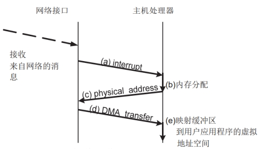 

这些步骤不包括从应用层到接收器的任何显式缓冲器大小通知消息。 因此，可以消除接收缓冲器的分配的设置开销。上述任何步骤都不包括向接收机通知缓冲器大小的通信。因此，具有非确定性消息的应用能够仅交换期望的消息。

此外，因为缓冲区的位置和缓冲区大小的通知是在单个消息中执行的，所以这些步骤的序列化永远不会发生。 因此，相对于将被动零拷贝通信应用于具有非会合通信的应用时获得的通信性能，将提高总通信性能。在接收机没有足够的空间接收主动零拷贝通信的情况下，当我们使用主动零拷贝通信时，需要注意消息的接收空间。 如果接收方由于内存空间不足而不能接收消息，则它必须以错误消息响应发送方。 对于报错，我们可以选择两种方式。一种是即时NACK，它在接收消息时发生错误后立即返回响应。 另一种是当发送方的定时器期满时发生的超时。 前者是向发送方报告错误的现实方法，因为应用程序需要尽可能快地处理查询。因此，我们将用立即NACK实现活动零拷贝。

 

为了实现主动零拷贝，接收机的网络接口和主机的软件都需要特殊的功能。

因为接收器必须接收消息并将消息传送到其主机存储器中，所以有效零拷贝需要以下功能：

\1. 中断主机处理器接收消息

网络接口硬件需要中断功能，以请求主机处理器向主机处理器分配通信缓冲器。 此外，操作系统需要一个功能来响应请求。 对于这些步骤，适于主机处理器的网络接口需要与主机处理器交换消息的大小。 还有操作系统，或网络接口的设备驱动程序，它正在运行主机处理器需要为消息分配缓冲区。

\2. 将消息缓冲区映射到用户应用程序空间

网络接口可以访问的存储空间(即物理地址)和应用可以访问的存储空间(即虚拟地址)是不同的地址空间。 在接收端接收到消息后，主处理器需要将在功能 1 分配的缓冲器地址空间映射到用户应用空间。 操作系统需要将缓冲区从内核内存空间映射到用户虚拟内存空间。

\3. 当没有更多的主机内存空间可用于接收后续消息时，错误检测

为了向发送方发送 NACK，主机处理器需要用对网络接口硬件的分配操作状态进行响应。当主机处理器由于资源匮乏而不能分配缓冲器时，网络硬件将向发送方发送 NACK。

### **1.2.3** tcp流重组技术

将TCP数据流中，传输序列号乱序的情况进行纠正，将中间夹杂的多余数据进行剔除。

根据TCP的数据流转换状态机，描述TCP的连接建立过程如下：

（1）客户端发送一个带SYN标志的TCP报文到服务器。这是三次握手过程中的报文1。

（2） 服务器端回应客户端的，这是三次握手中的第2个报文，这个报文同时带ACK标志和SYN标志。因此它表示对刚才客户端SYN报文的回应；同时又标志SYN给客户端，询问客户端是否准备好进行数据通讯。

（3） 客户必须再次回应服务段一个ACK报文，这是报文段3。

TCP的连接销毁过程如下：

 

由于TCP连接是全双工的，因此每个方向都必须单独进行关闭。这原则是当一方完成它的数据发送任务后就能发送一个FIN来终止这个方向的连接。收到一个 FIN只意味着这一方向上没有数据流动，一个TCP连接在收到一个FIN后仍能发送数据。首先进行关闭的一方将执行主动关闭，而另一方执行被动关闭。

（1） TCP客户端发送一个FIN，用来关闭客户到服务器的数据传送（报文段4）。

（2） 服务器收到这个FIN，它发回一个ACK，确认序号为收到的序号加1（报文段5）。和SYN一样，一个FIN将占用一个序号。

（3） 服务器关闭客户端的连接，发送一个FIN给客户端（报文段6）。

（4） 客户段发回ACK报文确认，并将确认序号设置为收到序号加一（报文段7）。

同时，为了达到保证顺序的目的，TCP的报文有如下格式：

 

使用源IP、目的IP、源端口、目的端口来唯一指定一个流。在同一时间出现，则必然是同一个报文序列。

根据该报文格式，使用确认号和序号达成TCP的连接。序号：占4个字节。TCP连接传送的数据流中的每一个字节都被编上一个序号。首部中序号字段的值指的是本报文段所发送的数据的第一个字节的序号。确认号：占4个字节，是期望收到对方下一个报文段的数据的第一个字节的序号。因此，主要逻辑为，若本侧确认号不等于另一端指定的序号，则表明中间有包的缺失。需要等待缺失的包后再处理。此时将当前正在处理的数据包保存在内存中，然后继续处理其他数据包。直到配置的三个存储空间均已满，则认为这个流有包缺失，忽略今后全部的数据包。

模块需要判断当前流是否包含的流信息空间指针，如果没有则分配一个流空间，如果流空间不够分配，则直接抛弃当前流；

模块需要对数据包进行IP定位，定义出IP地址的位置类型；

如果当前流没有识别出应用协议，模块需要调度对数据包执行协议识别操作；

如果当前流的应用协议在配置中指明需要进行协议解码，则模块将调用后续流程，执行对应的解码工作；模块需要对畸形报文和碎片包进行处理。

 

ＴＣＰ 连接建立的过程需要经过“三次握手”，ＴＣＰ 报文段首部的同步比特 ＳＹＮ 为 １ 时，就表示这是一个连接请求或连接接受报文，标志着三次握手的开始。 然而，若以 ＳＹＮ 作为连接建立的标识而不根据需要加以选择性的区分，那么在处理海量数据时，就需要在二维链表中存储大量的无用连接，而且每当一个数据包到来时，都要在链表中查找其所属的连接结点。 这样无论是从时间还是空间上，都提高了其复杂度，从而大幅降低了重组效率。

所以，为了减少缓存的 ＴＣＰ 连接数量，就要在海量数据流中根据数据流特征筛选出待重组研究的会话连接。 所谓数据流特征是指能标识网络通信行为的数据包特征串。 在网络通信过程中所有网络应用都是有其特征的，在使用这些应用时，它们会频繁的出现在网络数据流中。 而且这些特征可能分很多种类，包括数据包的负载长度，特征位置，特征串长度等，或为一系列特征数据包连续出现所组成的特征串序列。 分析单个数据流特征可以按以下几个步骤进行:

１) 确定网络层协议:一般为 IＰ 协议。

２) 观察目的 IＰ 地址和目的端口是否固定。

３) 观察数据包大小和应用层载荷长度是否固定。

４) 观察数据流长度序列是否固定(此特征多为文件传输)。

５) 观察数据包中是否存在浮动位置特征串(此特征多为英

文字符)。

６) 观察数据包中是否存在固定位置特征串(应用层协议特

征串大部分属于固定位置特征串)。

 

为了提高重组效率，除了根据特征进行选择性的重组之外，连接的终止判断方法和优化的数据缓冲策略也是必要的。

虽然 ＴＣＰ 协议保证了可靠交付，一般情况下 ＴＣＰ 连接都会按照正常的方式终止连接，但在网络环境较差的情况下，仍然会出现丢包的情况。 此外一些特殊的网卡也有可能过滤掉终止连接数据包。 这样的连接会因一直未接收到连接终止数据包，导致此连接的其他数据包一直存在于内存中，若不及时删除，随着连接数量的增加，会导致主机内存耗尽，所以需要设置一个连接中断定时器来判断连接的终止。 在 ＴＣＰ 数据流结点中包含存储的最后一个数据包的捕获时间ｔｉmｅ，另设一个线程每隔一段时间扫描二维链表中所有结点的 ｔｉmｅ值，并与本机的时间比较，若二者的差值大于定时器设定的值，即使没有收到标识连接结束的 ＦIＮ 或 ＲＳＴ 包，也视为该连接结束，然后进行后续处理。 为了防止误删和冗余，定时器的时长设置成为关键，经过大量的实验，将定时器设置为６０ ｓ较为合理。

对于 ＴＣＰ 重组结果的存储方法有两种:一种是文件指针存储，另一种是内存方式存储。 文件指针存储是每接收一个数据包，就按照序列号存储在所属连接的流结点中，当连接终止，此时连接中的所有数据包已按序列排好，即重组完毕，然后将该连接的重组结果写成文件存入硬盘。 内存缓存方式存储是当连接结束时，申请一块恰好能容纳该连接数据包的内存将数据段移到新申请的内存中。 第一种方法要进行频繁的文件读写操作，效率较低；而第二种方法虽然重组速度较快但是对于传输量较大的连接，会造成系统内存的严重消耗，甚至耗尽内存导致系统崩溃。

因此采用两种缓存方法相结合的方式，当按照序列号排好序的数据段大小超过一定的阈值时，就将内存中已缓存的数据段写入文件，同时删除内存中的缓存，继续处理后续的数据包。综上所述，分析应用层数据的第一个包的特征，分析出数据流特征后，以带有此特征的数据包作为会话连接的第一个数据包，将其存入二维链表建立新的结点，其他数据包通过查找四元组找到所属连接结点，再经过重组将这些数据包整合成完整的会话连接。 并利用改进的连接终止判断方法设置定时器和对数据缓冲策略进行优化。 通过此机制精简了 ＴＣＰ 连接数量，加快了结点查找速度，通过提取特征进行有的放矢的选择性数据流重组，提高了重组效率。

基于特征的 ＴＣＰ 数据流重组算法，每读取一个数据包，首先要查看其四元组用于判断链表中是否存有该包所属的连接，若不存在，则继续拆包查看其应用数据特征来判断是否为需要重组的数据包，若是则将此包作为其所属连接的第一个包进行存储。 这样每个连接判断特征仅需一次，大大提高了重组效率。

此算法的 ＴＣＰ 重组的流程图如图所示：

 

捕获网络数据包，获取其四元组信息。 扫描二维链表查看此数据包的流结点是否存在。 是则执行 ２)，否则执行 ５)。

２) 通过判断此数据包是否为 ＦIＮ 包和查看定时器是否超时来判定此连接的终止。 若终止则执行 ３)，否则执行 ４)。

３) 若此连接对应的文件存在，则将此连接的数据包写到文

件，若不存在，则将此连接的数据包写到内存中。

４) 若此连接未终止，则在内存中缓存此数据包，查看流结点

的数据大小是否超过阈值，若超过，将数据包写入文件，若未超过，返回 １)继续读取数据包。

５) 若此数据包所在的流结点在二维链表中不存在，则查看

该数据包的应用层数据看是否满足需求数据包的特征。 若满足，

则执行 ６)，若不满足，则返回 １)继续捕获数据包。

６) 若满足特征且链表中没有该数据包的流结点，则建立新的结点。

７) 记录初始序列号。 即此数据包作为该连接的第一个包的序列号。

８) 将此数据包存入新建立的数据流结点，返回 １)继续捕获数据包。

### **1.2.4** 智能网卡技术

近年来公有云中虚拟化技术的发展以及SDN技术的兴起，对端系统协议栈提出了更高的要求，而传统的高性能网卡已经难以满足这些要求。为此，智能网卡技术开始走进大众的视野。不同于传统网卡，智能网卡同时具备高性能及可编程的能力，既能处理高速的网络数据流，又能对网卡进行编程，实现定制化的处理逻辑。

 

传统网卡：早期的网卡仅实现数据链路层和物理层的功能，而端系统CPU负责处理网络协议栈中更高层的逻辑。CPU按照网络协议栈中传输层、路由层的逻辑，负责数据包的封装和解封；网卡则负责更底层的数据链路层帧的封装和解封，以及物理层电气信号的相应处理。

智能网卡：为适应高速网络，现代网卡硬件中普遍卸载了部分传输层和路由层的处理逻辑（如校验和计算、传输层分片重组等），来减轻CPU的处理负担。甚至有些网卡如RDMA网卡还将整个传输层的处理都卸载到网卡硬件上，以完全解放CPU。得益于这些硬件卸载技术，端系统的网络协议栈处理才能与现有的高速网络相匹配。

具体来说，传统网卡面向的用户痛点包括：

随着VXLAN等overlay协议以及OpenFlow、Open vSwitch（OVS）等虚拟交换技术的引入，使得基于服务器的网络数据平面的复杂性急剧增加。

网络接口带宽的增加意味着在软件中执行这些功能会给CPU资源造成难以承受的负载，留给运行应用程序的CPU资源很少或根本没有。

传统网卡固定功能的流量处理功能无法适应SDN和NFV。

在SmartNIC出现之前，解决这些问题的方法大概有：

使用英特尔开放网络平台，DPDK用作加速手段，但处理过程依赖于未针对数据传输进行优化的服务器和标准NIC，这是一个瓶颈，由于吞吐量性能低下，并且需要大量的CPU内核/资源，因此将导致服务器数量增加。

使用网卡支持的PCI Express单根IO虚拟化（SR-IOV）技术，允许网卡将物理端口映射为多个虚拟端口或虚拟功能（VF），使得每个虚拟端口都可以绑定到VM，这样吞吐量性能和CPU使用效率得到改善，但灵活性却降低了，复杂性也增加了；并且，大多数网卡最多有效支持1GbE端口的8-16个虚拟端口和10GbE端口的40-64个虚拟端口。

目前最有效的硬件方法Smart NIC，将虚拟交换机功能完全从服务器CPU转移到网卡，释放昂贵的服务器CPU的计算能力以返回给应用程序，从而更好地扩展网卡功能并提供更高的性能。SmartNIC的存在能够：

实现基于服务器的复杂网络数据平面功能，例如，包括多匹配操作处理、计量整形、流统计等。

通过更新的固件负载或客户编程来支持可替代的数据平面，对执行的功能几乎没有预先设定限制。

与现有的开源生态系统无缝协作，以最大程度地提高软件功能的速度和影响力。

SmartNIC可以执行加密/解密、防火墙、TCP / IP和HTTP处理，非常适合高流量的Web服务器。

智能网卡的分类方式

智能网卡之所以“智能”，即是拥有可编程能力，它并没有固定的分类方式，你可以根据智能网卡设计采用形式，将它分为：

多核智能网卡，基于包含多个CPU内核的ASIC

基于现场可编程门阵列（FPGA）的智能网卡

FPGA增强型智能网卡，它将硬件可编程FPGA与ASIC网络控制器相结合

也可以根据其加速不同的工作负载将它分为：

基本连接NIC

面向网路加速的智能网卡

面向存储加速的智能网卡

 

同时，由于不同的供应商的架构不同，因此SmartNIC可以基于ASIC、FPGA和片上系统（SOC）。

 

ASIC具有价格优势，但灵活性有限，尽管基于ASIC的NIC相对容易配置，但最终功能将受到基于ASIC中定义的功能的限制，这可能会导致某些工作负载无法得到支持。

相比之下，FPGA NIC是高度可编程的，并且可以相对有效地支持几乎任何功能，不过众所周知的是，FPGA最大的问题是编程难度大且价格昂贵。

针对更复杂的用例，SOC是最佳的SmartNIC选择，价格与性能兼具、易于编程且高度灵活。

 

可编程还是性能，二者如何抉择？

从理论上来说若想兼顾高性能和智能，一个最优的智能网卡架构应将不同场景下各网络协议栈都需具备的相同处理逻辑固化成专用ASIC芯片，而将其余随场景变化的处理逻辑通过可编程芯片定制化实现。

然而现实面对的困难是，目前对网络协议栈各层的功能没有一个很好的模块化抽象，各层内的各个处理逻辑之间甚至跨层的部分逻辑之间都依据场景高度耦合，难以提取有意义的共性和特性逻辑分别由ASIC和可编程芯片处理。现有智能网卡要想具备足够的可编程能力，能应对各种场景，只能将从上到下各层几乎所有的逻辑都交由可编程芯片实现，牺牲了性能。

若想突破此难题，一种可行的思路是从模块化的角度出发重构现有网络协议栈，在其各层协议中清晰地抽象出共性功能模块以及可依据场景定制的特性模块。从网卡设计的角度出发，区分各种场景下的网络协议栈中到底哪些部分可以由ASIC固化、哪些部分需要灵活地定制逻辑。

智能网卡的应用场景

SmartNIC用例包括虚拟化软件定义存储、超融合基础设施以及其他云资源。

 

在虚拟化爆发之前，大多数服务器只是运行本地存储，这虽然不是很高效，但是很容易使用。然后是网络存储的兴起——SAN、NAS，以及NVMe over Fabrics（NVMe-oF）。但是，并非每个应用程序都可识别SAN，并且某些操作系统和虚拟机管理程序（例如Windows和VMware）尚不支持NVMe-oF。SmartNIC可以虚拟化网络存储，效率更高、更易于管理，且应用程序更易于使用。 SmartNIC甚至可以虚拟化GPU(或其他神经网络处理器) ，这样任何服务器都可以在需要的时候通过网络访问任意数量的GPU。

软件定义存储和超融合基础设施都使用管理层（通常作为VM或作为虚拟机管理程序本身的一部分运行）来虚拟化和抽象化本地存储和网络，以使其可用到群集中的其他服务器或客户端，能够实现快速部署，有利于共享存储资源，但是管理和虚拟化层占用了本应运行应用程序的CPU周期。与标准服务器一样，网络运行的速度越快，存储设备的速度越快，则必须投入更多的CPU来虚拟化这些资源。

SmartNIC一方面可以卸载并帮助虚拟化网络（加速私有云和公共云，这就是为什么它们有时被称为CloudNIC）的原因，另一方面可以卸载网络和大部分的存储虚拟化，可以减轻SDS和HCI的功能负担，例如压缩、加密、重复数据删除、RAID、报告等。

超融合架构数据中心中，Smart NIC为SDN和虚拟化应用程序提供硬件加速与网络接口紧密结合，并可分布在大型服务器网络中，减小CPU负载，提供额外的边缘计算能力，加速特定应用和虚拟化功能，并且通过正确的语言和工具链支持，为用户提供应用加速即服务的附加价值。

白盒作为最受欢迎的COTS硬件，可以加入插件实现软件定义网络（SDN）和网络功能虚拟化（NFV）的各种计算和网络功能。Smart NIC可以将代码从CPU引入网卡，显著加速用于安全应用的加密/解密或用于深度包检测（DPI）应用程序，降低CPU负载，并且支持灵活的网络可编程性。

智能网卡是软件定义的基于卡上计算单元的网卡，可减轻主机端 ＣＰＵ 的网络堆栈计算负载，包括虚拟交换（ＯＶＳ）、存储、数据和网络加密（ ＩＰＳＥＣ／ ＳＳＬ） 等． 智能网卡是一种新型智能硬件，和历史上的网络智能化存在很大不同。

 

传统网卡（ＮＩＣ）支持较低链路速度，网络堆栈算法和协议在主机端 ＣＰＵ 上运行． 在将数据包传输到网络之前，主机端网卡仅执行链路层和物理层中的无状态算法和协议． 传统网卡显著依赖 ＣＰＵ 算力，且需要使用主机存储器来维持数据包之间的状态． 也就是说，传统 ＮＩＣ 用于执行无状态数据包

处理，而有状态数据包处理则在主机端 ＣＰＵ 上实现。

使用专用集成电路的传统网卡在多核 ＣＰＵ 出现后开始面对可编程性的挑战． 第 １ 代网卡智能的出现是为了解决网卡如何更好利用多核 ＣＰＵ 并行处理能力的问题． 典型工作是接收端扩展技术（Ｒｅｃｅｉｖｅ Ｓｉｄｅ Ｓｃａｌｉｎｇ，ＲＳＳ）多核 ＣＰＵ 时代的网络智能。

第 ２ 代网卡智能的诞生背景是虚拟化技术的出现，网卡智能化表现在利用用户空间卸载本应属于虚拟机的功能，使得网卡具备了高速编程体系，这一时期的典型工作是数据平面开发套件（Ｄａｔａ Ｐｌａｎｅ Ｄｅｖｅｌｏｐｍｅｎｔ Ｋｉｔ，ＤＰＤＫ）技术，如 ＴＣＰ／ ＩＰ 校验和计算，ＴＣＰ 分段卸载（ ＴＣＰ Ｓｅｇｍｅｎｔ Ｏｆｆ⁃ｌｏａｄ，ＴＳＯ） 和大型接收卸载（Ｌａｒｇｅ Ｒｅｃｅｉｖｅｒ Ｏｆｆｌｏａｄ，ＬＲＯ）。

功能卸载节省了 ＣＰＵ 处理大消息的周期，因为不再进行数据包有效负载计算，同时这也提高了系统 ＤＭＡ 吞吐量，减少了ＣＰＵ 的中断数量． 然而，这类网卡优化主要局限于大消息的传递． 多核 ＣＰＵ 出现后，网卡面临通过并行化提升效率的挑战，逐步转移到网卡上的卸载功能同样需要并行化提速． 为了利用多核 ＣＰＵ 的并行能力，Ｉｎｔｅｌ 公司研发了 ＲＳＳ． ＲＳＳ 使用了多个接收通道，利用特殊以太网报头标签，将待处理数据包分配到不同的 ＣＰＵ 核上进行并行处理，从而实现负载分散。

 

虚拟化技术可以实现软件网络堆栈功能，提供了极大的灵活性，数据包处理得以绕过硬件卸载． 同时，快速开发和测试新功能成为可能． 但网络堆栈软件化需要权衡 ＣＰＵ 资源消耗和传输效率． 消耗更多主机 ＣＰＵ 周期才可以支持全线路速率运行． 此外，由于软件固有的随机中断驱动特性，软件网络

堆栈不支持精确传输控制，使该类网络应用程序开发面临困境。

这一时期，许多研究项目［９⁃１１］通过修改网络堆栈或使用内核旁路框架的方式在软件中实现网络智能化，其中代表性工作是 Ｉｎｔｅｌ 公司牵头研发的数据平面开发套件（ ＤＰＤＫ）。ＤＰＤＫ 支持在用户空间处理所有数据包，从而绕过主机内核。ＤＰＤＫ 一般用作加速手段，其处理过程依赖于未针对数据传输进行优化的服务器，这是一个瓶颈． 由于单台服务器吞吐量性能低下，这一时期部署使用 ＤＰＤＫ 往往需要多台服务器，这导致了服务器购置成本的增加。

虚拟化平台中提高吞吐量的经典技术是基于 ＰＣＩｅ 的单根 ＩＯ 虚拟化（ Ｓｉｎｇｌｅ Ｒｏｏｔ Ｉ／ Ｏ Ｖｉｒｔｕａｌｉｚａｔｉｏｎ，ＳＲ⁃ＩＯＶ） 技术，ＳＲ⁃ＩＯＶ 允许网卡将物理端口映射为多个虚拟端口或虚拟功能（Ｖｉｒｔｕａｌ Ｆｕｎｃｔｉｏｎｓ，ＶＦｓ），这使得每个虚拟端口都可以绑定到不同的 ＶＭ，吞吐量性能和 ＣＰＵ 使用效率得到改善，但灵活性降低，复杂性增加． 大多数网卡最多有效支持 ８⁃６４ 个虚拟端口（１ＧＥ 物理端口一般承载 ８⁃１６ 个虚拟端口，１０ＧＥ 物理端口承载 ４０⁃６４ 个虚拟端口）． 为了能够将网络堆栈中各种协议和算法（甚至分布式应用）卸载到网卡，在虚拟化时代已经有网卡可编程的若干早期探索工作。

 

数据中心正越来越多地采用 ＳｍａｒｔＮＩＣｓ 来加速数据包处理，进而支持数据包处理管道和自定义网络功能（ Ｎｅｔｗｏｒｋ⁃ｆｕｎｃｔｉｏｎｓ，ＮＦｓ）． 网络加速的典型应用包括压缩／ 解压缩、Ｋ⁃ｍｅａｎｓ 聚类和 Ｗｅｂ 搜索等。

 

智能网卡采用的计算单元主要有 ３ 种，分别是 ＡＳＩＣ 芯片、现场可编程门阵列（ Ｆｉｅｌｄ⁃Ｐｒｏｇｒａｍｍａｂｌｅ Ｇａｔｅ Ａｒｒａｙ，ＦＰ⁃ＧＡｓ）、片上系统（ Ｓｙｓｔｅｍ⁃ｏｎ⁃Ｃｈｉｐ，ＳｏＣ）。三者的技术权

衡对比如下图所示。

 

基于 ＡＳＩＣ 的智能网卡． 这类智能网卡使用数百个非高速缓存相关的多线程 ＲＩＳＣ 核（例如 ＮＰＵ，ＡＲＭ 或 ＲＩＳＣ⁃Ｖ），支持 １００Ｇｂｐｓ 的流量速率，以及专用硬件功能：查找，负载平衡，排队等． 并且能够以低延迟运行并行工作负载． 这些智能网卡（ＮｅｔｒｏｎｏｍｅＡｇｉｌｉｏ７ 和 Ｍａｒｖｅｌｌ ＬｉｑｕｉｄＩＯ８） 设计方面的最新进展，使得用户更容易使用例如 Ｐ４和 Ｍｉｃｒｏ⁃Ｃ程序来定制网卡的数据平面逻辑，支持数据解析、匹配和操作，从而为编程人员提供熟悉的数据流和类 Ｃ 语言抽象，而不需要主机操作系统．

基于 ＦＰＧＡ 的智能网卡． 从概念上讲，ＦＰＧＡ 是一个可编程逻辑块和存储器阵列，可以基于用户定义程序实现定制逻辑，通常采用 Ｖｅｒｉｌｏｇ 和 ＶＨＤＬ 等硬件描述语言． 因此，基于ＦＰＧＡ 的网卡具有高度可编程性，可以支持有状态数据包处理． 此外，ＦＰＧＡ 只使用实现用户定义程序所必需的逻辑和存储器块。因此，它们可以根据特定应用进行高度定制，并实现１００Ｇｂｐｓ 的传输速率。这使得基于 ＦＰＧＡ 的网卡能够在主机端卸载高速数据流。

基于 ＦＰＧＡ 的网卡结合了基于 ＡＳＩＣ 的网卡和软件网卡的特点：它们能够以全线路速率运行，提供低延迟和精确定时，同时具有相对较短的新功能开发周期。 专门定制的高性能ＦＰＧＡ 智能网卡也已经开发出来． 例如，阿里巴巴开发了一个完全定制的基于 ＦＰＧＡ 的智能网卡，他们用它来运行精密拥塞控制协议（ＨＰＣＣ）的硬件实现，智能网卡的时延比基于软件的 ＤＰＤＫ 方案降低了 ５０％ ，而同时数据处理能力提升近4.5 倍. 基于 ＦＰＧＡ 的智能网卡已经在大规模数据中心实现了部署。这些数据中心使用机架规模的 ＦＰＧＡ 到 ＦＰＧＡ 直连通信，其加速服务的支持范围还仅限于单机架． 此外，由于ＦＧＰＡ 智能网卡节点故障对其他相邻节点会产生影响，这类ＦＰＧＡ 直连网络拓扑面临弹性挑战。ＦＰＧＡ 存在昂贵且耗电高的缺点，并且对其进行编程需要具备硬件专家知识，相对困难． 研发人员还不能不面对Ｖｅｒｉｌｏｇ 这类低层语言。

基于 ＳｏＣ 的智能网卡。片上系统（ＳｏＣ）是一类具有片上存储器的嵌入式 ＣＰＵ 内核，这些内核通常使用特定编程语言进行编程． 因此，基于 ＳｏＣ 的网卡也是高度可编程的，并且可以用于通用有状态数据包处理． 与 ＮＰＵ 类似，ＳｏＣ 通用编程模型使得它们很难以经济高效的方式扩展到每秒几十吉比特之上。 ＳｏＣ 将传统 ＡＳＩＣ 与数量适中的高速缓存相关的通用内核相结合，以便更容易地编程，并将固定功能协处理器用于自定义工作负载加速． 因此，ＳｏＣ 智能网卡适合程序开发．ＳｏＣ 智能芯片有“ｏｎ⁃ｐａｔｈ”和“ｏｆｆ⁃ｐａｔｈ”两种设计方法，其主要区别是网络端口和主机内存之间移动数据包的方式不同。 “ｏｎ⁃ｐａｔｈ”设计方法中，所有数据包在通往或离开网络的路径上必经 ＮＩＣ 的处理内核（或者其子集）。相反，“ ｏｆｆ⁃ｐａｔｈ”设计方法中使用交换机路由 ＮＩＣ 和主机之间的流量。设计的不同对分组吞吐量影响不同，前者需要更多的核以扩展到更高的线路速率，而后者在到达计算资源之前可能会引起额外的等待时间。

### **1.2.5** 高流量包监听技术

背景

网络运行的稳定性和网络攻击的过滤一直是困扰着网络发展的难题。网络监听技术可以使网络使用者和管理者很好地获知网络的状况信息，并且做出相应处理。随着网络数据传输量的增大，互联网研究界认识到对于数据包监听在网络 结构中的底层进行数据处理，可以提高数据包的捕捉率。 

监听数据流在传输中必须根据其数据类型进行封装重组，而传统的数据包捕获和重组机制下捕捉效率较高的网络驱动程序接口规范下的数据包过滤技术等，都要进行频繁的数据拷贝中断、页面切换，所以造成处理效率相对过低，很多时间和资源花费在处理过程中。

数据包过滤技术对于数据包的处理速率较高，但是在高流量数据包的网络下进行旁路监听，其系统开销较高。旁路监听高量数据包下，由于受CPU和内存还有本身的处理机制限制，处理效率下降较大。加快数据在缓冲区的处理过程，计算最优带宽值并设置相关参数 以达到最佳处理效率。由于对内存拷贝处理的改进，使得旁路监听高量数据包的效率极大提高。

并行计算机制

使用通用服务器平台的多核处理器来对网络数据包进行处理，并行计算机制主要包含两种方式，一种是提高处理器的指令并发度，另一种是多核并行处理网络数据包。 

指令并发是指一个处理器时钟周期内执行更多的指令，通过软件调优的方式对POSIx接口进行优化，影响了处理器运行时指令的派发和执行。 

多核并行处理网络数据包是基本思想。如下图所示，每个物理核心都可以独立创建一个任务线程，各个核心之间的通信通过芯片内部总线来完成，它们拥有独立的一级缓存和二级缓存，并共享第三级缓存和内存。

将处理网络数据包的任务从水平方向进行扩展，按照指定逻辑划分成若干子任务，然后绑定到特定 的核上(如corel，core2，……。core n)，使任务尽量长时间地在单一核上进行处理，避免多个核共同处理 任务。这样提高了CPU缓存的命中率和处理器性能、减少内存访问 开销和每个核心需要处理的网络负载。 

多核并行处理会带来Cache一致性的问题，当多个核对同一个内存块进行读写操作时，因为直写和 回写不同的Cache策略，导致一个内存块在不同核心的不同Cache中可能有多个备份。

为了避免多个核心同时访问同一个内存地址或者数据结构，需要将内存分割，每个核都有属于自己的内存，并且管理自己的数据结构，让数据尽可能本地化和无 锁化。

对于网络端口的访问，为每个核提供了单独的接收／发送队列，这样解决了cache一致性问 题，也避免了网络负载的竞争。

 

内存池管理

Linux使用4kB大小的分页来管理内存，而这里使用2MB或1GB的巨页来管理内存，一个转译后备缓存区(translation lookaside buffer，TLB)表项可以指向更大的内存区域，从而减少了TLB miss。 

将网络报文的内存操作对象抽象为Mbuf数据结构，Mbuf存储在内存池Mempool中。

Mempool的内存从巨页中提前分配，并且同时预先分配好指定大小的Mbuf对象。

Mempool 采用双环形缓存区来管理网络报文的生命处理周期，当一个网络 报文被网卡接收后，在Mbuf的环形缓存区中创建一个Mbuf对象。对网络报文的所有操作都集中在Mbuf对象中，仅在必要时对实际网络报文进行访问，原理如下图所示。 

当多个核心访问同一个内存池时，需要保证每次读写的数据 未被其他核心修改，所以存取效率低。使用单核本地缓存一部分数据，实时对环形缓存区进行块读写操作，从而减少访问环形缓存区的次数。

 

用户态驱动 

在传统的x86网络协议栈中，网络报文通过网卡硬件接收／发送，都需要发送中断到CPU，一次中断需要保存／恢复处理器状态，并运行中断服务程序，整个过程至少需要300个处理器时钟周期。

对于需要处理大规模数据的高性能网络报文处理框架，频繁的中断降低了网络应用的处理速度，成为了性能瓶颈。 为了减少中断开销，这里抛弃了传统的内核中断，采用轮询模式驱动(poll mode driver，PMD)的方式直接操作网卡的接收和发送队列，将报文直接拷贝到用户空问，不再经过内核协议栈。

 

用户态I／0(user space I／0，U10)驱动技术提供了支持。其主要功能是拦截中断，并重设中断回调行为，从而绕过内核协议栈后续的处理流程。

将硬件操作映射到用户空间，对用户空间提供文件接口，当注册一个UIO设备uiox，就会出现文件／dev／ui-ox，对该文件的读写就是对设备内存的读写。

UIO技术中仍然有一小部分驱动程序运行在内核空间中，它们主要负责两个任务：

①分配和记录设备需要的资源和注册UIO设备；

②处理一些必须在内核空间实现的小部分中断应答。

UIO技术使得内核空间与用户空问的内存交互不用进行拷贝，而是只做控制权转移，减少了报文的拷贝过程。即具有零拷贝、无系统调用的好处，同步处理也减少上下文切换带来的Cache miss。从中断与拷贝中节省的资源和时延，有效地运用在报文处理流程中，提高了报文的处理、转发效率。 综上,舍弃了内核中断，提供全用户态的驱动，拥有高效的内存管理机制，报文直接通过直接内存 存取(direct memory access，DMA)传输到用户态处理，减少内存拷贝次数。

后续技术优化方向

(1)	开发用户态网络协议栈

技术的重点是在于提升二层转发的性能，对于三层或者更高层的网络功能，如果开发涉及到更高层业务的复杂传输协议支持，缺少协议栈加深了许多应用程序的开发难度，并且影响处理转发的性能。如果能够开发一个稳定的用户态协议栈，那将会具有更普遍的适用性，降低程序的开发难度。 

(2)	添加中断优先级 

使用进程来读取和发送数据包，而进程的优先级是较低的，CPU随时都可能被硬中断或者软中断占用，或者被其他进程占用，这就可能导致在较长时间内无法使用CPU，最终导致丢包，或者延迟加大。 

并且PMD轮询机制使得CPU一直都在运行，占据所有的资源。实际网络中流量并不稳定，如 某一时刻流量骤降为零，便将浪费内核资源。虽然具有类似NAPI(new API)的混杂机制，用户可以配置何时关闭中断，何时轮询结束，但是缺乏灵活性，并且转发性能同样会受到影响。基于这种情况，可以将其他进程与网卡接收进程绑定在同一个核上，使用中断来通知进程切换，但是网卡接收进程占据最高级别的中断优先级。

(3)	动态配置大页内存 

内存需要在程序开发时提前从大页内分配好，配置复杂，无法动态分配。并且需要充分考虑 numa、nuio等各种体系结构，如果CPU配置不遵循体系结构的设计原则，性能则会下降。

如果能够根据程序的实际情况动态分配大页内存，将会增加程序的灵活性与可操作性。 

(4)	添加协处理器来增加计算能力 

使用优化虚拟交换机可以提高虚拟交换机的转发速度，当前的虚拟交换机比如0Vs，协议无感知 转发∞21(protocol oblivious forwarding，POF)具有修改报文字段的能力，然而修改字段将会消耗CPU的计算能力，影响转发线速。为了解决虚拟交换机转发速度和CPU处理速度不匹配的问题，可以考虑增加协处理器GPU模块来辅助报文处理，加强计算能力，从而提高性能。

### **1.2.6** 协议分析高性能状态机

协议的识别模块主要根据协议的RFC文档进行工作。根据协议的头几个包进行识别。而高性能处理需要有限状态机来实现。

状态机原理

有限状态自动机(FSM)是一种用于设计计算机程序和时序逻辑电路的数学模型,是计算机科学的重要基石。

有限状态机是一种计算机设备,输入是字符串,输出是两个值,称为接受 ( Accept ) 与 拒 绝(Reject),有限状态机亦称有限状态自动机。如果 M 是一个 FSM,则由左向右一次读取输入字符串中的一个字符送到M 中。 M 每次接受一个字符时,由当前状态及读入的新字符而选择下一个状态。 可以将一个或多个状态标注为接受状态。如果 M 输入完字符后终止在接受状态,则称输入字符串是接受的, 否则称之为拒绝的。 这样的FSM 形式上可以定义如下:一个确定的有限状态自动机 M 是一个五元组,M = (K,∑,δ, A,δ),其中:K 是状态的有限集合,∑ 输入的字母表,s ∈ K 是开始状态,A ⊆ K 是一组接受状态,δ 是转换函数,将 K × Σ 中的元素映射到 K 中的一个元素。

 

确定有限状态自动机如此表示不易理解,因此,在使用时,一个确定有限状态自动机使用一个有向图(称之有状态转换图)表示。 用圆表示一个状态,双圆表示接受状态,用一个无标记的箭头指向开始状态,弧表示状态转换,弧上的标记符号 a表示由弧尾状态读取符号 a 后转换到弧头状态。如下图所示,表示一个确定的有限状态自动机只有当输入符号串是 abca 时是接收的,否则是拒绝的。

 

如此状态转换图具有如下特点:①有且只有一个开始状态,可以有多个终止状态;②每个弧上只有一个符号,且同一个状态引出的两个弧,如果到达两个不同的状态,则弧上的标记符号不同。如果减少对状态转换图的约束,即允许有多个开始状态,允许由一个弧引出多个标记相同符号的弧到达不同的状态,甚至允许有标记为空符号 ε(即无任何符号)出现。 这种有向图表示一个不确定的有限状态自动机。 下图表示一个接受以 abca为子串的不确定的有限状态自动机。

 

图中的·表示任何一个符号,标记为·的弧实际上是多条弧的简单表示。 不确定的有限状态自动机表示简单容易理解,上图表示的是接受以 abca为子串的不确定有限状态自动机;下图表示的是接受由 a、b 和 c 3 个符号组成的任何仅出现两个符号的字符串的不确定有限状态自动机。 由一个不确定的有限状态自动机 M,可以构造一个与其等价的确定有限状态自动机 M′。 确定有限状态自动机与不确定有限状态自动机皆称为有限状态自动机(FSM)。

 

FSM 不仅可用于表示输入字符串是否能接受,亦可表示一个对象的状态转换,如下图所示,表示道路交通灯的转换。 即红灯亮 40 s 后转换成黄灯,黄灯亮 5 s 后转换成绿灯,绿灯亮 40 s 后转换成黄灯,黄灯亮 5 s 后转换成红灯。

 

协议应用

对于HTTP协议而言，可以分为请求和响应头两种:

HTTP-message  = Request | Response   ; HTTP/1.1 messages

不管是请求头还是响应头，都有如下：

​    generic-message = start-line

​             *(message-header CRLF)

​             CRLF

​             [ message-body ]

​    start-line    = Request-Line | Status-Line

​    message-header = field-name ":" [ field-value ]

​    field-name   = token

​    field-value   = *( field-content | LWS )

​    field-content  = <the OCTETs making up the field-value

​    and consisting of either *TEXT or combinations

​    of token, separators, and quoted-string>

关键字段首先是HTTP的方法。其次是要访问的URI，最后是HTTP的版本。

http_URL = "http:" "//" host [ ":" port ] [ abs_path [ "?" query ]]

HTTP-Version  = "HTTP" "/" 1*DIGIT "." 1*DIGIT

同时，对于头字段：

general-header = Cache-Control | Connection  | Date  | Pragma  | Trailer   | Transfer-Encoding  | Upgrade  | Via   | Warning这些字段都与之类似。

对于SMTP、IMAP、POP3等协议而言。此类协议均有一些特征，如：220 163 .com Anti-spam GT for Coremail System (163com[071018])、HELO smtp.163 .com、250 OK、auth login、334 dXNlcm5hbWU6、334 UGFzc3dvcmQ6、235 Authentication successful、MAILFROM、RCPTTO、250 Mail OK、DATA、QUIT等。可根据这些关键字进行识别，先识别出邮件协议，再具体识别出是什 么类型的邮件协议。很多时候需要判断是何协议，需要双向流量认证，否则只能单纯认出协议类型为邮件载荷，不能识别出协议具体是何协议。协议的识别使用内容进行识别。

根据规则，对不同的协议的数据包使用不同的引擎，按照指定的顺序进行检测。

HTTP载荷分析提取模块

HTTP协议的处理需要先分辨出上下行，然后调用不同的处理组件进行处理。

 

上图为HTTP状态机的起手。可以看到，在req状态机上，遇到ASCII为33、35-39、42-43、45-46等协议状态时，调用http_enter方法，同时调用log_key_logging方法，一直到结束。

在http_resp状态机上，多次进行重复调用。调用将获取HTTP的200 OK等状态码和状态信息，并调用相关函数，直到进行键-值对的处理。如下图所示：

 

对http消息头的处理：

主要调用逻辑还是log_key_enter和log_key_logging上。用于申请内存、记录并拷贝相关记录要素。下面的图记录了log_val_logging相关的调用，用于记录值相关的调用。

 

对HTTP状态机而言，最复杂的手段是对chunkdata的处理。实际处理过程中，需要记录下chunkdata的大小，并记录下每个chunk的分节符。记录下每个字段的结果，并进行文件存储。在还原载荷后，可能需要根据要求进行gzip解码等操作。

SMTP载荷分析提取模块

SMTP即简单邮件传输协议,它是一组用于由源地址到目的地址传送邮件的规则，由它来控制信件的中转方式。SMTP协议属于TCP/IP协议簇，它帮助每台计算机在发送或中转信件时找到下一个目的地。通过SMTP协议所指定的服务器,就可以把E-mail寄到收信人的服务器上了，整个过程只要几分钟。SMTP服务器则是遵循SMTP协议的发送邮件服务器，用来发送或中转发出的电子邮件。

整体而言，SMTP载荷分析提取模块可完成对数据包进行必要的预处理：编码解码，比如邮件的base64编码的解码；根据数据包的传输序列号对TCP数据包的payload数据进行缓存，重组成一个文件；根据协议的信息或者传输的数据包信息，判断文件传输是否结束和数据缓存是否足够；载荷提取完成后，送威胁检测系统进行检测。

与其他协议相似的，SMTP协议也需要区分上下行。大致而言，SMTP的上行比较有意义，需要处理的项主要有：记录用户登录凭据、登录用户邮箱等信息；同时记录下MIME，调用MIME处理的流程，解码出用户发送的TO、CC、BCC等信息。下行流量主要用于判断指令是否成功。

需要处理的SMTP命令如下：

HELO<domain><CRLF>；识别发送方到接收SMTP的一个HELLO命令MAIL FROM:<reverse-path><CRLF>；为发送者地址。此命令告诉接收方一个新邮件发送的开始，并对所有的状态和缓冲区进行初始化。此命令开始一个邮件传输处理，最终完成将邮件数据传送到一个或多个邮箱中。

RCPT TO:<forward-path><CRLF>；标识各个邮件接收者的地址

DATA<CRLF>；接收SMTP将把其后的行为看作邮件数据去处理，以<CRLF>.<CRLF>；标识数据的结尾。

REST<CRLF>；退出/复位当前的邮件传输

OOP<CRLF>；要求接收SMTP仅做OK应答。（用于测试）

QUIT<CRLF>；要求接收SMTP返回一个OK应答并关闭传输。

VRFY<string><CRLF>；验证指定的邮箱是否存在，由于安全因素，服务器多禁止此命令。

EXPN<string><CRLF>；验证给定的邮箱列表是否存在，扩充邮箱列表，也常禁止使用。

HELP<CRLF>；查询服务器支持什么命令

POP3载荷分析提取模块

POP3，即“邮局协议版本3”。是TCP/IP协议族中的一员，由RFC1939 定义。本协议主要用于支持使用客户端远程管理在服务器上的电子邮件。提供了SSL加密的POP3协议被称为POP3S。

POP 协议支持“离线”邮件处理。其具体过程是：邮件发送到服务器上，电子邮件客户端调用邮件客户机程序以连接服务器，并下载所有未阅读的电子邮件。这种离线访问模式是一种存储转发服务，将邮件从邮件服务器端送到个人终端机器上，一般是PC机或 MAC。一旦邮件发送到 PC 机或MAC上，邮件服务器上的邮件将会被删除。但目前的POP3邮件服务器大都可以“只下载邮件，服务器端并不删除”，也就是改进的POP3协议。

POP3载荷分析提取模块可完成对数据包进行必要的预处理：编码解码，比如邮件的base64编码的解码；根据数据包的传输序列号对TCP数据包的payload数据进行缓存，重组成一个文件；根据协议的信息或者传输的数据包信息，判断文件传输是否结束和数据缓存是否足够；载荷提取完成后，送威胁检测系统进行检测。

POP3协议的处理过程与SMTP类似。主要的命令有：

USER [username]   处理用户名

PASS [password]   处理用户密码

APOP [Name,Digest]  Digest是MD5消息摘要

STAT  处理请求服务器发回关于邮箱的统计资料，如邮件总数和总字节数

UIDL [Msg#]  处理返回邮件的唯一标识符，POP3会话的每个标识符都将是唯一的

LIST [Msg#] 处理返回邮件数量和每个邮件的大小

RETR [Msg#] 处理返回由参数标识的邮件的全部文本

DELE [Msg#]

处理服务器将由参数标识的邮件标记为删除，由quit命令执行

RSET处理服务器将重置所有标记为删除的邮件，用于撤消DELE命令

TOP [Msg# n]处理服务器将返回由参数标识的邮件前n行内容，n必须是正整数

NOOP处理服务器返回一个肯定的响应

QUIT终止会话

如图所示，协议的主要处理工作在RETR上，处理流程同样是根据大小和标识符，获取MIME信息，并予以存储。

IMAP载荷分析提取模块

IMAP的处理流程与其他邮件模块类似。 IMAP的全称为Internet Mail Access Protocol，即Internet邮件访问协议。IMAP是斯坦福大学在1986年开发的一种邮件获取协议。它的主要作用是邮件客户端可以通过这种协议从邮件服务器上获取邮件的信息，下载邮件等。当前的权威定义是RFC3501。IMAP协议运行在TCP/IP协议之上，使用的端口是143。它与POP3协议的主要区别是用户可以不用把所有的邮件全部下载，可以通过客户端直接对服务器上的邮件进行操作。

IMAP主要的处理模块是FETCH指令的处理。FETCH指令是IMAP的获取邮件指令。处理方式和其他邮件模块类似，具体而言，识别邮件长度，并读取相关字节，最后进行MIME和Base64解码。

IMAP载荷分析提取模块可完成对数据包进行必要的预处理：编码解码，比如邮件的base64编码的解码；可根据数据包的传输序列号对TCP数据包的payload数据进行缓存，重组成一个文件；可根据协议的信息或者传输的数据包信息，判断文件传输是否结束和数据缓存是否足够；载荷提取完成后，送威胁检测系统进行检测。

### **1.2.7** 机器学习

机器学习是一门多领域交叉学科，涉及概率论、统计学、逼近论、凸分析、算法复杂度理论等多门学科。专门研究计算机怎样模拟或实现人类的学习行为，以获取新的知识或技能，重新组织已有的知识结构使之不断改善自身的性能。它是人工智能核心，是使计算机具有智能的根本途径。

定义

机器学习是一门多学科交叉专业，涵盖概率论知识，统计学知识，近似理论知识和复杂算法知识，使用计算机作为工具并致力于真实实时的模拟人类学习方式，并将现有内容进行知识结构划分来有效提高学习效率。 

机器学习有下面几种定义：

（1）机器学习是一门人工智能的科学，该领域的主要研究对象是人工智能，特别是如何在经验学习中改善具体算法的性能。

（2）机器学习是对能通过经验自动改进的计算机算法的研究。

（3）机器学习是用数据或以往的经验，以此优化计算机程序的性能标准。

发展历程

机器学习实际上已经存在了几十年或者也可以认为存在了几个世纪。追溯到17世纪，贝叶斯、拉普拉斯关于最小二乘法的推导和马尔可夫链，这些构成了机器学习广泛使用的工具和基础。1950年（艾伦.图灵提议建立一个学习机器）到2000年初（有深度学习的实际应用以及最近的进展，比如2012年的AlexNet），机器学习有了很大的进展。

从20世纪50年代研究机器学习以来，不同时期的研究途径和目标并不相同，可以划分为四个阶段。

第一阶段是20世纪50年代中叶到60年代中叶，这个时期主要研究“有无知识的学习”。这类方法主要是研究系统的执行能力。这个时期，主要通过对机器的环境及其相应性能参数的改变来检测系统所反馈的数据，就好比给系统一个程序，通过改变它们的自由空间作用，系统将会受到程序的影响而改变自身的组织，最后这个系统将会选择一个最优的环境生存。在这个时期最具有代表性的研究就是Samuet的下棋程序。但这种机器学习的方法还远远不能满足人类的需要。 

第二阶段从20世纪60年代中叶到70年代中叶，这个时期主要研究将各个领域的知识植入到系统里，在本阶段的目的是通过机器模拟人类学习的过程。同时还采用了图结构及其逻辑结构方面的知识进行系统描述，在这一研究阶段，主要是用各种符号来表示机器语言，研究人员在进行实验时意识到学习是一个长期的过程，从这种系统环境中无法学到更加深入的知识，因此研究人员将各专家学者的知识加入到系统里，经过实践证明这种方法取得了一定的成效。在这一阶段具有代表性的工作有Hayes-Roth和Winson的对结构学习系统方法。

第三阶段从20世纪70年代中叶到80年代中叶，称为复兴时期。在此期间，人们从学习单个概念扩展到学习多个概念，探索不同的学习策略和学习方法，且在本阶段已开始把学习系统与各种应用结合起来，并取得很大的成功。同时，专家系统在知识获取方面的需求也极大地刺激了机器学习的研究和发展。在出现第一个专家学习系统之后，示例归纳学习系统成为研究的主流，自动知识获取成为机器学习应用的研究目标。1980年，在美国的卡内基梅隆（CMU）召开了第一届机器学习国际研讨会，标志着机器学习研究已在全世界兴起。此后，机器学习开始得到了大量的应用。1984年，Simon等20多位人工智能专家共同撰文编写的MachineLearning文集第二卷出版，国际性杂志Machine Learning创刊，更加显示出机器学习突飞猛进的发展趋势。这一阶段代表性的工作有Mostow的指导式学习、Lenat的数学概念发现程序、Langley的BACON程序及其改进程序。

第四阶段20世纪80年代中叶，是机器学习的最新阶段。这个时期的机器学习具有如下特点：

（1）机器学习已成为新的学科，它综合应用了心理学、生物学、神经生理学、数学、自动化和计算机科学等形成了机器学习理论基础。

（2）融合了各种学习方法，且形式多样的集成学习系统研究正在兴起。

（3）机器学习与人工智能各种基础问题的统一性观点正在形成。

（4）各种学习方法的应用范围不断扩大，部分应用研究成果已转化为产品。

（5）与机器学习有关的学术活动空前活跃。 

研究现状

机器学习是人工智能及模式识别领域的共同研究热点，其理论和方法已被广泛应用于解决工程应用和科学领域的复杂问题。2010年的图灵奖获得者为哈佛大学的Leslie vlliant教授，其获奖工作之一是建立了概率近似正确（Probably Approximate Correct，PAC）学习理论；2011年的图灵奖获得者为加州大学洛杉矶分校的Judea Pearll教授，其主要贡献为建立了以概率统计为理论基础的人工智能方法。这些研究成果都促进了机器学习的发展和繁荣。 

机器学习是研究怎样使用计算机模拟或实现人类学习活动的科学，是人工智能中最具智能特征，最前沿的研究领域之一。自20世纪80年代以来，机器学习作为实现人工智能的途径，在人工智能界引起了广泛的兴趣，特别是近十几年来，机器学习领域的研究工作发展很快，它已成为人工智能的重要课题之一。机器学习不仅在基于知识的系统中得到应用，而且在自然语言理解、非单调推理、机器视觉、模式识别等许多领域也得到了广泛应用。一个系统是否具有学习能力已成为是否具有“智能”的一个标志。机器学习的研究主要分为两类研究方向：第一类是传统机器学习的研究，该类研究主要是研究学习机制，注重探索模拟人的学习机制；第二类是大数据环境下机器学习的研究，该类研究主要是研究如何有效利用信息，注重从巨量数据中获取隐藏的、有效的、可理解的知识。 

机器学习历经70年的曲折发展，以深度学习为代表借鉴人脑的多分层结构、神经元的连接交互信息的逐层分析处理机制，自适应、自学习的强大并行信息处理能力，在很多方面收获了突破性进展，其中最有代表性的是图像识别领域。

机器学习分类

几十年来，研究发表的机器学习的方法种类很多，根据强调侧面的不同可以有多种分类方法。

基于学习策略的分类

（1）模拟人脑的机器学习

符号学习：模拟人脑的宏现心理级学习过程，以认知心理学原理为基础，以符号数据为输入，以符号运算为方法，用推理过程在图或状态空间中搜索，学习的目标为概念或规则等。符号学习的典型方法有记忆学习、示例学习、演绎学习.类比学习、解释学习等。

神经网络学习（或连接学习）：模拟人脑的微观生理级学习过程，以脑和神经科学原理为基础，以人工神经网络为函数结构模型，以数值数据为输入，以数值运算为方法，用迭代过程在系数向量空间中搜索，学习的目标为函数。典型的连接学习有权值修正学习、拓扑结构学习。

（2）直接采用数学方法的机器学习

主要有统计机器学习。 

统计机器学习是基于对数据的初步认识以及学习目的的分析，选择合适的数学模型，拟定超参数，并输入样本数据，依据一定的策略，运用合适的学习算法对模型进行训练，最后运用训练好的模型对数据进行分析预测。

统计机器学习三个要素：

模型（model）：模型在未进行训练前，其可能的参数是多个甚至无穷的，故可能的模型也是多个甚至无穷的，这些模型构成的集合就是假设空间。

策略（strategy）：即从假设空间中挑选出参数最优的模型的准则。模型的分类或预测结果与实际情况的误差（损失函数）越小，模型就越好。那么策略就是误差最小。

算法（algorithm）：即从假设空间中挑选模型的方法（等同于求解最佳的模型参数）。机器学习的参数求解通常都会转化为最优化问题，故学习算法通常是最优化算法，例如最速梯度下降法、牛顿法以及拟牛顿法等。

基于学习方法的分类

（1）归纳学习

符号归纳学习：典型的符号归纳学习有示例学习、决策树学习。

函数归纳学习（发现学习）：典型的函数归纳学习有神经网络学习、示例学习、发现学习、统计学习。

（2）演绎学习

（3）类比学习：典型的类比学习有案例（范例）学习。

（4）分析学习：典型的分析学习有解释学习、宏操作学习。 

基于学习方式的分类

（1）监督学习（有导师学习）：输入数据中有导师信号，以概率函数、代数函数或人工神经网络为基函数模型，采用迭代计算方法，学习结果为函数。 

（2）无监督学习（无导师学习）：输入数据中无导师信号，采用聚类方法，学习结果为类别。典型的无导师学习有发现学习、聚类、竞争学习等。 

（3）强化学习（增强学习）：以环境反馈（奖/惩信号）作为输入，以统计和动态规划技术为指导的一种学习方法。 

基于数据形式的分类

（1）结构化学习：以结构化数据为输入，以数值计算或符号推演为方法。典型的结构化学习有神经网络学习、统计学习、决策树学习、规则学习。 

（2）非结构化学习：以非结构化数据为输入，典型的非结构化学习有类比学习案例学习、解释学习、文本挖掘、图像挖掘、Web挖掘等。 

基于学习目标的分类

（1）概念学习：学习的目标和结果为概念，或者说是为了获得概念的学习。典型的概念学习主要有示例学习。

（2）规则学习：学习的目标和结果为规则，或者为了获得规则的学习。典型规则学习主要有决策树学习。

（3）函数学习：学习的目标和结果为函数，或者说是为了获得函数的学习。典型函数学习主要有神经网络学习。 

（4）类别学习：学习的目标和结果为对象类，或者说是为了获得类别的学习。典型类别学习主要有聚类分析。

（5）贝叶斯网络学习：学习的目标和结果是贝叶斯网络，或者说是为了获得贝叶斯网络的一种学习。其又可分为结构学习和多数学习。

常见算法

决策树算法

决策树及其变种是一类将输入空间分成不同的区域，每个区域有独立参数的算法。决策树算法充分利用了树形模型，根节点到一个叶子节点是一条分类的路径规则，每个叶子节点象征一个判断类别。先将样本分成不同的子集，再进行分割递推，直至每个子集得到同类型的样本，从根节点开始测试，到子树再到叶子节点，即可得出预测类别。此方法的特点是结构简单、处理数据效率较高。 [3] 

朴素贝叶斯算法

朴素贝叶斯算法是一种分类算法。它不是单一算法，而是一系列算法，它们都有一个共同的原则，即被分类的每个特征都与任何其他特征的值无关。朴素贝叶斯分类器认为这些“特征”中的每一个都独立地贡献概率，而不管特征之间的任何相关性。然而，特征并不总是独立的，这通常被视为朴素贝叶斯算法的缺点。简而言之，朴素贝叶斯算法允许我们使用概率给出一组特征来预测一个类。与其他常见的分类方法相比，朴素贝叶斯算法需要的训练很少。在进行预测之前必须完成的唯一工作是找到特征的个体概率分布的参数，这通常可以快速且确定地完成。这意味着即使对于高维数据点或大量数据点，朴素贝叶斯分类器也可以表现良好。 

支持向量机算法

基本思想可概括如下：首先，要利用一种变换将空间高维化，当然这种变换是非线性的，然后，在新的复杂空间取最优线性分类表面[8]。由此种方式获得的分类函数在形式上类似于神经网络算法。支持向量机是统计学习领域中一个代表性算法，但它与传统方式的思维方法很不同，输入空间、提高维度从而将问题简短化，使问题归结为线性可分的经典解问题。支持向量机应用于垃圾邮件识别，人脸识别等多种分类问题。 

随机森林算法

控制数据树生成的方式有多种，根据前人的经验，大多数时候更倾向选择分裂属性和剪枝，但这并不能解决所有问题，偶尔会遇到噪声或分裂属性过多的问题。基于这种情况，总结每次的结果可以得到袋外数据的估计误差，将它和测试样本的估计误差相结合可以评估组合树学习器的拟合及预测精度。此方法的优点有很多，可以产生高精度的分类器，并能够处理大量的变数，也可以平衡分类资料集之间的误差。 

人工神经网络算法

人工神经网络与神经元组成的异常复杂的网络此大体相似，是个体单元互相连接而成，每个单元有数值量的输入和输出，形式可以为实数或线性组合函数。它先要以一种学习准则去学习，然后才能进行工作。当网络判断错误时，通过学习使其减少犯同样错误的可能性。此方法有很强的泛化能力和非线性映射能力，可以对信息量少的系统进行模型处理。从功能模拟角度看具有并行性，且传递信息速度极快。 

Boosting与Bagging算法

Boosting是种通用的增强基础算法性能的回归分析算法。不需构造一个高精度的回归分析，只需一个粗糙的基础算法即可，再反复调整基础算法就可以得到较好的组合回归模型。它可以将弱学习算法提高为强学习算法，可以应用到其它基础回归算法，如线性回归、神经网络等，来提高精度。Bagging和前一种算法大体相似但又略有差别，主要想法是给出已知的弱学习算法和训练集，它需要经过多轮的计算，才可以得到预测函数列，最后采用投票方式对示例进行判别。 

关联规则算法

关联规则是用规则去描述两个变量或多个变量之间的关系，是客观反映数据本身性质的方法。它是机器学习的一大类任务，可分为两个阶段，先从资料集中找到高频项目组，再去研究它们的关联规则。其得到的分析结果即是对变量间规律的总结。 

EM（期望最大化）算法

在进行机器学习的过程中需要用到极大似然估计等参数估计方法，在有潜在变量的情况下，通常选择EM算法，不是直接对函数对象进行极大估计，而是添加一些数据进行简化计算，再进行极大化模拟。它是对本身受限制或比较难直接处理的数据的极大似然估计算法。 

深度学习

深度学习（DL，Deep Learning）是机器学习（ML，Machine Learning）领域中一个新的研究方向，它被引入机器学习使其更接近于最初的目标——人工智能（AI，Artificial Intelligence）。

深度学习是学习样本数据的内在规律和表示层次，这些学习过程中获得的信息对诸如文字，图像和声音等数据的解释有很大的帮助。它的最终目标是让机器能够像人一样具有分析学习能力，能够识别文字、图像和声音等数据。 深度学习是一个复杂的机器学习算法，在语音和图像识别方面取得的效果，远远超过先前相关技术。

深度学习在搜索技术、数据挖掘、机器学习、机器翻译、自然语言处理、多媒体学习、语音、推荐和个性化技术，以及其他相关领域都取得了很多成果。深度学习使机器模仿视听和思考等人类的活动，解决了很多复杂的模式识别难题，使得人工智能相关技术取得了很大进步。

应用领域

机器学习应用广泛，无论是在军事领域还是民用领域，都有机器学习算法施展的机会，主要包括以下几个方面。 

数据分析与挖掘

“数据挖掘”和“数据分析”通常被相提并论，并在许多场合被认为是可以相互替代的术语。关于数据挖掘，已有多种文字不同但含义接近的定义，例如“识别出巨量数据中有效的.新颖的、潜在有用的最终可理解的模式的非平凡过程”，无论是数据分析还是数据挖掘，都是帮助人们收集、分析数据，使之成为信息，并做出判断，因此可以将这两项合称为数据分析与挖掘。 

数据分析与挖掘技术是机器学习算法和数据存取技术的结合，利用机器学习提供的统计分析、知识发现等手段分析海量数据，同时利用数据存取机制实现数据的高效读写。机器学习在数据分析与挖掘领域中拥有无可取代的地位，2012年Hadoop进军机器学习领域就是一个很好的例子。 

模式识别

模式识别起源于工程领域，而机器学习起源于计算机科学，这两个不同学科的结合带来了模式识别领域的调整和发展。模式识别研究主要集中在两个方面。 

（1）研究生物体（包括人）是如何感知对象的，属于认识科学的范畴。 

（2）在给定的任务下，如何用计算机实现模式识别的理论和方法，这些是机器学习的长项，也是机器学习研究的内容之一。 

模式识别的应用领域广泛，包括计算机视觉、医学图像分析、光学文字识别、自然语言处理、语音识别、手写识别、生物特征识别、文件分类、搜索引擎等，而这些领域也正是机器学习大展身手的舞台，因此模式识别与机器学习的关系越来越密切。

在使用过程中，我们主要采用了逻辑回归和随机森林2种模式为主，神经网络为辅助的模式，兼顾了性能和功能的结合。

逻辑回归

logistic回归又称logistic回归分析，是一种广义的线性回归分析模型，常用于数据挖掘，疾病自动诊断，经济预测等领域。例如，探讨引发疾病的危险因素，并根据危险因素预测疾病发生的概率等。以胃癌病情分析为例，选择两组人群，一组是胃癌组，一组是非胃癌组，两组人群必定具有不同的体征与生活方式等。因此因变量就为是否胃癌，值为“是”或“否”，自变量就可以包括很多了，如年龄、性别、饮食习惯、幽门螺杆菌感染等。自变量既可以是连续的，也可以是分类的。然后通过logistic回归分析，可以得到自变量的权重，从而可以大致了解到底哪些因素是胃癌的危险因素。同时根据该权值可以根据危险因素预测一个人患癌症的可能性。

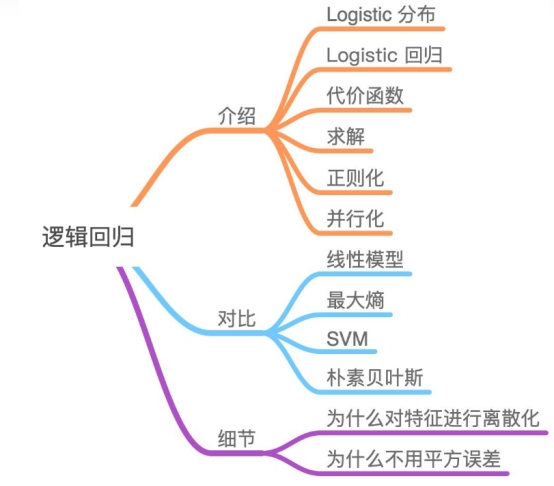 

模型介绍

Logistic Regression 虽然被称为回归，但其实际上是分类模型，并常用于二分类。Logistic Regression 因其简单、可并行化、可解释强深受工业界喜爱。

 

Logistic 回归的本质是：假设数据服从这个分布，然后使用极大似然估计做参数的估计。

 

Logistic 分布

Logistic 分布是一种连续型的概率分布，其分布函数和密度函数分别为：

 

Logistic 分布是由其位置和尺度参数定义的连续分布。Logistic 分布的形状与正态分布的形状相似，但是 Logistic 分布的尾部更长，所以我们可以使用 Logistic 分布来建模比正态分布具有更长尾部和更高波峰的数据分布。

logistic回归的因变量可以是二分类的，也可以是多分类的，但是二分类的更为常用，也更加容易解释，多类可以使用softmax方法进行处理。实际中最为常用的就是二分类的logistic回归。 

Logistic回归模型的适用条件：

1 因变量为二分类的分类变量或某事件的发生率，并且是数值型变量。但是需要注意，重复计数现象指标不适用于Logistic回归。

2 残差和因变量都要服从二项分布。二项分布对应的是分类变量，所以不是正态分布，进而不是用最小二乘法，而是最大似然法来解决方程估计和检验问题。

3 自变量和Logistic概率是线性关系

4 各观测对象间相互独立。 

原理：如果直接将线性回归的模型扣到Logistic回归中，会造成方程二边取值区间不同和普遍的非直线关系。因为Logistic中因变量为二分类变量，某个概率作为方程的因变量估计值取值范围为0-1，但是，方程右边取值范围是无穷大或者无穷小。所以，才引入Logistic回归。 

 

Logistic回归实质：发生概率除以没有发生概率再取对数。就是这个不太繁琐的变换改变了取值区间的矛盾和因变量自变量间的曲线关系。究其原因，是发生和未发生的概率成为了比值 ，这个比值就是一个缓冲，将取值范围扩大，再进行对数变换，整个因变量改变。不仅如此，这种变换往往使得因变量和自变量之间呈线性关系，这是根据大量实践而总结。所以，Logistic回归从根本上解决因变量要不是连续变量怎么办的问题。还有，Logistic应用广泛的原因是许多现实问题跟它的模型吻合。例如一件事情是否发生跟其他数值型自变量的关系。

随机森林

在机器学习中，随机森林是一个包含多个决策树的分类器， 并且其输出的类别是由个别树输出的类别的众数而定。 Leo Breiman和Adele Cutler发展出推论出随机森林的算法。 而 "Random Forests" 是他们的商标。 这个术语是1995年由贝尔实验室的Tin Kam Ho所提出的随机决策森林（random decision forests）而来的。这个方法则是结合 Breimans 的 "Bootstrap aggregating" 想法和 Ho 的"random subspace method"以建造决策树的集合。

根据下列算法而建造每棵树：

用N来表示训练用例（样本）的个数，M表示特征数目。

输入特征数目m，用于确定决策树上一个节点的决策结果；其中m应远小于M。

从N个训练用例（样本）中以有放回抽样的方式，取样N次，形成一个训练集（即bootstrap取样），并用未抽到的用例（样本）作预测，评估其误差。

对于每一个节点，随机选择m个特征，决策树上每个节点的决定都是基于这些特征确定的。根据这m个特征，计算其最佳的分裂方式。

每棵树都会完整成长而不会剪枝，这有可能在建完一棵正常树状分类器后会被采用）。

随机森林的优点有：

1）对于很多种资料，它可以产生高准确度的分类器；

2）它可以处理大量的输入变数；

3）它可以在决定类别时，评估变数的重要性；

4）在建造森林时，它可以在内部对于一般化后的误差产生不偏差的估计；

5）它包含一个好方法可以估计遗失的资料，并且，如果有很大一部分的资料遗失，仍可以维持准确度；

6）它提供一个实验方法，可以去侦测variable interactions；

7）对于不平衡的分类资料集来说，它可以平衡误差；

8）它计算各例中的亲近度，对于数据挖掘、侦测离群点（outlier）和将资料视觉化非常有用；

9）使用上述。它可被延伸应用在未标记的资料上，这类资料通常是使用非监督式聚类。也可侦测偏离者和观看资料；

10）学习过程是很快速的。

相关概念

1.分裂：在决策树的训练过程中，需要一次次的将训练数据集分裂成两个子数据集，这个过程就叫做分裂。

2.特征：在分类问题中，输入到分类器中的数据叫做特征。以上面的股票涨跌预测问题为例，特征就是前一天的交易量和收盘价。

3.待选特征：在决策树的构建过程中，需要按照一定的次序从全部的特征中选取特征。待选特征就是在步骤之前还没有被选择的特征的集合。例如，全部的特征是 ABCDE，第一步的时候，待选特征就是ABCDE，第一步选择了C，那么第二步的时候，待选特征就是ABDE。

4.分裂特征：接待选特征的定义，每一次选取的特征就是分裂特征，例如，在上面的例子中，第一步的分裂特征就是C。因为选出的这些特征将数据集分成了一个个不相交的部分，所以叫它们分裂特征。

随机森林构建

决策树相当于一个大师，通过自己在数据集中学到的知识对于新的数据进行分类。但是俗话说得好，一个诸葛亮，玩不过三个臭皮匠。随机森林就是希望构建多个臭皮匠，希望最终的分类效果能够超过单个大师的一种算法。

那随机森林具体如何构建呢？有两个方面：数据的随机性选取，以及待选特征的随机选取。

1.数据的随机选取：

首先，从原始的数据集中采取有放回的抽样，构造子数据集，子数据集的数据量是和原始数据集相同的。不同子数据集的元素可以重复，同一个子数据集中的元素也可以重复。第二，利用子数据集来构建子决策树，将这个数据放到每个子决策树中，每个子决策树输出一个结果。最后，如果有了新的数据需要通过随机森林得到分类结果，就可以通过对子决策树的判断结果的投票，得到随机森林的输出结果了。如图3，假设随机森林中有3棵子决策树，2棵子树的分类结果是A类，1棵子树的分类结果是B类，那么随机森林的分类结果就是A类。

 

待选特征的随机选取

与数据集的随机选取类似，随机森林中的子树的每一个分裂过程并未用到所有的待选特征，而是从所有的待选特征中随机选取一定的特征，之后再在随机选取的特征中选取最优的特征。这样能够使得随机森林中的决策树都能够彼此不同，提升系统的多样性，从而提升分类性能。

蓝色的方块代表所有可以被选择的特征，也就是待选特征。黄色的方块是分裂特征。左边是一棵决策树的特征选取过程，通过在待选特征中选取最优的分裂特征（别忘了前文提到的ID3算法，C4.5算法，CART算法等等），完成分裂。右边是一个随机森林中的子树的特征选取过程。

 

随机森林中的每棵树在称为自助聚集 (bagging) 的过程中随机对训练数据子集进行抽样。该模型适合这些较小的数据集，并汇总预测结果。通过有放回抽样，可以重复使用同一数据的几个实例，结果就是，这些树不仅基于不同的数据集进行训练，而且还使用不同的特性做出决策。

 

梯度提升决策树

梯度提升决策树 (GBDT) 是一种决策树集成学习算法，类似于用于分类和回归的随机森林。随机森林和 GBDT 都构建了由多个决策树组成的模型。两者的区别在于重建和组合的方式。

GBDT 使用一种称为 boosting 的技术，以迭代方式训练一组浅层决策树，每次迭代都使用上一个模型的残差拟合下一个模型。最终得到的预测结果是所有树预测结果的加权总和。随机森林 bagging 可大幅减少差异和过拟合，而 GBDT boosting 则可减少偏差和欠拟合。

XGBoost（极端梯度提升）是 GBDT 的领先、可扩展的分布式变体。使用 XGBoost 时，树并行构建，而非顺序构建。GBoost 遵循按层生长策略，扫描梯度值并使用这些部分和来评估训练集中每个可分割点的分割质量。

XGBoost 因其广泛的用例、可移植性、多样化的语言支持以及云集成而广受欢迎。

与 XGBoost 相比，随机森林模型的准确性可能会因两个不同的误差来源（偏差和方差）而下降：

梯度提升模型通过以低学习率进行多轮提升来消除偏差和方差。

梯度提升模型超参数也有助于消除方差。

随机森林模型使用树深度和树的数量消除偏差和方差。

随机森林树可能需要比梯度提升树更深入。

更多数据可减少偏差和方差。

神经网络

人工神经网络（Artificial Neural Networks，简写为ANNs）也简称为神经网络（NNs）或称作连接模型（Connection Model），它是一种模仿动物神经网络行为特征，进行分布式并行信息处理的算法数学模型。这种网络依靠系统的复杂程度，通过调整内部大量节点之间相互连接的关系，从而达到处理信息的目的。

 

定义

生物神经网络主要是指人脑的神经网络，它是人工神经网络的技术原型。人脑是人类思维的物质基础，思维的功能定位在大脑皮层，后者含有大约10^11个神经元，每个神经元又通过神经突触与大约103个其它神经元相连，形成一个高度复杂高度灵活的动态网络。作为一门学科，生物神经网络主要研究人脑神经网络的结构、功能及其工作机制，意在探索人脑思维和智能活动的规律。

人工神经网络是生物神经网络在某种简化意义下的技术复现，作为一门学科，它的主要任务是根据生物神经网络的原理和实际应用的需要建造实用的人工神经网络模型，设计相应的学习算法，模拟人脑的某种智能活动，然后在技术上实现出来用以解决实际问题。因此，生物神经网络主要研究智能的机理；人工神经网络主要研究智能机理的实现，两者相辅相成。

研究内容

神经网络的研究内容相当广泛，反映了多学科交叉技术领域的特点。主要的研究工作集中在以下几个方面：

生物原型

从生理学、心理学、解剖学、脑科学、病理学等方面研究神经细胞、神经网络、神经系统的生物原型结构及其功能机理。

建立模型

根据生物原型的研究，建立神经元、神经网络的理论模型。其中包括概念模型、知识模型、物理化学模型、数学模型等。

算法

在理论模型研究的基础上构作具体的神经网络模型，以实现计算机模拟或准备制作硬件，包括网络学习算法的研究。这方面的工作也称为技术模型研究。

神经网络用到的算法就是向量乘法，并且广泛采用符号函数及其各种逼近。并行、容错、可以硬件实现以及自我学习特性，是神经网络的几个基本优点，也是神经网络计算方法与传统方法的区别所在。

分类

人工神经网络按其模型结构大体可以分为前馈型网络（也称为多层感知机网络）和反馈型网络（也称为Hopfield网络）两大类，前者在数学上可以看作是一类大规模的非线性映射系统，后者则是一类大规模的非线性动力学系统。按照学习方式，人工神经网络又可分为有监督学习、非监督和半监督学习三类；按工作方式则可分为确定性和随机性两类；按时间特性还可分为连续型或离散型两类，等等。

特点

不论何种类型的人工神经网络，它们共同的特点是，大规模并行处理，分布式存储，弹性拓扑，高度冗余和非线性运算。因而具有很髙的运算速度，很强的联想能力，很强的适应性，很强的容错能力和自组织能力。这些特点和能力构成了人工神经网络模拟智能活动的技术基础，并在广阔的领域获得了重要的应用。例如，在通信领域，人工神经网络可以用于数据压缩、图像处理、矢量编码、差错控制（纠错和检错编码）、自适应信号处理、自适应均衡、信号检测、模式识别、ATM流量控制、路由选择、通信网优化和智能网管理等等。

工作原理

“人脑是如何工作的？”

“人类能否制作模拟人脑的人工神经元？”

多少年以来，人们从医学、生物学、生理学、哲学、信息学、计算机科学、认知学、组织协同学等各个角度企图认识并解答上述问题。在寻找上述问题答案的研究过程中，逐渐形成了一个新兴的多学科交叉技术领域，称之为“神经网络”。神经网络的研究涉及众多学科领域，这些领域互相结合、相互渗透并相互推动。不同领域的科学家又从各自学科的兴趣与特色出发，提出不同的问题，从不同的角度进行研究。

人工神经网络首先要以一定的学习准则进行学习，然后才能工作。现以人工神经网络对于写“A”、“B”两个字母的识别为例进行说明，规定当“A”输入网络时，应该输出“1”，而当输入为“B”时，输出为“0”。

所以网络学习的准则应该是：如果网络作出错误的判决，则通过网络的学习，应使得网络减少下次犯同样错误的可能性。首先，给网络的各连接权值赋予(0，1)区间内的随机值，将“A”所对应的图象模式输入给网络，网络将输入模式加权求和、与门限比较、再进行非线性运算，得到网络的输出。在此情况下，网络输出为“1”和“0”的概率各为50%，也就是说是完全随机的。这时如果输出为“1”(结果正确)，则使连接权值增大，以便使网络再次遇到“A”模式输入时，仍然能作出正确的判断。

普通计算机的功能取决于程序中给出的知识和能力。显然，对于智能活动要通过总结编制程序将十分困难。

人工神经网络也具有初步的自适应与自组织能力。在学习或训练过程中改变突触权重值，以适应周围环境的要求。同一网络因学习方式及内容不同可具有不同的功能。人工神经网络是一个具有学习能力的系统，可以发展知识，以致超过设计者原有的知识水平。通常，它的学习训练方式可分为两种，一种是有监督或称有导师的学习，这时利用给定的样本标准进行分类或模仿；另一种是无监督学习或称无为导师学习，这时，只规定学习方式或某些规则，则具体的学习内容随系统所处环境 （即输入信号情况）而异，系统可以自动发现环境特征和规律性，具有更近似人脑的功能。

神经网络就像是一个爱学习的孩子，您教她的知识她是不会忘记而且会学以致用的。我们把学习集（Learning Set）中的每个输入加到神经网络中，并告诉神经网络输出应该是什么分类。在全部学习集都运行完成之后，神经网络就根据这些例子总结出她自己的想法，到底她是怎么归纳的就是一个黑盒了。之后我们就可以把测试集（Testing Set）中的测试例子用神经网络来分别作测试，如果测试通过（比如80%或90%的正确率），那么神经网络就构建成功了。我们之后就可以用这个神经网络来判断事务的分类了。

神经网络是通过对人脑的基本单元——神经元的建模和联接，探索模拟人脑神经系统功能的模型，并研制一种具有学习、联想、记忆和模式识别等智能信息处理功能的人工系统。神经网络的一个重要特性是它能够从环境中学习，并把学习的结果分布存储于网络的突触连接中。神经网络的学习是一个过程，在其所处环境的激励下，相继给网络输入一些样本模式，并按照一定的规则（学习算法）调整网络各层的权值矩阵，待网络各层权值都收敛到一定值，学习过程结束。然后我们就可以用生成的神经网络来对真实数据做分类。

发展历史

1943年，心理学家W·Mcculloch和数理逻辑学家W·Pitts在分析、总结神经元基本特性的基础上首先提出神经元的数学模型。此模型沿用至今，并且直接影响着这一领域研究的进展。因而，他们两人可称为人工神经网络研究的先驱。

1945年冯·诺依曼领导的设计小组试制成功存储程序式电子计算机，标志着电子计算机时代的开始。1948年，他在研究工作中比较了人脑结构与存储程序式计算机的根本区别，提出了以简单神经元构成的再生自动机网络结构。但是，由于指令存储式计算机技术的发展非常迅速，迫使他放弃了神经网络研究的新途径，继续投身于指令存储式计算机技术的研究，并在此领域作出了巨大贡献。虽然，冯·诺依曼的名字是与普通计算机联系在一起的，但他也是人工神经网络研究的先驱之一。

50年代末，F·Rosenblatt设计制作了“感知机”，它是一种多层的神经网络。这项工作首次把人工神经网络的研究从理论探讨付诸工程实践。当时，世界上许多实验室仿效制作感知机，分别应用于文字识别、声音识别、声纳信号识别以及学习记忆问题的研究。然而，这次人工神经网络的研究高潮未能持续很久，许多人陆续放弃了这方面的研究工作，这是因为当时数字计算机的发展处于全盛时期，许多人误以为数字计算机可以解决人工智能、模式识别、专家系统等方面的一切问题，使感知机的工作得不到重视；其次，当时的电子技术工艺水平比较落后，主要的元件是电子管或晶体管，利用它们制作的神经网络体积庞大，价格昂贵，要制作在规模上与真实的神经网络相似是完全不可能的；另外，在1968年一本名为《感知机》的著作中指出线性感知机功能是有限的，它不能解决如异或这样的基本问题，而且多层网络还不能找到有效的计算方法，这些论点促使大批研究人员对于人工神经网络的前景失去信心。60年代末期，人工神经网络的研究进入了低潮。

另外，在60年代初期，Widrow提出了自适应线性元件网络，这是一种连续取值的线性加权求和阈值网络。后来，在此基础上发展了非线性多层自适应网络。当时，这些工作虽未标出神经网络的名称，而实际上就是一种人工神经网络模型。

随着人们对感知机兴趣的衰退，神经网络的研究沉寂了相当长的时间。80年代初期，模拟与数字混合的超大规模集成电路制作技术提高到新的水平，完全付诸实用化，此外，数字计算机的发展在若干应用领域遇到困难。这一背景预示，向人工神经网络寻求出路的时机已经成熟。美国的物理学家Hopfield于1982年和1984年在美国科学院院刊上发表了两篇关于人工神经网络研究的论文，引起了巨大的反响。人们重新认识到神经网络的威力以及付诸应用的现实性。随即，一大批学者和研究人员围绕着 Hopfield提出的方法展开了进一步的工作，形成了80年代中期以来人工神经网络的研究热潮。

2021年6月9日，英国《自然》杂志发表一项人工智能突破性成就，美国科学家团队报告机器学习工具已可以极大地加速计算机芯片设计。研究显示，该方法能给出可行的芯片设计，且芯片性能不亚于人类工程师的设计，而整个设计过程只要几个小时，而不是几个月，这为今后的每一代计算机芯片设计节省数千小时的人力。这种方法已经被谷歌用来设计下一代人工智能计算机系统。研究团队将芯片布局规划设计成一个强化学习问题，并开发了一种能给出可行芯片设计的神经网络。

 

研究方向

神经网络的研究可以分为理论研究和应用研究两大方面。

理论研究可分为以下两类：

1、利用神经生理与认知科学研究人类思维以及智能机理。

2、利用神经基础理论的研究成果，用数理方法探索功能更加完善、性能更加优越的神经网络模型，深入研究网络算法和性能，如：稳定性、收敛性、容错性、鲁棒性等；开发新的网络数理理论，如：神经网络动力学、非线性神经场等。

应用研究可分为以下两类：

1、神经网络的软件模拟和硬件实现的研究。

2、神经网络在各个领域中应用的研究。这些领域主要包括：模式识别、信号处理、知识工程、专家系统、优化组合、机器人控制等。随着神经网络理论本身以及相关理论、相关技术的不断发展，神经网络的应用定将更加深入。

卷积神经网络

卷积神经网络结构介绍

如果用全连接神经网络处理大尺寸图像具有三个明显的缺点：

（1）首先将图像展开为向量会丢失空间信息；

（2）其次参数过多效率低下，训练困难；

（3）同时大量的参数也很快会导致网络过拟合。

而使用卷积神经网络可以很好地解决上面的三个问题。

与常规神经网络不同，卷积神经网络的各层中的神经元是3维排列的：宽度、高度和深度。其中的宽度和高度是很好理解的，因为本身卷积就是一个二维模板，但是在卷积神经网络中的深度指的是激活数据体的第三个维度，而不是整个网络的深度，整个网络的深度指的是网络的层数。举个例子来理解什么是宽度，高度和深度，假如使用图像是作为卷积神经网络的输入，该输入数据体的维度是32x32x3（宽度，高度和深度）。我们将看到，层中的神经元将只与前一层中的一小块区域连接，而不是采取全连接方式。对于用来分类图像的卷积网络，其最后的输出层的维度是1x1x10，因为在卷积神经网络结构的最后部分将会把全尺寸的图像压缩为包含分类评分的一个向量，向量是在深度方向排列的。下面是例子：

 

左侧是一个3层的神经网络；右侧是一个卷积神经网络，将它的神经元在成3个维度（宽、高和深度）进行排列。卷积神经网络的每一层都将3D的输入数据变化为神经元3D的激活数据并输出。在图1的右侧，红色的输入层代表输入图像，所以它的宽度和高度就是图像的宽度和高度，它的深度是3（代表了红、绿、蓝3种颜色通道），与红色相邻的蓝色部分是经过卷积和池化之后的激活值（也可以看做是神经元） ，后面是接着的卷积池化层。

卷积神经网络主要由这几类层构成：输入层、卷积层，ReLU层、池化（Pooling）层和全连接层（全连接层和常规神经网络中的一样）。通过将这些层叠加起来，就可以构建一个完整的卷积神经网络。在实际应用中往往将卷积层与ReLU层共同称之为卷积层，所以卷积层经过卷积操作也是要经过激活函数的。具体说来，卷积层和全连接层（CONV/FC）对输入执行变换操作的时候，不仅会用到激活函数，还会用到很多参数，即神经元的权值w和偏差b；而ReLU层和池化层则是进行一个固定不变的函数操作。卷积层和全连接层中的参数会随着梯度下降被训练，这样卷积神经网络计算出的分类评分就能和训练集中的每个图像的标签吻合了。

卷积层

卷积层是构建卷积神经网络的核心层，它产生了网络中大部分的计算量。注意是计算量而不是参数量。

卷积层作用

\1. 滤波器的作用或者说是卷积的作用。卷积层的参数是有一些可学习的滤波器集合构成的。每个滤波器在空间上（宽度和高度）都比较小，但是深度和输入数据一致（这一点很重要，后面会具体介绍）。直观地来说，网络会让滤波器学习到当它看到某些类型的视觉特征时就激活，具体的视觉特征可能是某些方位上的边界，或者在第一层上某些颜色的斑点，甚至可以是网络更高层上的蜂巢状或者车轮状图案。

\2. 可以被看做是神经元的一个输出。神经元只观察输入数据中的一小部分，并且和空间上左右两边的所有神经元共享参数（因为这些数字都是使用同一个滤波器得到的结果）。

\3. 降低参数的数量。这个由于卷积具有“权值共享”这样的特性，可以降低参数数量，达到降低计算开销，防止由于参数过多而造成过拟合。

感受野

在处理图像这样的高维度输入时，让每个神经元都与前一层中的所有神经元进行全连接是不现实的。相反，我们让每个神经元只与输入数据的一个局部区域连接。该连接的空间大小叫做神经元的感受野（receptive field），它的尺寸是一个超参数（其实就是滤波器的空间尺寸）。在深度方向上，这个连接的大小总是和输入量的深度相等。需要再次强调的是，我们对待空间维度（宽和高）与深度维度是不同的：连接在空间（宽高）上是局部的，但是在深度上总是和输入数据的深度一致。

 

展现的卷积神经网络的一部分，其中的红色为输入数据，假设输入数据体尺寸为[32x32x3]，如果感受野（或滤波器尺寸）是5x5，那么卷积层中的每个神经元会有输入数据体中[5x5x3]区域的权重，共5x5x3=75个权重（还要加一个偏差参数）。注意这个连接在深度维度上的大小必须为3，和输入数据体的深度一致。其中还有一点需要注意，对应一个感受野有75个权重，这75个权重是通过学习进行更新的，所以很大程度上这些权值之间是不相等（也就对于同一个卷积核，它对于与它连接的输入的每一层的权重都是独特的，不是同样的权重重复输入层层数那么多次就可以的）。在这里相当于前面的每一个层对应一个传统意义上的卷积模板，每一层与自己卷积模板做完卷积之后，再将各个层的结果加起来，再加上偏置，注意是一个偏置，无论输入输入数据是多少层，一个卷积核就对应一个偏置。

神经元的空间排列

感受野讲解了卷积层中每个神经元与输入数据体之间的连接方式，但是尚未讨论输出数据体中神经元的数量，以及它们的排列方式。3个超参数控制着输出数据体的尺寸：深度（depth），步长（stride）和零填充（zero-padding）。

(1) 输出数据体的深度：它是一个超参数，和使用的滤波器的数量一致，而每个滤波器在输入数据中寻找一些不同的东西，即图像的某些特征。如图2 所示，将沿着深度方向排列、感受野相同的神经元集合称为深度列（depth column），也有人使用纤维（fibre）来称呼它们。

(2)在滑动滤波器的时候，必须指定步长。当步长为1，滤波器每次移动1个像素；当步长为2，滤波器滑动时每次移动2个像素，当然步长也可以是不常用的3，或者更大的数字，但这些在实际中很少使用）。这个操作会让输出数据体在空间上变小。

(3)有时候将输入数据体用0在边缘处进行填充是很方便的。这个零填充（zero-padding）的尺寸是一个超参数。零填充有一个良好性质，即可以控制输出数据体的空间尺寸（最常用的是用来保持输入数据体在空间上的尺寸，使得输入和输出的宽高都相等）。

在卷积层中权值共享是用来控制参数的数量。假如在一个卷积核中，每一个感受野采用的都是不同的权重值（卷积核的值不同），那么这样的网络中参数数量将是十分巨大的。

权值共享是基于这样的一个合理的假设：如果一个特征在计算某个空间位置 (x1,y1)(x1,y1) 的时候有用，那么它在计算另一个不同位置 (x2,y2)(x2,y2) 的时候也有用。基于这个假设，可以显著地减少参数数量。换言之，就是将深度维度上一个单独的2维切片看做深度切片（depth slice），比如一个数据体尺寸为[55x55x96]的就有96个深度切片，每个尺寸为[55x55]，其中在每个深度切片上的结果都使用同样的权重和偏差获得的。在这样的参数共享下，假如一个例子中的第一个卷积层有96个卷积核，那么就有96个不同的权重集了，一个权重集对应一个深度切片，如果卷积核的大小是 11x11的，图像是RGB 3 通道的，那么就共有96x11x11x3=34,848个不同的权重，总共有34,944个参数（因为要+96个偏差），并且在每个深度切片中的55x55 的结果使用的都是同样的参数。

在反向传播的时候，都要计算每个神经元对它的权重的梯度，但是需要把同一个深度切片上的所有神经元对权重的梯度累加，这样就得到了对共享权重的梯度。这样，每个切片只更新一个权重集。

 

连接性

卷积神经网络中卷积层间的连接被称为稀疏连接（sparse connection），即相比于前馈神经网络中的全连接，卷积层中的神经元仅与其相邻层的部分，而非全部神经元相连。具体地，卷积神经网络第l层特征图中的任意一个像素（神经元）都仅是l-1层中卷积核所定义的感受野内的像素的线性组合 [1]  。卷积神经网络的稀疏连接具有正则化的效果，提高了网络结构的稳定性和泛化能力，避免过度拟合，同时，稀疏连接减少了权重参数的总量，有利于神经网络的快速学习，和在计算时减少内存开销。

卷积神经网络中特征图同一通道内的所有像素共享一组卷积核权重系数，该性质被称为权重共享（weight sharing）。权重共享将卷积神经网络和其它包含局部连接结构的神经网络相区分，后者虽然使用了稀疏连接，但不同连接的权重是不同的。权重共享和稀疏连接一样，减少了卷积神经网络的参数总量，并具有正则化的效果。

在全连接网络视角下，卷积神经网络的稀疏连接和权重共享可以被视为两个无限强的先验（pirior），即一个隐含层神经元在其感受野之外的所有权重系数恒为0（但感受野可以在空间移动）；且在一个通道内，所有神经元的权重系数相同。

表征学习

作为深度学习的代表算法，卷积神经网络具有表征学习能力，即能够从输入信息中提取高阶特征。具体地，卷积神经网络中的卷积层和池化层能够响应输入特征的平移不变性，即能够识别位于空间不同位置的相近特征。能够提取平移不变特征是卷积神经网络在计算机视觉问题中得到应用的原因之一。

平移不变特征在卷积神经网络内部的传递具有一般性的规律。在图像处理问题中，卷积神经网络前部的特征图通常会提取图像中有代表性的高频和低频特征；随后经过池化的特征图会显示出输入图像的边缘特征（aliasing artifacts）；当信号进入更深的隐含层后，其更一般、更完整的特征会被提取。反卷积和反池化（un-pooling）可以对卷积神经网络的隐含层特征进行可视化。一个成功的卷积神经网络中，传递至全连接层的特征图会包含与学习目标相同的特征，例如图像分类中各个类别的完整图像。

 

生物学相似性

卷积神经网络中基于感受野设定的稀疏连接有明确对应的神经科学过程——视觉神经系统中视觉皮层（visual cortex）对视觉空间（visual space）的组织。视觉皮层细胞从视网膜上的光感受器接收信号，但单个视觉皮层细胞不会接收光感受器的所有信号，而是只接受其所支配的刺激区域，即感受野内的信号。只有感受野内的刺激才能够激活该神经元。多个视觉皮层细胞通过系统地将感受野叠加完整接收视网膜传递的信号并建立视觉空间。事实上机器学习的“感受野”一词即来自其对应的生物学研究。卷积神经网络中的权重共享的性质在生物学中没有明确证据，但在对与大脑学习密切相关的目标传播（target-propagation, TP）和反馈调整（feedback alignment, FA） 机制的研究中，权重共享提升了学习效果。

循环神经网络

循环神经网络（Recurrent Neural Network, RNN）是一类以序列（sequence）数据为输入，在序列的演进方向进行递归（recursion）且所有节点（循环单元）按链式连接的递归神经网络（recursive neural network）。

对循环神经网络的研究始于二十世纪80-90年代，并在二十一世纪初发展为深度学习（deep learning）算法之一，其中双向循环神经网络（Bidirectional RNN, Bi-RNN）和长短期记忆网络（Long Short-Term Memory networks，LSTM）是常见的循环神经网络。

循环神经网络具有记忆性、参数共享并且图灵完备（Turing completeness），因此在对序列的非线性特征进行学习时具有一定优势。循环神经网络在自然语言处理（Natural Language Processing, NLP），例如语音识别、语言建模、机器翻译等领域有应用，也被用于各类时间序列预报。引入了卷积神经网络（Convolutional Neural Network,CNN）构筑的循环神经网络可以处理包含序列输入的计算机视觉问题。

 

历史

1933年，西班牙神经生物学家Rafael Lorente de Nó发现大脑皮层（cerebral cortex）的解剖结构允许刺激在神经回路中循环传递，并由此提出反响回路假设（reverberating circuit hypothesis）。该假说在同时期的一系列研究中得到认可，被认为是生物拥有短期记忆的原因。随后神经生物学的进一步研究发现，反响回路的兴奋和抑制受大脑阿尔法节律（α-rhythm）调控，并在α-运动神经（α-motoneurones ）中形成循环反馈系统（recurrent feedback system）。在二十世纪70-80年代，为模拟循环反馈系统而建立的一些数学模型为RNN带来了启发。

1982年，美国学者John Hopfield基于Little (1974)的神经数学模型使用二元节点建立了具有结合存储（content-addressable memory）能力的神经网络，即Hopfield神经网络。Hopfield网络是一个包含递归计算和外部记忆（external memory）的神经网络，其内部所有节点都相互连接，并使用能量函数进行非监督学习。

1986年，Michael I. Jordan在分布式并行处理（parallel distributed processing）理论下提出了Jordan网络。Jordan网络的每个隐含层节点都与一个状态单元（state units）相连以实现延时输入，并使用logistic函数作为激励函数 。Jordan网络使用反向传播算法（Back-Propagation, BP）进行学习，并在测试中提取了给定音节的语音学特征。之后在1990年，Jeffrey Elman提出了第一个全连接的RNN，即Elman网络。Jordan网络和Elman网络都从单层前馈神经网络出发构建递归连接，因此也被称为简单循环网络（Simple Recurrent Network, SRN）。

在SRN出现的同一时期，RNN的学习理论也得到发展。在反向传播算法被提出后，学界开始尝试在BP框架下对循环神经网络进行训练。1989年，Ronald Williams和David Zipser提出了RNN的实时循环学习（Real-Time Recurrent Learning, RTRL）。随后Paul Werbos在1990年提出了随时间反向传播算法（BP Through Time，BPTT）。

1991年，Sepp Hochreiter发现了循环神经网络的长期依赖问题（long-term dependencies problem），即在对长序列进行学习时，循环神经网络会出现梯度消失（gradient vanishing）和梯度爆炸（gradient explosion）现象，无法掌握长时间跨度的非线性关系。为解决长期依赖问题，RNN的改进不断出现，较重要的包括Jurgen Schmidhuber及其合作者在1992和1997年提出的神经历史压缩器（Neural History Compressor, NHC）和长短期记忆网络（Long Short-Term Memory networks, LSTM），其中包含门控的LSTM受到了关注。

同在1997年，M. Schuster和K. Paliwal提出了具有深度结构的双向循环神经网络（Bidirectional RNN, BRNN），并对其进行了语音识别试验。双向和门控构架的出现提升了RNN的学习表现，在一些综述性研究中，被认为是RNN具有代表性的研究成果。

二十一世纪后，随着深度学习理论的出现和数值计算能力的提升，拥有更高复杂度的RNN开始在自然语言处理问题中得到关注。2005年，Alex Graves等将双向LSTM应用于语音识别，并得到了优于隐马尔可夫模型（Hidden Markov Model, HMM）的表现。

2014年，K. Cho提出了门控循环单元网络（Gated Recurrent Unit networks, GRU），该方法是LSTM之后另一个受到关注的RNN门控构架。

2010年，Tomas Mikolov及其合作者提出了基于RNN的语言模型。2013-2015年， Y. Benjo、D. Bahdanau等提出了编码器-解码器、自注意力层等一系列RNN算法，并将其应用于机器翻译问题。为语言模型设计的RNN算法在随后的研究中启发了包括Transformers、XLNet、ELMo、BERT等复杂构筑。

内部计算

RNN的核心部分是一个有向图（directed graph）。有向图展开中以链式相连的元素被称为循环单元（RNN cell）。通常地，循环单元构成的链式连接可类比前馈神经网络中的隐含层（hidden layer），但在不同的论述中，RNN的“层”可能指单个时间步的循环单元或所有的循环单元，因此作为一般性介绍，这里避免引入“隐含层”的概念。给定按序列输入的学习数据 ，RNN的展开长度为 。待处理的序列通常为时间序列，此时序列的演进方向被称为“时间步（time-step）”。对时间步 ，RNN的循环单元有如下表示

 

简单循环网络

简单循环网络（Simple Recurrent Network, SRN）是仅包含一组链式连接（单隐含层）的RNN，其中循环单元-循环单元连接的为Elman网络，闭环连接的为Jordan网络。对应的递归方式如下：

 

式中为激励函数，例如逻辑斯蒂函数或双曲正切函数。

门控算法

门控算法是RNN应对长距离依赖的可行方法，其设想是通过门控单元赋予RNN控制其内部信息积累的能力，在学习时既能掌握长距离依赖又能选择性地遗忘信息防止过载。门控算法使用BPTT和RTRL进行学习，其计算复杂度和学习表现均高于SRN。

长短期记忆网络（Long Short-Term Memory networks, LSTM）

LSTM是最早被提出的RNN门控算法，其对应的循环单元，LSTM单元包含3个门控：输入门、遗忘门和输出门。相对于RNN对系统状态建立的递归计算，3个门控对LSTM单元的内部状态建立了自循环（self-loop）。具体地，输入门决定当前时间步的输入和前一个时间步的系统状态对内部状态的更新；遗忘门决定前一个时间步内部状态对当前时间步内部状态的更新；输出门决定内部状态对系统状态的更新。LSTM单元的更新方式如下：

 

门控循环单元网络（Gated Recurrent Unit networks, GRU）

由于LSTM中3个门控对提升其学习能力的贡献不同，因此略去贡献小的门控和其对应的权重，可以简化神经网络结构并提升其学习效率。GRU即是根据以上观念提出的算法，其对应的循环单元仅包含2个门控：更新门和复位门，其中复位门的功能与LSTM单元的输入门相近，更新门则同时实现了遗忘门和输出门的功能。GRU的更新方式如下

 

STM和GRU有很多变体，包括在循环单元间共享更新门和复位门参数，以及对整个链式连接使用全局门控，但研究表明这些改进版本相比于标准算法未体现出明显优势，其可能原因是门控算法的表现主要取决于遗忘门，而上述变体和标准算法使用了的遗忘门机制相近。

 

深度算法

RNN的“深度”包含两个层面，即序列演进方向的深度和每个时间步上输入与输出间的深度。对前者，循环神经网络的深度取决于其输入序列的长度，因此在处理长序列时可以被认为是直接的深度网络；对后者，循环神经网络的深度取决于其链式连接的数量，单链的循环神经网络可以被认为是“单层”。

RNN能够以多种方式由单层加深至多层，其中最常见的策略是使用堆叠的循环单元。

堆叠循环神经网络（Stacked Recurrent Neural Network, SRNN）

SRNN是在全连接的单层RNN的基础上堆叠形成的深度算法。SRNN内循环单元的状态更新使用了其前一层相同时间步的状态和当前层前一时间步的状态：

 

双向循环神经网络（bidirectional recurrent neural network, BRNN）

BRNN是至少包含两层的深度RNN，被应用于学习目标与完整（而不是截止至当前时间步）输入序列相关的场合。例如在语音识别中，当前语音对应的词汇可能与其后出现的词汇有对应关系，因此需要以完整的语音作为输入。Bi-RNN的两个链式连接按相反的方向递归，输出的状态会进行矩阵拼接并通过输出节点，其更新规则如下：

 

应用场景

自然语言处理

RNN在NLP问题中有得到应用。在语音识别（speech recognition）中，有研究使用L双向STM对英语文集TIMIT进行语音识别，其表现超过了同等复杂度的隐马尔可夫模型（Hidden Markov Model, HMM）和深度前馈神经网络。RNN是机器翻译（Machine Translation, MT）的算法之一，并形成了区别于“统计机器翻译”的“神经机器翻译（neural machine translation）”方法  。有研究使用端到端学习的LSTM成功对法语-英语文本进行了翻译，也有研究将卷积n元模型（convolutional n-gram model）与RNN相结合进行机器翻译。有研究认为，按编码器-解码器形式组织的LSTM能够在翻译中考虑语法结构。

基于上下文连接的RNN被用于语言建模（language modeling）问题。有研究在字符层面（character level）的语言建模中，将RNN与卷积神经网络相结合。RNN也是语义分析（ sentiment analysis）的工具之一，被应用于文本分类  、社交网站数据挖掘等场合。

在语音合成（speech synthesis）领域，有研究将多个双向LSTM相组合建立了低延迟的语音合成系统，成功将英语文本转化为接近真实的语音输出 。RNN也被用于端到端文本-语音（Text-To-Speech, TTS）合成工具的开发，例子包括Tacotron 、Merlin等。

RNN也被用于与自然语言处理有关的异常值检测问题，例如社交网络中虚假信息/账号的检测。

威胁检测

在威胁检测中，可以使用循环神经网络来检测webshell的脚本，和加密流量的多流分析，用于威胁识别和发现、告警。

### **1.2.8** 机器学习与流量基线

随着计算机网络的日益发展，网络规模扩大，创新性的应用模式和需求的不断涌现，导致呈现出了越来越多的安全问题，出现各种安全事件和网络异常的可能性增大，这些安全事件和网络异常极大地增加了检测和管理的难度。

现有技术中，网络管理者通过人工实时对网络流量进行检测可以及时有效地发觉网络异常，并产生相应的报警，防止异常的进一步传播和扩大，从而为阻断网络异常行为提供决策依据，并为网络安全的管控提供技术支持和保障。

现有技术存在如下缺陷：人工对网络流量进行检测需要耗费大量人力，准确性也难以得到保障。

故此研究一种基于机器学习的异常流量检测方法、装置和设备，以实现精确地确定网络流量中的异常数据的效果。

技术背景

通信网络，软交换技术使得大规模交换机性能、告警等数据的能够进行实时采集，由于网络数据的关联复杂，实时处理要求严格等特性，使得传统的带有逻辑判断语句的程序无法适用。此外，早期的网络管理采用的网络监视手段，多数会以一种直观和可以理解的方式显示给网络管理人员，缺乏用户可以使用的启发式信息和智能帮助。此外，目前的网络管理多为事后灭火方式，没有在理论和技术上实现符合用户需求和业务发展的主动监控模式，业务和运维管理系统相互独立，不能对故障起到预防作用。因而，研究主动监控模式，从而满足性能告警的设置与屏蔽的需求．需要一套主动监控算法，包括三部分：“软交换网络性能预测算法”、“主动监控实时性能告警算法”和“主动软交换网络优化算法”，通过采集交换机海量网络告警、配置等数据，进行智能分析，为网络性能主动监控功能、告警和网络优化服务．其中，“基线算法”、“容忍度计算方法”、“告警产生机制”共同构成“主动监控实时性能告警算法”，基线的计算是一个关键环节，容忍度和告警产生机制都是依赖于基线。

已有的基线计算算法主要包括一次、二次等多项式拟合算法、概率算法、排序算法、小波理论、神经网络算法(如BP)。主要分为两类基线计算，静态基线算法和动态基线算法。

静态基线取定方法分为手工设定和自动设定，前者能够借鉴运维人员知识，具有一定的灵活性，但是当指标的波动幅度较大时，该方法易产生主观性强等问题，使得系统维护变得困难．当指标具有一定的波动范围和统计规律时，可以采用自动设定方式．但是，在监控的指标、设备数量较多的情况下，该方式难以适应运维需求，工作效率低下。

此外，静态基线算法仅适用于波动不明显的指标。对于波峰和波谷随时间变化差别较大的指标，需要设定随时间变化的门限值．已有的动态基线算法大体分为两类，基于概率法的动态基线算法和基于排序法的动态基线算法。但是，以上算法的一个共同问题是没有能够考虑到样本的周期性以及概率特征，从而忽略了利用样本的周期特性和数据分布对样本进行相关处理的改进空间。

基线算法

为了实现“主动监控”，满足性能告警的设置与屏蔽的需求，在项目实施过程中，我们实现了一套主动监控算法，包括三部分：“软交换网络性能预测算法”、“主动监控实时性能告警算法”和“主动软交换网络优化算法”，算法通过采集交换机海量网络性能、告警、配置和基础数据，对时间序列进行智能分析，实现网络性能主动监控功能、告警和网络优化．其中，“主动监控实时性能告警算法”中，由“”基线算法”、“容忍度计算方法”、“告警产生机制”共同构成。

计算基线：抽取历史正常值，建立样本空间，通过数理统计理论求取指标的正常波动范围，计算出相应的上下基线。当计算得到上下基线后，根据事先设定的容忍度，计算基线相应的容忍线，作为触发产生告警信息的阈值。

 

高斯过程学习模型设计

高斯过程学习网络设计从初始值、协方差函数的选取、超参数的先验概率分布函数、超参数的优化等方面进行考虑。

①初始值．由于系统是非线性的，初始值的选取对于学习是否达到局部最小，是否能够收敛以及训练时间的长短有很大关系．一般取权值在(一l，1)之间的随机数。

②协方差函数的选取。

③超参数的先验概率分布函数。

④超参数的优化．学习速率决定每一次循环训练中所产生的权值变化量。

2)高斯过程学习模型构建

高斯过程学习模型预测步骤如下：

1．使用RBF神经网络对样本数据，进行聚类处理，将找到聚类点作为训练数据集A；

2．选取复合核函数，并将核函数拆分为全局核函数部分和局部核函数部分，使用由聚类点组成的训练数据集，训练全局核函数部分；使用任意一点的数据，进行局部核函数训练．从而设定超参数初始值；

3．给定高斯过程学习超参数的初始值，以训练样本的极大似然为目标搜索最优超参数；

4．判断是否满足条件；

5．若满足条件，输出结果；若不满足条件返回步骤3． 

通过对样本历史数据的噪音分析，从而引入高斯过程机器学习方法对样本数据进行分析，提出了基于周期样本的高斯过程机器学习方法，通过采用复合核函数，计算网络主动监控的基线，最终提升了网络安全和网络性能。

基于时序分析

对网络流量中报文的时序检测，主要是网络威胁时序的自相似性分析，根据威胁的连续数据、间断数据、稀疏数据的关系和趋势，采用机器学习进行分析和验证，发现和识别威胁种类。

从当前已知的威胁攻击的时序图看, 时序数据大致可分为3类:

\1) “连续”数据:每个时间段都有数据;

\2) “间断”数据:有数据的时间段远大于没有数据的时间段;

\3) “稀疏”数据:有数据的时间段远小于没有数据的时间段。

一般没有那种有数据与没有数据的时间段大致相当的类型。这里所说的数据“连续”、“间断”和“稀疏”都是相对于时间单位的, 当时间单位足够小的时候, 任何威胁都会出现间断, 即某些时间段没有威胁;而当时间单位足够大时, 多数威胁就会在每个时间段都发生, 数据呈现连续性。采用大数据分析可得:网络面临的威胁事件绝不是以线性的形式发生的, 而是具有非线性特性。因此,采用大数据系统和机器学习功能要对数据进行非线性分析, 判断各个时间序列的统计自相似性或随机性, 从而判断其可预测性。

对于不同的威胁事件，往往具有不同的时序数据，主要包括总体威胁、ICMP端口不可达威胁、IIS缓冲区溢出威胁、DDoS威胁、shellcode缓冲区溢出威胁。

 

 

 

 

从图中可以看出, 网络威胁频率是一个看似随机的时间序列, 具有一定的突发性, 连续数据和间断数据每24h有一个伪周期, 白天威胁数量远高于晚上, 又具有一定的规律性。而网络威胁中除稀疏数据外, 其余网络威胁时序均具有统计自相似性, 说明网络威胁连续和间断时序具有较好的可预测性。

通过对各网络信息的攻击进行采集和整理，形成数据信息，采用马尔科夫链对报文的时序进行数据处理，使用机器学习诸如随机森林、支持向量机或贝叶斯网络等的方法进行训练形成模型，用于识别异常数据，进行威胁有效性研判。

### **1.2.9** AI芯片NPU

NPU作为一种主要采用ASIC技术的专用嵌入式神经网络芯片通过硬件模拟神经网络的方式克服了CPU、GPU在深度学习中设计上的先天不足，大大提高了深度学习芯片的运算速度。2014年寒武纪DianNao系列论文开启了专用人工智能芯片NPU架构设计的先河，直接催生了寒武纪系列NPU，一定程度上引领了华为达芬奇架构NPU、阿里“含光”、谷歌TPU等的出现。尽管现今主要的NPU只集中在推理芯片领域，但已经撼动了GPU人工智能领域的地位。NPU的出现代表了人工智能芯片开始走向定制专用化的方向。

背景介绍

如今大数据与智能时代即将来临，深度学习计算需求愈加旺盛，人工智能芯片市场初具规模，蓬勃发展。人工智能芯片功能上主要分为训练芯片和推理芯片两种，应用场景主要分为云端和终端，技术上主流的AI芯片分为GPU、FPGA以及ASIC专用芯片三大类。如今AI训练芯片主要以英伟达的GPU为主，但是在推理芯片领域主要采用ASIC技术的NPU定制新型AI芯片层出不穷，本文将主要从NPU的概念、架构和实例三个方面对其发展概况展开讨论。

概念定义

NPU（Neural-network Processing Unit）是一种嵌入式神经网络处理器，它采用“数据驱动并行计算”的架构，特别擅长处理视频、图像类的海量多媒体数据。

NPU的诞生

长期以来，应用需求一直牵动着嵌入式技术的发展方向。随着深度学习神经网络的兴起，人工智能、大数据时代的来临，CPU和GPU渐渐难以满足深度学习的需要，面对日渐旺盛的需求和广大的预期市场，设计一款专门用于神经网络深度学习的高效智能处理器显得十分必要，因此NPU应运而生。

从技术角度看，深度学习实际上是一类多层大规模人工神经网络。它模仿生物神经网络而构建，由若干人工神经元结点互联而成。神经元之间通过突触两两连接，突触记录了神经元间联系的权值强弱。由于深度学习的基本操作是神经元和突触的处理，神经网络中存储和处理是一体化的，都是通过突触权重来体现，而冯·诺伊曼结构中，存储和处理是分离的，分别由存储器和运算器来实现，二者之间存在巨大的差异。当用现有的基于冯·诺伊曼结构的经典计算机(如X86处理器和英伟达GPU)运行神经网络应用时，就不可避免地受到存储和处理分离式结构的制约，因而影响效率。因此，专门针对人工智能的专业芯片NPU更有研发的必要和需求。

 

NPU、CPU、GPU的区别

CPU(central processing unit)是中央处理器。主要包括运算器（ALU）和控制单元（CU），还包括若干寄存器、高速缓存器和它们之间通讯的数据、控制及状态的总线。CPU作为计算机系统的运算和控制核心，是信息处理、程序运行的最终执行单元。它主要负责多任务管理、调度，具有很强的通用性，是计算机的核心领导部件，其计算能力并不强，更擅长逻辑控制。

GPU（Graphics Processing Unit）是一种图形处理器，它可以弥补CPU在计算能力上的天然缺陷。相对于CPU较少的内核较多的资源而言，它采用数量众多的计算单元和超长的流水线，善于进行大量重复计算，处理图像领域的运算加速。它的基本思想是并行计算即用多个处理器来共同求解同一问题，将被求解的问题分解成若干个部分，各部分均由一个独立的处理机来并行计算。但是他的缺陷也很明显，即协调、管理能力弱，无法单独工作，需要CPU进行控制调度。虽然GPU用于深度学习运算时速度比CPU有很大提升，但对于特定应用场景其仍有功耗大，芯片容易过热，性能提升不足等问题。

相较于CPU擅长处理任务和发号施令，GPU擅长进行图像处理、并行计算算，NPU更擅长处理人工智能任务。NPU在电路层模拟人类神经元和突触，并且用深度学习指令集直接处理大规模的神经元和突触，一条指令完成一组神经元的处理。相比于CPU和GPU的冯诺伊曼结构，NPU通过突触权重实现存储和计算一体化，从而提高运行效率。但NPU也有不足，比如目前它并不支持对大量样本的训练，相对来说更擅长预测和推理。

NPU的发展现状

2016年6 月 20 日，中星微数字多媒体芯片技术 国家重点实验室在北京宣布，已研发成功了中国首款嵌入式神经网络处理器（NPU）芯片，成为全球首颗具备深度学习人工智能的嵌入式视频采集压缩编码系统级芯片，并取名“星光智能一号”。截至2020年5月，拥有NPU制造能力的厂商有寒武纪公司(Cambricon-1H/1M、MLU100)、华为（晟腾）、阿里（含光），谷歌(TPU)等。

相对于CPU拥有相对清晰的定义，稳定的生态链而言，NPU还处于方兴未艾的阶段，无论是研发还是应用还需要更多的值得探索和研究的地方。相对于CPU、GPU发展，国内追赶的窘境而言，无疑在NPU的开发上，国内厂商已经走在前列，未来可期。

NPU架构分析

2014年中科院的陈天石科研团队发表了DianNao系列论文，随即席卷了体系结构界，开启了专用人工智能芯片设计的先河。后来中科院旗下的寒武纪科技推出了其第一代NPU寒武纪1A，并用在了华为麒麟970芯片中。随后谷歌推出了TPU架构，华为推出了自研的基于达芬奇架构的NPU，阿里推出了“含光”架构的NPU。后续的NPU架构与DianNao架构都有一定联系，我们主要对DianNao架构进行简要介绍。

DianNao

DianNao是寒武纪NPU嵌入式处理器的原生架构，是寒武纪的开山之作。

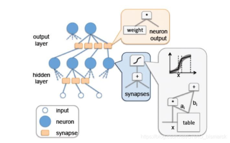 

以上是神经网络模式图，基于神经网络的人工智能算法，成功模拟了人类大脑内部神经元的结构。上图中的neuron代表的就是单个神经元，synapse代表神经元的突触，hidden layer是神经网络中的隐含层，output layer是输出层，input是神经网络输入。

下图为DianNao的内部结构：

 

蓝色区域是硬件逻辑模拟的神经网络结构，称为NFU(Neural Functional Units)。从左到右分为三个部分，NFU-1、NFU-2、NFU-3。NFU-1是乘法单元，共有256(16*16)个乘法器。NFU-2是加法树，共有16个加法树，每个加法树由15个加法器组成，排列依次为8-4-2-1。NFU-3是激活单元，共有16个激活单元。总的来说NFU将资源分为了16份，每一份包括NFU-1的16个乘法器，NFU-2的1个加法树(15个加法器)和NFU-3的一个激活函数运算器，运算时一份资源中乘法器同时运行共输出16个结果，送加法树，加法树运算后得出一个结果送激活函数，激活函数运算判断是否激活。

除此之外还有三个缓冲区，一个存储输入的数据(NBin)，一个存储运算的权值(SB)，一个存储结果(NBout)。

使用DianNao架构的深度学习神经网络芯片性能得到了很大的提高，运算速度远超GPU和CPU。DianNao的出现引起行业震动，开创了深度学习神经网络专用处理器的先河，之后又迅速涌现出许多不同的架构，其中最著名的就有谷歌公司的TPU。

DaDianNao

相比于DianNao作为嵌入式终端使用的处理器，DaDianNao 更适合做服务器使用的大规模高性能处理器。在DaDianNao的设计中，寒武纪给DaDianNao制定的要求是性能要实现DianNao的16倍提升。因此最初采用了将NFU资源扩大16倍的方案，但发现这样做布线面积大且不够高效，于是后来采用了多核并行架构，将原来资源扩大16倍的打NFU改为16个小的NFU，经过合理布线，最终面积减小28.5%且性能满足要求。

PuDianNao

PuDianNao是寒武纪为了加速机器学习中除了深度学习之外的其他重要算法而推出的一款嵌入式处理器方案。PuDianNao，内部实现了7种常用的机器学习算法：k-means，k-nearest neighbors , naive bayes ,support vector machine , linear regression , and DNN。PuDianNao的结构如下图：

 

PuDianNao结构与DianNao类似，包含三个缓冲区，和多个运算单元，缓冲区包括输入数据存储、权值存储和输出数据存储。运算单元由多个FU（Function Unit）并联组成，每个FU中包含一个MLU (Machine Learning Unit)和一个ALU。MLU结构如下：

 

MLU结构与NFU类似，只是在NFU-1前面增加了2层逻辑Counter和Adder。Counter用于累加，结果直接输出到下一层，主要是naver bayes和classification tree需要。Adder用于大部分机器学习算法，计算结果直接输出或者作为下一层的输入。Multiplier相当于NFU-1,Adder tree相当于NFU-2，ACC用于累加，当计算资源大于硬件资源时，已经算好的数据可以直接存在ACC中用作下一轮累加，节省了读写存储的开销，Misc相当于NFU-3。

ALU包含各一个加法器、乘法器、除法器和一个转换器(converter)，用于机器学习中一些特殊的MLU解决不了的计算。

使用流程

NPU 芯片采用了一个专用的存储转换单元来完成这一过程，将这一步完全固化在硬件电路中，可以在很短的时间之内完成整个转置过程。由于类似转置的计算在深度神经网络中出现得极为频繁，这样定制化电路模块的设计可以提升执行效率，从而能够实现不间断的卷积计算。 

系统采集到的数据是对一根传感光纤不断进行扫描得来的。由于光纤的长度是一定的，因此光纤上分布的传感器数量也是固定的，得到的数据是一个列数一定、行数不断增加的动态二维矩阵。在实际处理中，每次选取其中某一时间片段进行处理。

系统的采样频率为 400 Hz，在截取片段时只截取 1 s的数据，即每秒调用一次预处理程序来处理 400 个周期的数据。入侵振动信号通常是一个突变量，主要信息常常集中在 20~120 Hz部分，但是由于激光器、光路、硬件电路以及环境等因素引入的低频和其他分量会造成低频漂移或其他现象，对特征信号后续的识别带来了一定的影响。所以系统采集的原始数据在后续求包络时不能直接使用，一般使用高通滤波器去除20 Hz 以下的分量，文中实验使用带通滤波器提取出 20~100 Hz的振动信号，使系统能够提取出有效的振动信息。

一般来说，在判别是否有异常入侵事件以及类型时，判决器需要根据预处理后得到的峰度和包络两个特征量来进行异常模式的识别和定位。预处理流程如下图所示。

 

峰度是描述一组数据分布的平坦度，表征概率密度分布曲线在平均值处峰值高低的特征数，反映了峰部的尖度，一般用四阶中心矩来表示。在实验中，利用峰度值来判定振动发生的位置，其公式为：

 

峰度计算流程如下图所示：

 

包络是另一个判定振动的特征量，它是自定义的。滤波后的数据较难提取出相邻两次激励的间隔，而利用包络可以清晰得出结果，方便判断振动类型，生成的瀑布图可以更直观地看出振动位置、振动发生的地点以及相对强度。为了减少计算量，一般对时间点的维度进行分组，求出每个传感器所对应该段时间内的最大值和最小值的差，得到一个一维矩阵，即该段时间内的包络数据。包络计算流程如下图所示：

 

为了减少滤波时突变信号对后续计算包络所产生的影响，在实际处理中，选取滤波后 500 个时间采样点中去掉两端后的 400 个时间采样点的数据。通常情况下，系统通过判断峰度值的大小来判断振动发生的位置，数值大于 7即为发生了振动。将原始数据传入 Matlab 的 kurtosis()函数可直接求得每个光纤

的位置探测点所对应的峰度所组成的1×10 000矩阵。

现规定以 40 个时间点位产生的数据为一组，如40×10 000的矩阵，即 0.1 s内 10 000个光纤位置采样点的所有数据。通过 Matlab 的 max()和 min()函数找出该子矩阵中每一列的最大值 maxi和最小值 mini，并将它们依次相减得到一组数据的包络，即规格为1×10 000 的矩阵。利用循环结构多次执行相同的操作得到剩余 9 组的包络数据，然后按行重新组合成为一个 10×10 000的矩阵，该矩阵就是实验所取数据的包络矩阵。

程序一般被分成两个部分，即构建阶段和执行阶段。在构建阶段，大体定义了对原始数据的读取、滤波、求峰度和分段求包络这几个主要操作节点。

在相同条件下选取规模相同的不同原始数据，利用计时函数分别多次计算 CPU 端和 NPU 端的计算时间，具体时间如下表所示：

 

针对传统的在 CPU 端对光纤信号数据预处理中，处理速度慢、效率低的问题，文中提出并实现了基于NPU 设备上的光纤信号数据预处理的解决方案。实验结果证明，在 CPU端的计算结果与在 NPU 设备上调用 om 模型得到的峰度和包络的计算结果基本一致，满足后续对振动模式识别所需的特征量的处理要求。多次取得不同段落的相同规模的原始数据计算包络和峰度所需时间约为 280 ms，与原系统所用的 900 ms相比，效率约提升了 3 倍，远远小于系统所需的 1 s。

采用NPU进行机器学习极大的加强了我们对光纤信号和流量数据的统计学习能力，优化了流量分析和深度检测能力。

存算一体技术

技术背景

冯·诺依曼计算架构为计算机提供了理论指导，二进制编码、顺序执行等优势使其成为计算机领域主导。然而随着人工智能时代的到来，巨量数据的深度处理和存储要求更高的运算速度和更低的能耗。计算和存储单元的相互分离引起速度瓶颈与功耗浪费，传统计算机架构无法满足目标检测、情感理解等需要。因此新型计算存储一体化技术成为研究的重要方向。 

而存算一体(IMC)架构引起了广泛关注，并被认为有望成为突破冯诺依曼瓶颈的新型计算机架构， 特别是在数据密集型(data-intensive)计算中能够带来显著的性能和功耗优势。

高性能计算和数据处理芯片是软件算法功能实现的硬件载体, 软件算法和高性能计算芯片有着相互依存、相互促进的关系。近年来, 集成电路蓬勃发展带来的算力提升对基于深度神经网络的智能应用取得巨大成功有着不可磨灭的贡献。同时, 大数据和人工智能时代的来临也给传统的计算/存储分离的硬件架构带来了的存储墙及功耗墙挑战。为了降低计算和存储单元间数据频繁交换带来的延迟和功耗, 以存储为中心的计算架构逐渐兴起。近存计算和存内计算技术可以有效压缩计算单元和存储单元的时间与空间距离, 提高面向智能应用芯片的能效和性能, 受到了学术界和工业界广泛关注。

国际和国内学者报道了众多近存/存内计算技术领域的重要进展, 包括基于传统动态随机存储器 (DRAM) 等的

近存计算和存内计算芯片, 以及基于阻变存储器 (ReRAM)、相变存储器 (PCM)、磁存储器 (MRAM)等新型存储器件的近存/存内计算范式。该领域已经逐渐发展到从单纯的器件研究向电路、架构、算法综合研究的新阶段。研究人员开始更加关注器件、电路及系统稳定性与可靠性、新网络和新算法等对芯片的影响及对应的优化方法, 协同设计开始得到关注。

基于新存储技术的图计算和机器学习的加速器体系结构可以有效地减少加速器体系结构的数据流动来获得高性能和降低功耗。对于 3D 内存技术, 主要问题是如何将计算映射到分布式的内存模块和相应的计算单元, 从软硬件协同设计的角度减少通信; 对于可变电阻式存储器, 主要问题是如何将基本的计算映射到可以进行矩阵向量乘的交叉式内存控制器结构。

存内计算范式可减少数据转移并提升计算效率。 基于自旋磁存储器 (MRAM) 的存内计算设计具有非易失、高能效、易于集成等特点。人工智能处理器存在计算与存储单元之间的大规模数据移动, 给传统的计算架构带来了严重的存储墙及功耗墙挑战。通过在计算芯片内部署大量存储单元, 让存储单元具有计算能力, 可以大幅减少或避免数据移动。

存内计算技术被认为是打破 “冯 · 诺依曼瓶颈” 的有效方法。相比于传统计算芯片, 基于忆阻器的存算一体芯片在神经网络计算方面具有更高的能效, 然而存算一体芯片的计算精度往往受到忆阻器的非理想特性影响。

基于 RRAM 的存算一体神经网络加速器有高并发、低功耗等优点, 但自身限制对所处理的神经网络提出一定要求. 一方面, 神经网络需要考虑模拟计算带来的噪声问题和数模转换等问题; 另一方面,神经网络的权重数量受 RRAM 单元数量的限制, 权重和中间激活值需要进行量化以部署到硬件。因此,通常为 RRAM 存算一体加速器设计和部署的神经网络开销教大, 且模型性能较差。

存内计算技术可以有效地降低内存访问延迟, 加速传统神经网络的推理运算. 然而新型的图卷积神经网络 (GCN) 混合了计算和内存访问特性, 限制了存内计算架构的访存优势。使用一种 GCN(graph convolutional networks) 的任务调度方法.该调度方法能够有效地分配 GCN 中具有不同计算和存储资源需求的任务, 显著提高异构架构的利用率并降低 GCN 的推理延迟. 该工作为进一步加速图神经网络的处理效率提供了新的思路和技术途径。

 

AI处理器的计算逻辑和内存之间需要数据移动，形成“内存墙”和“电源墙”，阻碍了⾼级AI处理器的发展。

DM-IMCA简介

DM-IMCA是一个基于SRAM的通用IMC架构平台，其硬件架构如下图所示。DM-IMCA主要由1个6级流水精简指令集处理器核、1个指令存储器、1个存内计算协处理器——IMC-CP，以及由若干SRAM模块组成的数据存储器组成。其中处理器核是基于一款开源、具有经典5级流水且兼容MIPS32架构的低功耗轻量处理器核OpenMIPS进行裁剪与改进而来的。

数据存储器由若干常规SRAM模块与计算型SRAM——IMC-SRAM组成。IMC-SRAM是一款融合存储和计算为一体的SRAM，其硬件架构如下图所示。

 

IMC-SRAM是在如上图所示的电路原理基础之上，将传统6管单元换成9管单元，以消除6管单元所带来的读写互扰以及进行存内计算时的问题。此外，IMC-SRAM中还额外加入了少许逻辑门，用于实现除“与”和“或非”逻辑之外的其他运算。IMC-SRAM可以支持更多类型的运算，例如加法、移位运算等。此外，IMC-SRAM支持存内向量计算。如下图所示，将向量操作数A和B沿字线方向对齐存储，那么只需1次操作，便可对存储阵列中某一行的A和B分量计算完，然后将计算结果回写至同样与A和B对齐存储的向量C中。在IMC-SRAM进行存内计算时，数据存储器中的常规SRAM仍然可以进行数据的读写操作。

 

### **1.2.10** 多流威胁检测技术

加密流量检测的发展概况

随着加密流量占比的逐年增长，越来越多的研究者将目光投向了加密流量检测领域，近年来有关加密流量及其检测的研究逐年增长，这些研究根据其使用的方法大致可以分为：基于有效负载的检测方法、基于机器学习的检测方法、基于行为的检测方法、基于数据包大小分布的检测方法、混合方法五种类型，它们的占比如图所示。可以看到，有关混合方法和基于数据包大小分布的检测方法的研究相对较少，混合方法常用于某些特定的应用或者协议的识别以提升准确率，而基于数据包大小分布的检测方法在某些方面有着优秀表现。基于机器学习的检测方法的研究相对较多，事实上，这也的确是一个比较有前景的方向。基于行为的检测方法和基于有效负载的检测方法有各自的适用范围和局限。下面本章将分别介绍基于不同方法的加密流量检测方法。

 

基于有效负载的检测方法

基于有效负载的检测方法与非加密流量检测中的 DPI 方法类似，通过分析

网络流量中的有效负载来进行识别。很多加密协议，如 SSL/TLS，在进行加密

传输前会进行密钥协商，而密钥协商过程往往是明文的，基于有效负载的检测

方法就是从这部分明文信息中获取特征并结合统计方法进行识别的。

利用 SSL/TLS 协议创建会话时数据包的头部信息来建立基于一阶马尔可夫链的指纹，利用马尔可夫链状态对服务器和客户端 SSL/TLS 的消息序列进行建模。此外，相关流量中的有效负载也有利于检测。使用上下文信息，如 DNS 响应和 HTTP 头部信息来帮助识别加密流量中的威胁。DNS 响应提供了加密流量所使用的地址信息以及与域名相关的 TTL，HTTP 上下文流量中的头部信息同样有用。除此之外，还可以根据 SSL 服务证书级别来进行识别。在许多情况下，攻击者倾向于使用不可信证书来加密恶意负载，因为可信证书需要通过严格的检查才能获得。因此，利用基于 SSL 服务器证书的功能进行检测，因为恶意流量的证书往往不受信任，实验取得了较好的结果。

基于有效负载的检测方法识别准确率高，但识别复杂度也高，对资源的消耗大，且这种解析数据包负载的方法存在触犯隐私的问题。此外，该方法在处理私有协议或加密协议时难以适用，并且应用协议特征发生变化时，流量识别方法需要及时更新，否则识别准确率将难以保证。

 

基于机器学习的检测方法

基于机器学习的识别方法是一种 DFI 方法，它利用流量的统计特征来进行检测。加密技术一般只对负载信息进行加密，流的统计特征受加密影响较小。基于机器学习的识别方法相对较多，比较了六种广泛使用的监督式机器学习算法对网络流量进行分类的性能。 这些分类器是朴素贝叶斯，贝叶斯网，随机森林，决策树，朴素贝叶斯树和多层感知器。下表展示了研究结果。他们的比较结果表明，就分类准确性和计算效率而言，随机森林和决策树算法都是较有前途的网络流量分类器。说明机器学习方法在加密恶意软件流量分类任务中表现不佳的主要原因在于不准确的标注以及不平稳性。

 

基于机器学习的检测方法也能用于做精细化的分类。提出了一种方法可用于识别用户行为，该方法考虑三种时间序列：

（1）仅由传入数据包传输的字节构成的时间序列；

（2）仅由传出数据包传输的字节构成的时间序列；

（3）通过组合传入和传出数据包传输的字节构成的时间序列。

由不同的用户行为的时间序列所得到的累计图的“形状”不同，该研究提出的分类方式试图学习与特定用户行为有关的网络流的“形状”，并旨在通过对“形状”进行分类来识别用户行为。

 

基于行为的检测方法

基于行为的检测方法是通过考虑主机或应用的行为来划分不同的应用，如P2P 和 Web。一种基于主机行为的检测方法来识别流量，对未知流量进行识别的启发式技术，称为 BLINC（即 BlindClassification），它通过在传输层观察和识别主机行为的模式来进行识别。利用协议之间和时间上的相关性来识别 Web 邮件流量，这同样是由于 Web 邮件流量在主机行为上表现出特异性，如由于基于 AJAX 的客户端会定期检查新邮件，因此流向 Web 邮件服务器平台的流量呈现出固有的周期性。一种基于主机行为的 P2P 流量实时识别方法。这种识别通常是粗粒度的，但在识别 P2P 应用程序时有望做到精细化识别。将主机间时间窗口内交互数据包的数量和字节数用于 P2P-TV 应用精细化识别。基于主机行为的识别方法还可以用于识别物联网设备和事件。不同的人在使用应用程序的时候会有自己的行为特征和偏好，这些用户行为特征也有利于网络流量的识别。

一种基于机器学习的框架用于分析加密的移动流量，以找到智能手机用户使用移动应用程序的模式。基于行为的检测方法是一种常用的加密流量检测方法，尤其在识别 P2P 应用程序尤为有效，但在传输层进行加密后无法进行检测，且其精度会受到连接信息的完整性的影响。基于主机行为的检测方法粒度较粗，但其鲁棒性高，主机通信时所使用的加密协议的更新不会影响该方法的识别；基于应用行为的方法对于部分具有明显通信模式的应用可以有效地实现精细化识别，但适用范围不广。基于应用行为的方法对于加密流量精细化识别仍有待探索。

 

基于数据包大小分布的检测方法 

通过对实际网络环境中的流量进行分析可以发现，不同的业务类型所产生 的数据包的大小分布有一定差异，可以利用这种差异性来进行网络流量的检测。一种可以准确识别 P2P 和 VoIP 应用的检测方法，该方法利用数据包大小分布形成签名并用于识别。具体做法是，首先，使用双向流模型将流量数据包聚合为双向流；然后，利用数据包大小分布（PSD）的签名来获取流的特征， 即一个双向流中数据包大小分布概率；最后，根据不同应用程序的 PSD 彼此不 同来进行流量识别。使用数据包大小分布来识别 Heavy-Hitter 流，这一类流量消耗的网络资源比其他流的总和还要多得多，此类流的标识对于防止网络拥塞和整体网络性能下降至关重要。现有的识别 Heavy-Hitter 流的方法都是基于阈值的，但难以找到能够可靠地对流量进行分类的一致且可接受的阈值， 且阈值方法的准确性取决于完整性。

基于数据包大小分布的方法，使用模板匹配的技术来识别 Heavy-Hitter 流，仅使用流的前 14 个数据包即可达 到 96%的分类精度。可以利用数据包的大小特性获取更多的用户信息。在Web应用程序中往往会采取低熵输入以实现更好的交互。这样的低熵输入通常是由于基于 AJAX（异步 JavaScript 和 XML）等技术的高度交互性和动态 Web 界面的使用越来越多而导致的。这意味着有时 Web 应用程序的状态转换由非常少量的输入数据触发，因此，攻击者可以枚举所有可能的输入值，观察响应数据包的大小情况，并以此获取用户信息。在智能家居场景中，有一种方法来识别物联网设备和事件，例如发给智能助手的语音命令。该方法利用加密流量 的数据包长度统计信息来表征智能家居场景中的物联网设备和事件的行为。

 

混合方法

由于单一识别方法对某应用的识别率较低，可以结合多种加密流量识别方

法对应用进行识别。一种在 SSL/TLS 流量上的混合检测方法，该方法混合了基于签名的检测方法和基于统计分析的检测方法，取得了较好的效果。对现有的基于马尔科夫的方法进行改进，通过将属性的二元语法合并到二阶马尔可夫链中来建立模型对 HTTPS 应用进行分类。一种在细粒度级别上对 P2P 流量进行准确识别的方法，该方法仅依赖于对特定P2P 应用程序生成的流量中频繁且稳定出现的一些特殊流量进行计数，并不需要复杂的特征和技术就可以实现很高的分类精度。该方法不受高带宽应用程序的影响，大多数基于主机行为的检测方法在存在高带宽应用的环境下难以很好的工作，而该方法仍然表现良好。

基于单一方法的识别策略往往在一两个场景中表现良好，而无法在大多数场景下体现出相对于其他方法的绝对性优势。在此基础上，一种结合多种识别法方式的混合方法，验证了该方法在不同场景下的的表现，实验结果表明混合方法相对于单一方法在不同场景下具有更好的鲁棒性。

 

面向拟态流量识别技术

(1)基于特征字符的流量识别

传输PDF文件过程中可依靠检查PDF文件的xref表识别文件传输(尤其是PDF文件)，并为此划分为4类：标准(standard)、异常(malformed)、部分(partial)和其他(other)，分别依据 “％PDF％”‘‘％％EOF”、xref关键字和状态代码“206 Partial Content”识别。

利用StegoTorus的 HTTP响应特征识别并根据请求类型将响应分为6类：GET long、GET non．existing、HEAD existing、OPTIONS common、DELETE existing、TESTmethod、GETWrongProtocol，分析了误报的原因和概率。FTE报文虽然经过加密转换，但HTTP的Content．Length字段与真实内容长度不匹配，据此获得的误 报率低于4％．基于特征字符的流量识别技术开销相对较小，有很高的准确率，但前期特征发现和提取过程工作量较大．

(2)基于熵的流量识别 

FTE混淆流量经过变换处理看似普通流量，但第1个HTTP GET报文中URI经加密看似随机字节，FTE的URI熵落在5．5～5．8比特相对窄的范围内，非FTE的URI熵均小于5．1比特。据此熵识别FTE流量．获得100％的识别率。

面向隧道的流量识别技术 

(1)	基于协议字段的流量识别 

利用TLS握手协议加密套件、数字证书序列号与普通流量的差异识别Tor流量的方法．识 别率为100％。

总结出了7个稳定的Meek流特征：单一链接特征、有序连接特征、TLS Cipher Suits 特征、TLSExtensions特征、TLS ServerName特征、轮询请求特征、分组传输特征，并利用其中的静态指纹特 征过滤Meek流量。

(2)	基于报文长度的流量识别 

基于Tbr的混淆流量中报文长度与信元长度(512字节)存在倍数关系。按照信元及发送策略分析混淆流量报文长度分布，将报文长度按出现频率由高到低排序并求频率之和，选取大于门限值频率的长度作为特征长度。

统计Tor上行流量和其他类型流量中相同特征报文出现的频率形成长度分布，其离线流量识别率达到95％，在线流量识别率达到91％，误报率只有1．2×lO一，填充技术的引入使基于报文长度分布的识别技术不再适用。

(3)	基于熵的流量识别

统计发送报文长度信息熵和接收报文长度信息熵，归一化预处理成{0，l}范围内 的实数，利用SVM机器学习算法加以判别，针对识别准确率较低的问题，提出一种基于信息熵的流量 识别方法，用信息熵级联分簇，生成识别模型，识别率在90％以上。采用匿名通信系统的不可观测性度量方法，提出基于相对熵的混淆流量识别方法，从报文间隔分布相对熵和长度分布相对熵中发现普通HTTPS 报文与Meek报文间存在明显的差别.

(4)	基于行为模式的流量识别 

基于行为模式的流量识别技术，又称为启发式流量识别技术，通过匹配节点间通信模式推断节点关系或者特定角色外,早期启发式识别技术利用P2P已知属性，如同时用UDP、TCP两种协议通信、利用独立连接传输大量数据，识别精度较低。扩大了参数匹配范围以提高识别精度，利用精确匹配降低误报。利用报文长度模式匹配识别基于SSL的Tor流量，通过提取目标TLS流量特殊长度报文．计算报文间隔，并将间隔序列带入轮询请求机制判断器进行判断，识别率为97％。基于马尔可夫模型的流量识别技术，通过分析虚电路构建过程并结合日志交叉分析，形成电路构建序列的马尔可夫模型具有高达98％的识别率。

混淆流量识别技术对比分析 

流量混淆技术旨在规避审查，保护用户隐私。

混淆流量识别技术是识别混淆流量、获取流量信息的网络攻击技术．攻击混淆流量伴随着审查规避系统的不断加强，混淆流量识别技术相应地推陈出新．两种技术互为攻防，发展过程中此消彼长。

基于DPI的混淆流量识别技术从SSL报文或应用层报文中获取特征字段、统计特征，但需要人工发现并提取流量特征等大量预处理工作。

基于特征字段的DPI可依靠简单的字段匹配，复杂度为常数C。随着新的流量 混淆技术引入，DPI流量识别方法依靠统计特征识别流量变得愈发困难，准确率开始降低。DPI流量识别技术只对当前流量识别有较好的识别能力，对未来出现的混淆流量需重新分析和提取，扩展性差。 

现已应用于流量识别的机器学习算法包括4类：有监督学习、无监督学习、半监督学习和集成学习。多种机器学习分类器协同处理可以有效提高识别精确度。

基于机器学习的混淆流量识别技术是为了提高流量识别率、减少人类工作量提出来的。浅层机器学习技术仍依靠人工提取流量特征，其广泛采用BP算法，尤其是 SVM(复杂度)、决策树(复杂度)等算法；深层机器学习(深度学习)技术主要依靠流量的Bit串输入识别流量，无需人为提取特征，节省了大量人力、财力和物力，广泛采用cNN(复杂度)、SAE(复杂度)等深度神经网络算法。

机器学习技术可用于现有及未来所有流量的识别，具有很强的扩展性。流量识别技术对比情况见下图。针对随机化混淆流量的识别特征单一，主要依靠熵，但识别率高；拟态流量识 别特征包括特征字符和熵；隧道技术识别方法丰富，包括协议字段、报文长度、熵和行为模式，除基于协议字段 的识别方法可达到100％的识别率以外，其他方法的识别率为97％左右．机器学习可结合多个特征，经训练可获 得较高的识别率，但需人工发现并提取特征；深度学习可在没有任何特征时通过训练获得更高的识别率，但训练 开销大，周期长．从表3可以看出，由于DPI依靠明显的流量特征，识别率高；浅层机器学习需要数十个流量特征， 确定和提取流量特征依然需要大量工作，深度学习技术无需人为提取特征，较浅层机器学习识别方法可节省大 量工作，具有更高的识别率．今后深度学习流量识别技术将是流量识别技术的未来发展趋势。

 

加密流量检测方法总结

总体来讲，基于有效负载的检测方法准确率高，但速度慢，消耗的计算资源 也较多，同时还存在侵犯隐私等问题。基于行为的检测方法在识别 P2P 应用等 具有明显特征的应用程序上表现良好，但在识别其他类型应用时表现不佳。基于机器和数据包大小的方法检测代价小，识别速度快，有利于做到实时识别， 识别粒度和准确度较高，是一种十分有前景的方法。混合方法能做到很高的识 别准确率并具有多种场景下的稳健性，但由于集成了多种方法，在效率上较低， 且复杂度较高，多用于识别某种特定的协议或应用以提高识别准确率。 随着研究的推进，加密流量检测已经取得不错的进展，但加密流量识别也面 临着许多其他的问题。 首先，加密流量的精细化识别仍然是一个问题。纵观加密流量检测的相关研 究，大多数的加密流量检测方法仅能识别特定协议或应用，难以做到精细化识 别，如识别用户行为等。

近年来，也有部分研究将目光投向了加密流量精细化 识别。通过迁移学习来识别用户行为。通过流量的累计包长 序列图的“形状”（这实际上是一种流量的统计特征）来识别用户在社交网络上浏览某人资料、在好友的帖子下回复或发送电子邮件等行为。一种方法来识别微信红包和资金转账交易，该方法首先将流量分成几个 burst 来 描述不同的操作，然后从每个 burst 中提取相关的红包交易和资金转移的特征， 并将其用于训练基于学习的分类器以进行区分。 其次，网络流量的特征可能随时间发生相应的变化，导致分类模型的分类精 度降低，也就是所谓的概念漂移。针对概念漂移问题，研究人员进行了大量的 研究，并取得了一定的成果。机器学习中的大部分方法都假设样本服从某种平稳的概率分布，并且其识别模型在样本分布平稳时误差减少，在分布发生变化时，误差增加。通过为错误率设置警告级别来检测概念漂移并学习新的特征，可以克服多类不平衡和概念漂移问题对机器学习技术的不利影响。但是克服概念漂移问题或概念漂移检测仍存在很多待解决的问题，例如，在概念漂移检测方面，渐变式概念漂移的检测仍是一个问题，其检测漏报误报率高。 此外，流量混淆技术的出现也加大了识别难度。

流量混淆技术大致可以分为三种：随机化技术、流量伪装技术和隧道技术。

随机化技术利用加密、填 充等手段随机化目标流量，使其不再具有可供识别的特异性。例如Obfs2 混淆协议通过对密钥进行填充和对负载进行加密来随机化流量； 流量伪装技术将一种流量伪装成另一种流量来躲避检测，例如一种基于凸优化的方法，实时的修改数据包以降低各类流量分类器对于修改后流量的识别精度；隧道技术则将某协议的数据包封装在另外一个协议的负载部分发送， Meek，它是 Tor 的一个混淆层，用户在使用 Tor 访问服务器所 发送的报文都会被 Meek 封装。

因此我们需要多流威胁检测技术来提升检出效果。这里需要考虑多种因素：

多流关系定义、流间关联度定义和度量。

流量样本采集相关研究。

多流挖掘相关探索。

基于多流联合特征的加密流量识别方法。

多流概念定义

纵观加密流量检测领域的研究，基于单流的检测一直有着识别精度不够精细的问题。部分研究尝试引入多条网络流的信息，综合考虑它们以进行更精细

化的识别。有一种新思路来检测恶意流量，使用了上下文流量中的有效负载来进行检测。所谓的上下文流量主要包括与目的 IP 地址相关的DNS 相应信息、相同源 IP 地址 5min 窗口内的 HTTP 流的头部信息等。对这些流量进行大量分析，选取出具有明显区分度的特征集来训练模型，从而识别加密的恶意流量。

首先对 TCP 会话进行了截断，方式是当会话双方超过阈值时间没有进行通信即进行截断，这与后文的做法类似。针对截断后的流，不同的用户行为表现出了不同的性状，即其流量在累计包长序列图中的 “形状”不同。采用 DTW 距离作为内置距离函数对这些流进行了聚类，形成一个个簇，最后采用随机森林算法进行分类，其主要思想是：不同的操作将“触 发”不同的簇的集合。 部分研究提出了 burst 的概念，burst 是一起出现的所有网络数据包（不考虑 原地址或目标地址）的集合，它满足最新数据包出现在前一个数据包的时间阈 值（burst 阈值）之内的条件。即若在设置为突发阈值的时间量内没有新分组到达，则关闭上一个 burst 分组，并建立新的分组。如下图展示了有效载荷的累计字节数随时间序列的变化，根据 burst 的定义，图中红线标注了 burst 的起点， 绿线标注了 burst 的终点，在起点和终点之间，客户端和服务器之间不断传输着 由用户行为生成的大量数据。流是在同一 burst 中具有相同目标 IP 地址和端口 号的一系列数据包。流与 TCP 会话是不同的，TCP 会话持续时间可以很长，能 够跨越多个 burst，而流只属于一个 burst，TCP 会话可以由多个流构成。部分研 究认为，一条流表征了用户行为的一个子步骤，综合考虑这些流量，可以更加 精准地刻画用户行为。

 

这些研究的出现，实际上完成了利用单条网络流进行识别向利用多条网络 流量进行识别的转变，如下图。它们将流量拆成了一个个的“零件”，并通过用户行为“使用了哪些零件”来进行用户行为的识别。

 

骨干流量

骨干流量是客户端在响应用户行为时的关键步骤所产生的流量，是完成一个事件所需的流的最小集合。

如下图，骨干流量产生于业务逻辑，彼此之间具有较强的关联性，它们是业务逻辑的“骨架”，可以用来精准的刻画用户行为。但不通过逆向分析等手段，很难得知后台的业务逻辑，在用户行为所产生的加密流量集中寻找骨干流量是十分困难的。

 

多流是对骨干流量的一种抽象，在对用户行为所产生的流量集中的多流进行分析，并利用多流来对用户行为进行建模，从 而识别用户行为。

多流的概念定义及广泛性验证

通过对若干用户行为所产生的网络流量进行分析，总结其骨干流量的特点以及它们之间的关系，本文提出对多流的定义：

多流：

多流是指相互独立的、协同完成某一功能的、在逻辑上有较强关联性的一组流。

区别于上下文网络流量，多流更强调逻辑上而不是时间上的关联性。下图展示了一些常见的、简单的多流。

 

关联度定义

为了研究多流之间的关联性，从三个方面定义了流与流之间的关联性，分别是：源目的关联度、相似关联度、逻辑关联度，它们分别从不同角度来刻画了多流之间的不同关联性，如下图所示：

 

在进行关联度定义时，使用了流的以下几个属性，在下图中列出：

 

基于 DTW 的相似关联度评估

在客户端响应用户行为的过程中，由业务逻辑的同一关键步骤产生、执行相 同任务的流的特征应该是相似的。在数据挖掘领域中，时间序列的相似性度量同样是一个研究重点和热点，能否找到一种合适的相似性度量方案对挖掘性能有着关键影响。将结合数据挖掘领域和流量识别领域的一些研究，提出一种基于流包长序列的均值 DTW 距离的 相异性评估方法。 

DTW(Dynamic Time Warping)动态时间规整算法，是一种计算两个时间序列尤其是不同长度的序列相似度的一种动态规划算法。它主要应用在时序数据的相似度比对上，比如语音识别、手势识别等。

DTW 算法的思想是通过动态规划的算法计算序列之间的累计距离，从而得 到表示两个不同长度的序列间的距离。如下图，Flow 1 和 Flow 2 属于同一类 流量，Flow 3 和 Flow 4 属于同一种流量，可以看到，Flow 1 与 Flow 2 的包长 序列相似，Flow 3 与 Flow 4 的包长序列相似并与 Flow 1 和 Flow 2 差别较大。 可以使用 DTW 算法来进行这种相异性的评估，从而判定是否属于同一类流量， 图中属于同一类型的 Flow 1 和 Flow 2 的 DTW 距离为 3965，属于同一类型的 Flow 3 和 Flow 4 的 DTW 距离为 2483，而属于不同类型的 Flow 1 和 Flow 4 的 距离为 5741。

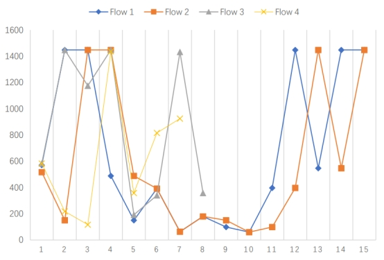 

DTW 算法本质上是一种计算累计距离的算法，它在对长度相差悬殊的两个 序列进行计算时会因为长度上的累积而导致其度量相似性的能力下降。在将 DTW 算法应用到加密流量识别领域时同样产生了这个问题，在实验过程中，两条同类型的网络流之间，由于长度相差悬殊，其 DTW 算法计算结果与不同类型的网络流之间的计算结果在数量级上相差不大，区分效果不好。最终采用均值 DTW 算法来进行替代。均值 DTW 算法是传统的 DTW 算法的一种推广，它排除了长度对 DTW 算法的影响，是一种与 DTW 算法计算复杂性相当、空间复杂度两倍于 DTW 算法的序列相似度算法。该算法在其他领域作为聚类算法的内嵌距离函数时，显著提升了结果的精度。

为了验证基于动态 DTW 算法的相似性评估函数在实际应用中的有效性以 及其与 DTW 算法的对比，选用了 Wickr Me 收到图片信息后点击下载这一用户行为，通过人工分析打标了 50 条属于同一类型的流，计算了同类流两两之间的平均 DTW 距离和平均均值 DTW 距离，于此同时，随机选取了 50 条不同类型的流，计算了不同类的流两两之间的平均 DTW 距离和平均均值 DTW 距 离。实验结果如下图所示，同一类型的流之间的均值 DTW 距离与非同一类型的流之间的均值 DTW 距离相差了 4 个数量级，效果良好。

 

基于统计的逻辑关联度评估 

在客户端响应用户行为的过程中，由业务逻辑的不同关键步骤产生的流，它 们特征不一致，但有着逻辑上的相关性，这种相关性表现为一种时序关系。用时序关系来定义了这种逻辑关联性，而逻辑关联度的评估可以采用统计学的方法。其中的映射关系在加密流量中较难确定，因为负载加密后很难确定两条流是否执行的是相同的任务。

但执行相同任务的流之间的相似关联度较强，可以根据这种相似关联性给出一个近似的映射������′ 定义如下。 对于某次用户行为所产生的流量集������，������ ∈ ������。对于该用户行为的另一次执行 所产生的流量集������′ ，������′ 为集合������到集合������′ 的映射：

 

其中������为相异性评估函数。

 对于某次用户行为所产生的流量集������，以及������的子集������，且������中的流量在������中 相互具有逻辑关联性，对于该用户行为的������ 次执行所产生的流量集������1, ������2, ������3 … ������������ 来说，若������中流量的逻辑关联性通过映射������′ 在������个流量集上得到了推广，则������⁄������ 可用来评估该逻辑关联性。定义阈值������，若������⁄������ > ������，则������中流量的逻辑关联性具 有普适性，������⁄������越大，普适性越强，越可靠。 

选取了即时通信软件接收图片、即时通信软件用户间通信、访问网页这三个用户行为，通过人工分析分别确定了两条具有时序关系的流，这两条流是 用户行为所产生的多流中的两条，它们之间具有逻辑关联性。

在 100 个相 同场景产生的流量集中计算了其������⁄������的值，如下图所示：

 

层次聚类概述

聚类分析是把研究对象，即样本或数据，分组成为由多个在某些方面类似的对象组成的类的分析方法。聚类分析的目的在于将在某些方面相似的事物归类，同一类中的对象有较大的相似性，而不同类的对象则差异性很大。

在聚类的分析中，样本的标签是未知的，需要用某种样本间紧密程度的度量方法来 将所有的对象划分到各个类中。因此，聚类分析又被称为无监督的学习。

在过去的研究中，已经有许多优秀的聚类算法已经被开发出来，大致可分为：划分方法、层次方法、基于密度的方法、基于网格的方法。 

其中，层次聚类技术是聚类分析中的一种重要的手段，也是数据挖掘领域的研究热点之一。

层次聚类根据其思想，分为自上而下的分裂的层次聚类算 法（DIANA）和自下而上的凝聚的层次聚类算法（AGNES）。其中 DIANA 的思想是首先将所有的对象划分为一个簇，然后逐步分裂为越来越小的簇，直至满 足给定的终止条件。

DIANA 的思想则恰恰相反，它先将一个个对象视为一个个单独的簇，逐渐合并两个最接近的簇以形成更大的簇，直至满足给定的条件。 如图所示：

 

在度量簇间距离时，根据其计算方法的不同，分为以下几种方法： single linkage：以两个不同簇中最近的两个样本点之间的距离作为簇间距离。 这个方法容易受到异常点的影响，即某些异常点可能作为“桥梁”将不相似的 两个簇联系起来。其距离公式表示为：

 

complete linkage：与 single linkage 相反，以两个不同簇中最远的两个样本 点的距离作为簇间距离。这个方法容易使一些较大的簇难以合并。其距离公式表示为：

 

average linkage：以分属两个不同簇中点的两两之间距离的平均值来表示这 两个簇间距离。这种方式相比前两种方式，更全面的刻画了两个簇之间的距离， 具有相对的鲁棒性。其距离公式为：

 

其中，������1、������2为两个不同的簇，������������������������、������������������������、������������������������分别为三种不同方式的簇 间距离，������������、������������为分属������1、������2的两个点，������为两点间的距离度量（向异性度量）， |������1|、|������2|为������1、������2中点的个数。

层次聚类优化算法

BIRCH算法 

即平衡迭代消减层次聚类法，通过一个树结构来实现快速聚类，这个树结构就是聚类特征树（CF-Tree），它的结构类似于平衡 B+树，由聚类特征（CF, Clustering Feature）构建而成。CF-Tree 的每个节点由若干个 CF 组成，非叶节点的 CF 有 指向子节点的指针，所有叶子节点用一个双向链表连接起来。特征聚类树的构 建是动态的，对于新到来的数据支持增量聚类。

 BIRCH 算法节约内存，聚类速度快，一次扫描即可建立 CF-Tree，对 CF-Tree 的增删改也很快，这两个特性使得 BIRCH 算法适用于大量数据的聚类。但对于 凹形的数据分布，BIRCH 算法无法获得良好的结果，若数据的分布不是呈球形，BIRCH 算法的聚类结果也不好。

CURE 算法 

绝大多数聚类算法存在这样的问题，即对球形分布的样本聚类效果良好，但 非球形的样本聚类效果不佳，或者当存在异常点时，聚类效果下降。CURE 算 法[47] 在一定程度上解决了这个问题，它选择簇中的若干个点作为此簇的代表点， 并将这些点乘以一个收缩因子，它可以通过改变收缩因子来改变簇的形状，从 而适应各种非球形的样本分布，也可以通过改变收缩因子减小异常点的影响。 

在 CURE 算法的过程中，还有两个消除孤立点或异常值的阶段。第一个阶 段是在当前簇总数减小到某个值时，根据簇的增长速度对孤立点或异常值进行 识别，其方法是将聚类过程中成员增长速度非常缓慢的簇作为异常值剔除。这 是由于孤立点或异常值往往与其他簇成员的距离更大，所以增长缓慢。第二个 阶段是在聚类的最后，将非常小的簇删除。这是由于孤立点或异常值在样本中 的占比很小，而正常簇的成员数往往很多。 

虽然 CURE 算法可以解决对非球形分布的样本的聚类问题，且受噪声影响 较小。但其参数较多，如代表点的个数、收缩因子等，对于代表点的选择也难 以反映簇内真实的样本分布，最后，消除孤立点或者异常值的第一阶段的选择 也是一个问题，如果这个阶段选择得太早，一些正常的值将被识别为孤立点或 异常值从而被抛弃，如果选择得太晚，孤立点或异常值可能已经被合并到某些 簇中了。

Chameleon 算法 

Chameleon 算法是一种具有划分和聚类两个阶段的凝聚的层次聚类算法。 Chameleon 算法改进了 CURE 和 ROCK 算法，综合考虑了互连性和相似性，具 有发现任意形状和大小的簇的能力。

Chameleon 算法具有子图划分和子簇聚类等两个阶段。子图划分阶段主要有 两个流程，首先是构造 K-最近邻图，再对 K-最近邻图进行分割。子簇聚类阶段 同时考虑相对互连性和相对近似性来进行簇的合并，最终获得聚类结果。其主要流程如图所示：

 

在子簇聚类阶段，相对互连性函数定义如下：

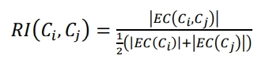 

其中，������������(������������, ������������)是连接簇������������和������������的边的权重之和，������������(������������)是把簇������������划分成两 个大小大致相等部分的最少边的权重之和。相对互连性是利用两个簇内部互连 性对簇间互联性的规范化。 相对近似性函数定义如下：

 

其中，������̅ ������������(������������, ������������)表示连接簇������������和������������的边的平均权重，������̅ ������������(������������)表示把簇������������划分 成两个大小大致相等部分的最少边的平均权重，|������������|表示簇������������中的点的个数。相 对近似性是利用两个簇内部近似度对簇间近似度的规范化。 Chameleon 算法选择相对互连函数值和相对近似函数值都大的簇进行合并， 通常的合并方案有两种： 采用阈值的方法：即设定阈值������������������和������������������，当满足下式时进行合并。

 

多流挖掘

根据相似关联度，利用聚类的方式，将多次用户行为产生的数据集中执行相同任务的流聚集在一起，从而发现该用户行为中的多流关系。根据对聚类技术的研究和考 察，选用均值 DTW 算法来衡量流与流之间的相似度，没有将流的特 征抽象为多维空间上的点，一些需要依靠中心点的聚类算法，如 K-Means 等， 并不能适用。层次聚类是一种只需要数据间相似度定义的一种聚类方式，故主要研究了基于层次聚类的多流挖掘，并吸收了层次聚类优化算法中的一些思想，将其应用于多流的挖掘。

基于层次聚类的多流挖掘 

采集������次相同的用户行为所产生的纯净流量集，依次记为������1, ������2, ������3 … ������������，其中 ������������表示第������次采集得到的纯净流量集，由������1, ������2, ������3 … ������������������ ，其中������������为������������中的第������条流， ������������中共有������������条流。由此，我们得到了实验所需的全部加密流量集������ = ������1 ∪ ������2 ∪ ������3 … ∪ ������������，如下图所示：

 

在 Chameleon 算法的子图划分阶段，Chameleon 算法通过构造 K-近邻图并 进行分割来获得一系列小型簇，这些簇的内部互连度很高。在多流领域中，具 有源目的关联性的流天然的形成了一些小型簇，这些小型簇的内部互连度同样 很高。故对于流量集������������，首先依据源目的关联度，将源 IP、目的 IP、目的端口 相同的流聚集成簇，有些簇由若干条流构成，有些簇则由单条流量构成。流量 集合������������将被划分为������������个簇：������1, ������2, ������3 … ������������������ 。如图所示：

 

对于这些簇，本文将采用凝聚的层次聚类思想对其进行聚类。在第一步中已 经将数据集������������中的流根据源目的关联度汇聚成簇，对于不同数据集中的簇，对于 具有源目的关联性的簇进行预聚类。由于没有掌握流的一些分布特性，本文采 用最朴素的 average linkage 的思想来进行聚类。对于两个簇������1与������2，基于均值 DTW 算法计算其 average linkage：

 

其中，������������������_������������������为均值 DTW 算法，|������1|、|������2|分别为簇������1、������2中流的个数， ������������、������������分别为簇������1、������2中的流。 在 average linkage 的基础上，计算其合并代价：

 

其中，������为合并代价的权值，用于控制聚类的方向。在聚类时，更倾向于不 同流量集之间的簇的合并，即“寻找共性”，相同流量集之间簇的合并则受到一 定阻碍。 ������的取值取决于两个簇中的流所属的数据集的重合度。在本文中，������取值为：

 

其中，������������为一个簇，������������(������������)为簇������������中流所属的数据集的集合，|������������(������������)|为其数 据集的个数。

 

根据 CURE 算法的思想，在聚类的某个阶段，将聚类过程中成员增长速度非常缓慢的簇作为异常值剔除。同时，选择适当的时机停止聚类，将形成一个个横跨多个数据集的、“狭长”的簇，如图所示。从这些簇中，删除过小的簇，得到最后的聚类结果。

 

对聚类结果进行分析，找到横跨的数据集个数占总数据集个数比例较高的 簇，这些簇体现出了同一用户行为的多次执行所产生的流之间的一些共性，是多流中的一类流在用户行为的多次执行中的体现。这样的簇的个数，即为多流中流的条数。

针对多流的特征工程实现

 

主动关联技术 

主动流量关联技术是攻击者对目标流量采取主动干涉手段将接收端流量与发送端流量关联起来的技术． 主动关联技术操作简单，开销低，且实时性强，适用于任何流量。

(1)	基于流速 

基于流速的流水印技术主要依靠调制流量发送速率．扩频是调制流量发送速率的典型方法．在物理层对发送信号按照某种扩频函数(如利用伪噪声pseudo．noise，简称PN)扩展频带宽度．扩频函数就是水印嵌入方法，嵌 入的信息被称为水印信号．直序扩频(DSSS)t351是扩频水印的典型代表．追踪者对原始信号珐加入水印(PM码) 信号后得到信号足，经路由转发(假设未受干扰)后，追踪者提取信号S，如果Ss=S，．，则利用PⅣj逆运算可恢复原始 信号D

 

扩频流水印提供一个隐蔽、实时的流量追踪技术．目前尚未有允许用户消除扩频流水印的解决方案。

(2)基于时间

基于时间的流水印技术分为两种：(1)基于报文间隔；(2)基于时隙分割．基于报文间隔的流水印技术通过 调整间隔嵌入水印．通过随机选取流内两个包分组，调整分组到达或离开的时 间间隔以实现水印注入。为了解决MFA攻击威胁， SWIRL算法虽然具有良好的 多流攻击、拥塞攻击抵御能力，但易受抖动和垃圾包注入的干扰，鲁棒性较差．基于时隙分割的流水印技术按照时隙分组嵌入水印。基于时隙分割流水印技术的典型实例是基于时隙质心的流水印技术，将2一个时隙按照水印信号的bit数分为2个组，每个组包含工个小组，每个小组对应n／L个时隙．如下计算各小组时隙质心：

 

计算两个群中对应同一水印bit的时隙差．水印调制模块根据差值决定每个组的延时增量． 基于时隙质心的流水印技术虽然具有较好的隐蔽性和抗干扰能力，将ICBW与DSSS相结合，基于直序扩频的时隙质心流水印方法(interval centroid based spread spectrum watermarking，简称ICBSSW)，在应对MSAC攻击和MFA方面具有较好的效果．同时，具有追踪多条流的能力，但算法复杂度高，开销大，实用性低，在抵御MFA、网络干扰、 流分割与合并等方面有较好表现。

### **1.2.11** 数据库性能优化

数据库设计 

要在数据库产品方案中实现最优的性能，比较关键的是要有一个很好的数据库设计方案。在实际工作中，许多方案往往都是由于数据库设计得不好导致性能很差。由此，要开发优秀的数据库产品就不得不考虑这个问题。 数据库的设计包括逻辑设计和物理设计两部分。通常要采用两步法进行数据库设计，即首先进行逻辑设计而后进行物理设计。数据库逻辑设计去除了所有冗余数据，提高了数 据吞吐速度，保证了数据的完整性，清楚地表达了数据元素之 间的关系。逻辑数据库设计包括使用数据库组件(如表和约 束)为业务需求和数据建模，而无须考虑如何或在哪里物理存储这些数据。物理数据库设计包括将逻辑设计映射到物理媒 体上、利用可用的硬件和软件功能使得尽可能快地对数据进 行物理访问和维护，还包括生成索引。设计好后再要更改这些组件很困难，因此，在数据库应用程序开发的早期阶段，正确设计数据库使其满足业务需求并充分利用硬件和软件功能 就显得格外重要。

适度规范化的逻辑数据库 

一般来说，逻辑数据库设计应该满足规范化的前3级标准。

①第一范式：没有重复的组或多值的列；

②第二范式：每个非关键字段必须依赖于主关键字，不能依赖于一个组合式主关键字的某些组成部分；

③第三范式：一个非关键字段不能依赖于另一个非关键字段。

遵守这些规则的设计会产生较少的列和更多的表，因而也就减少了数据冗余，也减少了用于存储数据的页。冗余数据的减少，也就减少了数据库中的总数据量， 这相应地提高了系统的查询性能。此外，通过避免更新多个位置的相同数据，规范化提高了应用程序的效率并减少因数据不一致引起错误的可能性。 然而，规范化并不总能提高性能，因为规范化处理涉及到 把表分成相关列中的最少的表，所以对一些查询来说，可能要完成复杂的联结才能实现。这种联结将导致性能下降和复杂度增大。

因此，必须对规范化进行必要的平衡，适当的时候要采用非规范的形式来提高检索速度，以便最大限度地提高应用程序的性能脚。以下方法经实践验证往往能提高性能：

(1)如果规范化设计产生了许多四路或更多路合并关系，就可以考虑在数据库实体(表)中加入重复属性(列)；

(2)常用的计算字段(如总计、均值、极值等)可以考虑存储到数据库实体中； (3)重新定义实体以减少外部属性数据或行数据的开支； 相应的非规范化类型是：

①把一个实体(表)分割成两个表(把所有的属性分成两组)。这样就把频繁被访问的数据同较少被访问的数据分开了。这种方法要求在每个表中复制首要关键字。这样产生的设计有利于并行处理，并将产生列数较少的表。

②把一个实体(表)分割成两个表(把所有的行分成 两组)。这种方法适用于那些将包含大量数据的实体(表)。在应用中常要保留历史记录，但是历史记录很少用到。因此可以把频繁被访问的数据同较少被访问的历史数据分开。

合理必要的索引 

索引是数据库中重要的数据结构，它的根本目的就是为了提高查询效率。在数据表上建立索引，可以使数据库用较少的I／O来存取数据，并且查询优化器也非常依赖索引的分配和密度。没有索引优化器，就只能选择表扫描。这将产生大量的I／O，从另一方面来说，尽管索引可以快速获取数据，但它们也同时减慢数据的修改操作和需要更多的空间。因此，必须设计出合适的索引来平衡这两者。一般来说建立索引应注意以下几点：

(1)主键时常作为WHERE子句的条件，应在表的主键列上建立索引，尤其当经常用它作为连接的时候； 

(2)在查询经常用到的所有列上创建非聚集索引； 

(3)在经常进行连接，但没有指定为外键的列上建立索引， 而不经常连接的字段则由优化器自动生成索引； 

(4)在频繁进行范围查询、排序或分组的列上建立索引； 

(5)比较窄的索引具有比较高的效率。对于比较窄的索引来说，每页上能存放较多的索引行，而且索引的级别也较少。 所以，缓存中能放置更多的索引页，这样也减少了I／o操作； 

(6)在条件表达式中经常用到的不同值较多的列上建立索 引，在不同值少的列上不要建立索引。例如在用户表的“性 别”列上只有“男”与“女”两个不同值，因此不要建立索引。如果建立索引反而会严重降低更新速度； 

(7)经常同时存取多列，且每列都含有重复值，可以考虑建 立复合索引来覆盖一个或一组查询，并把查询引用最频繁的列作为前导列，如果可能尽量使关键查询形成覆盖查询； 

(8)当数据库表更新大量数据后，删除并重建索引可以提高查询速度；

(9)频繁进行插入、删除操作的表，不要建立过多索引； 

(10)当UPDATE性能远远大于SELECT性能时，不应该创建索引。这是因为UPDATE的性能跟SELECT的性能是互相 矛盾的。

使用存储过程 

随着C／S、B／S结构的应用程序的广泛使用，如何充分利用网络资源、减少网络流量，是提高应用查询性能的一个重要因素。而存储过程的使用，则是减少网络流量、加快执行速度 的必要环节01。存储过程是数据库服务器上一组预先定义并 编译好的Transact-SQL语句。它可以接受参数、返回状态值和 参数值，并且还可以嵌套调用。当一个存储过程被第一次运行时，其将被放入内存并完全编译，在该存储过程被再次调用 时(无论是由同一用户还是不同用户调用)，可以被马上处理而 没有任何额外开销。另外存储过程是一种模式化的程序设计， 在C／S、B／S的应用程序中，使用存储过程可以方便地进行程序设计，减少程序员的工作量。

算法的讨论 

本文将MC／DC的特点运用于测试集减少上面，使测试集得到了一定程度的减少，同时在覆盖率上，使得减少后的测试集与原有测试集有着相同或者相似的覆盖率。但是由于测试集减少算法是利用MC／DC的特点，所以存在着一定的弊端：

①局限性：如果按照某种测试规则所得出的测试集对MC／DC对的覆盖情况极差的话，则算法不能达到预期的效果。举例说明如下：对于上面例子中用到的判定S啾OR B)AND(C AND D)，符合C／De(条件／判定覆盖)的测试集为 {T)={Tl，T2)，其中TI：FFFF；T2：。但是测试集{T)并不覆盖判定S中各个条件的MC／DC对，所以无法用所阐述的算法进行测试集减少。如 果所要减少测试集对MC／DC对覆盖情况好的话，利用MC／DC 进行测试集的减少，可以使得减少后的测试集与原来的测试 集有着相同或者相似的覆盖率。反之，利用MC／Dc进行测试 集减少则不能达到预期效果。

②所得到的测试集可能不是覆盖需求的最小测试集：由于利用MC／DC进行测试集的减少， 所要保证的是需求被覆盖，但是不能保证按照此种方法所得到的测试集是覆盖需求最小的测试集。举例说明如下：对 于上面例子中用到的判定S=(AORB)AND(CANDD)，所得 到的减少后的测试集{T)={Tl，T5，T6，T7，T8，T9)；但是按照MC／ DC规则所得出的测试集{TT)={T1，T2，T3，T7，T8}。

结论

以如上多种方式提高整个系统数据库的性能，最终提高检索和查询能力，并完成恶意流量和威胁事件的检出和检索展示能力。

## 1.3 系统架构设计

### **1.3.1** 设计思想

软件系统架构是关于软件系统的结构，行为和属性的高级抽象。描述阶段，其对象是直接构成系统的抽象组件以及各个组件之间的连接规则，特别是相对细致地描述组件之间的通讯。在实现阶段，这些抽象组件被细化为实际的组件，比如具体类或者对象。软件系统架构不仅指定了软件系统的组织结构和拓扑结构，而且显示了系统需求和构成组件之间的对应关系，包括设计决策的基本方法和基本原理。

### **1.3.2** 架构体系

 

系统通过分光实时输入流量，经过高速流量接入、协议识别提取、分层检测、隧道剥离、加密流量解析、全要素日志生成等环节，输出威胁日志，威胁流量、还原文件等内容。

同时接收外探针扫描日志和网关告警日志，主机病毒日志，主机行为日志等外包日志。

数据在入侵与威胁分析采用对重引擎进行分析和处理，输出威胁和告警信息。

资产发现子系统通过主动和被动模式进行资产发现和资产画像与异常检出。

行为异常发现模块根据外部日志和流量分析结果进行分析和处理，形成告警信息。

最终由统计和展示为用户提供服务，完成用户需求的实现。

 

按照技术路线和系统架构，对功能模块分为流量采集、流量分析、入侵检测和资产发现、违规行为发现和本系统的配置策略等功能。

网络流量采集功能采用高性能的优化算法技术，结合软硬件均衡资源调度，完成对流量的高效捕获和对IP包重组以及响应的丢包重传处理，并可以在初步阶段进行单包的威胁检出。

在流量处理中采用自动化代码和高效状态机完成对协议的识别和提取，改用启发式模型完成对文件格式识别，采用内存缓存的算法完成文件还原，实现对文件的深度检出。

在全流量处理方面，支持存储与查询，并支持BPF语法来优化用户体验和使用效果。

网络流量分析功能主要是对流量采用机器学习来建立基线，实现异常流量分析，并从地址排名、业务应用排名、协议排名和业务区域排名完成多维度统计，同时支持自定义业务统计和自定义区域统计。以攻击者视角、受害者视角、威胁情报视角、元数据视角来完成对维度监控视图，以提供更好的观察角度和更好的用户体验。

入侵检测功能主要是实现自定义入侵规则，完成信标检测、snort规则检测、和关联规则检测。同时支持拒绝服务攻击检测和弱口令检测、双向流量检测，暴力破解等多维度的检测能力。

资产发现功能采用扫描方法提供主动资产发现和通过流量数据完成被动资产发现，并支持设置资产任务定义，支持单次和周期性检测，并形成资产基线，支持自定义和自学习。最后形成资产画像，可通过手动和自动两种操作模式形成网络拓扑结构，以实现更加完善的功能。

违规行为发现功能支持口令爆破，通过深度检测、汇总分析、和关联分析，可对违规行为结果及TOP5进行展示。同时支持通过违规外联进行自学习模型训练来发现告警，支持二次关联告警。支持访问控制策略隐患控制监控分析，可以采集网关设备分析，并支持获取违规文件取证和违规行为取证，全流量网络攻击告警取证。

配置策略功能支持策略管理和设备配置、引擎配置、授权、日志存储、pcap存储、升级等功能。

**1.1.1.1.3.2.1** 架构体系定义

一个程序和计算系统软件体系结构是指一个或多个结构。结构中包括软件的构件、构件的外部可见属性以及它们之间的相关关系。

体系结构并非可运行软件。确切的说，它是一种表达，使软件工程师能够：

(1)分析设计在满足规定需求方面的有效性。

(2)在设计变更相对容易的阶段，考虑体系结构的可能的选择方案。

(3)降低与软件构造相关联的风险。

上面的定义强调在任意体系结构表述中“软件构件”的角色。在体系结构设计的环境中，软件构件可以简单到程序模块或者面向对象的类，也可以扩充到包含数据库和能够完成客户与服务器网络配置的“中间件”。

软件体系结构的设计通常考虑了金字塔中的两个层次----数据设计和体系结构设计。数据设计使我们表示出传统体系结构的数据构件和面向对象系统中的类的定义（封装了属性和操作），体系结构设计则主要软件构件的结构、属性和交互作用。

建立体系结构层的“内聚的，良好设计的表示”所需的方法，其目标是提供一种导出体系结构设计的系统化方法，而体系结构设计是构建软件的初始蓝图。

5.6.3.2.2 软件架构设计与生命周期

需求分析阶段

需求阶段的SA研究还处于起步阶段。在本质上，需求和SA设计面临的是不同的对象：一个是问题空间；另一个是解空间。保持二者的可追踪性和转换，一直是软件工程领域追求的目标。从软件需求模型向SA模型的转换主要关注两个问题：

（1）	如何根据需求模型构建SA模型。

（2）	如何保证模型转换的可追踪性。

针对这两个问题的解决方案，随着所采用的需求模型的不同而各异。在采用Use Case图描述需求的方法中，从Use Case图向SA模型（包括类图等）的转换一般经过词性分析和一些经验规则来完成，而可追踪性则可通过表格或者Use Case Map等来维护。

从软件复用的角度看，SA影响需求工程也有其自然性和必然性，已有系统的SA模型对新系统的需求工程能够起到很好的借鉴作用。在需求阶段研究SA,有助于将SA的概念贯穿整个软件生命周期，从而保证了软件开发过程的概念完整性，有利于各阶级参与者的交流，也易于维护各阶级的可追踪性。

设计阶段

设计阶段是SA研究关注的最早和最多的阶段，这一阶段的SA研究主要包括：SA模型的描述、SA模型的设计与分析方法，以及对SA设计经验的总结与复用等。有关SA模型描述的研究分为三个层次：

（1）SA的基本概念，即SA模型由哪些元素组成，这些组成元素之间按照何种原则组织。传统的设计概念只包括构件（软件系统中相对独立的有机组成部分，最初称为模块）以及一些基本的模块互联机制。随着研究的深入，构件间的互联机制逐渐独立出来，成为与构件同等级别的实体，称为连接子。现阶段的SA描述方法是构件和连接子的建模。近年来，也有学者认为应当把Aspect等引入SA模型。

（2）体系结构描述语言（Architecture Description Language，ADL），支持构件、连接子及其配置的描述语言就是如今所说的体系结构描述语言。ADL对连接子的重视成为区分ADL和其他建模语言的重要特征之一。典型的ADL包括UniCon、Rapide、Darwin、Wright、C2 SADL、Acme、XADL、XYZ/ADL和ABC/ADL等。

（3）SA模型的多视图表示，从不同的视角描述特定系统的体系结构，从而得到多个视图，并将这些视图组织起来以描述整体的SA模型。多视图作为一种描述SA的重要途径，也是近年来SA研究领域的重要方向之一。系统的每一个不同侧面的视图反映了一组系统相关人员所关注的系统的特定方面，多视图体现了关注点分离的思想。把体系结构描述语言和多视图结合起来描述系统的体系结构，能使系统更易于理解，方便系统相关人员之间进行交流，并且有利于系统的一致性检测以及系统质量属性的评估。学术界已经提出若干多视图的方案，典型的包括4+1模型（逻辑视图、进程视图、开发视图、物理视图，加上统一的场景）、Hofmesiter的4视图模型（概念视图、模块视图、执行视图、代码视图）、CMU-SEI的Views and Beyond模型（模块视图、构件和连接子视图、分配视图）等。此外，工业界也提出了若干多视图描述SA模型的标准，如IEEE标准1471-2000（软件密集型系统体系结构描述推荐实践）、开放分布式处理参考模型（RM-ODP）、统一建模语言（UML）以及IBM公司推出的Zachman框架等。需要说明的是，现阶段的ADL大多没有显式地支持多视图，并且上述多视图并不一定只描述设计阶段的模型。

实现阶段

最初的SA研究往往只关注较高层次的系统设计、描述和验证。为了有效实现从SA设计向实现的转换，实现阶段的体系结构研究在以下几个方面。

（1）研究基于SA的开发过程支持，如项目组织结构、配置管理等。

（2）寻求从SA向实现过渡的途径，如将程序设计语言元素引入SA阶段、模型映射、构件组装、复用中间件平台等。

（3）研究基于SA的测试技术。

SA提供了待生成系统的蓝图，根据该蓝图实现系统需要较好的开发组织结构和过程管理技术。以体系结构为中心的软件项目管理方法，开发团队的组织结构应该和体系结构模型有一定的对应关系，从而提高软件开发的效率和质量。

对于大型软件系统而言，由于参与实现的人员较多，所以需要提供适当的配置管理手段。SA引入能够有效扩充现有配置管理的能力，通过在SA描述中引入版本、可选择项（options）等信息，可以分析和记录不同版本构件和连接子之间的演化，从而可用来组织配置管理的相关活动。典型的例子包括支持给构件指定多种实现的UniCon、支持给构件和连接子定义版本信息和可选信息的xADL等。

为了填补高层SA模型和底层实现之间的鸿沟，通过封装底层的实现细节，模型转换、精化等手段缩小概念之间的差距。典型的方法如下。

（1）在SA模型中引入实现阶段的概念，如引入程序设计语言元素等。

（2）通过模型转换技术，将高层的SA模型逐步精化成能够支持实现的模型。

（3）封装底层的实现细节，使之成为较大粒度构件，在SA指导下通过构件组装的方式实现系统，这往往需要底层中间件平台的支持。

构件组装阶段

在SA设计模型的指导下，可复用构件组装可以在较高层次上实现系统，并能够提高系统实现的效率。在构件组装的过程中，SA设计模型起到了系统蓝图的作用。研究内容包括：

（1）如何支持可复用构件的互联，即对SA设计模型中规约的连接子的实现提供支持。

（2）在组装过程中，如何检测并消除体系结构失配问题。

对设计阶段连接子的支持：不少ADL支持在实现阶段将连接子转换到具体的程序代码或系统实现，如UniCon定义了Pipe、FilelO、ProcedureCall 等多种内建的连接子类型，它们在设计阶段被实例化，并可以在实现阶段在工具的支持下转化成为具体的实现机制，如过程调用、操作系统数据访问、Unix管道和文件、远程过程调用等。支持从SA模型生成代码的体系结构描述语言，如C2SADL、Rapide等，也都提供了一定的机制生成连接子的代码。

中间件遵循特定的构件标准，为构件互联提供支持，并提供相应的公共服务，如安全服务、命名服务等。中间件支持的连接子实现有如下优势：

（1）中间件提供了构件之间跨平台交互的能力，且遵循特定的工业标准，如CORBA、J2EE、COM等，可以有效地保证构件之间的通信完整性。

（2）产品化的中间件可以提供强大的公共服务能力，这样能够更好地保证最终系统的质量属性。设计阶段连接子的规约可以用于中间件的选择，如消息通信连接子最好选择提供消息通信机制的中间件平台。从某种意义上说，随着中间件技术的发展，也导致一类新的SA风格，即中间件导向的体系结构风格（middleware-induced architectural style）的出现。

检测并消除体系结构失配：体系结构失配问题是由David Garlan等人在1995年提出。失配是指在软件复用的过程中，由于待复用构件对最终系统的体系结构和环境的假设（assumption）与实际状况不同而导致的冲突。在构件组装阶段失配问题主要包括：

（1）由构件引起的失配，包括由于系统对构件基础设施、构件控制模型和构件数据模型的假设存在冲突引起的失配。

（2）由连接子引起的失配，包括由于系统对构件交互协议、连接子数据模型的假设存在冲突引起的失配。

（3）由于系统成分对全局体系结构的假设存在冲突引起的失配等。要解决失配问题，首先需要检测出失配问题，并在此基础上通过适当的手段消除检测出的失配问题。

部署阶段

随着网络与分布式软件的发展，软件部署逐渐从软件开发过程中独立出来，成为软件生命周期中一个独立的阶段。为了使分布式软件满足一定的质量属性要求，如性能、可靠性等，部署需要考虑多方面的信息，如待部署软件构件的互联性、硬件的拓扑结构、硬件资源占用等。SA对软件部署的作用如下：

（1）	提供高层的体系结构视图描述部署阶段的软硬件模型。

（2）	基于SA模型可以分析部署研究更多的质量属性，从而选择合理的部署方案。

先阶段，基于SA的软件部署研究更多地集中挂在组织和展示部署阶段的SA、评估分析部署阶段方案等方面，部署方案的分析往往停留在定性的层面，并需要部署人员的参与。

后开发阶段

后开发阶段是指软件部署安装之后的阶段。这一阶段的SA研究主要围绕维护、演化、复用等方面来进行。典型的研究方向包括动态软件体系结构、体系结构恢复与重建等。

1）动态软件体系结构

传统的SA研究设想体系结构总是静态的，即软件的体系结构一旦建立，就不会在运行时刻发生变动。但人们在实践中发现，现实中的软件往往具有动态性，即它们的体系结构会在运行时发生改变。SA在运行时发生的变化包括两类。一类是软件内部执行所导致的体系结构改变。比如，很多服务器端软件会在客户请求到达时创建新的构件来 cO响应用户的需求。某个自适应的软件系统可能根据不同的配置状况采用不同的连接子来传送数据。另一类变化是软件系统外部的请求对软件进行的重配置。比如，有很多高安全性的软件系统，这些系统在升级或进行其他修改时不能停机。因为修改是在运行时刻进行的，体系结构也就动态地发生了变化。在高安全性系统之外也有很多软件需要进行动态修改，比如很多操作系统期望能够在升级时无须重新启动系统，在运行过程中就完成对体系结构的修改。

由于软件系统会在运行时刻发生动态变化，这就给体系结构的研究提出了很多新的问题。如何在设计阶段捕获体系结构的这种动态性，并进一步指导软件系统在运行时刻实施这些变化，从而达到系统的在线演化或自适应甚至自主计算，是动态体系结构所要研究的内容。现阶段，动态软件体系结构研究可分为以下两个部分。

（1）体系结构设计阶段的支持。主要包括变化的描述、根据变化如何生成修改策略、描述修改过程、在高抽象层次保证修改的可行性以及分析、推理修改所带来的影响等。

（2）运行时刻基础设施的支持。主要包括系统体系结构的维护、保证体系结构修改在约束范围内、提供系统的运行时刻信息、分析修改后的体系结构符合指定的属性、正确映射体系结构构造元素的变化到实现模块、保证系统的重要子系统的连续执行并保持状态、分析和测试运行系统等。

2）体系结构恢复与重建

当前系统的开发很少是从头开始的，大量的软件开发任务是基于已有的遗产系统进行升级、增强或移植。这些系统在开发的时候没有考虑SA，在将这些系统进行构件化包装、复用的时候，会得不到体系结构的支持。因此，从这些系统中恢复或重构体系结构是有意义的，也是必要的。

SA重建是指从已实现的系统中获取体系结构的过程。一般地，SA重建的输出是一组体系结构视图。现有的体系结构重建方法可以分为4类：

（1）手工体系结构重建。

（2）工具支持的手工重建。通过工具对手工重建提供辅助支持，包括获得基本体系结构单元、提供图形界面允许用户操作SA模型、支持分析SA模型等。如KLOCwork inSight 工具（www.klocwork.com/products/insight.asp）使用代码分析算法直接从源代码获得SA构件视图，用户可以通过操作图形化的SA设定体系结构规则，并可在工具的支持下实现对体系结构的理解、自动控制和管理。

（3）通过查询语言来自动建立聚集。这类方法适用于较大规模的系统，基本思路是：在逆向工程工具的支持下分析程序源代码，然后将所得到的体系结构信息存入数据库，并通过适当的查询语言得到有效的体系结构显示。

（4）使用其他技术，比如数据挖掘等。

软件架构的重要性

软件架构设计是降低成本、改进质量、按时和按需交付产品的关键因素。

1.架构设计能够满足系统的品质

系统的功能性是软件构架师通过组成体系架构的多种元素之间的交互作用来支持的。架构设计用于实现系统的品质，如性能、安全性和可维护性等。通过架构设计文档化，可以尽早的评估项目的这些品质。

2.架构设计使受益人达成一致的目标

架构设计的过程使得不同的受益人达成一致的目标，体系架构的过程需要确保架构设计被清楚地传达与理解。一个被有效传达的体系架构使得涉众们可以辩论决议和权衡，反复讨论，最终达成共识。文档化体系架构是非常重要的，这是软件构架师的主要职责。

3.架构设计能够支持计划编制过程

架构设计将确定组件之间的依赖关系，直接支持项目计划和项目管理的活动，例如，细节化分，日程安排，工作分配，成本分析，风险管理和技能开发等；构架师还能协助估算项目成本，例如，体系架构决定使用第三方组件的成本，以及支持开发的所有工具的成本；构架师支持技术风险的管理，包括制定每一个风险的优先次序，以及确定一个恰当的风险缓解策略。

4.架构设计对系统开发的指导性

架构设计主要目标就是确保体系架构能够为设计人员和实现人员所承担的工作提供可靠的框架。很明显，这比简单的传送一个体系架构视图要复杂的多。为了确保最终体系架构的完整性，构架师必须明确的定义体系架构，因为它确定了体系架构的重要元素，例如系统的组件，组件之间的接口以及组件之间的通信。

构架师同时还必须定义恰当的标准和指导方针，它们将会引导设计人员和实现人员的工作。对开发过程活动采取恰当的架构回顾和评估，能够确保体系架构的完整性。这些QA（Quality Assurance，质量保障）活动的任务是确定体系架构的标准和指导方针的有效性。

5.架构设计能够有效地管理复杂性

如今的系统越来越复杂，这种复杂性需要我们去管理。体系架构通过构件及构件之间关系，描述了一个抽象的系统，因而提供了高层次的复杂管理的方法。同样，架构设计过程考虑组件的递归分解。这是处理一个大的问题的很好的一个方法，它可以把这个大问题分解成很多的小问题，再逐个的解决。

6.架构设计为复用奠定了基础

架构设计过程可以同时支持使用和建立复用资源。复用资源可以降低一个系统的成本，并且可以改进系统的质量，这些好处已经被证明。一个体系架构的建立，能够支持大粒度的资源复用。例如，体系架构的重要组件和它们之间的接口和质量，能够支持现货供应的组件，存在的系统和封装的应用程序等的选择，从而可以用来实现这些组件。

7.架构设计能够降低维护费用

架构设计过程可以在很多方面帮助我们降低维护费用。首先最重要的是架构设计过程要确保系统的维护人员是一个主要的涉众，并且他们的需求被作为首要的任务满足。一个被恰当文档化的体系架构不应该仅仅为了减轻系统的可维护性；构架师还应该确保结合了恰当的系统维护机制，并且在建立体系架构的时候还要考虑系统的适应性和可扩充性。

8.架构设计能够支持冲突分析

架构设计的一个重要的好处是它可以允许我们在采取改变之前推断它所产生的影响。一个软件构架确定了主要的组件和它们之间的交互作用，两个组件之间的依赖性以及这些组件对于需求的可追溯性。有了这个信息，例如需求的改变等可以通过组件的影响来分析。同样的，改变一个组件的影响可以在依靠它的其他组件上分析出来。

**1.1.1.1.3.2.2** 基于体系结构的设计方法

设计方法概述

基于体系结构的软件设计方法，该方法是体系结构驱动，即指构成体系结构的商业、质量和功能需求的组合驱动的。使用该方法，设计活动可以从项目总体功能框架明确就开始，这意味着需求抽取和分析还没有完成（甚至远远没有完成），就开始了软件设计。设计活动的开始并不意味着需求抽取和分析活动就可以终止，而是应该与设计活动并行。特别是在不可能预先决定所有需求时，例如产品线系统或长期运行的系统，快速开始设计是至关重要的。

基于体系结构的设计方法有三个基础。第一个基础功能的分解。在功能分解中，使用已有的基于模块的内聚和耦合技术。第二个基础是通过选择体系结构风格实现质量和商业需求。第三个是软件模板的使用。软件模块利用了一些软件系统的结构。

本方法是递归的，且迭代的每一个步骤都是清晰地定义的。因此，不管设计是否完成，体系结构总是清晰的，这有助于降低体系结构设计的随意性。

概念与术语

1.设计元素

ABSD方法是一个自顶向下，递归细化的方法，软件系统的体系结构通过该方法得到细化，直到能产生软件构件和类。

ABSD方法中使用的设计元素如图5-1所示。在最顶层，系统被分解为若干概念子系统和一个或若干个软件模板。在第二层，概念子系统又被分解成概念构件和一个或若干个附加软件模板。

 

2.视角与视图

考虑体系结构时，重要的是从不同的视角（perspective）来检查，这促使软件设计师考虑体系结构的不同属性。例如，展示功能组织的静态视角能判断质量特性，展示并发行为的动态视角能判断系统行为特性。选择的特定视角或视图也就是逻辑视图、进程视图、实现视图和配置视图。使用逻辑视图来记录设计元素的功能和概念接口，设计元素的功能定义了它本身在系统中的角色，这些角色包括功能性能等。

3.用例和质量场景

用例已经成为推测系统在一个具体设置中的行为的重要技术，用例被用在很多不同的场合，用例是系统的一个给予用户一个结果值的功能点，用例用来捕获功能需求。在使用用例捕获功能需求的同时，我们通过定义特定场景来捕获质量需求，并称这些场景为质量场景。这样一来，在一般的软件开发过程中，我们使用质量场景捕获变更、性能、可靠性和交互性，分别称之为变更场景、性能场景、可靠性场景和交互性场景。质量场景必须包括预期的和非预期的。例如，一个预期的性能场景是估计每年用户数量增加10%的影响，一个非预期的场景是估计每年用户数量增加100%的影响。非预期场景可能不能真正实现，但它们在决定设计的边界条件时很有用。

基于体系结构的设计模型

本节讨论基于体系结构的软件设计模型。传统的软件设计过程可以划分为从概念直到实现的若干个阶段，包括问题定义、需求分析、软件设计、软件实现及软件测试等。如果采用传统的软件设计模型，软件体系结构的建立应位于需求分析之后，概要设计之前。

传统的软件设计模型存在设计效率不高，不能很好地支持软件重用等缺点。基于体系结构的软件设计过程划分为体系结构需求、设计、文档化、复审、实现和演化等6个子过程。

 

体系结构需求

需求是指用户对目标软件系统在功能、行为、性能、设计约束等方面的期望。体系结构需求受技术环境和体系结构设计师的经验影响。需求过程主要是获取用户需求，标识系统中所要用到的构件。体系结构需求过程如图所示。如果以前有类似的系统体系结构的需求，我们可以从需求库中取出，加以利用和修改，以节省需求获取的时间，减少重复劳动，提高开发效率。

1.需求获取

体系结构需求一般来自三个方面，分别是系统的质量目标、系统的商业目标和系统开发人员的商业目标。软件体系结构需求获取过程主要是定义开发人员必须实现的软件功能，使得用户能完成他们的任务，从而满足业务上的功能需求。与此同时，还要获得软件质量属性，满足一些非功能需求。

2.标识构件

在图5-3中虚框部分属于标识构件过程，该过程为系统生成初始逻辑结构，包含大致的构件。这一过程又可分为三步来实现。

第一步：生成类图。生成类图的CASE工具有很多，例如Rational Rose2000能自动生成类图。

第二步：对类进行分组。在生成的类图基础上，使用一些标准对类进行分组可以大大简化类图结构，使之更清晰。一般地，与其他类隔离的类形成一个组，由概括关联的类组成一个附加组，由聚合或合成关联的类也形成一个附加组。

第三步：把类打包成构件。把在第二步得到的类簇打包成构件，这些构件可以分组合并成更大的构件。

3.架构需求评审

组织一个由不同代表（如分析人员、客户、设计人员、测试人员）组成的小组，对体系结构需求及相关构件进行仔细的审查。审查的主要内容包括所获取的需求是否真实反映了用户的要求，类的分组是否合理，构件合并是否合理等。必要时，可以在“需求获取一标识构件一需求评审”之间进行迭代。

 

体系结构设计

体系结构需求用来激发和调整设计决策，不同的视图被用来表达与质量目标有关的信息。体系结构设计是一个迭代的过程，如果要设计的系统能够从已有的系统中导出大部分，则可以使用已有的设计过程。

1.提出软件体系结构模型

在建立体系结构的初期，选择一个合适的体系结构风格是首要的。在这个风格基础上，开发人员通过体系结构模型，可以获得关于体系结构属性的理解。此时，虽然这个模型是理想化的（其中的某些部分可能错误地表示了应用的特征），但是，该模型为将来的实现和演化过程建立了目标。

2.把已标识的构件映射到软件体系结构中

把在体系结构需求阶段已标识的构件映射到体系结构中，将产生一个中间结构，这个中间结构只包含那些能明确适合体系结构模型的构件。

3.分析构件之间的相互作用

为了把所有已标识的构件集成到体系结构中，必须认真分析这些构件的相互作用和关系。

4.产生软件体系结构

一旦决定了关键的构件之间的关系和相互作用，就可以在第2阶段得到的中间结构的基础上进行精化。

5.设计评审

一旦设计了软件体系结构，必须邀请独立于系统开发的外部人员对体系结构进行评审。

软件体系设计过程如图所示：

  

体系结构文档化

绝大多数的体系结构都是抽象的，由一些概念上的构件组成。例如，层的概念在任何程序设计语言中都不存在。因此，要让系统分析员和程序员去实现体系结构，还必须得把体系结构进行文档化。文档是在系统演化的每一个阶段，系统设计与开发人员的通信媒介，是为验证体系结构设计和提炼或修改这些设计（必要时）所执行预先分析的基础。

体系结构文档化过程的主要输出结果是体系结构规格说明和测试体系结构需求的质量设计说明书这两个文档。生成需求模型构件的精确的形式化的描述，作为用户和开发者之间的一个协约。软件体系结构的文档要求与软件开发项目中的其他文档是类似的。文档的完整性和质量是软件体系结构成功的关键因素。文档要从使用者的角度进行编写，必须分发给所有与系统有关的开发人员，且必须保证开发者手上的文档是最新的。

体系结构复审

体系结构设计、文档化和复审是一个迭代过程。从这个方面来说，在一个主版本的软件体系结构分析之后，要安排一次由外部人员（用户代表和领域专家）参加的复审。

鉴于体系结构文档标准化，以及风险识别的现实情况，通常我们根据架构设计，搭建一个可运行的最小化系统用于评估和测试体系架构是否满足需要。是否存在可识别的技术和协作风险。

复审的目的是标识潜在的风险，及早发现体系结构设计中的缺陷和错误，包括体系结构能否满足需求、质量需求是否在设计中得到体现、层次是否清晰、构件的划分是否合理、文档表达是否明确、构件的设计是否满足功能与性能的要求等。

体系结构实现

所谓“实现”就是要用实体来显示出一个软件体系结构，即要符合体系结构所描述的结构性设计决策，分割成规定的构件，按规定方式互相交互结构说明书为基础的，每个构件必须满足软件体系结构中说明的对其他构件的责任。这些决定即实现的约束是在系统级或项目范围内给出的，每个构件上工作的实现者是看不见的。

在体系结构说明书中，已经定义了系统中的构件与构件之间的关系。因为在体系结构层次上，构件接口约束对外唯一地代表了构件，所以可以从构件库中查找符合接口约束的构件，必要时开发新的满足要求的构件。然后，按照设计提供的结构，通过组装支持工具把这些构件的实现体组装起来，完成整个软件系统的连接与合成。

最后一步是测试，包括单个构件的功能性测试和被组装应用的整体功能和性能

体系结构的实现过程如下所示：

 

体系结构的演化

在构件开发过程中，用户的需求可能还有变动。在软件开发完毕，正常运行后，由一个单位移植到另一个单位，需求也会发生变化。在这两种情况下，就必须相应地修改软件体系结构，以适应新的变化了的软件需求。

1.需求变化归类

首先必须对用户需求的变化进行归类，使变化的需求与已有构件对应。对找不到对应构件的变动，也要做好标记，在后续工作中，将创建新的构件，以对应这部分变化的需求。

2.制订体系结构演化计划

在改变原有结构之前，开发组织必须制订一个周密的体系结构演化计划，作为后续演化开发工作的指南。

3.修改、增加或删除构件

在演化计划的基础上，开发人员可根据在第1步得到的需求变动的归类情况，决定是否修改或删除存在的构件、增加新构件。最后，对修改和增加的构件进行功能性测试。

4.更新构件的相互作用

随着构件的增加、删除和修改，构件之间的控制流必须得到更新。

5.构件组装与测试

通过组装支持工具把这些构件的实现体组装起来，完成整个软件系统的连接与合成，形成新的体系结构。然后对组装后的系统整体功能和性能进行测试。

6.技术评审

对以上步骤进行确认，进行技术评审。评审组装后的体系结构是否反映需求变动，符合用户需求。如果不符合，则需要在第2到第6步之间进行迭代。

在原来系统上所作的所有修改必须集成到原来的体系结构中，完成一次演化过程。

体系结构演化过程如下所示：

 

**1.1.1.1.3.2.3** 面向构件架构设计

面向构件的软件设计是现在软件设计的重要方法，是软件生产线技术、软件工厂技术重要的理论基础。而在20世纪90年代之前，软件领域中的构件一直没有成功发展，这与软件领域中软件复杂度管理和软件复用粒度需求有关。术语“软件构件”的定义以及“构件化软件”等的仍然存在许多不同的观点，但构件概念已经在工程中被建立并且发展较为成熟，本章讨论软件构件的概念及构件化软件开发设计的方法与存在问题。

构件的概念

人们经常不做区分地使用术语“构件”和“对象”，以及像“构件对象”这样的短语组合。对象常被称为是类的实例，对象和构件都通过类或接口向外界提供服务。对于对象和构件之间的交互，设计人员常用模式描述，用框架规范。而构件和框架又都常被称为是白盒的或黑盒的。程序语言设计者还不断提出诸如名字空间、模块、包等各种名词。这种术语和概念泛滥的现象亟待改变，应该消除它们的冗余歧义，或者对它们进行阐明、解释与辨析。这些都让术语“构件”更加扑朔迷离。

术语与概念

构件技术蕴涵了太多概念。一个典型的例子就是含义众多的术语“对象”。随着时间的推移，模块、类和构件的概念都最终为“对象”所包括。最近，术语“软件构件”甚至到了把以前的普通对象也称作是构件的程度。将几个术语合并为一个，看起来似乎方便了使用，但除此之外再无其他好处。所以，必须在保证术语的准确度和直观性的前提下取得某种平衡。下面定义了几个关键的术语，并描述了它们之间的关系。

构件

构件的特性如下。

·独立部署单元。

·作为第三方的组装单元。

·没有（外部的）可见状态。

这些特性有几重含义。

一个构件是独立可部署的，意味着它必须能跟它所在的环境及其他构件完全分离。因此，构件必须封装自己的全部内部特征。并且，构件作为一个部署单元，具有原子性，是不可拆分的。也就是说，第三方没有权利访问其所使用的任何构件的内部细节信息。

在这样的约束下，如果第三方厂商能将一个构件和其他构件组装在一起，那么这个构件不但必须具备足够好的内聚性，还必须将自己的依赖条件和所提供的服务说明清楚。换句话说，构件必须封装它的实现，并且只通过良好定义的接口与外部环境进行交互。

最后，一个构件不能有任何（外部的）可见状态一—这要求构件不能与自己的拷贝有所区别。但对于不影响构件功能的某些属性，例如，用于计费的序列号，则没有这种限制。通过对属性的可见性进行限制，允许用户在不影响构件的可见行为的前提下，使用合法的技术手段对那些影响性能的状态进行特殊处理。特别是，构件可以将某些状态专门用于缓存（缓存具有这样的特性：当它被清空时除了可能会降低性能以外，没有其他后果）。

构件在特定的系统中可以被装载和激活。但是，由于构件本质上没有状态，因此，在同一操作系统进程中装载多个构件的拷贝是毫无意义的，而且它们之间是不可区分的。也就是说，给定一个进程（或者其他的语境），至多会存在一个特定构件的拷贝。因此，谈论某个构件的可用拷贝的数量是没有什么意义的。

在目前许多系统中，构件被实现为大粒度的单元，系统中的构件只能有一个实例。

例如，一个数据库服务器可以作为一个构件。如果这个服务器刚好只维护了一个数据库，那么会很容易把该数据库误认为是实例，如公司里的员工工资管理服务器。该数据库服务器连同其中的数据库，可以被视为一个有可见状态的模块。根据上面的定义，该数据库并不是一个构件，但那个静态的数据库服务器程序却是一个构件一—它只支持一个数据库“对象”实例。也就是说，在这个例子中，工资管理服务器程序是一个构件，而其中的工资数据只是实例（对象）。这种将不易变的“模型”和易变的“实例”分离的做法避免了大量的维护问题。如果允许构件拥有可见状态的话，那么任何两个来自同一个构件的实例都不会拥有相同的属性。

在这一点上一定要分辨清楚。这里所说的构件的概念与对象层次上的可见或不可见状态无关，也与对象状态的生命周期（每次呼叫，每次会话，或是永久的）无关。这些全都是对象层次上所关心的东西，与构件的概念并没有直接的关系，但是通过构件，我们可以获得拥有任何这些属性的对象。

对象

说起对象，不得不提实例化、标志和封装。与构件的特性不同，对象的特性是：

（1）一个实例单元，具有唯一的标志。

（2）可能具有状态，此状态外部可见。

（3）封装了自己的状态和行为。

同样，对象的一系列属性随之而来。由于对象是一个实例化的单元，所以不能被局部初始化。由于对象有各自的状态，它必须有唯一的标志，以使它在整个生命周期内，无论状态如何变化，都能够被唯一地识别。

当对象被实例化的时候，需要一个构造方案来描述其状态空间、初始状态和新生对象的行为。该方案在对象存在之前就已经存在。显式存在的实例化方案称为类。也有隐式的实例化方案，即通过克隆一个已存在的对象来实现，即原型对象。AJ无论使用类的形式，还是用原型对象的形式来初始化一个对象，这个新生的对象都必须被设置一个初始状态。创建与初始化控制对象的代码可以是一个静态的过程—一如果它是对象所从属类的一部分，就被称为构造函数。如果这个对象是专门用来创建与初始化对象的，则简称为工厂。对象中专门用来返回其他新创建的对象的方法常被称为工厂方法。

构件与对象

构件的行为显然可以通过对象来实现，因此构件通常包含了若干类或不可更改的原型对象。除此之外，构件还包括一系列对象，这些对象被用来获取默认的初始状态和其他的构件资源。

但构件并非一定要包含类元素，它甚至可以不包含类。实际上，构件可以拥有传统的过程体，甚至全局变量，它也可以通过函数语言，或者汇编语言，或者其他可用方法实现自身的全部特性。构件创建的对象——更确切地说是对这些对象的引用一—可以与该构件分离开来，并对构件的客户可见。构件的客户通常是指其他的构件。除非构件的对象对客户可见，否则我们无从判断一个构件内部是否是“完全面向对象”的。一个构件可以包含多个类元素，但是一个类元素只能属于一个构件。将一个类拆分进行部署通常没什么意义。另外，正如类之间可以通过继承关系等产生依赖一样，构件之间也可以存在互相依赖的关系——这种依赖很重要。一个类的父类并不一定与它的子类存在于同一个构件中。如果一个类的父类存在于外部的其他构件中，那么这两个类之间的继承关系便是跨构件的，这种关系将会导致相关联的构件间的导入关系。规约的继承是保证正确性的一项很关键的技术，因为共同的规约是构件间达成共识的基础。至于构件间对实现的继承是好是坏，仍然是众多学术流派争论的焦点。

模块

构件与模块的概念其实非常类似。模块的概念出现于20世纪70年代后期的模块化语言（Wirth，1977；Mitchell等人，1979）。最广泛使用的模块化语言是Modula-2（Wirth，1982）和Ada。

在Ada里面，模块被称做包，但其实两者是相同的。模块化方法成熟的标志是其对分离编译技术的支持，包括跨模块的正确的类型检查能力。

随着Eiffel语言的面世，类被认为是更好的模块（Meyer，1988）。这似乎是正确的，因为我们最初的想法是每个模块实现一种抽象数据类型。毕竟，我们可以把一个类看成是一个抽象数据类型的实现，只不过它多了继承和多态的特性而已。然而，模块常常被用于把多个诸如抽象数据类型、类等实体打包到一个单元中。并且，模块没有实例化的概念，而类却有。

在其后出现的程序设计语言中——比如Modula-3，Component Pascal，和C#——模块的概念（C#中的集合）与类的概念是区分对待的。在任何情况下，模块都可以包含多个类。在有些没有模块概念的语言（诸如Java语言）中，模块可以通过嵌套类来模拟实现。类之间的继承关系并不受模块界限的限制。另外值得一提的是，在Smalltalk系统中，经常会通过修改当前已存在的类来构造一个应用程序，人们已经开始尝试定义“模块系统”，这将使Smalltalk越过类而直接达到构件级水平，例如Fresco（Wills，1991）。

模块本身就可以作为一个最简单的构件。即使不包含任何类元素的模块也可以实现构件的功能。传统的数值计算函数库就是一个很好的例子，这些库是功能性的，而不是面向对象的，但却可以打包成模块。然而，一个成熟的复杂的构件却并不是简单地仅用模块就可以实现的。模块没有持久不变的资源，有的只是那些被硬编码到程序中的常量。资源可以参数化一个构件。通过替换这些资源，就可以重新配置该构件而无需更改构件代码。例如，本地化设置可以通过资源配置实现。看起来资源配置好像为构件赋予了可变的状态值。但是我们知道，构件不能修改它们自身的资源，这些资源与编译后的代码一样只是构件的组成部分。追踪一个构件与它所派生的本地化了的构件之间的关联，在某种程度上，和追踪同一构件的不同的发布版本之间的关系相似。

某些情况下，模块并不适合作为构件，掌握这些情况是非常有用的。根据本书的定义，构件没有外部可见的状态，但是模块却可以显式地用全局变量来使其状态可见。并且，通过直接导入其他模块的接口，模块之间可以存在静态的代码依赖。而对于构件来说，虽然也允许存在对构件外部代码的静态依赖关系，但却并不提倡。这种静态依赖关系应被限定用于那些合约元素，包括类型和常量。使用间接而非直接的接口表示模块的依赖关系，把对实现代码的依赖关系限定于对象层次，就可以利用同一接口的不同实现来灵活地组装模块。

总的说来，模块化是构件技术产生的前提，但对于构件来说，传统的模块化的概念和标准是远远不够的。很多模块化的概念源自.Parmas（1972），其中包括最大化内聚性与最小化耦合性这条基本原理。因此，模块化的思想并不新鲜。但遗憾的是，现今的大部分的软件仍然不是模块化的。比如，有不少的大型企业应用都是对一个单一的数据库进行操作，允许应用系统的任何一部分依赖于数据模型的任何部分。但构件技术则要求系统中各部分必须互相独立，或者存在可控的显式依赖关系。因此构件技术必将导致模块化的解决方案。这种软件工程效益充分说明对构件技术的投资是有价值的。

白盒、黑盒与重用

黑盒抽象与白盒抽象的区别主要在于接口“后面”的实现细节是否可见。在理想的黑盒抽象的情况下，客户对接口和规约之外的实现细节一无所知。而在白盒抽象中，在接口限制了用户行为并确保了封装性的情况下，客户仍然可以通过继承对构件的实现细节进行修改。由于在白盒方式中实现细节对外界是完全可见的，因此可以对实现细节进行研究，以加深对该接口抽象含义的理解。

揭示实现细节的可控部分。这是一个有争议的概念，因为部分可见的实现细节可以是规约的一部分。一个完整的实现只需要保证，能被客户看见的那部分实现细节与抽象的接口规约一致即可。这是将规约实现的标准方式。

黑盒重用指仅仅依赖接口和规约来实现。比如，在绝大多数系统中，应用程序接口（Application Programming Interface，API）完全与内部的具体实现无关。用这样的应用程序接口构造系统相当于黑盒重用这些接口的实现。

相反，白盒重用指依赖于对具体实现细节的理解，通过接口来使用软件部件。大部分类库和框架都会提供源代码，应用程序开发人员通过学习类的具体实现，就可以知道如何构造该类的子类。

 

在白盒重用中，被重用的软件不可以轻易地被另外的软件替换。如果贸然替换将有可能破坏正在重用的客户端，因为这些客户端依赖于那些在未来可能发生改变的实现细节。

根据上述特性可以得出以下的定义：“软件构件是一种组装单元，它具有规范的接口规约和显式的语境依赖。软件构件可以被独立地部署并由第三方任意地组装。”

这个定义最先是在1996年的面向对象程序设计欧洲会议上（European Conference on Object-Oriented Programming，ECOOP），由面向构件程序设计工作组（Szyperski和Pfister，1997）提出。该定义涵盖了我们之前讨论的那些构件特性。它既包括了技术因素，例如独立性、合约接口、组装，也包括了市场因素，例如第三方和部署。就技术和市场两方面的因素融为一体而言，即使是超出软件范围来评价，构件也是独一无二的。

而从当前的角度看，上述定义仍然需要进一步澄清。一个可部署构件的合约内容远不只接口和依赖，它还要规定构件应该如何部署、一旦被部署（和启动）了应该如何被实例化、实例如何通过规定的接口工作等。事实上，各个接口的规约都应该被独立地看待，任何提供与使用该接口实现的构件之间都是相对独立的。比如，一个实现队列操作的构件通过一个接口获得物理存储空间，通过另外两个接口提供入队列和出队列的操作。在构件的合约中说明，通过入队列接口插入队列的元素，可以通过出队列接口中的操作取出来，这种关联关系，任何接口规约都不能单独提供。该合约同时也规定构件一旦被实例化，就必须在关联一个实现了物理存储空间接口的构件之后才能被使用。这种关联将受到底层构件模型的组装规则的影响。具体的部署和安装的细节由特定的构件平台提供。

接口

接口是一个已命名的一组操作的集合。构件的客户（通常是其他构件）通过这些访问点来使用构件提供的服务。通常来说，构件在不同的访问点有多个不同的接口。每一个访问点会提供不同的服务，以迎合不同的客户需求。强调构件接口规范的合约性非常重要，因为构件和它的客户是在互不知情的情况下分别独立开发的，是合约提供了保证两者成功交互的公共中间层。

成功的合约接口需要遵循哪些非技术因素？首先，必须时刻关注经济效益。一个构件可以有多个接口，每一个接口提供一种服务。有一些服务会格外受客户欢迎，但是如果所有服务都不受欢迎，那么服务的组合也不会受欢迎，这个构件就没有市场价值了。

这样的话，就没有必要在非构件的实现方案的构件化上进行投资了。

其次，应当避免不当的市场分化，因为这威胁到构件的生存。所以，尽量不要重复引入功能相近的接口。在市场经济中，这通常是主要生产商在市场早期努力推行标准化的结果，或者是经过残酷的市场竞争优胜劣汰的结果。但是，前者可能会由于笨拙官僚的“委员会设计”问题而不能达到最优；而对于后者，市场竞争的非技术本质也可能导致结果不是最优的。

最后，为了使一个接口的规范和实现该接口的构件得到广泛应用，需要有一个公共传媒来向大众进行宣传和推广。要做到这一点，至少需要几种能被广泛认可的保证命名唯一性的命名方案。接口标准化的一个非常有意思的变种，是对消息的格式、模式和协议的标准化。它不是要将接口格式化为参数化操作的集合，而是关注输入输出的消息的标准化，它强调当机器在网络中互连时，标准的消息模式、格式、协议的重要性。这也是因特网（IP、UDP、TCP、SNMP等）和Web（HTTP、HTML等）标准的主要做法。

为了获得更广泛的语义，有必要在一个单一通用的消息格式语境中标准化消息模式。这就是XL的思想。XML提供了一种统一的数据格式。

显示语境依赖

在上文的构件定义中，构件除了要说明所提供的接口外，还要说明其需求。也就是说为了使构件正常地工作，必须说明其对部署环境的具体要求。这些要求被称为语境依赖，指的是构件组装和部署的语境，包括了定义组装规则的构件模型和定义构件部署、安装和激活规则的构件平台。如果只存在一种软件构件体系的话，那么只需要列举该构件所需的所有其他构件提供的接口，这样就足够可以说明全部的语境依赖。例如，一个合并邮件的构件会声明它需要一个文件系统的接口。但是，今天的大多数构件即使连这样的需要的接口也通常不进行声明。而构件提供的接口更受关注。

事实上，目前有几种构件体系同时存在，它们相互竞争，彼此冲突。例如，现在就有OMG的CORBA，Sun的Java，以及微软的COM和CLR（Common Language Runtime）等体系。

并且，因为要支持不同的计算和网络平台，构件体系本身并不是单一的。这种状况还没有很快改善的迹象。而另外一种观点则认为，所有这些构件体系最终都只能归结为两类—CORBA+Java体系和微软体系（包括COM+和.NET/CLR）。但即使构件体系被刻意减少到不能再少的区区两种，在具体实现层次上还是存在着千差万别的。

构件的规模

显然，构件只有在提供了“恰当”的接口集，以及对语境依赖没有严格限制的情况下，该构件可以在所有的构件体系中运行，并且其依赖的接口不会超出那些构件体系所能提供的范围时最好用。然而，只有极少的构件拥有这么弱的环境依赖性。技术上来说，一个构件可能和它所需要的所有软件捆绑起来被提供，但这显然违背了使用构件的初衷。注意，环境需求往往取决于构件运行的目标机器。如果是虚拟机，例如Java虚拟机，这就显然是该构件体系规范的内容之一。如果是本地代码平台，仍然有类似于Apple的将多个二进制文件打包成一个文件的Fat Binaries这样的机制，可以使构件在“所有地方”运行。

构件设计者通常不会构造自给自足的构件，将所需的所有东西都打包进来，而是采取一种“最大化重用”的策略。为了避免在构件中重复实现那些次要的服务，设计师通常会只实现该构件的核心功能，然后重用其他所有的一切。面向对象的设计有向这种极端发展的趋势，许多面向对象的方法论者都大力提倡这种最大化重用的思想。虽然最大化重用的思想有很多为人称道的优点，但是它也有一个潜在的缺点—语境依赖的爆炸性增长。如果构件在发布后其设计一直冻结不变，同时所有的部署环境也都一样，那么这个问题就不会出现。然而，构件会不断地演化，不同的部署环境会提供不同的配置，多种版本会同时存在，在这样的情况下大量的语境依赖只会使构件成为众矢之的。语境依赖越多，能满足构件环境需求的客户构件就越少。总之，最大化重用降低了可用性。

构件设计者需要为以上两者找到一个平衡点。当要描述构件的基本接口的时候，设计者们就需要做出抉择。增加语境依赖通常会使构件因重用而简洁，但却会降低可用性。此外，还必须考虑环境的演化会使构件更加脆弱，例如引入新版本带来的变化。增加构件的自给性可以减少语境依赖，增加可用性，并且使构件更健壮，但却会使构件规模过大。

标准化与规范化

通过提高接口与构件体系的标准化和规范化程度，可以使上文优化问题中的最优点偏向于简洁性一侧。一个东西越稳定，越容易被广泛接受，其成为某个构件的特殊需求的危险就越小。如果语境依赖能够被广泛支持，就不是什么缺点。比如仅仅在50年前，要求客户必须拥有电话才能谈妥生意是极不明智的。而现在，在世界上的许多地方，拥有电话已经成为必要条件。

1）统一市场与专业市场

如果要制定一种覆盖所有领域、有广泛市场的标准，就有必要区分面向通用市场与面向专业市场的两种标准。通用市场覆盖了多数甚至全部不同的市场领域；它对所有或绝大多数的客户和生产商都有影响。专业市场往往只限于某个特定的领域，相对来说影响比较小。例如，因特网和万维网的标准都属于通用市场标准。与之相反，放射医学领域的标准就只影响一个比较窄的专业市场，却同样会占有相当大的市场份额。

通用市场的标准化是非常困难的。如果有一项服务几乎和每个人都相关，那么它就得满足所有人的需求。想像一下那些通用程序设计语言标准化委员会，他们为顾全各方面的利益而疲于奔命。与此同时，成功的标准只有在通用市场中才能形成最广泛的影响，网络标准就是其中最好的例子。

2）标准的构件体系与规范化

在基本构件体系和那些最重要的接口合约形成标准，并且在这些标准被相关的工业界支持的情况下，构件技术最为成功。然而，要发挥标准化的作用，就必须使与之竞争的其他标准的数目尽量很小。如果某个标准背后有一个强大的国际标准化组织认可，有一个非常有实力的企业推动，有众多有影响力的公司或组织联合支持，那么一切自然不成问题。然而，通常却是几个标准在相互竞争。如果因专业市场各自为政，导致某标准在不同领域重复建设，而该标准又可能适合其他领域，就可能出现戏剧性的结果：很多原先互不知情的标准竞争者在一夜之间一起出现。例如，放射医学和射电天文学就可以共享多种图像处理标准。

如果相互竞争的标准过多，而其相应的市场份额过小，就可能引发危机，这个问题可以通过规范化的手段来解决。公布共同的设计“模式”，并对其进行编目，原来互不知情的各方标准化实体就有可能在各自的目标领域发现共同点。当然，寻找和利用共同点的努力是否值得，即成本效益是否理想是个规模效益的问题。

**1.1.1.1.3.2.4** 构件框架

构件体系结构

系统的体系结构是任何大规模软件技术的关键基础，在基于构件的系统中起着至关重要的作用。只有当整体的体系结构良好地定义和维护，构件及系统的升级和维护才会有坚实的基础。构件体系结构的核心包括：构件和外部环境的交互；构件的角色；标准化工具的界面；对最终用户和部署人员的用户界面等。

体系结构的角色

体系结构是关于一个系统的整体视图，一个体系结构从总体上定义了总体的不变性，即那些根据这个特定的体系结构建立起来的所有系统的共同属性。体系结构把核心资源分类，以支持在资源竞争下的独立性。操作系统就是一个很好的例子，通过定义独立的进程之间如何竞争资源，操作系统部分地定义了运行于其上的系统所采用的体系结构。

体系结构为所有涉及的机制规定了恰当的框架，限制自由度，以控制变化性并支持协作。体系结构包括了所有支持独立使用机制进行互操作的策略决策。策略决策包括构件的角色。

体系结构需要基于对整体功能、性能、可靠性和安全性的主要考虑过细的决策可以放在一边，但关于所期望层次功能和性能的指导是必须的。例如，体系结构可能确切地规定一些细节来保证性能、可靠性或者安全性。在安全关键的应用中，有强调这些所谓非功能需求的传统。在任何体系结构中把这4个方面都作为一个整体的高优先级问题仍然是一个重要的目标。

概念化

在概念层次上，划分层次、标志构件、分离关注点的作用是显而易见的。但在一个具体的体系结构中，它们是否还存在？更具有争论性的是，超越对象的粒度是否真有必要？有趣的是，有时认为对象最主要的优势是对象和对象间的关系在需求、分析、设计和实现等阶段是一致的（Goldberg和Rubin，1995）。这种说法的成立需要两个前提，一是如果在所有的上述过程中都只有对象起主要作用；二是系统中所有超越对象的事物都可以被隔离。这两个前提也是所谓的“纯”面向对象方法的主要动机。

显然，并不是所有的事物都是对象。然而，任何需要一组对象进行交互的系统都可以通过指定一个代表对象来抽象这个交互对象组。此时，区分“has a”（或者“contain a”）联系和“use a”关系就变得很必要了。这个代表对象“包含”（“has a”）对象组，而组中的对象之间也可以通过代表对象的协调而相互使用（use）。以图的形式建模对象之间的关系时，对象是节点，联系是这些节点间的有向边。“has a”和“use a”分别是图际边和图内边。让我们考虑在时间和空间语境中支持对象转换的外部服务，例如，存储复合文档。在典型的外部行为中，图内边需要追溯下去；图际边不需要追溯，但需要抽象地保持为“连接”，连接象征性地代表了有向边的目标节点。

构件系统架构特性

·构件系统体系结构由一组平台决策、一组构件框架和构件框架之间的互操作设计组成。

平台是允许在其上安装构件和构件框架的一个基础设施，支持构件和构件框架的实例化和激活。平台可以是实际平台，也可以是虚拟平台。实际平台提供了直接的物理支持一—也就是在硬件上实现了它们的服务。虚拟平台（也可以称做平台抽象或者平台外壳）在其他平台之上仿真了一个平台，以支持灵活的成本权衡能力。

·构件框架是一种专用的体系结构（通常围绕一些关键的机制），同时，也是一组固定地作用于构件层次机制的策略。

构件框架常常实现一些协议以连接构件，并强制实施一些由框架决定的策略。管理如何使用框架自身所用机制的策略并不确定。实际上，它们可以留给更高一层的体系结构来确定。

·概念框架的互操作设计包括系统体系结构连接的所有框架间的互操作的规则。这样的设计是第二等的构件框架，构件框架可以看成是它的内插构件。到现在我们可以确信第二层次是必要的一—包含所有内容的单个构件框架是不切实际的。现在还不清楚第三层或者更高的层次是否必要，但此处暗示的元体系结构模型是可扩展的，允许增长。

·构件是一组通常需要同时部署的原子构件。构件和原子构件之间的区别在于，大多数原子构件永远都不会被单独部署，尽管它们可以被单独部署。

相反，大多数原子构件都属于一个构件家族，一次部署往往涉及整个家族。

·一个原子构件是一个模块和一组资源。

原子构件是部署、版本控制和替换的基本单位。原子构件通常成组地部署，但是它也能够被单独部署。一个模块是不带单独资源的原子构件（在这个严格定义下，Java包不是模块——在Java中部署的原子单元是类文件。一个单独的包被编译成多个单独的类文件—每个公共类都有一个）。

·模块是一组类和可能的非面向对象的结构体，比如过程或者函数。

显然，一个模块可能静态地需要另一个模块的存在才能起作用。因此，一个模块只有在其依赖的所有模块都已经可用后才能部署。这个依赖图必须是无循环的，否则一组循环依赖关系的模块总是需要同时部署，这就破坏了模块定义的性质。

·资源是一个类型化的项的固定集合。

资源这个概念可以包含代码资源，进而包含模块。问题在于除了编译器编译一个模块或包生成的资源外，还可能存在其他的资源。在“纯对象”的方法中，资源是外部化的不可改变的对象一—不可改变是因为构件没有持久化的标志，而且复制不能被区分。

分层的构件体系结构

层的概念和层次分解在构件系统中十分有用。构件系统的每一个部分，包括构件本身，都可以被分层，因为在一个更大的体系结构中，构件可以被定位到特定层次。为了控制更大型的构件系统的复杂性，体系结构自身也需要分层。

如前所述的构件系统体系结构具有一组开放的构件框架。这组构件框架形成了第二水平层次，而每个构件框架都定义了第一水平层次的体系结构。在这里，区分水平分层和传统的垂直分层之间的本质区别非常重要。传统的垂直分层，自底向上地，抽象程度渐增，与应用相关的性质逐渐提高。在一个良好的垂直分层系统中，各个层次都应该考虑相应的性能和资源。相反，水平分层是性能和资源相关性递减而结构相关性渐增的。不同的水平层次关注不同的集成性，但都与同一个应用相关。图9-1描述了在一个三水平分层多垂直分层的体系结构中垂直分层和水平分层的相互影响。如同描绘的那样，高水平分层提供了共享的低垂直分层以集成低水平分层。水平分层被描绘成相邻的，而垂直分层则是一个叠于另一个的上面。

**1.1.1.1.3.2.5** 构件开发

面向构件的编程目前仍然是一门年轻的学科，其涉及的许多方面仍需要进一步地研究。本章的论述主要涉及了面向构件编程的方法学、环境和语言等三个方面。编程方法学主要考虑如何用一种系统化的方式来进行构件系统的划分、构件的交互和建造。而编程的环境和语言则主要考虑如何表现和支持特定的编程方法学。

面向构件的编程方法学

如同面向对象的编程（OOP）关注于如何支持建立面向对象的软件解决方案一样，面向构件的编程（Component-Oriented Programming，COP）关注于如何支持建立面向构件的解决方案。一个基于一般OOP风格的COP定义如下（Szyperski，1995）：“面向构件的编程需要下列基本的支持：

——多态性（可替代性）；一模块封装性（高层次信息的隐藏）；一后期的绑定和装载（部署独立性）；

—安全性（类型和模块安全性）。”

面向构件的编程仍然缺乏完善的方法学支持。现有的方法学往往只关注于单个构件本身，并没有充分考虑由于构件的复杂交互而带来的诸多困难。其中的一些问题可以在编程语言和编程方法的层次上进行解决。这其中，面向连接的编程尤其吸引了语言设计领域众多研究者的关注，例如，ArchJava（Aldrich等人，2002和Jiazzi McDermid等人，2001）。然而，面向连接的编程并不是通向面向构件的唯一途径。

分层体系结构或其他体系结构的设计方法有助于控制系统的复杂性，并能够指导系统的演化。但是，单独依靠体系结构并不能有效地指导构件及构件框架的开发活动。许多问题仍然没有得到根本的解决。主要问题如下。

1）异步问题

当前的构件互连标准大都使用某种形式的事件传播机制作为实现构件实例装配的手段。其思想是相对简单的：构件实例在被期望监听的状态发生变化时发布出特定的事件对象；事件分发机制负责接收这些事件对象，并把它们发送给对其感兴趣的其他构件实例；构件实例则需要对它们感兴趣的事件进行注册，因为它们可能需根据事件对象所标志的变化改变其自身的状态。

2）多线程

“多线程会使你寝食难安。”Swaine在后来的著作中解释，他的一些与此相似的论断具有明显的煽动性，但是他并不认为这些论断是错误的。多线程是指在同一个状态空间内支持并发地进行多个顺序活动的概念。相对于顺序编程，多线程的引入为编程带来了相当大的复杂性。特别是，需要避免对多个线程共享的变量进行并发的读写操作可能造成的冲突。这种冲突也被称做数据竞争，因为两个或多个线程去竞争对共享变量的操作。线程的同步使用某种形式的加锁机制来解决此类问题，但这又带来了一个新的问题：过于保守的加锁或者错误的加锁顺序都可能导致死锁。

多线程主要关注于对程序执行进行更好的分配，发送并发请求的客户端能够很好地观察到这种分配。然而，获取性能最大化的手段却根本不依赖于多线程，而是尽量在第一时间内以最快的速度处理用户的请求。即使能够避免死锁，同步也可能导致一定程度的性能损失。必须避免对经常使用的共享资源进行不必要的加锁。跨线程的异常传播也会导致处理非同步的异常变得更加困难。而且，使用多线程和复杂的互锁机制将使得代码调试变得异常困难。

显然，在真正并发的环境下，这些问题无一不需要考虑。例如，如果构件实例运行在独立的处理器上，就需要考虑并发请求的问题。可以在处理一个请求时对某个构件实例进行完全的加锁，但这样做可能会导致死锁或者糟糕的响应时间。

3）“生活”在没有实现继承的状态下

构件间的实现继承所引起的严重问题使得人们倾向于使用简单对象组合或消息转发来替代实现继承。但是，当我们仅需要对已有的实现进行轻微的修改时，这种替代方式却又显得太笨拙。创建一个具有很多方法的类的子类，且只重写父类中一小部分方法是很容易实现的。相对而言，仅为转发一小部分方法调用而生成一个新的包装类却是一件十分繁琐的事情。除了实现上的开销以外，简单的转发还增加了运行时的开销（执行时间和代码占用空间的增加）。

当一个对象中的方法被分组成若干个接口，每个接口中含有数目恰当的方法时，COM风格的聚合有助于避免由于转发所带来的性能损失。通过使用多种自动化技术，对于程序员而言，其实现成本没有丝毫的增加。

一种解决方案是根据转发目标对象的接口生成转发类的代码。这种方案的弱点也是所有代码生成途径所共有的：目标对象接口的改变要求重新生成转发类的代码，或者手工调整旧的生成代码。

另外一种解决方案是利用模板机制（如C++中的模板）在编译时刻生成所需的代码。模板可以通过参数化的方式配置，而不必手工编辑生成的代码。编译器根据模板的实例化参数来生成最终的代码。

4）坚壳类

第三种解决方案是使用实现继承。虽然一般来讲实现继承具有严重的问题，但对于白盒类（以完整的源代码形式发布并且不再被改变的类）使用实现继承是没有问题的。对经常成为转发目标的构件接口来说，可以为其关联一个专门负责处理转发者琐碎细节的坚壳类（Szyperski，1992b）。坚壳类与转发目标具有相同的接口，而且所有方法的实现都是简单地向目标转发消息。坚壳类本身是抽象的，尽管所有的方法都有实现，但是这种实现完全没有引入新的功能。（有趣的是，某些语言包括C++，无法表现这样一个事实，即一个没有抽象方法的类仍然是抽象类。）然而，可以通过继承坚壳类去截取某些方法调用，从而产生一个有意义的转发者。由此导致的程序员工作量与一般的实现继承类似，但产生的效果是转发而不是代理。

Java中的代理类（proxy class）就是这样的一种机制。一个代理看起来是某种给定的类型，但其内部却实现为代理类的一个子类。这种实现提供了一种对调用进行截取的机会。CLR通过实时代理类也提供了类似的机制。

5）语言支持

第四种解决方案是语言支持，这种解决方案或许更易于被接受。如果编程语言直接支持转发类的构造，则所有以上方案的缺点都可以被避免。编程的开销也将是最小的，且在运行时刻时间和空间上的开销与实现继承方式相比也都是一样的。但目前还没有主流的编程语言来支持这种构造。比如，C++的虚拟基类机制不允许在几个独立的对象之间共享基类对象。它也不允许动态改变基类对象，或虚拟基类的独立子类化。Objective-C（Apple Computer，2000；Pinson和Wiener，1991）是一种支持对象动态继承的非主流编程语言。

6）调用者封装

语言支持带来的另外一个好处是接口定义。当构件对外提供一个接口时，可能会涉及两种不同的意图。一方面，构件外部的代码可能会调用这个接口中的操作。另一方面，构件内部的代码可能需要调用实现这个接口的一些操作。在COM技术中，这体现为入接口和出接口的差异。除了Component Pascal以外，没有别的语言能够恰当地支持构件的纯出接口。

正如许多传统的封装机制一样，如果出接口和入接口之间的对称可以被接受，那么仅对调用者而不是对被调用者进行封装也就不应该令人感到惊奇。然而，适合于构造构件的调用者封装机制被大多数的语言丢弃了。在类似Simula的语言，包括Beta 语言（Lehrmann Madsen等人，1993），均支持内部方法。在类的层次上，这种机制和调用者封装很相似。引介基类（Introducing Base Class）之外的代码无法访问由子类所实现的内部方法。每个人都可以试图调用该方法，但是基类代码的执行受到了保护，至少能够动态地防止非法的外部调用者。

调用者封装策略被应用于黑盒构件框架的若干方面。例如，只有框架可以调用视图的关键方法。如果框架在早些时候捕获了对同一个视图的同一个方法调用产生的异常，它将会阻止对此方法的进一步调用。这样，产生错误的视图的某些方法将被屏蔽，从而不会再继续扰乱系统的运行。黑盒是很少几个能够保证嵌在复合文档中的视图不会破坏文档的整体性的系统之一。

环境与选择目标框架

脱离了良好定义的环境，一个构件实例是不能正常工作的。构件框架定义了这样的环境。然而，一个构件实例可能被设计成可以在多个构件框架中工作。根据构件系统体系结构的不同，框架可以根据不同的角色被分割成不同的子框架。例如，每个框架都可能会采用某种特定的机制实现构件之间的协同运作。在这种情况下，分布式框架可能会负责在机器之间分发构件实例。而另外一个单独的框架将会负责对复合文档的集成。构件的设计可能需要考虑所有的这些子框架，以使得最终的构件实现能够在这些框架下正常运行。

工具与选择编程语言

原则上，构件编程几乎可以使用任何一种语言，并采用任何范型。并不存在所谓的最低需求。构件编程主要关注的是对相关构件的多态处理。由于构件之间的交互需要动态进行，因此就必须支持后期绑定。参数构造安全性还需要封装及安全—类型安全和模块安全——的支持，在大多数情况下垃圾回收的支持也是必需的。此外，构件编程需要一种能够显式化声明状态依赖的机制，理想情况下应该保持这些依赖是可以参数化的。对实现中的依赖进行完全的参数化导致了面向连接的编程。在语言范型的层次上，面向对象范型最接近于面向构件的编程范型，但是其他的范型，比如功能范型，可能也是合适的。

到目前为止，只有少数编程语言在应用层次上支持面向构件的编程。许多流语言，如COBOL、Object COBOL、FORTRAN、C、C++Pascal和Smalltalk 在不同程度上均缺少对封装、多态、类型安全性、模块安全性的支持。

Java、C#和Component Pascal都分别支持在包一级或者模块一级的访问保护。通过这种方式，可以建立对模块安全性的支持。但Java的开放包机制对模块安全性的支持太过脆弱。即使不使用替换目标文件的方式，也可以通过向包中添加新的类，从而完全穿越包机制提供的保护！这种漏洞需要通过另外的途径来弥补。因此，需要把包放在文件系统中的保护目录下，或者其他带有访问控制的地方。在一个从远端服务器动态获取类文件的环境中，这种情况将变得更为复杂。需要一种机制来保证同一个包中的类文产生于同一个编译源。为了支持更加开放的设置，Java或许需要采用封闭的模块构造机制，其中每一个这样的模块被映射到一个被发布的编译文件上。Java的嵌套类机制有助于建立真正的所谓模块，但是Java缺少一个能够支持对一个类及其嵌套类的访问保护层。另外，由于JVM实际上并不真正支持嵌套类，Java编译器不得不把嵌套类抽取出来，放入单独的类文件中。

C#令人感兴趣的地方在于其模块级访问保护适用于集合。C#的任何构造机制（事实上任何基于CLR的语言都适用）可以被打包成为一个集合。一旦被打包，该集合也就被加密了，从而避免对其的任意窜改，这也使得对集合内部的访问控制机制变得强大和有效。因此这种基于CLR的集合内部访问机制是目前为止最灵活的包概念。

**1.1.1.1.3.2.6** 构件组装

构件是可被第三方独立部署的基本单元。每个构件的部署过程之间不是相互孤立的，构件实例之间通常会在一个或多个构件框架的介入下发生交互。将构件组装成系统的一种显而易见的方法是通过传统的编程方式进行。然而，由于这种方式支持用较简单的方式生成大多数常用的构件系统（或由于其能够完全避免单独的组装过程），因此构件的适用范围和生存能力都大大地增加了。

构件初始化及互连

体系结构描述语言（ADL）即遵从了这样的思想：这些语言通常都把构件和连接子作为其核心的建模概念。组装因此表现为选择一组构件并通过适当的连接子将这组构件进行连接的过程。基于这种方式的组装过程实际描述的是被选择的构件的“实例”应该如何通过适当的连接子“实例”互连的过程。这个细节揭示的一个重要之处在于：构成一个组合体的基本元素是构件或连接子的实例而不是构件或连接子本身。例如，虽然概念上一个构件可以出现在两个组合体中，但实际上是这个构件的不同实例将出现在这两个组合体的若干实例中。

BML（bean markup language）是种由IBMalphaWorks实验室在1998年发布的针对JavaBean的构件组装语言。BML基于XML并针对JavaBean构件模型进行了定制。通过使用XSLT，可以从更抽象的系统描述中生成BML。实际上，BML自身与JavaBean构件模型已相当接近，能够支持Bean构件实例的创建、访问及配置等操作。为了支持配置，BML允许对Bean 属性进行访问和设置。当提供了具有这种配置方式的Bean构件实例后，BML能够用来绑定Bean构件，使其作为监听者监听其他Bean产生的事件。

BML既可以通过直接产生配置后的可运行子系统而被解释，也可以被编译而生成 Java代码。BML解释器的基础是bean定制化框架。该框架也能够支持实现不同于BML的其他形式的bean配置和互连语言。

构件的可视化组装

构件实例的可视化组装方式能够有效地简单化组装过程。例如，JavaBean构件能够区分其实例的使用和构造阶段。一个bean因此可以表现出特定的外观（例如，一个类似建筑单元的图标）、行为（例如，一个可以和其他实例连接的句柄）和帮助信息（例如，针对特定人员的构件组装帮助文档）。在组装过程中，构件被实例化，实例通过统一的方式把其具有的出接口和入接口连接到相关的实体上。JavaBean和COM技术均支持这种一般方式的连接范型。

用复合文档取代可视化组装

在构件实例可见的情况下（通过提供一个可视化的用户界面），专业的构造器或组装环境可以和一般用途的软件开发环境相统一。而通过复合文档，构造和使用这两个不同的环境也可以自然直接地集成在一起（文档代表应用系统），对文档的编辑相当于构件（实例）的组装过程。在这样的系统中，构件的组装者和使用者之间不存在任何的隔阂。这两者之间的平滑过渡就如同在已有构件组合体的基础上，通过后期组装生成新组合体，与通过编程生成新组合体可以随意地相互结合使用，以满足特定应用系统的需要一样。因此，为了全面地满足使用者的需求，组装机制应该具有在使用时刻的可用性。黑盒构件构造器及构件框架即遵循了这样的途径。虽然我们可以通过不部署所需的构造器构件的方式来区分构件的组装和使用，但复合文档并不对这两者做严格的区分。

构造环境和使用环境的无缝集成（特别是在复合文档的方式下）也形成了对于快速应用开发（Rapid Application Development，RAD）的强有力支持。在这样的环境中，工业级构件、原型构件及一次性解决方案可以自由地结合。需求捕获和对需求改变请求的确认也可以高效且有效地执行。如果企业或组织需要，经过相应的培训后，最终用户可以进一步地调整他们的系统。

非图形用户界面环境的构件

大多数早期的构件化软件方法往往关注于客户端的前台交互式应用系统。现代图形用户界面的需求本质，加上用户界面的相对规则性，使得与用户界面相关的可重用构件成为具有独特价值的软件资产。然而，计算的其他领域，特别是基于服务端的解决方案，存在同样甚至更多的复杂性，而且已经引起了现阶段许多构件化软件方法的关注。

对基于服务的构件，构造和使用阶段的清晰划分显得更为自然。Oliver Sims于1994年提出的业务对象，是最早提出的针对“无处不在的构件”（Components Everywhere）思想的建议之一。

接下来的一个重要进展则是Java servlet的出现。Java servlet是运行于服务器上的构件，但它们仍可以通过可视化的方式来进行组装。为了与现存的构件模型良好协调（包括CORBA提出的构件模型），使用前的组装通常需要较早地做出某些决策，如分布式系统中构件实例的分布决策。值得注意的是，虽然对象迁移能够带来的益处仍然值得讨论，但大多数系统，包括当前的CORBA实现，都支持持有其他对象引用的对象的迁移能力。然而最近的一些围绕Web服务的途径（基于SOAP），却不支持对远程对象引用的传递。相反，SOAP主张对定位器（Locator）的传递，如URL或COM中的moniker。这些定位器在不同的机器上每次可能会被解析到不同的对象上。

因此，远程对象标志这个概念在SOAP和Web服务中并不存在，迁移问题也由此变得非常简单。

关于服务端构件模型的典型解决方案包括适用于应用服务器的EJB模型（Sun公司J2EE的一部分）和COM+模型（微软公司），以及适用于Web服务器的servlet模型（基于Sun公司JSP技术）和Visual Basic及其他技术（基于微软公司ASP技术）。微软的.NET框架还引入了一种新的同时适用于客户端和服务端的基于CLI（Command Line Interface）的构件模型。

可管理且“自引导的”构件组装

构件的组装实际上是指对构件实例的组装（一个采用对象技术实现的构件实例通常是一个由若干对象形成的消息网络）。当然，通过组合已有构件来实现新构件也是可行的，这种方式类似于传统的基于底层函数库构建高层函数库的过程。换而言之，构件组装（不是构件实例）只不过是编程的一个代名词，而构件实例的组装并非如此。构件实例组装提倡把实现构件的代码和资源与“连接”构件实例的代码这两个方面保持分离。构件实例的连接可以通过轻量级编程的方式（如编写脚本）来实现，而新构件的编写则应采用其他的方式（脚本语言或接口语言并不适合编写构件，因为编写构件与连接构件实例有本质的不同）。

最终用户组装

当需要时，允许最终用户进行系统组装以获得高度定制的解决方案是非常有价值的。最终用户的参与导致产生了一个有趣的、介于完全自引导和完全静态预定义之间的构件组装模式。显然，即使有最终用户的参与，组装过程仍然需要一定程度的自引导性。

我们不应当期望用户能够完全承担技术细节层次上的构件组装工作。

系统组装分为三个不同的层次：定制（customization）、集成（integration）和扩展（extension）。这三个层次对应于构件组装过程中的不同任务。但这种最终用户剪裁仅仅是从用户的角度观察其关心的领域问题，而不是从构件组装的技术角度来进行的。Robert Slagter和Henri ter Hofte（2002）展示了这种思想在计算机支持的协作应用软件系统中的一个有趣应用。

该系统支持最终用户根据需要去组合群件的行为。Groove Transceiver（www.groove.net）具有的类似特征则允许最终用户通过选择和配置工具快速地组装工作空间。

构件演化

构件技术体现了一种后期组装的思想。构件的逐渐成熟会进一步推后组装（或绑定）时间，但随之而来的是整个系统将变得越来越脆弱。构件通常也会经历一般软件产品具有的演化过程。安装新版本的构件将会与期望使用旧版本构件的现有系统发生冲突，甚至直接与现存的旧版本构件实例发生冲突。相对于已经实例化的构件，一个构件从构件库中被获取并实例化的时间越晚，潜在的版本冲突问题就会越严重。

在分布式系统中，为安装新版本的构件实例而终止所有现有构件的运行是不现实的。不同版本的客户端和不同版本的构件实例之间的二进制互操作性需要在版本间二进制兼容性中就加以考虑。如何实现构件实例的在线版本升级仍然是一个非常活跃的研究领域。

在实际配置中，必须考虑构件的不同版本实例共存于一个系统的情况。系统的升级就是一个重要的例子。除采用多版本共存技术之外，解决“遗留系统移植”问题还需要通过使用包裹器构件来适配旧版软件或解决系统不兼容性。

支持版本共存和包裹器构件技术的方法之一是COM所使用的方法。按照约定，一旦COM接口被发布，其就不能再被更改。因此，COM中不存在针对单个接口的版本问题。一个提供新版本服务的构件将不得不使用一个新的接口。采用这种方式的一个重要优点是它使得同时支持具有不同语义的新旧接口成为可能。显然，一旦一个接口不再被支持时，该接口就可以从系统中安全删除。

CORBA采用的版本管理机制的能力则较弱，它仍然试图将所有版本的所有操作合并成一个接口。因此，这种方式不支持仅改变操作的语义而不改变该操作名称或原型的能力。由此导致的一个后果是，虽然可以引入操作的新名称，但若想删除一个旧的操作而不改变二进制兼容性却非常困难。甚至SOM的版本序列机制（SOMs Release Orders）也无法解决这个问题。

### **1.3.3** 重要业务流程

安天追影威胁分析系统支持LINUX底层框架，采用B/S架构，可通过安全浏览器访问威胁检测界面，访问时需要通过加密接口进入产品界面，能够随时随地查看网络数据流量的异常情况，同时实现系统配置、管理以及维护。

采用非一致性内存访问技术、零拷贝内存访问技术、直接内存访问技术、大内存页技术实现流量捕获功能，系统检测吞吐量达到1GB。系统通过分光实时输入流量，经过高速流量接入、协议识别提取、分层检测、全要素日志生成等层层检测分析的环节，输出威胁日志，威胁流量、还原文件等内容。

通过自主研发的协议处理引擎，完成对捕获流量的处理，支持从包、流量、会话、文件、元数据、网络行为多层次进行数据提取、监测和记录。并支持基于真实通讯内容的协议识别，不受端口影响，支持丰富的协议包括HTTP、FTP、SMB、SMTP、POP3、IMAP、DNS、MYSQL等协议的解析；支持对PPP、VLAN等隧道层的剥离。支持基于真实文件格式的内容识别，不受扩展名影响。支持超过370+种文件格式，包括pdf、office、exe、rar、zip等常见的PC文件类型的还原。支持对逃避检测的文件进行识别，包括压缩格式、加壳格式识别。

对于日志数据，存储采用ES数据库，使系统具备高速、可靠、安全的特性。 对于流量数据，采用自研发高性能存储格式，通过优化文件写入和读取、淘汰的处理效率，提高磁盘的性能。

在引擎层，完成对流量的异常分析、对数据内容的特征分析、违规行为分析，并具备对资产的管理和分析的能力，同时支持对弱安全行为的发现和告警功能。

在应用层，支持全流量记录，支持对流量的多维度展示和威胁多视角统计和展示，包括告警监控统计和元数据监控统计等功能。

外部数据获取探针日志，网关告警日志，主机病毒日志和病毒行为日志。

展示层使用安全https模式进行内容展示，支持全流量展示，pcap包展示，告警展示、统计展示、以及资产视图与网络拓扑展示等，并且还支持对设备与配置进行管理。

安天追影威胁分析系统结构组成如图“系统结构示意图”所示：

 

系统的软件结构采用当前主流的B/S模式，保持了客户端轻量运作的优点。系统用户仅需要使用浏览器，就可以在任何平台上通过浏览器处理业务。采用B/S模式结构，既充分考虑了不同用户的特点，保证了方便操作的同时，也使得系统更新简单、维护简单、灵活且易于操作。存储采用ES数据库，使系统具备高速、可靠、安全的特性。

安天追影威胁分析系统的业务处理流程如图“基本处理流程示意图”所示：

 

1)	从网卡捕获流量；

2)	按照配置对流量进行限流，使处理的流量不会超出设定的最高值，然后根据用户配置对流量进行审计，对ip报文进行分片重组；

3)	对流量进行处理，将报文进行初步的解封装，获取五元组信息，按照tcp、udp或者其他协议将流量分发到对应的处理进程中；

4)	对流量进行单包检测，按照现有规则或者自定义规则对流量进行逐包匹配，检查报文是否存在威胁行为；

5)	对流量进行协议识别，并对每种协议进行流量统计；

6)	对流量的协议进行还原，提取关键信息。

7)	对包括并不限于HTTP、IMAP、POP3、SMTP、DNS、SMB、MYSQL、FTP等协议进行解析，提取对应的字段或者还原传输的文件；

8)	使用多种引擎对提取的信息进行威胁检测；

9)	对流量进行分析，形成初步统计信息；

10)	对违规行为进行分析；

11)	对资产进行分析；

12)	对流量、资产等信息建立基线；

13)	通过基线找出异常行为或者异常流量；

14)	对前几步的信息进行统计分析； 

15)	将威胁和统计日志保存到Elasticsearch数据库；

16)	对日志进行分析和提取，形成告警威胁情报；

17)	根据信息形成视图；

18)	通过接口提供信息数据；

19)	根据之前的信息在前端实现展示；

## 1.4 接口设计

### **1.4.1** 内部接口设计

 

**1.1.1.1.4.1.1** 接口内容

系统的内部输入数据接口如下表所示：

| 接口标识 | 接口名称     | 数据来源           | 数据类型       | 数据项                     |
| -------- | ------------ | ------------------ | -------------- | -------------------------- |
| E1       | 流量处理出口 | 网络流量采集子系统 | 流量信息       | 流量数据全要素日志         |
| E2       | 流量信息入口 | 网络流量分析子系统 | 流量、标签流量 | 流量数据标签流量数据       |
| E3       | 外部接口     | 外部接口           | 日志信息       | 探针日志数据第三方日志数据 |
| E4       | 日志处理     | 资产发现子系统     | 日志信息       | 探针日志数据第三方日志数据 |
| E5       | 基础信息传输 | 网络流量分析子系统 | 基础信息       | 恶意流量流量标签协议标签   |
| E6       | 基础信息传输 | 资产发现子系统     | 基础信息       | 恶意流量流量标签协议标签   |
| E7       | 基础信息传输 | 网络流量分析子系统 | 基础信息       | 恶意流量流量标签协议标签   |
| E8       | 基础信息传输 | 入侵检测子系统     | 基础信息       | 恶意流量流量标签协议标签   |
| E9       | 基础信息传输 | 网络流量分析子系统 | 基础信息       | 恶意流量流量标签协议标签   |
| E10      | 基础信息传输 | 违规分析子系统     | 基础信息       | 恶意流量流量标签协议标签   |
| E11      | 资产信息接口 | 资产发现子系统     | 资产情报       | 资产信息资产行为           |
| E12      | 资产信息接口 | 违规分析子系统     | 资产情报       | 资产信息资产行为           |

**1.1.1.1.4.1.2** 接口方式

所有敏感数据传输通过TCP API方式实现，非敏感数据传输通过HTTP API实现。

### **1.4.2** 外部接口设计

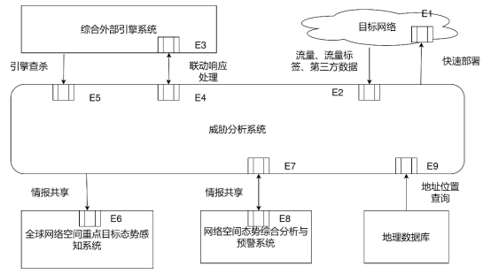 

**1.1.1.1.4.2.1** 接口内容

| 接口标识 | 接口名称     | 数据来源                         | 数据类型       | 数据项                   |
| -------- | ------------ | -------------------------------- | -------------- | ------------------------ |
| E1       | 部署接口     | 威胁分析平台                     | 部署信息       | 部署配置信息             |
| E2       | 流量入口     | 目标网络                         | 流量、标签流量 | 流量数据标签流量数据     |
| E3       | 联动响应接口 | 威胁分析平台                     | 关联策略       | 响应策略数据恶意标签数据 |
| E4       | 联动响应接口 | 综合外部引擎系统                 | 关联策略       | 响应策略数据恶意特征数据 |
| E5       | 引擎查杀接口 | 综合外部引擎系统                 | 恶意信息       | 恶意流量流量标签协议标签 |
| E6       | 信息交互接口 | 全球网络空间重点目标态势感知系统 | 威胁情报数据   | 威胁情报数据             |
| E7       | 信息交互接口 | 威胁分析平台                     | 威胁情报数据   | 威胁情报数据             |
| E8       | 信息交互接口 | 网络空间态势综合分析与预警系统   | 威胁情报数据   | 威胁情报数据             |
| E9       | 地理查询接口 | 地理数据库                       | 地理信息       | IP数据                   |

**1.1.1.1.4.2.2** 接口方式

所有敏感数据传输通过TCP API方式实现，非敏感数据传输通过HTTP API实现。

##### 

# 2 网络流量采集子系统

## **2.1** 系统概述

在本子系统中，我司分了三个模块，分别为流量采集模块，负责在高速流量环境下接收数据，包括对隧道的解析和数据还原，全流量存储模块，负责接收和检索查询流量数据，协议解析和还原模块，负责对流量协议的识别和解析，对携带数据文件的的协议，还原其中的文件数据，以实现深度分析能力。

流量采集模块

在流量采集模块中，我司采用非一致性内存访问技术、零拷贝内存访问技术、直接内存访问技术、大内存页技术来实现对流量的高速处理。通过非一致性内存访问技术，将不同的网卡获取的数据分布到不同的CPU上，以加快CPU运算时的内存访问速度。NUMA系统拥有多条内存总线，将几个处理器（核心）通过内存总线与一块内存区域相连构成一个节点，这样系统被分为若干个节点。设备在处理流量时，将数据报文及其对应的处理CPU资源通过硬件分离到对应的NUMA节点上，通过提供分离的存储器给各个处理器，避免当多个处理器访问同一个存储器产生的总线竞争等待，从而减少性能损失，增强了流量的可扩展性。

为了提高内存拷贝的性能和减少资源消耗，采用直接内存访问（DMA）和内存映射的方式，减轻CPU和数据报文拷贝的负担。网卡获取到数据报文后，通过DMA技术直接放置在指定的内存区域，应用工作在Ring3层，在初始化时，通过内存映射的方式，将此内存区域直接映射到对应的模块中，并通过轮询数据包的方式，实时获取流量数据。

关于接收的网卡数据，使用直接内存访问技术用于将数据从一个地址空间复制到另外一个地址空间。CPU通过内存区块读取网卡数据，并将数据送给指定的内存区块。CPU只负责控制传输动作的启动操作，从而减少CPU的消耗，设备将CPU的时间更多的应用在协议识别、协议解析和检测分析工作上，从而增强网络流量的处理能力。

为减少大流量处理的内存分页资源消耗，采用大内存页技术来降低CPU对虚拟内存分页工作的转换检测缓冲区（TLB）访问次数的同时，由Linux系统提供了直接访问内存的接口。结合内存映射技术，提供在Ring3层直接访问网卡提供的数据包的能力。进程间若要访问同一数据包，可以直接传递内存指针即可，极大的减少了需要拷贝的数据量。网卡直接将数据写入到大内存页中。抓包程序轮询(poll)有无数据，有数据则封送走。使用轮询，以避免Ring0方式中断，从而有效处理骨干网大流量。

全流量存储模块

在全流量存储模块中，采用高效磁盘存储模式，存储原始流量包和全要素日志等信息。

在功能上，支持在高速流量下完成对全流量的存储功能，将流量数据存储为pcap文件，并在web界面上提供独立的全流量查询界面。在界面中，支持按照源IP、目的IP、源端口、目的端口和协议类型进行查询，并支持以上几种条件的组合要求，以满足用户的实际需求。

对于日志信息，依赖于文件系统来存储和缓存，因此采用追加写、页缓存、零拷贝的模式，来保证日志模块具备高效的读写性能的关键技术。

计算机系统中各层存储介质的存取速度不同，而磁盘是一个存储速度比较低的介质，使用内存作为默认的存储介质而磁盘作为备选介质，以此实现高吞吐和低延迟的特性。在顺序读写的情况下，操作系统可以针对线性读写做深层次的优化，比如预读（read-ahead，提前将一个比较大的磁盘块读入内存） 和 后写（write-behind，将很多小的逻辑写操作合并起来组成一个大的物理写操作）技术。顺序写盘的速度不仅比随机写盘的速度快，而且也比随机写内存的速度快。在设计时，采用了“文件追加”的方式来写入消息，即：

① 只能在日志文件的尾部追加新的消息，

② 并且也不允许修改已写入的消息。

页缓存是提升读写性能的第二点方法。页缓存是操作系统实现的一种主要的磁盘缓存，以此用来减少对磁盘I/O的操作。具体来说，就是把磁盘中的数据缓存在内存中，把对磁盘的访问变成对内存的访问，当一个进程准备读取磁盘上的文件内容时，操作系统会先查看待读取的数据所在的页（page）是否在页缓存（pagecache）中，如果存在（命中）则直接返回数据，从而避免了对物理磁盘的I/O操作。

同样，如果一个进程需要将数据写入磁盘，那么操作系统会先检查数据对应的页是否在页缓存中，如果不存在则会先在页缓存中添加相应的页，最后将数据写入对应的页。被修改过后的页也就变成了 “脏页”，操作系统会在合适的时间把脏页中的数据写入磁盘，以保持数据的一致性。

全流量存储模块中大量使用了页缓存，这是实现高吞吐的重要因素之一。

默认情况下是由操作系统来负责具体的刷盘任务，但在全流量存储模块中同样提供了同步刷盘即间接性强制刷盘（fsync）的功能，可以通过参数进行配置，以保障各种使用场景。强制同步刷盘的好处是提高消息的可靠性，防止由于机器掉电等异常造成处于页缓存而没有及时写入磁盘的消息丢失，缺点是损耗性能，一般不予开启。

除了消息顺序追加、页缓存等技术，全流量存储模块使用的第三个优化磁盘读写性能的技术是：零拷贝（Zero-Copy）。

所谓的“零拷贝”就是将数据直接从磁盘文件复制到网卡设备中，而不需要经由应用程序的方法。

零拷贝大大提高了应用程序的性能，减少了内核和用户模式之间的上下文切换。举例来说：假如需要将本机磁盘中的静态资源（如图片、文件）等发送给用户，在不使用零拷贝的默认处理方式下，需要先调用 read() 系统调用从内核空间将文件拷贝到应用进程空间，在由应用进程调用 socket() 函数将文件发送到网卡，从用户空间拷贝到内核空间数据平白无故的从内核模式到用户模式“走了一圈”，浪费了两次复制过程。

如果采用零拷贝技术，那么应用程序可以直接请求内核把磁盘中的数据传输给Socket。

零拷贝技术通过 “DMA”（Direct Memory Access） 技术将文件内容复制到内核模式下的Read Buffer中，不过没有数据被复制到Socket Buffer，相反只有包含数据的位置和长度的信息的文件描述符被加到Socket Buffer中。

追加写、页缓存、零拷贝是全流量存储模块保证高效存储和查询能力的原因和技术保障。

对于pcap文件，采用环形文件系统用于存储，基于自定义文件分区的文件系统设计方法，极大的提高了数据检索速度和管理效率。具有易实现，管理效率高，可靠性高、可扩展等特点。

在数据存储中，为了提高空间管理效率避免存储碎片的产生，我们以块为最小存储单位，也就是说在记录和重演过程中按块来分配空间。在记录开始阶段，为了快速的分配存储空间，定义一个快速索引表记录存储空间的使用情况。快速索引表中用一位数据标识当前块是否可用。原则上每个块存在三种状态：可用空块、已用块、坏块，这里我们只关心其是否能在下面的记录中被分配，减少了不必要的状态存储。由于对于存储控制系统来说内存有限，而在记录状态下，索引表需常驻内存，使用这种极简的空间管理数据结构对于节省珍贵的内存资源非常必要。

文件索引表（FIL）记录每个文件所占用的块地址以及顺序，鉴于系统内存容量有限，存储在另外一块节点上，这块节点专门用来记录文件索引信息，称之为 文件索引表。文件索引表采用冗余设计保证其存储的可靠性。记录时首先查阅快速索引表分配磁盘空间，记录结束通过在文件索引表中创建新的文件项实现新文件。

在这种模式下，高效的利用考虑磁盘性能，保障了在大规模流量的情况下，依然可以在不影响流量监听的情况下，写入全流量数据，完成全流量存储模块的功能和设计标准。

协议解析与还原模块

在协议解析与还原模块中，采用了包暂存和基于传输协议的数据报文保序技术、基于有限状态机的协议转换协议特征技术、基于数据包的协议识别技术、基于特征的乱序协议重定位技术、基于文件特征的传输识别技术、文件解析技术、基于分向流量的流式协议元数据解析技术。

模块针对TCP协议承载的数据流量，结合数据包池技术和TCP的状态位，对请求/响应方向分别进行保序工作。通过分别计算SYN数据包（请求向）和SYN-ACK数据包（响应向）起始的协议序列号，对非正常序的数据报文进行暂存。通过数据包池提供的引用数进行暂存引用计算，并只在需要的时候释放数据报文，在暂存数据报文时不涉及流量拷贝工作。若无法在指定的数据报文个数内重组数据流，或SYN/SYN-ACK的数据报文在流量镜像环节丢失，仍然有可能应用基于协议特征的乱序重定位重整流量数据。

在协议解析中，使用状态转换特征，对流量内容的请求向和响应向进行分别识别。当一个状态转换特征可转换到多个协议时，基于对各可能协议上下文的理解，智能判断是否应当暂存数据报文，并在一定报文及时间允许范围内等待后续报文，从而达成设备内存使用率和还原能力的均衡。

使用基于状态转换特征的协议识别，在协议最初报文有效载荷较少，特别是在攻击者使用较小MTU、IP分片或巨型帧的情况以规避协议分析的情况下，依然可以取得较好的协议识别效果。

针对数据包的协议识别，针对UDP流、无TCP握手报文流或已进入数据报文丢失状态的流， 基于对协议的理解，寻找协议的关键特征模式，对每个数据包尝试进行协议的识别及协议处理位置识别。在多个协议均可能命中此特征模式，从而无法准确获取到数据报文的协议的情况下，暂时留存此报文，并在处理到此流的下一个数据报文时再次进行协议识别，并综合进行判断。

结合基于数据包的协议识别，在乱序超出设备容忍上限从而无法继续还原的情况下，在后续数据报文中，基于传输协议中编码的应用协议，寻找协议的可用于定位的位置。当发现可重定位协议处理的位置后，将协议处理状态机调整到识别到的处理状态上，并继续运转协议处理状态机，以提取数据报文中蕴含的协议数据。

在基于文件特征的传输识别流程中，基于对文件特征的理解，从流量中寻找文件的传输迹象，并尝试从文件头开始直接剥离文件内容。，对控制流和数据流区分在不同设备上的文件传输协议，此功能特别有效。同时，对Metasploit等常见攻击平台进行恶意控制木马载荷传输时，对载荷的剥离和识别也能取得较好的效果。

基于真实文件格式的内容识别，不受扩展名影响，可发现伪装成图片的可执行程序。可支持对图片、脚本、多媒体、文本、软件数据、文档、压缩包、可执行程序进行文件并发还原。

在识别这些文件格式后，上述文件格式是否还原、是否检测、是否深度分析、是否留存可提供单独设置。对文件格式的识别结果包括图片、脚本、多媒体、文本、软件数据、文档、压缩包、可执行程序八大类，包括370+种以上文件格式识别结果。

在基于分向流量的流式协议元数据解析方面，在确定的识别协议后，基于协议的状态转换，分别解析协议的请求-响应内容。使用状态转换模式，完成流式内容解析。在较少的内存占用的情况下，允许超大文件留存，无数据包丢失容忍，乱序包整理，MTU变化自适应等功能。此功能在威胁使用碎片包和较小MTU进行解析时亦能取得较好效果。

流式协议解析避免了传统协议解析中数据包流重组导致内存占用率高的弊端，可实时解析数据包，通过减少每个流占用的内存，极大地增加了设备在骨干网大流量环境下对协议还原的支持。与传统的协议解析技术相比，流式协议解析有效地提高了数据包解析的效率，减少丢包的概率，支持对超大文件的还原。

## **2.2** 系统功能组成

 

网络流量采集子系统包括如下几个模块：流量采集模块、全流量存储模块、协议解析与还原模块。支持以下功能：

1.链路及协议监控

依从IEEE 802.3、IEEE 802.3u、IEEE 802.3ab、IEEE 802.3z、IEEE 802.3x、IEEE 802.1Q、RFC2516标准，对以太网、VLAN链路、PPPOE链路、GTPU链路、QING链路、GRE链路、MPLS链路、VXLAN链路进行监控。对主流协议进行识别，对以TCP，UDP，SCTP，ICMPv4，Raw，SLL，ERSPAN、HTTP，SSL，TLS，SMB，DCERPC，HTTP/2，NGAP，NAS，PFCP，SMTP，FTP，SSH，NFS，NTP，DHCP，TFTP，KRB5，IKEv2，Mysql，Oracle，Mssql，PPTP，BGP，SNMP，NNTP，POSTGRESQL，LDAP，Telnet，MQTT，SIP，IMAP，RFB，L2TP，RDP，web邮箱协议，达梦、人大金仓、瀚高、神州通用、优炫、南大通用等国产数据库和IEC_MMS、IEC_60870_104等常见协议进行全流量解析、元数据提取留存。

2.协议识别及元数据留存分析

系统基于流量通讯内容进行协议识别，不受端口影响； 为保障用户单位安全，特别是网站安全，实现恶意行为分析、审计和追溯，应当能按协议会话留存如下元数据：

对TCP协议应当至少留存以下元数据：

会话发起时间、会话结束时间、发送ip、发送端口、接收ip、接收端口、服务器到客户端发送数据包数、客户端到服务器发送数据包数、应用层协议。

对HTTP应当至少留存以下元数据：

会话发起时间、会话结束时间、发送ip、发送端口、接收ip、接收端口、服务器到客户端发送数据包数、服务器到客户端发送数据字节数、客户端到服务器发送数据包数、客户端到服务器发送数据字节数。HTTP请求方法、请求URI、全部请求体键值对、HTTP响应体全部键值对。HTTP上传文件MD5、HTTP上传文件真实文件类型、HTTP下载文件MD5、HTTP下载文件真实文件类型。

对SMTP、POP3、IMAP应当至少留存以下元数据：

会话发起时间、会话结束时间、发送ip、发送端口、接收ip、接收端口、服务器到客户端发送数据包数、服务器到客户端发送数据字节数、客户端到服务器发送数据包数、客户端到服务器发送数据字节数。登录用户、发件人、收件人列表、抄送列表、主题、邮件体嵌入文件MD5、邮件体嵌入文件文件类型、邮件附件MD5、邮件附件文件类型。

对SAMBA应当至少留存以下元数据：

会话发起时间、会话结束时间、发送ip、发送端口、接收ip、接收端口、服务器到客户端发送数据包数、客户端到服务器发送数据包数、Samba传输方向、Samba传输的文件MD5、Samba传输的文件类型。

对FTP应当至少留存以下元数据：

会话发起时间、会话结束时间、发送ip、发送端口、接收ip、接收端口、服务器到客户端发送数据包数、客户端到服务器发送数据包数。传输的文件的MD5、传输的文件类型。

对DNS应当至少留存以下元数据：

会话发起时间、会话结束时间、发送ip、发送端口、接收ip、接收端口、服务器到客户端发送数据字节数、客户端到服务器发送数据字节数。DNS数据的请求、响应方向、DNS数据请求或响应的方式、DNS数据请求或响应的域名、DNS请求、响应的数据。

3.非标准协议识别

支持发现网络中的隐蔽传输功能，能够发现非标准HTTP、HTTPS传输，并能按照流量、内网IP、国家等进行排序功能。

4.文件还原类型

支持PDF、Office、EXE、RAR、ZIP等所文件还原功能。支持基于文件内容的格式识别，可以将文件精确分类（支持超过244种文件类型）。

5.中文识别

支持各种编码格式识别功能，文件编码不影响邮件还原。

6.文件下载

支持报警后的文件可下载分析功能。

\7. URL解析

支持URL解析和记录功能，并支持HTTP头中请求和响应的各种元数据进行记录。

\8. 支持全流量写入PCAP文件，支持全要素日志写入。

\9. 全流量模式下的采集规则包括源和目的IP地址、协议、端口号、VLANID等，其中的IP地址支持按照单个地址和地址段进行配置，并且使用优化算法支持在采集中实现标准的BPF语法，并支持web界面配置。

\10. 支持按照源IP、目的IP、源端口、目的端口和协议类型进行查询，并支持以上几种条件的组合要求。

##### **1.1.1.2.3** 系统业务流程

###### **1.1.1.2.3.1** 流量捕获与分析处理流程

 

捕获网络镜像设备传入的网络数据包，并且向上层检测模块提供标准的IP层和TCP层数据。

支持根据源ip、源端口、目标ip、目标端口、传输层协议、BPF语法等机芯包捕获功能。

将数据包根据协议交给TCP\UDP\OTHER进行处理，并完成TCP重组功能。

根据前3个包进行协议识别，对识别的协议进行协议解析，对载荷文件进行还原，并发送给文件还原模块，完成文件的还原。

###### **1.1.1.2.3.2** 流量采集分发流程

捕获传输到数据口的流量，并进行限流操作，对报文进行初步的解封装，若ip报文是分片报文则进行重组，然后进行流量分发。

从数据口捕获流量，通过共享内存将流量分发到其他处理进程

程序运行依赖于分配的大页内存，预分配内存池存储数据包

能够捕获1G流量，无丢包现象

在流量过大时，能将流量限制在1G及以下

接收到ip分片报文后能够进行分片重组

流量分发时，保证负载均衡和同源同宿

##### **1.1.1.2.4** 系统接口设计

###### **1.1.1.2.4.1** 外部接口设计

**1.1.1.2.4.1.1** 流量捕获接口

 

系统通过监听口将外部流量接入设备网卡，系统通过流量捕获接口对监测流量进行捕获，接入系统进行威胁检测工作。

其中的消息格式，与各个协议相关，对于每种协议的解析以可参考rfc中相关协议格式的介绍来解析。

rfc是Request for Comments的缩写，是由互联网工程任务组发布的一系列备忘录，收集了有关internet的相关信息以及uninx和互联网社区的软件文件，以编号排定，rfc文件是由互联网协会赞助发行。现在已经演变为记录互联网规范、协议、过程等的标准文件。基本的互联网通信协议都有在RFC文件内详细说明。

**1.1.1.2.4.1.2** 数据联动接口

 

向使用syslog接口像第三方数据接收平台输送日志信息，当系统开启syslog数据传送功能时，在威胁检测分析后，将会使用NSQ分布式消息处理平台对日志数据进行收取，形成NSQ消息队列，随后将其封装为syslog消息格式采用加密或非密方式发送至第三方数据接收平台的数据接收模块。

传输数据内容包含：

| **内容项**     | **描述**                                                     |
| -------------- | ------------------------------------------------------------ |
| 数据流基本信息 | 提供所有监测到的数据流的源IP、目的IP、源端口、目的端口、应用层协议、传输层协议、开始时间、结束时间、发送流量、接收流量、源IP归宿地、目的IP归宿地等信息。 |
| HTTP协议字段   | 提供所有监测到的HTTP协议的请求URI、HOST、请求方法、响应代码；及其他HTTP请求头和响应头的信息。 |
| 邮件协议字段   | 提供所有监测到的SMTP、IMAP、POP3协议的登录账户、发件人、收件人、抄送人、密送人等信息。 |
| 还原文件       | 提供各协议还原出的文件信息，包括文件格式、文件MD5等信息。邮件格式提供嵌入邮件体的文件（如嵌入图片）及附件的文件信息。 |
| 信标           | 提供协议中及还原回的文件中提取出的URL、域名、IP地址（及端口）、文件的MD5值作为威胁信标。 |
| 威胁检测       | 检测到的，与该会话相关联的威胁信息，包括病毒名、病毒分类等信息 |
| 威胁评估       | 分别提供：检测到的威胁本身的威胁评估；结合危害资产价值和威胁本身的威胁评估； |
| 告警           | 根据威胁评估信息，决定是否告警。                             |

syslog在unix系统中应用非常的广泛，它是一种标准协议，负责记录系统事件。syslog协议使用UDP作为传输协议，通过514端口通信，它将网络设备的日志发送到安装了syslog软件系统的日志服务器，syslog日志服务器自动接收日志数据并写到指定的日志文件中。

syslog消息格式：

syslog消息日志没有对最小长度有所定义，但是报文的总长度必须在1024字节之内字节之内。

举例如下：

1、<30> 是PRI部分，及优先级，取值范围在0~191；

2、“Oct 10 20:30:40 CentOS”是HEADER 报头部分；

3、“audit[1780] the audit daemon is exiting”是Msg（信息）部分；

PRI字段:

其中PRI部分必须有三个字符，以‘<’为起始符，然后紧跟一个数字，最后以‘>’结尾。在括号内的数字被称为优先级。

HEADER字段：

HEADER部分包括两个字段，时间和主机名（或者IP地址）。时间紧跟在PRI后面，中间没有空格，而且格式必须是“Mmm dd hh:mm:ss”，不包括年份。“日”的数字如果是1~9，前面会补一个空格（也就是月份后面有两个空格），而“小时”、“分”、“秒”则在前面补“0”。其中月份的取值包括如下：

Jan，Feb，Mar，Apr，May，Jun，Jul，Aug，Sep，Oct，Nov，Dec。

时间后面跟一个空格，然后是主机名或者IP地址，主机名不得包括域名部分。

​	Msg字段：

​	Msg字段又分为两部分，TAG和Content。其中TAG字段是可选的。

在前面的例子中，audit[1780]是TAG部分，包含了进程名称和进程PID。PID可以没有，这个时候中括号也是没有的。进程PID有时候甚至不是一个数字，例如

“ root-1870”，解析的程序要做好容错准备。TAG后面用一个冒号隔开Content部分，这部分的内容是应用程序自定义的。

**1.1.1.2.4.1.3** 日志出入库接口

 

系统为检测日志提供数据接口，用于存储系统的威胁检测日志。当系统进行威胁分析完毕后统一采用json格式存入ES数据库。系统检测日志入库后将通过出入接口对存储数据在系统界面进行回显。

出入库数据内容包含：

| 内容项                 | 描述                                                         |
| ---------------------- | ------------------------------------------------------------ |
| 系统日志信息           | 提供产品名称、产品版本信息、设备ID、日志信息、日志版本等信息。 |
| 扩展信息               | 提供告警信息、包含威胁情况、是否进行文件传输分析、传输分析文件MD5信息、威胁分险等级、威胁等级、威胁行为标签、自定义标签、病毒家族名标签等信息。 |
| 时间范围信息           | 提供结束包时间、起始包时间、IP检出的信誉信息等信息。         |
| 流量信息               | 提供客户端到服务端的总字节数、客户端到服务端的总包数、服务端到客户端的总字节数、服务端到客户端的总包数等信息。 |
| 文件信息               | 提供文件对象列表、文件大小、上行或下行、文件MD5值、存储文件名、文件类型等信息。 |
| IP端口信息             | 提供IP地址、IPV6地址、端口号等信息。                         |
| 源网络地址相关信息     | 提供IP地址所属的城市和国家、IP地址、IPV6地址、IP所属运营商、IP所在维度、IP所在经度、IP所在单位、源mac地址、源端口号、地区等信息。 |
| 目的网络地址相关信息   | 提供IP地址所属的城市和国家、IP地址、IPV6地址、IP所属运营商、IP所在维度、IP所在经度、IP所在单位、源mac地址、源端口号、地区等信息。 |
| 威胁检测信息           | 提供威胁域名、威胁文件、威胁IP地址、原始流量检出情况、威胁的url地址、病毒名、病毒家族、病毒类型、病毒平台、病毒行为、文件MD5、命中规则标识、信标、风险等级等信息。 |
| 威胁分析信息           | 提供文件行为、信息行为、组件行为、网络访问情况、描述信息、对象类型、风险等级、行为类型、向量内容等信息。 |
| HTTP协议专有字段       | 提供HTTP方法包括GET、POST、DELETE、PUT、域名、url地址、其他请求信息、其他的键值对儿、字节数、方向、文件名、文件类别、文件md5值、http返回状态值、其他应答信息等信息。 |
| DNS协议专有字段        | 提供记录类别、协议组信息、别名、返回数据（ip地址等）等信息。 |
| Email协议专有字段      | 提供服务器型号及版本、客户端型号及版本、加密情况、邮箱密码、邮箱账号、发件人、收件人、密送人、邮件内容、文件大小、上传或下载、存储的文件名、文件类型、文件MD5值等信息。 |
| Ftp协议转有字段        | 提供文件大小、上传或下载、存储的文件名、文件类型、文件MD5值等信息。 |
| SMB、SSL等协议通用字段 | 提供下载字段、上传字段、传输总字节数、方向描述、文件名、文件类型、文件MD5等信息。 |

##### **1.1.1.2.5** 系统用户用例

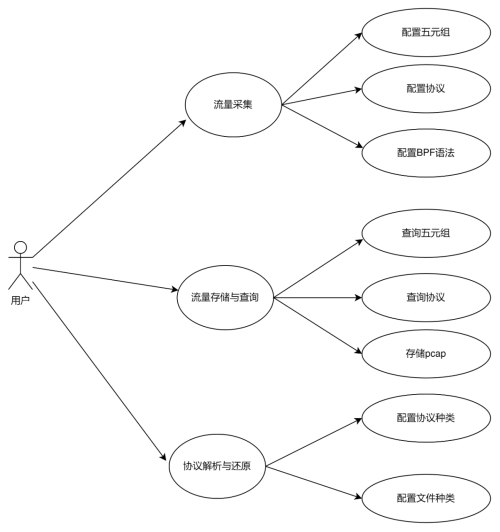 

通过高性能流量采集系统，支持对全流量的采集能力，可保留PCAP包，并基于web模式支持了独立的全流量采集配置页面，同时支持在图形界面支持流量采集的配置规则。全流量模式下的采集规则包括源和目的IP地址、协议、端口号、VLANID等，其中的IP地址支持按照单个地址和地址段进行配置，并且使用优化算法支持在采集中实现标准的BPF语法，并支持web界面配置。

通过异步模式在高速流量下完成对全流量的存储功能，将流量数据存储为pcap文件，并在web界面上提供独立的全流量查询界面。在界面中，支持按照源IP、目的IP、源端口、目的端口和协议类型进行查询，并支持以上几种条件的组合要求，以满足用户的实际需求。

通过流重组技术和高性能状态机完成对网络协议的解析和原因，包括TCP，UDP，SCTP，ICMPv4，GRE，Ethernet，PPP，PPPoE，Raw，SLL，VLAN，QINQ，MPLS，ERSPAN、HTTP，SSL，TLS，SMB，DCERPC，HTTP/2，NGAP，NAS，GTP-U，PFCP，SMTP，FTP，SSH，NFS，NTP，DHCP，TFTP，KRB5，IKEv2，Mysql，Oracle，Mssql，PPTP，BGP，SNMP，NNTP，POSTGRESQL，LDAP，Telnet，MQTT，SIP，IMAP，RFB，L2TP，RDP等常见协议。

同时能够支持更多国内工作、生产环境中的流量协议分析和解析，包括并不限于web邮箱协议，达梦、人大金仓、瀚高、神州通用、优炫、南大通用等国产数据库和IEC_MMS、IEC_60870_104等多种工控协议等。除此以外，还支持深度分析和还原多种协议中携带的文件，如HTTP、IMAP、SMTP、MSFFILE、FEIQ、FTP、SMB、POP3、RAW、TFTP、NFS、IEC_MMS、IEC_60870_104等协议中的文件还原功能。

##### **1.1.1.2.6** 流量采集模块

###### **1.1.1.2.6.1** 模块概述

对仿真环境和真实业务系统的通信流量进行捕获并对捕获的流量数据进行分析，流量过滤解析支持千兆、万兆带宽的网络通信流量数据的捕获和解析。主要实现对镜像设备传入的网络数据包进行捕获，并且向上层检测模块提供标准的IP层和TCP层数据。并且，可对流量中包、流、会话、文件、协议元数据多层次数据提取、监测和记录。

 

通过高性能流量采集系统，支持对全流量的采集能力，可保留PCAP包，支持在支持流量采集的配置规则。全流量模式下的采集规则包括源和目的IP地址、协议、端口号、VLANID等，其中的IP地址支持按照单个地址和地址段进行配置，并且使用优化算法支持在采集中实现标准的BPF语法，来获得需要的流量数据。

###### **1.1.1.2.6.2** 功能设计

 

流量采集模块主要是由流量捕获、规则过滤等功能组成。流量捕获主要是对仿真环境的流量进行捕获以及真实业务系统流量捕获的流量进行捕获。流量捕获支持千兆、万兆带宽的网络通信流量数据的捕获。规则过滤主要由数据包规则过滤、会话规则过滤、跨包规则过滤、BPF规则过滤等功能，主要是对采集的流量进行过滤和处理。

###### **1.1.1.2.6.3** 技术实现

**1.1.1.2.6.3.1** 流量捕获

 

流量捕获由流重组技术、非一致内存访问技术、零拷贝内存访问技术、直接内存访问技术、大内存页技术组成，以最优化的算法和结构结合硬件资源，达到最优的处理效率。

1.1.1.2.6.3.1.1 流重组技术

流重组技术将TCP数据流中，传输序列号乱序的情况进行纠正，将中间夹杂的多余数据进行剔除。

根据TCP的数据流转换状态机，描述TCP的连接建立过程如下：

（1）客户端发送一个带SYN标志的TCP报文到服务器。这是三次握手过程中的报文1。

（2） 服务器端回应客户端的，这是三次握手中的第2个报文，这个报文同时带ACK标志和SYN标志。因此它表示对刚才客户端SYN报文的回应；同时又标志SYN给客户端，询问客户端是否准备好进行数据通讯。

（3）客户必须再次回应服务段一个ACK报文，这是报文段3。

TCP的连接销毁过程如下：

 

由于TCP连接是全双工的，因此每个方向都必须单独进行关闭。这原则是当一方完成它的数据发送任务后就能发送一个FIN来终止这个方向的连接。收到一个 FIN只意味着这一方向上没有数据流动，一个TCP连接在收到一个FIN后仍能发送数据。首先进行关闭的一方将执行主动关闭，而另一方执行被动关闭。

（1） TCP客户端发送一个FIN，用来关闭客户到服务器的数据传送（报文段4）。

（2） 服务器收到这个FIN，它发回一个ACK，确认序号为收到的序号加1（报文段5）。和SYN一样，一个FIN将占用一个序号。

（3） 服务器关闭客户端的连接，发送一个FIN给客户端（报文段6）。

（4） 客户段发回ACK报文确认，并将确认序号设置为收到序号加一（报文段7）。

同时，为了达到保证顺序的目的，TCP的报文有如下格式：

 

使用源IP、目的IP、源端口、目的端口来唯一指定一个流。在同一时间出现，则必然是同一个报文序列。

根据该报文格式，使用确认号和序号达成TCP的连接。序号：占4个字节。TCP连接传送的数据流中的每一个字节都被编上一个序号。首部中序号字段的值指的是本报文段所发送的数据的第一个字节的序号。确认号：占4个字节，是期望收到对方下一个报文段的数据的第一个字节的序号。因此，主要逻辑为，若本侧确认号不等于另一端指定的序号，则表明中间有包的缺失。需要等待缺失的包后再处理。此时将当前正在处理的数据包保存在内存中，然后继续处理其他数据包。直到配置的三个存储空间均已满，则认为这个流有包缺失，忽略今后全部的数据包。

模块需要判断当前流是否包含的流信息空间指针，如果没有则分配一个流空间，如果流空间不够分配，则直接抛弃当前流；

模块需要对数据包进行IP定位，定义出IP地址的位置类型；

如果当前流没有识别出应用协议，模块需要调度对数据包执行协议识别操作；

如果当前流的应用协议在配置中指明需要进行协议解码，则模块将调用后续流程，执行对应的解码工作；模块需要对畸形报文和碎片包进行处理。

ＴＣＰ 连接建立的过程需要经过“三次握手”，ＴＣＰ 报文段首部的同步比特 ＳＹＮ 为 １ 时，就表示这是一个连接请求或连接接受报文，标志着三次握手的开始。 然而，若以 ＳＹＮ 作为连接建立的标识而不根据需要加以选择性的区分，那么在处理海量数据时，就需要在二维链表中存储大量的无用连接，而且每当一个数据包到来时，都要在链表中查找其所属的连接结点。 这样无论是从时间还是空间上，都提高了其复杂度，从而大幅降低了重组效率。

所以，为了减少缓存的 ＴＣＰ 连接数量，就要在海量数据流中根据数据流特征筛选出待重组研究的会话连接。 所谓数据流特征是指能标识网络通信行为的数据包特征串。 在网络通信过程中所有网络应用都是有其特征的，在使用这些应用时，它们会频繁的出现在网络数据流中。 而且这些特征可能分很多种类，包括数据包的负载长度，特征位置，特征串长度等，或为一系列特征数据包连续出现所组成的特征串序列。 分析单个数据流特征可以按以下几个步骤进行:

１) 确定网络层协议:一般为 IＰ 协议。

２) 观察目的 IＰ 地址和目的端口是否固定。

３) 观察数据包大小和应用层载荷长度是否固定。

４) 观察数据流长度序列是否固定(此特征多为文件传输)。

５) 观察数据包中是否存在浮动位置特征串(此特征多为英

文字符)。

６) 观察数据包中是否存在固定位置特征串(应用层协议特

征串大部分属于固定位置特征串)。

 

为了提高重组效率，除了根据特征进行选择性的重组之外，连接的终止判断方法和优化的数据缓冲策略也是必要的。

虽然 ＴＣＰ 协议保证了可靠交付，一般情况下 ＴＣＰ 连接都会按照正常的方式终止连接，但在网络环境较差的情况下，仍然会出现丢包的情况。 此外一些特殊的网卡也有可能过滤掉终止连接数据包。 这样的连接会因一直未接收到连接终止数据包，导致此连接的其他数据包一直存在于内存中，若不及时删除，随着连接数量的增加，会导致主机内存耗尽，所以需要设置一个连接中断定时器来判断连接的终止。 在 ＴＣＰ 数据流结点中包含存储的最后一个数据包的捕获时间ｔｉmｅ，另设一个线程每隔一段时间扫描二维链表中所有结点的 ｔｉmｅ值，并与本机的时间比较，若二者的差值大于定时器设定的值，即使没有收到标识连接结束的 ＦIＮ 或 ＲＳＴ 包，也视为该连接结束，然后进行后续处理。 为了防止误删和冗余，定时器的时长设置成为关键，经过大量的实验，将定时器设置为６０ ｓ较为合理。

对于 ＴＣＰ 重组结果的存储方法有两种:一种是文件指针存储，另一种是内存方式存储。 文件指针存储是每接收一个数据包，就按照序列号存储在所属连接的流结点中，当连接终止，此时连接中的所有数据包已按序列排好，即重组完毕，然后将该连接的重组结果写成文件存入硬盘。 内存缓存方式存储是当连接结束时，申请一块恰好能容纳该连接数据包的内存将数据段移到新申请的内存中。 第一种方法要进行频繁的文件读写操作，效率较低；而第二种方法虽然重组速度较快但是对于传输量较大的连接，会造成系统内存的严重消耗，甚至耗尽内存导致系统崩溃。

因此采用两种缓存方法相结合的方式，当按照序列号排好序的数据段大小超过一定的阈值时，就将内存中已缓存的数据段写入文件，同时删除内存中的缓存，继续处理后续的数据包。综上所述，分析应用层数据的第一个包的特征，分析出数据流特征后，以带有此特征的数据包作为会话连接的第一个数据包，将其存入二维链表建立新的结点，其他数据包通过查找四元组找到所属连接结点，再经过重组将这些数据包整合成完整的会话连接。 并利用改进的连接终止判断方法设置定时器和对数据缓冲策略进行优化。 通过此机制精简了 ＴＣＰ 连接数量，加快了结点查找速度，通过提取特征进行有的放矢的选择性数据流重组，提高了重组效率。

基于特征的 ＴＣＰ 数据流重组算法，每读取一个数据包，首先要查看其四元组用于判断链表中是否存有该包所属的连接，若不存在，则继续拆包查看其应用数据特征来判断是否为需要重组的数据包，若是则将此包作为其所属连接的第一个包进行存储。 这样每个连接判断特征仅需一次，大大提高了重组效率。

此算法的 ＴＣＰ 重组的流程图如图所示

 

１) 捕获网络数据包，获取其四元组信息。 扫描二维链表查看此数据包的流结点是否存在。 是则执行 ２)，否则执行 ５)。

２) 通过判断此数据包是否为 ＦIＮ 包和查看定时器是否超时来判定此连接的终止。 若终止则执行 ３)，否则执行 ４)。

３) 若此连接对应的文件存在，则将此连接的数据包写到文件，若不存在，则将此连接的数据包写到内存中。

４) 若此连接未终止，则在内存中缓存此数据包，查看流结点

的数据大小是否超过阈值，若超过，将数据包写入文件，若未超过，返回 １)继续读取数据包。

５) 若此数据包所在的流结点在二维链表中不存在，则查看

该数据包的应用层数据看是否满足需求数据包的特征。 若满足，则执行 ６)，若不满足，则返回 １)继续捕获数据包。

６) 若满足特征且链表中没有该数据包的流结点，则建立新的结点。

７) 记录初始序列号。 即此数据包作为该连接的第一个包的序列号。

８) 将此数据包存入新建立的数据流结点，返回 １)继续捕获数据包。

1.1.1.2.6.3.1.2 非一致内存访问技术

通过非一致性内存访问技术，将不同的网卡获取的数据分布到不同的CPU上，以加快CPU运算时的内存访问速度。NUMA系统拥有多条内存总线，将几个处理器（核心）通过内存总线与一块内存区域相连构成一个节点，这样系统被分为若干个节点。在处理流量时，将数据报文及其对应的处理CPU资源通过硬件分离到对应的NUMA节点上，通过提供分离的存储器给各个处理器，避免当多个处理器访问同一个存储器产生的总线竞争等待，从而减少性能损失，增强了流量的可扩展性。

1.1.1.2.6.3.1.3 零拷贝内存访问技术

零拷贝内存访问技术基于直接内存访问（DMA）和内存映射的方式，减轻CPU和数据报文拷贝的负担。网卡获取到数据报文后，通过DMA技术直接放置在指定的内存区域，应用工作在Ring3层，在初始化时，通过内存映射的方式，将此内存区域直接映射到对应的模块中，并通过轮询数据包的方式，实时获取流量数据。

对于从网络镜像设备传入的网络数据包，向上层检测模块提供标准的IP层和TCP层数据，需要进行零拷贝流程，减少系统的资源消耗，提高系统的性能与分析、检出能力。

目前在高速网络下，允许的对每个包处理的时钟周期小于1500个指令。在内核和用户态进行处理完全来不及。而linux从网卡获取数据的过程是网卡触发CPU中断-> 内核0环中断处理程序开始处理中断-> 网卡驱动处理相关数据包-> 内核各程序处理相关数据包->拷贝到3环（应用态）。

零拷贝指的是硬件写入到处理完成无拷贝。零拷贝包获取框架通过将网卡抓取到的数据包写入到内存大页（hugepage）中， 来完成在用户态直接获取网卡数据报文的需求。

获取网卡的数据的过程：网卡直接将数据写入到hugepage中。抓包程序轮询(poll)有无数据，有数据则封送走。

使用轮询避免中断，中断需要工作在ring0级别中，如下图：

 

采用等零拷贝抓包模块，使用82599等芯片的网卡。支持的网卡型号有：

Amazon的ena（Elastic Network Adapter）；

博通（Broadcom）的bnxt (NetXtreme-C, NetXtreme-E, StrataGX)；

Cavium的thunderx (CN88XX, CN83XX, CN81XX, CN80XX)、liquidio (LiquidIO II CN23XX)、bnx2x (QLogic 578xx)、qede (QLogic FastLinQ QL4xxxx)；

Chelsio的cxgbe (Terminator 5)

Cisco的enic (UCS Virtual Interface Card)

Intel的e1000 (82540, 82545, 82546)；e1000e (82571, 82572, 82573, 82574, 82583, ICH8, ICH9, ICH10, PCH, PCH2, I217, I218, I219)；igb (82575, 82576, 82580, I210, I211, I350, I354, DH89xx)；ixgbe (82598, 82599, X520, X540, X550)；i40e (X710, XL710, X722)；fm10k (FM10420)。

​	Mellanox的mlx4 (ConnectX-3, ConnectX-3 Pro)；mlx5 (ConnectX-4, ConnectX-4 Lx, ConnectX-5)

Netcope的szedata2 (NFB-*, NPC-*, NSF-*)；

Netronome的nfp (NFP-6xxx)；

Solarflare的sfc_efx (SFN7xxx, SFN8xxx)；

部分虚拟化环境下的avp (Wind River Accelerated Virtual Port)、virtio-net (QEMU)、vmxnet3 (VMware ESXi)、xenvirt (Xen)。

1）零拷贝原理

零拷贝是指计算机执行IO操作时，CPU不需要将数据从一个存储区域复制到另一个存储区域，进而减少上下文切换以及CPU的拷贝时间。它是一种IO操作优化技术。

“零”：表示次数是0，它表示拷贝数据的次数是0

“拷贝”：指数据从一个存储区域转移到另一个存储区域

合起来，那零拷贝就是不需要将数据从一个存储区域复制到另一个存储区域。

 

如图描述从一个文件读取并通过网络将数据传输到另一个程序的场景。（此场景描述了许多服务器应用程序的行为，包括服务于静态内容的Web应用程序、FTP服务器、邮件服务器等。）操作的核心为两个调用，但是在内部，复制操作需要在用户模式和内核模式之间进行四次上下文切换，并且在操作完成之前将数据复制四次。

 

涉及的步骤包括：

\1. read()调用导致上下文从用户模式切换到内核模式。在内部会发出sys_read()（或等效文件）从文件读取数据。 第一个副本由直接内存访问（DMA）引擎执行，该引擎从磁盘读取文件内容并将其存储到内核地址空间缓冲区中。

\2. 所请求的数据量从读缓冲区复制到用户缓冲区，然后read()调用返回。调用的返回导致另一个上下文从内核切换回用户模式。 现在数据被存储在用户地址空间缓冲器中。

\3. send()套接字调用导致上下文从用户模式切换到内核模式。执行第三拷贝以再次将数据放入内核地址空间缓冲器。 不过，这一次，数据被放入一个不同的缓冲区，一个与目标套接字相关联的缓冲区。

\4. send()系统调用返回，创建第四个上下文切换。 当DMA引擎将数据从内核缓冲区传递到协议引擎时，会独立且异步地发生第四个副本。

 

而使用中间内核缓冲区（而不是将数据直接传输到用户缓冲区）可能看起来效率低下。但是在进程中引入了中间内核缓冲区来提高性能。 在读取端使用中间缓冲区允许内核缓冲区在应用程序没有要求内核缓冲区所保存的那么多数据时充当“预读缓存”。 当请求的数据量小于内核缓冲区大小时，这将显著提高性能。 写端的中间缓冲区允许异步完成写操作。

不幸的是，如果请求的数据的大小远大于内核缓冲区的大小，则这种方法本身可能成为性能瓶颈。数据在最终传递到应用程序之前，会在磁盘、内核缓冲区和用户缓冲区之间复制多次。

零拷贝通过消除这些冗余数据拷贝来提高性能。

 

如果重新检查传统场景，您会注意到实际上并不需要第二和第三数据副本。应用程序除了缓存数据并将其传输回套接字缓冲区外什么也不做。 相反，数据可以直接从读缓冲器传输到套接字缓冲器。 transferTo()方法允许您完成此操作。

transferTo()方法将数据从文件通道传输到给定的可写字节通道。在内部，它依赖于底层操作系统对零拷贝的支持；在UNIX和各种Linux版本中，这个调用被路由到sendfile()系统调用，它将数据从一个文件描述符传输到另一个文件描述符。

 

\1. 方法使DMA引擎将文件内容复制到读取缓冲区中。 然后，内核将数据复制到与输出套接字相关联的内核缓冲区中。

\2. 第三个复制发生在DMA引擎将数据从内核套接字缓冲区传递到协议引擎时。

 

这里进行一个改进：我们将上下文切换的数量从四个减少到两个，并将数据副本的数量从四个减少到三个（其中只有一个涉及CPU）。 但这还不能使我们达到零复制的目标。如果底层网络接口卡支持收集操作，我们可以进一步减少内核所做的数据重复。 在Linux内核中2.4 后来，套接字缓冲区描述符被修改以适应这个需求。 这种方法不仅减少了多个上下文切换，而且消除了需要CPU参与的重复数据副本。 用户端的使用仍然保持不变，但内部特性已经改变：1. 方法使DMA引擎将文件内容复制到内核缓冲区中。

\2. 没有数据复制到套接字缓冲区。 相反，只有具有关于数据位置和长度的信息的描述符被附加到套接字缓冲区。 DMA引擎将数据直接从内核缓冲区传递到协议引擎，从而消除剩余的最终CPU副本。

 

正图所示，零拷贝API与传统方法相比使时间减少了大约65%。对于那些将大量数据从一个I/O通道复制到另一个I/O通道（如Web服务器）的应用程序，这有可能显著提高性能。

1.1.1.2.6.3.1.4 直接内存访问技术

直接内存访问技术用于将数据从一个地址空间复制到另外一个地址空间。CPU通过内存区块读取网卡数据，并将数据送给指定的内存区块。CPU只负责控制传输动作的启动操作，从而减少CPU的消耗，将CPU的时间更多的应用在协议识别、协议解析和检测分析工作上，从而增强网络流量的处理能力。

1.1.1.2.6.3.1.5 大内存页技术

大内存页技术在降低CPU对虚拟内存分页工作的转换检测缓冲区（TLB）访问次数的同时，由Linux系统提供了直接访问内存的接口。结合内存映射技术，提供在Ring3层直接访问网卡提供的数据包的能力。进程间若要访问同一数据包，可以直接传递内存指针即可，极大的减少了需要拷贝的数据量。网卡直接将数据写入到大内存页中。抓包程序轮询(poll)有无数据，有数据则封送走。使用轮询，以避免Ring0方式中断，从而有效处理骨干网大流量。

**1.1.1.2.6.3.2** 规则过滤

 

规则规律主要是对流量数据进行过滤，支持五元组、协议、BFP规则等，而且支持跨流处理数据包。

1.1.1.2.6.3.2.1 数据包规则过滤

支持基于数据包的五元组、全包浮动位置关键字、协议号、包负载长度、流ID、事件唯一ID、总包数、网络数据包号等复合规则过滤。

系统接收数据包并存放于缓存中，由报头提取模块提取报头相关信息作比对处理。如果该数据包是打有 SYN 标志的 TCP 包，则根据该数据包的五元组信息与规则表进行匹配。若规则表中不存在相应的匹配表项，或者所匹配的规则表项 的处置信息域为拒绝，该数据包被丢弃；若处置信息域为通过，则把该数据包的流量信息记录到状态表中，并直接转发该数据包。如果该数据包不是一个 SYN 包，则直接查找状态表。若在状态表中匹配到了状态表项 ，则根据的处置信息域进行相应的操作，并刷新该表项的 TTL值；若没有任何状态表项和该数据包匹配，则进一步把该包与规则表进行匹配，处理流程与 SYN 包类似。

| {"flow_id": 7623591274026764000, //流ID（网络数据包号 与 应用启动时间戳计算得出）"flow_pkg_id": 36537,      //创建本流时包ID"id": "7623591274026764038",   //事件唯一ID（由flow_id 和 flow_pkg_id运算而出）  "pkts": 1692,          //总包数(包含上下行)  "bytes": 1720944,        //总字节数(包含上下行)  "ack": [2699795295, 924171061, 924171061, … , 924171061], //tcp 前20 ack值  "seq": [924170880, 2699795295, 2699796743, …, 2699821359], //tcp 前20 seq值"proto": ["HTTP", "TCP"], //网络协议，从右自左是网络协议的网络层到应用层"protoid": [1002, 4],    //协议ID  "ip": ["192.168.18.160", "192.168.18.61"],  //网络地址对儿  "domain": ["192.168.18.61"],   //域名地址  "url": ["http://192.168.18.61/E2FD02B143D501A30E2B140538C5D555.E140901F"], //url地址} |             |                                                |
| ------------------------------------------------------------ | ----------- | ---------------------------------------------- |
| **字段**                                                     | **类型**    | **含义说明**                                   |
| flow_id                                                      | integer     | 网络数据包号 与 应用启动时间戳计算得出         |
| flow_pkg_id                                                  | Integer     | 创建本流时的包ID                               |
| id                                                           | integer     | 事件唯一ID（由flow_id 和 flow_pkg_id运算而出） |
| pkts                                                         | integer     | 总包数(包含上下行)                             |
| bytes                                                        | integer     | 总字节数(包含上下行)                           |
| ack                                                          | integer[20] | TCP前20个数据包的ack值                         |
| seq                                                          | integer[20] | TCP前20个数据包的seq值                         |
| proto                                                        | string[]    | 网络协议，从右自左是网络协议的网络层到应用层   |
| protoid                                                      | integer[]   | 协议ID，根据协议ID查出协议                     |
| ip                                                           | string[2]   | 网络地址对儿                                   |
| domain                                                       | string[]    | 域名地址                                       |
| url                                                          | string[]    | 网址url                                        |

1.1.1.2.6.3.2.2 会话规则过滤

支持基于会话的五元组、跨包关键字、包负载长度、包负载长度统计（负载长度处于某个区间）、包负载长度序列、网络协议、协议ID、总字节数等复合型规则过滤，支持1000条统计规则，100条包负载长度序列规则。

| {"flow_id": 7623591274026764000, //流ID（网络数据包号 与 应用启动时间戳计算得出）"flow_pkg_id": 36537,      //创建本流时包ID"id": "7623591274026764038",   //事件唯一ID（由flow_id 和 flow_pkg_id运算而出）  "pkts": 1692,          //总包数(包含上下行)  "bytes": 1720944,        //总字节数(包含上下行)  "ack": [2699795295, 924171061, 924171061, … , 924171061], //tcp 前20 ack值  "seq": [924170880, 2699795295, 2699796743, …, 2699821359], //tcp 前20 seq值"proto": ["HTTP", "TCP"], //网络协议，从右自左是网络协议的网络层到应用层"protoid": [1002, 4],    //协议ID  "ip": ["192.168.18.160", "192.168.18.61"],  //网络地址对儿  "domain": ["192.168.18.61"],   //域名地址  "url": ["http://192.168.18.61/E2FD02B143D501A30E2B140538C5D555.E140901F"], //url地址} |             |                                                |
| ------------------------------------------------------------ | ----------- | ---------------------------------------------- |
| **字段**                                                     | **类型**    | **含义说明**                                   |
| flow_id                                                      | integer     | 网络数据包号 与 应用启动时间戳计算得出         |
| flow_pkg_id                                                  | Integer     | 创建本流时的包ID                               |
| id                                                           | integer     | 事件唯一ID（由flow_id 和 flow_pkg_id运算而出） |
| pkts                                                         | integer     | 总包数(包含上下行)                             |
| bytes                                                        | integer     | 总字节数(包含上下行)                           |
| ack                                                          | integer[20] | TCP前20个数据包的ack值                         |
| seq                                                          | integer[20] | TCP前20个数据包的seq值                         |
| proto                                                        | string[]    | 网络协议，从右自左是网络协议的网络层到应用层   |
| protoid                                                      | integer[]   | 协议ID，根据协议ID查出协议                     |
| ip                                                           | string[2]   | 网络地址对儿                                   |
| domain                                                       | string[]    | 域名地址                                       |
| url                                                          | string[]    | 网址url                                        |

1.1.1.2.6.3.2.3 挎包规则检测

系统支持基于跨包函数运算的威胁规则检测，50条跨包函数运算规则。流量威胁检测能力是对网络中的流量进行捕获，对流量数据进行协议解析、文件还原，从包、流、会话、协议元数据、网络行为、文件等多个层次对采集的数据进行威胁检测，获得资源信誉、威胁名称、核心行为、关联信标、标签化结果等多维度信息，发现处于不同攻击阶段的威胁活动。

l单包检测技术

基于确定性有限状态自动机，对已解析元数据中的对应协议字段进行关键字匹配和正则匹配。与此同时，对全部数据包，均可以直接匹配其网络层、传输层元数据，也可以使用相同技术，匹配其对应层的载荷数据。

在流量特征单包检测的初始化阶段，将合并用户导入及系统内置的相同的数据报文特征，避免多次重复匹配。 

对高速在线流量使用确定性有限状态自动机，尽管存在少数正则表达式无法良好支持的情况，但由于其无需回溯的特性，极大地提高了匹配效率，有效的应对了在线流量匹配。

信标检测

在协议解析的基础之上，提供木马远控的通联分析能力。针对常见木马的通讯协议，匹配木马与服务器通讯的心跳保活报文、上线报文、控制报文，从而对常见木马进行远控通联检测。

针对大量已知的受攻击者控制的命令与控制（C&C）服务器，基于协议解析的结果进行匹配，即使受控主机在隔离网内，无法产生通联协议报文，依然能达成有效检测，定位受控主机的效果。

在流量威胁检测方面具备恶意代码检测引擎、网络行为检测引擎、命令与控制通道检测引擎、自定义场景检测引擎等四大检测引擎及DGA随机域名检测、隐蔽信道检测等多种威胁检测模型。可以有效防止攻击者对分析机制、威胁向量等的绕过，结合情境化分析技术，能够大幅提供网内高价值资产的快速布防和威胁定位能力，丰富的线索和标签化的检测结果则是快速检索、追溯威胁的前提。

 

依托全球领先的安天国产自主反威胁引擎、多年积累的恶意代码检测和精确命名能力以及海量威胁库，支持对蠕虫、感染式病毒、木马、黑客工具、风险软件、灰色软件、垃圾文件、测试文件八大类威胁的检测，可识别威胁种类>860万种，规则数>5000万；支持基于威胁类型、核心行为、依赖环境、恶意代码家族、变种号，对威胁予以精确命名，并提供家族信息。具备对海量的、已知的恶意程序快速、有效检测的能力，有较高的识别率，降低无用告警噪声，缩短安全管理人员对威胁的判定时间。

网络行为检测引擎，以网络通信行为特征为检测对象，发现扫描探测、远程漏洞利用、Web攻击等恶意网络行为。成立网络安全检测实验室，持续增强网络行为检测能力。内置检测规则1万+条，支持集成Snort 、Suricata，支持开源标准的 Snort 语法规则扩展。

命令与控制通道检测引擎以IP\域名\URL等IOC指标为检测对象,发现被远程控制、窃密回传行为的失陷主机。支持基于IP、域名、URL等信标进行检测，发现远程控制、窃密回传、隐蔽信道等攻击行为；支持基于内置威胁情报库，可关联识别APT攻击事件150+；可检测超过600种远控程序；对域名的检测特征数量超过160万，对IP的检测特征超过10万，对URL的检测特征超过20万。针对大量已知的受攻击者控制的命令与控制（C&C）服务器，基于协议解析的结果进行匹配，即使受控主机在隔离网内，无法产生通联协议报文，依然能达成有效检测，定位受控主机的效果。

1.1.1.2.6.3.2.4 BPF语法过滤

柏克莱封包过滤器（Berkeley Packet Filter，缩写 BPF），是类Unix系统上数据链路层的一种原始接口，提供原始链路层封包的收发，除此之外，如果网卡驱动支持洪泛模式，那么它可以让网卡处于此种模式，这样可以收到网络上的所有包，不管他们的目的地是不是所在主机。

BPF支持“过滤”封包，这样BPF会只把“感兴趣”的封包到上层软件，可以避免从操作系统内核向用户态复制其他封包，降低抓包的CPU的负担以及所需的缓冲区空间，从而减少丢包率。BPF的过滤功能是以BPF虚拟机机器语言的解释器的形式实现的，这种语言的程序可以抓取封包数据，对封包中的数据采取算术操作，并将结果与常量或封包中的数据或结果中的测试位比较，根据比较的结果决定接受还是拒绝封包。即时编译技术用于把虚拟机指令转换为原始码，以进一步减少开销。

用户态解释器在对此过滤机制没有内核态支持的系统上抓取封包时，封包可以在内核态过滤，可以工作于此两种模式；在使用用户态过滤的系统上，所有分包由内核态复制到用户态，包括将被过滤出去的封包。这种解释器也可以用于包含由pcap抓取的封包的文件。

BPF有时也只表示过滤机制，而不是整个接口。

 

目前使用最新的扩展eBPF：extended Berkeley Packet Filter，一套通用执行引擎，提供了可基于系统或程序事件高效安全执行特定代码的通用能力。由执行字节码指令、存储对象和帮助函数组成，字节码指令在内核执行前必须通过BPF验证器的验证，同时在启用BPF JIT模式的内核中，会直接将字节码指令转成内核可执行的本地指令运行，具有很高的执行效率。

 

采用BPF语法，对数据包进行过滤和抓取，以适用于特点的用户环境，满足更充分的业务场景。

##### **1.1.1.2.7** 全流量存储模块

###### **1.1.1.2.7.1** 模块概述

通过高性能流量采集系统，支持对全流量的采集能力，可保留PCAP包，并基于web模式支持了独立的全流量采集配置页面，同时支持在图形界面支持流量采集的配置规则。全流量模式下的采集规则包括源和目的IP地址、协议、端口号、VLANID等，其中的IP地址支持按照单个地址和地址段进行配置，并且使用优化算法支持在采集中实现标准的BPF语法，并支持web界面配置。

###### **1.1.1.2.7.2** 功能设计

 

全流量存储模块保留全要素日志和流量数据，为了保障最优的写入速度，需要对日志存储和pcap存储进行优化，其中主要是追加写、页缓存、零拷贝和环结构文件系统、高速文件索引等功能。

###### **1.1.1.2.7.3** 技术实现

**1.1.1.2.7.3.1** 日志存储技术

1.1.1.2.7.3.1.1 追加写

计算机系统中各层存储介质的存取速度不同，而磁盘是一个存储速度比较低的介质，使用内存作为默认的存储介质而磁盘作为备选介质，以此实现高吞吐和低延迟的特性。在顺序读写的情况下，操作系统可以针对线性读写做深层次的优化，比如预读（read-ahead，提前将一个比较大的磁盘块读入内存） 和 后写（write-behind，将很多小的逻辑写操作合并起来组成一个大的物理写操作）技术。顺序写盘的速度不仅比随机写盘的速度快，而且也比随机写内存的速度快。在设计时，采用了“文件追加”的方式来写入消息，即：

② 只能在日志文件的尾部追加新的消息，

② 并且也不允许修改已写入的消息。

1.1.1.2.7.3.1.2 页缓存

页缓存是提升读写性能的第二点方法。页缓存是操作系统实现的一种主要的磁盘缓存，以此用来减少对磁盘I/O的操作。具体来说，就是把磁盘中的数据缓存在内存中，把对磁盘的访问变成对内存的访问，当一个进程准备读取磁盘上的文件内容时，操作系统会先查看待读取的数据所在的页（page）是否在页缓存（pagecache）中，如果存在（命中）则直接返回数据，从而避免了对物理磁盘的I/O操作。

同样，如果一个进程需要将数据写入磁盘，那么操作系统会先检查数据对应的页是否在页缓存中，如果不存在则会先在页缓存中添加相应的页，最后将数据写入对应的页。被修改过后的页也就变成了 “脏页”，操作系统会在合适的时间把脏页中的数据写入磁盘，以保持数据的一致性。

全流量存储模块中大量使用了页缓存，这是实现高吞吐的重要因素之一。

默认情况下是由操作系统来负责具体的刷盘任务，但在全流量存储模块中同样提供了同步刷盘即间接性强制刷盘（fsync）的功能，可以通过参数进行配置，以保障各种使用场景。强制同步刷盘的好处是提高消息的可靠性，防止由于机器掉电等异常造成处于页缓存而没有及时写入磁盘的消息丢失，缺点是损耗性能，一般不予开启。

1.1.1.2.7.3.1.3 零拷贝

零拷贝大大提高了应用程序的性能，减少了内核和用户模式之间的上下文切换。举例来说：假如需要将本机磁盘中的静态资源（如图片、文件）等发送给用户，在不使用零拷贝的默认处理方式下，需要先调用 read() 系统调用从内核空间将文件拷贝到应用进程空间，在由应用进程调用 socket() 函数将文件发送到网卡，从用户空间拷贝到内核空间数据平白无故的从内核模式到用户模式“走了一圈”，浪费了两次复制过程。

如果采用零拷贝技术，那么应用程序可以直接请求内核把磁盘中的数据传输给Socket。

零拷贝技术通过 “DMA”（Direct Memory Access） 技术将文件内容复制到内核模式下的Read Buffer中，不过没有数据被复制到Socket Buffer，相反只有包含数据的位置和长度的信息的文件描述符被加到Socket Buffer中。

**1.1.1.2.7.3.2** 磁盘存储技术

1.1.1.2.7.3.2.1 环结构文件系统

圆形缓冲区(circular buffer)，也称作圆形队列(circular queue)，循环缓冲区(cyclic buffer)，环形缓冲区(ring buffer)，是一种数据结构用于表示一个固定尺寸、头尾相连的，适合缓存。

在优化的文件系统中，对文件进行计算索引，采用hash桶模式定位文件，并以环形模式写入文件系统，避免因为文件太小导致索引节点过多的问题，从而提升文件系统的效率。

1.1.1.2.7.3.2.2 高速文件索引

在数据存储中，为了提高空间管理效率避免存储碎片的产生，我们以块为最小存储单位，也就是说在记录和重演过程中按块来分配空间。在记录开始阶段，为了快速的分配存储空间，定义一个快速索引表记录存储空间的使用情况。快速索引表中用一位数据标识当前块是否可用。原则上每个块存在三种状态：可用空块、已用块、坏块，这里我们只关心其是否能在下面的记录中被分配，减少了不必要的状态存储。由于对于存储控制系统来说内存有限，而在记录状态下，索引表需常驻内存，使用这种极简的空间管理数据结构对于节省珍贵的内存资源非常必要。

文件索引表（FIL）记录每个文件所占用的块地址以及顺序，鉴于系统内存容量有限，存储在另外一块节点上，这块节点专门用来记录文件索引信息，称之为 文件索引表。文件索引表采用冗余设计保证其存储的可靠性。记录时首先查阅快速索引表分配磁盘空间，记录结束通过在文件索引表中创建新的文件项实现新文件。

在这种模式下，高效的利用考虑磁盘性能，保障了在大规模流量的情况下，依然可以在不影响流量监听的情况下，写入全流量数据，完成全流量存储模块的功能和设计标准。

##### **1.1.1.2.8** 协议解析与还原模块

###### **1.1.1.2.8.1** 模块概述

识别模块在处理进程中对报文进行协议识别，针对具体的应用层协议类型，对数据包的各种元素信息解析出来，完成其信息内容的提取。

支持HTTP、IMAP、SMTP、MSFFILE、FEIQ、FTP、SMB、POP3、RAW、TFTP、NFS、IEC_MMS（工控）、IEC_60870_104（工控）等协议的文件还原。

基于真实文件格式的内容识别，不受扩展名影响，可发现伪装成图片的可执行程序。具备370种以上文件格式识别，可支持对图片、脚本、多媒体、文本、软件数据、文档、压缩包、可执行程序进行文件并发还原。

对网络中的流量进行捕获，对流量数据进行协议解析和整理，提取其中的文件数据，并支持按照指定格式进行保存和丢弃，实现文件还原。

流量协议解析识别：

可实时识别解析200+协议。包括：MYSQL、HTTP、FTP、SMB、IMAP、SMTP、POP3、DNS、TCP、UDP、VLAN、PPPOE、MPLS、TLS、FeiQ、ARP、BGP、ICMP、LDAP、MSFILE、NFS、RLOGIN、SNMP、SSH、TELNET、TFTP、IEC61850、IEC60870、AMS、MODBUS、MQTT、TDS、TNS、1kXun、9PFS、AFP、AJP13、AMMYY、AMQP、ARCServe、ARES、AirTunes、BACnet、BJNP、BitCoin、BitTorrent、CAPWAP、CISCOVPN、COPS、CVS、CheckMK、DAAP、DB2、DCERPC、DHCP、DNP3、DRDA、Diameter、DoH_DoT、Dropbox、EAQ、ENIP、EPMD、EXEC、FIX、GIFT、GIT、IRC、KISMET、KakaoTalk、Kerberos、LDP、LON、MEMCACHED、MPEG_TS、MQTT、MSDP、MSN、Mining、Modbus、NDMP、NEST_LOG_SINK、NNTP、NTP、NetFlow、Nintendo、OCS、Ookla、OpenVPN、Oscar、PCANYWHERE、PPStream、PPTP、QUIC、RAT、RDP、RIP、RSH、RSYNC、RX、SIP、SKINNY、SMPP、SSDP、STEAM、STUN、Signal、Skype、Starcraft、TDS、TINC、TNS、Teredo、Tomasu、UBNTAC2、ULP、UPnP、VNC、Viber、WeChat、WebMail、WireGuard、X11、XMPP、YouTube、ZOOM、Zabbix、Zebra、L2TP、PCANYWHERE等。

 

包暂存和基于传输协议的数据报文保序

针对TCP协议承载的数据流量，结合数据包池技术和TCP的状态位，对请求/响应方向分别进行保序工作。通过分别计算SYN数据包（请求向）和SYN-ACK数据包（响应向）起始的协议序列号，对非正常序的数据报文进行暂存。通过数据包池提供的引用数进行暂存引用计算，并只在需要的时候释放数据报文，在暂存数据报文时不涉及流量拷贝工作。

若无法在指定的数据报文个数内重组数据流，或SYN/SYN-ACK的数据报文在流量镜像环节丢失，仍然有可能应用基于协议特征的乱序重定位重整流量数据。

基于有限状态机的协议转换协议特征

使用状态转换特征，对流量内容的请求向和响应向进行分别识别。当一个状态转换特征可转换到多个协议时，基于对各可能协议上下文的理解，智能判断是否应当暂存数据报文，并在一定报文及时间允许范围内等待后续报文，从而达成设备内存使用率和还原能力的均衡。

使用基于状态转换特征的协议识别，在协议最初报文有效载荷较少，特别是在攻击者使用较小MTU、IP分片或巨型帧的情况以规避协议分析的情况下，依然可以取得较好的协议识别效果。

基于数据包的协议识别

针对UDP流、无TCP握手报文流或已进入数据报文丢失状态的流， 基于对协议的理解，寻找协议的关键特征模式，对每个数据包尝试进行协议的识别及协议处理位置识别。在多个协议均可能命中此特征模式，从而无法准确获取到数据报文的协议的情况下，暂时留存此报文，并在处理到此流的下一个数据报文时再次进行协议识别，并综合进行判断。

基于特征的乱序协议重定位

结合基于数据包的协议识别，在乱序超出设备容忍上限从而无法继续还原的情况下，在后续数据报文中，基于传输协议中编码的应用协议，寻找协议的可用于定位的位置。当发现可重定位协议处理的位置后，将协议处理状态机调整到识别到的处理状态上，并继续运转协议处理状态机，以提取数据报文中蕴含的协议数据。

基于分向流量的流式协议元数据解析

在确定的识别协议后，基于协议的状态转换，分别解析协议的请求-响应内容。使用状态转换模式，完成流式内容解析。在较少的内存占用的情况下，允许超大文件留存，无数据包丢失容忍，乱序包整理，MTU变化自适应等功能。此功能在威胁使用碎片包和较小MTU进行解析时亦能取得较好效果。

流式协议解析避免了传统协议解析中数据包流重组导致内存占用率高的弊端，可实时解析数据包，通过减少每个流占用的内存，极大地增加了设备在骨干网大流量环境下对协议还原的支持。与传统的协议解析技术相比，流式协议解析有效地提高了数据包解析的效率，减少丢包的概率，支持对超大文件的还原。

###### **1.1.1.2.8.2** 功能设计

 

协议解析与还原模块支持流量解析，支持对隧道进行剥离，并对协议进行识别和解析，协议解析并提取全要素信息，支持对源数据进行解析，并支持对协议中的文件进行解析和还原。

###### **1.1.1.2.8.3** 技术实现

**1.1.1.2.8.3.1** 流量解析

1.1.1.2.8.3.1.1 隧道剥离

1.1.1.2.8.3.1.1.1 隧道列表

| 隧道名称     | 隧道描述                                                     |
| ------------ | ------------------------------------------------------------ |
| 8021Q        | IEEE 802.1的标准规范，允许多个网桥(Bridge)在信息不被外泄的情况下公开的共享同一个实体网上。 |
| GRE          | 通用路由封装(GRE) 是一种协议，用于将使用一个路由协议的数据包封装在另一协议的数据包中。 |
| PPPOE        | Point-to-Point Protocol Over Ethernet，以太网上的点对点协议，是将点对点协议（PPP）封装在以太网（Ethernet）框架中的一种网络隧道协议。 |
| MPLS_UNICAST | （Multi-Protocol Label Switching）即多协议标记交换，是一种标记（label）机制的包交换技术，通过简单的2层交换来集成IP Routing 的控制。 |
| VXLAN        | Virtual Extensible LAN 虚拟可扩展局域网，是大二层网络中广泛使用的网络虚拟化技术。在源网络设备与目的网络设备之间建立一条逻辑VXLAN隧道 |
| GTPU         | GTP-U（User Plane Part of GTP，GPRS 用户平面部分）是 GTP 的用户面部分，是一个的基于 IP/UDP 的隧道协议，它允许在各个 GTP-U Protocol Entity（协议实体）之间建立多个隧道。 |

1.1.1.2.8.3.1.1.2 隧道说明

QinQ协议

QinQ（802.1Q-in-802.1Q）技术: 是一项扩展VLAN空间的技术，通过在802.1Q标签报文的基础上再增加一层802.1Q的Tag来达到扩展VLAN空间的功能，可以使私网VLAN透传公网。由于在骨干网中传递的报文有两层802.1Q Tag（一层公网Tag，一层私网Tag），即802.1Q-in-802.1Q，所以称之为QinQ协议。

QinQ是指在802.1Q VLAN的基础上增加一层802.1Q VLAN标签，从而拓展VLAN的使用空间。在公网的传输过程中，设备只根据外层VLAN Tag转发报文，并根据报文的外层VLAN Tag进行MAC地址学习，而用户的私网VLAN Tag将被当作报文的数据部分进行传输。

QinQ报文有固定的格式，就是在802.1Q的标签之上再打一层802.1Q标签，QinQ报文比802.1Q报文多四个字节。

QinQ主要可以解决如下几个问题：

缓解日益紧缺的公网vlan id资源问题。

用户可以规划自己的私网vlan id，不会导致和公网vlan id冲突。

为小型城域网或企业网提供一种较为简单的二层vpn解决方案。

实现方式：

通过开启的qinq特性功能，可以实现qinq。开启端口的qinq功能后，当该端口接收到报文，无论报文是否带有vlan tag，交换机都会为该报文打上本端口缺省vlan的vlan tag。这样，如果接收到的是已经带有vlan tag的报文，该报文就成为双tag的报文；如果接收到的是不带vlan tag的报文，该报文就成为带有端口缺省vlan tag的报文。

Vxlan协议

传统的交换网络解决了二层的互通及隔离问题，这个架构发展了几十年已经相当成熟。而随着云时代的到来，却渐渐暴露出了一些主要的缺点。

多租户环境和虚拟机迁移

为了满足在云网络中海量虚拟机迁移前后业务不中断的需要，要求虚拟机迁移前后的IP不能变化，继而要求网络必须是大二层结构。传统的二层网络技术，在链路使用率、收敛时间等方面都不能满足需要。

VLAN的局限

随着云业务的运营，租户数量剧增。传统交换网络用VLAN来隔离用户和虚拟机，但理论上只支持最多4K个标签的VLAN，已无法满足需求。

为了解决上述局限性，不论是网络设备厂商，还是虚拟化软件厂商，都提出了一些新的Overlay解决方案。

网络设备厂商，基于硬件设备开发出了EVI（Ethernet Virtualization Interconnect）、TRILL（Transparent Interconnection of Lots of Links)、SPB（Shortest Path Bridging）等大二层技术。这些技术通过网络边缘设备对流量进行封装/解封装，构造一个逻辑的二层拓扑，同时对链路充分利用、表项资源分担、多租户等问题采取各自的解决方法。此类技术一般要求网络边缘设备必须支持相应的协议，优点是硬件设备表项容量大、转发速度快。

虚拟化软件厂商，从自身出发，提出了VXLAN（Virtual eXtensible LAN）、NVGRE（Network Virtualization Using Generic Routing Encapsulation）、STT（A Stateless Transport Tunneling Protocol for Network Virtualization）等一系列技术。这部分技术利用主机上的虚拟交换机（vSwitch）作为网络边缘设备，对流量进行封装/解封装。优点是对网络硬件设备没有过多要求。

VXLAN是由IETF定义的NVO3（Network Virtualization over Layer 3）标准技术之一，采用MAC-in-UDP的报文封装模式，可实现二层网络在三层范围内进行扩展，满足数据中心大二层虚拟机迁移的需求。在VXLAN网络中，属于相同VXLAN的虚拟机处于同一个逻辑二层网络，彼此之间二层互通；属于不同VXLAN的虚拟机之间二层隔离。

VXLAN最初只在虚拟交换机实现，但虚拟交换机天然具有转发性能低下的缺点，并不适合大流量的网络环境。于是，各硬件厂商也纷纷推出支持VXLAN的硬件产品，与虚拟交换机一起，共同成为网络边缘设备，最终使VXLAN技术能够适应各种网络。

 

XVLAN的基本概念

• VNI（VXLAN Network Identifier，VXLAN网络标识符）：VXLAN通过VXLAN ID来标识，其长度为24比特。VXLAN 16M个标签数解决了VLAN标签不足的缺点。

• VTEP（VXLAN Tunnel End Point，VXLAN隧道端点）：VXLAN的边缘设备。VXLAN的相关处理都在VTEP上进行，例如识别以太网数据帧所属的VXLAN、基于VXLAN对数据帧进行二层转发、封装/解封装报文等。VTEP可以是一台独立的物理设备，也可以是虚拟机所在服务器的虚拟交换机。

• VXLAN Tunnel：两个VTEP之间点到点的逻辑隧道。VTEP为数据帧封装VXLAN头、UDP头、IP头后，通过VXLAN隧道将封装后的报文转发给远端VTEP，远端VTEP对其进行解封装。

• VSI（Virtual Switching Instance，虚拟交换实例）：VTEP上为一个VXLAN提供二层交换服务的虚拟交换实例。VSI可以看作是VTEP上的一台基于VXLAN进行二层转发的虚拟交换机，它具有传统以太网交换机的所有功能，包括源MAC地址学习、MAC地址老化、泛洪等。VSI与VXLAN一一对应。

VSI-Interface（VSI的虚拟三层接口）：类似于Vlan-Interface，用来处理跨VNI即跨VXLAN的流量。VSI-Interface与VSI一一对应，在没有跨VNI流量时可以没有VSI-Interface。

Gre协议

通用路由封装 （GRE）定义了在任意一种网络层协议上封装任意一个其它网络层协议的协议。

在大多数常规情况下，系统拥有一个有效载荷（或负载）包，需要将它封装并发送至某个目的地。首先将有效载荷封装在一个GRE 包中，然后将此GRE 包封装在其它某协议中并进行转发。此外发协议即为发送协议。当IPv4 被作为GRE 有效载荷传输时，协议类型字段必须被设置为0x800。当一个隧道终点拆封此含有 IPv4 包作为有效载荷的GRE 包时，IPv4 包头中的目的地址必须用来转发包，并且需要减少有效载荷包的TTL。值得注意的是，在转发这样一个包时，如果有效载荷包的目的地址就是包的封装器（也就是隧道另一端），就会出现回路现象。在此情形下，必须丢弃该包。当 GRE 包被封装在IPv4 中时，需要使用IPv4 协议47。

GRE 下的网络安全与常规的IPv4 网络安全是较为相似的，GRE 下的路由采用IPv4 原本使用的路由，但路由过滤保持不变。包过滤要求防火墙检查 GRE 包，或者在GRE 隧道终点完成过滤过程。在那些这被看作是安全问题的环境下，可以在防火墙上终止隧道。

GRE（Generic Routing Encapsulation，通用路由封装）协议是对某些网络层协议（如IP 和IPX）的数据报文进行封装，使这些被封装的数据报文能够在另一个网络层协议（如IP）中传输。GRE采用了Tunnel（隧道）技术，是VPN（Virtual Private Network）的第三层隧道协议。

Tunnel 是一个虚拟的点对点的连接，提供了一条通路使封装的数据报文能够在这个通路上传输，并且在一个Tunnel 的两端分别对数据报进行封装及解封装。　一个X协议的报文要想穿越IP网络在Tunnel中传输，必须要经过加封装与解封装两个过程。

GRE 封装后的报文格式为 [1]  ：

Delivery Header|GRE Header|Payload packet

Delivery Header：封装的外部协议报文头（如IP报文头），即隧道所处网络的协议数据头，是实现一种协议报文穿越另一种协议网络的传输工具。

GRE Header：对数据报文进行封装后加入的数据，包含GRE协议本身以及和负载协议有关的一些信息。

Payload Packet：进入隧道之前的网络层数据报文，将作为隧道报文的有效负载，该报文的协议号将作为GRE头部字段中的ProtocolType字段。GRE头部信息具有如图所示的结构。

一个最简单的GRE头部只有4个字节，即在C、K、S等标志们都为0的情况下，GRE头部仅包含第0到31位的信息。前4个bit位都为标志位，分别表示了头部后来的字段是否有效；ProtocolType字段标识PayloadPacket的协议类型，一般情况下，该协议字段与以太网帧的类型字段值相同。

需要封装和传输的数据报文，称之为净荷（Payload），净荷的协议类型为乘客协议（Passenger Protocol）。系统收到一个净荷后，首先使用封装协议（Encapsulation Protocol）对这个净荷进行GRE 封装，即把乘客协议报文进行了“包装”，加上了一个GRE 头部成为GRE 报文；然后再把封装好的原始报文和GRE 头部封装在IP 报文中，这样就可完全由IP 层负责此报文的前向转发（Forwarding）。通常把这个负责前向转发的IP 协议称为传输协议（Delivery Protocol 或者Transport Protocol）。根据传输协议的不同，可以分为GRE over IPv4 和GRE over IPv6 两种隧道模式。

Gtpu协议

GTP（GPRS隧道协议(GPRSTunnelingProtocol)），可以分解成三种独立的协议，GTP-C、GTP-U及GTP'。GTP-U用于在GPRS核心网内，无线接入网与核心网之间传送用户数据。 GTP可以用在UDP或TCP上，GTP v1仅用于UDP上，UDP的2123端口是为GTP-C登记的端口号， 2152端口是为GTP-U登记的端口号。

GTP-U协议使用的GTP头是变长度的。GTP头的最小长度是8个字节。

协议必选字段：

版本号(Ver)：用于确定GTP协议的版本，转换成10进制表示。

协议类型(PT)：用于区分GTP(置’1’)和GTP’(置’0’)协议。

扩展头标志(e)：置’1’表示有下一个扩展头字段。置’0’表示没有下一个扩展头字段，或有但不必解释。

序号标志(s)：置’1’表示有序号字段。置’0’表示要么没有序号字段，要么有但不必做出解释。在GTP-C消息中s标志应置’1’。

N-PDU编号标志(Pn)：置’1’表示有N-PDU编号字段。置’0’表示要么没有N-PDU编号字段，要么有但不必做出解释。这个标志仅对GTP-U有意义。所以，GTP-C不使用这个标志。

消息类型：这个字段指出GTP消息的类型。

长度：这个字段指出以字节为单位的净荷长度，即分组中除了GTP头的必选部分外剩余部分的长度(即除去前面的8个字节)。

隧道端点标识符(TEID)：这个字段清楚地标识了对端的GTP-U或GTP-C协议实体中的隧道端点。

协议可选字段：

序号：这个字段在GTP-U中是可选的。对GTP-C控制面消息，序号用于事务标识。通过GTP-U隧道传输时，如果必须保护传输顺序，用该字段对T-PDU进行编号，且每传输一个T-PDU就增加序号值。

N-PDU标号：这个字段在SGSN间的路由区更新过程中和某些系统间切换过程(如2G和3G无线接入网间切换)中使用。当MS和SGSN间的通讯工作在确认模式下时，使用这个字段协调它们间的数据传输。这个字段的确切意义取决于使用场合。如GSM/GPRS到GSM/GRPS，这个字段就是SNDCP N-PDU编号。

下一个扩展头类型：这个字段定义在G-PDU中紧接着这个字段的扩展头的类型。

Pppoe协议

PPPoE（英语：Point-to-Point Protocol Over Ethernet），以太网上的点对点协议，是将点对点协议（PPP）封装在以太网（Ethernet）框架中的一种网络隧道协议。由于协议中集成PPP协议，所以实现出传统以太网不能提供的身份验证、加密以及压缩等功能，也可用于缆线调制解调器（cable modem）和数字用户线路（DSL）等以以太网协议向用户提供接入服务的协议体系。

PPPoE（英语：Point-to-Point Protocol Over Ethernet），以太网上的点对点协议，是将点对点协议（PPP）封装在以太网（Ethernet）框架中的一种网络隧道协议。由于协议中集成PPP协议，所以实现出传统以太网不能提供的身份验证、加密以及压缩等功能，也可用于缆线调制解调器（cable modem）和数字用户线路（DSL）等以以太网协议向用户提供接入服务的协议体系。

本质上，它是一个允许在以太网广播域中的两个以太网接口间创建点对点隧道的协议。

以Linux系统常用的pppd为例，支持PPP接口上面的IP、IPv6和IPX网络层协议。

它使用传统的基于PPP的软件来管理一个不是使用串行线路而是使用类似于以太网的有向分组网络的连接。这种有登陆和口令的标准连接，方便了接入供应商的记费。并且，连接的另一端仅当PPPoE连接接通时才分配IP地址，所以允许IP地址的动态复用。

PPPoE是由UUNET、Redback Networks和RouterWare所开发的。发表于RFC 2516说明中。

PPPoE是从窄带技术演化而来，PPP最早就是专门为电话线上网而设计的，当宽带普及后，为了兼容以前的电话线用户习惯，故在宽带网络中继承了PPP技术。PPPoE是一种过渡技术，已经基本处于淘汰阶段。原因如下：

1、PPPoE是一种2层链路技术，正常下无法穿透三层交换机，若要在三层交换机传输，就必须做trunk，即把三层当作二层交换机使用。这导致不能充分发挥三层交换机的潜能，三层交换机的很多高级功能都无法使用，从而浪费了宝贵的网络设备资源。也给整体网络规划造成了一定的复杂性。如果一开始采用了PPPoE认证，那么以后想要使用三层交换机网络规划功能，调整整体网络，那么将是一个巨大的工作量。

2、宽带使用PPPoE方式，将造成不必要的带宽损耗，而且上网速度比正常宽带速度要慢一个级别。原因是采用PPPoE比正常宽带包，多了2个协议层，一个是PPPoE协议层，另一个就是PPP协议层，这几个协议层头会增加到正常数据包头部里，在传输数据过程中，多出了不少额外数据，拨号握手过程也比正常多了好几个步骤。

3、2004年开始，ARP攻击在网络流行时，PPPoE由于自身与ARP无关的特点，使其具有天然免疫优势，所以，当时很多场合对PPPoE有较高的需求。

但经过近10年网络发展，随着各种安全软件普及，如360、电脑管家、以及各种杀毒软件等都早已具有防止ARP攻击功能。因此，ARP攻击已经彻底消失殆尽。PPPoE的各种缺点已经越来越不适应宽带网络的发展。

4、PPPoE客户端一般都会采用操作系统自带的PPPoE，但设置比较麻烦，有很多步骤，普通家庭用户若不熟悉，大多数根本搞不定，此时维护人员必须挨家挨户进行上门设置，这给网络维护带来了很大工作量。非常不利宽带网络用户的发展和运营，将经常接到用户关于PPPoE的使用投诉。

5、PPPoE的效率比较低，从PPPoE协议模型可以看出，BAS汇聚了用户的所有数据流，它必须将每一个PPPoE包都拆开检查处理，这在很大程度上是沿袭了传统的PPP处理的方式，一旦用户很多，数据包数量很大，解封装速度就需要很快，BAS很大的精力花在检测用户的数据包上，容易形成接入的“瓶颈”。

6、PPPoE由于采用了二层链路方式，所以在防止ARP三层包攻击方式具有很大安全性，但PPPoE自身却存在着协议不安全性，因为PPPoE认证是采用广播方式，在网段内只要装个网络嗅探器，都能截获到PPPoE包，并能做任意修改重定向。

Mpls协议

MPLS（Multi-Protocol Label Switching）即多协议标记交换，是一种标记（label）机制的包交换技术，通过简单的2层交换来集成IP Routing 的控制。

2002年，中国电信在中国大陆建立其高密度的IP/MPLS网络。该网络在同一物理网络上支持对传统业务和IP/MPLS新业务，并可快速提供用户业务。比如对等接入、IPVPN、城域以太网，通过二层VPN的方式承载FR、ATM、DDN业务的等。中国电信美国公司则将向在中国有业务的美国公司提供MPLSVPN、通达中国内地各处的专线业务和到CHINANET的直接IP接入等业务。

2003年，MPLS技术得到更为广泛的应用。印度的最大的INTERNER网络和电子商务提供商Sify有限公司，建成了印度最大的MPLS网络，提供安全VPN业务并作为连接到美国的INTERNET网关。日本的NTTCommunications建成了其全国范围、宽带多业务MPLS网络，并在这一个平台上提供IP、Ethernet、FR和ATM业务。

MPLS（Multi-Protocol Label Switching）即多协议标记交换，是一种标记（label）机制的包交换技术，通过简单的2层交换来集成IP Routing 的控制。 MPLS属于第三代网络架构，是新一代的IP高速骨干网络交换标准，由IETF（Internet Engineering Task Force，因特网工程任务组）所提出，由Cisco、ASCEND、3Com等网络设备大厂所主导。 MPLS是集成式的IP Over ATM技术，即在Frame Relay及ATM Switch上结合路由功能，数据包通过虚拟电路来传送，只须在OSI第二层（数据链结层）执行硬件式交换（取代第三层（网络层）软件式routing），它整合了IP选径与第二层标记交换为单一的系统，因此可以解决Internet路由的问题，使数据包传送的延迟时间减短，增加网络传输的速度，更适合多媒体讯息的传送。因此，MPLS最大技术特色为可以指定数据包传送的先后顺序。MPLS使用标记交换（Label Switching），网络路由器只需要判别标记后即可进行转送处理。 MPLS的运作原理是提供每个IP数据包一个标记，并由此决定数据包的路径以及优先级。与MPLS兼容的路由器（Router），在将数据包转送到其路径前，仅读取数据包标记，无须读取每个数据包的IP地址以及标头（因此网络速度便会加快），然后将所传送的数据包置于Frame Relay或ATM的虚拟电路上，并迅速将数据包传送至终点的路由器，进而减少数据包的延迟，同时由Frame Relay及ATM交换器所提供的QoS（Quality of Service）对所传送的数据包加以分级，因而大幅提升网络服务品质提供更多样化的服务。 对IPOA（IP OVER ATM）的改进是MPLS产生的源动力。MPLS还没有成为最后正式的标准，在MPLS成为标准的过程中，许多公司都推出了自己的标记技术，比如CISCO公司的Tag交换技术。

MPLS中涉及了很多基本的概念：

1．FEC（转发等价类） MPLS实际上是一种分类转发的技术，它将具有相同转发处理方式（目的地相同、使用的转发路径相同、具有相同的服务等级等）的分组归为一类，这种类别就称为转发等价类。属于相同转发等价类的分组在MPLS网络中将获得完全相同的处理。在LDP（后面讲到）过程中，各种等价类对应于不同的标记，在MPLS网络中，各个节点将通过分组的标记来识别分组所属的转发等价类。

2．多协议标记交换（1）多协议 MPLS位于传统的第二层和第三层协议之间，其上层协议与下层协议可以是当前网络中的各种协议。如：IPX，APPLETALK等。 （2）标记 一个长度固定，只具有本地意思的标志。它用于唯一地表示一分组所属的FEC，决定标记分组的转发方式。 （3）交换 通过FEC的划分与标记的分配，MPLS的标记在网络中进行交换，建立一条虚电路。

3．标记栈 是一组标记的级联。

4．标记分组 包含了MPLS标记封装的分组。标记可以使用专用的封装格式，也可以利用现有的链路层封装如：ATM的VCI和VPI。

5．标记交换路由器(LSR) 支持MPLS协议的路由器，是MPLS网络中的基本元素。

6．标记交换路径（LSP） 使用MPLS协议建立起来的分组转发路径，由标记分组源LSR与目的LSR之间的一系列LSR以及它们之间的链路构成，类似于ATM中的虚电路。

7．上游LSR与下游LSR，一个分组由一个路由器发往另一个路由器时，发送方的路由器为上游路由器，接收方为下游路由器。

8．标记信息库（LIB） 类似于路由表，包含各个标记所对应的各种转发信息。

9．标记分发协议（LDP） 该协议是MPLS的控制协议，相当于传统网络的信令协议，负责FEC的分类，标记的分配，以及分配结果的传输及LSP的建立和维护等。

10．标记分发对等实体（LDP PEERS） 进行LDP*作的LSR为标记分发对等实体。

11．标记合并 对于某一相同FEC的标记分组，将不同的入标记替换为相同的一个出标记继续转发的过程，减少标记资源的消耗。 12．TLV（Type Length Value） MPLS消息中的子结构，类似于其它协议中各种消息内的对象

Vlan协议

VLAN（虚拟局域网）是对连接到的第二层交换机端口的网络用户的逻辑分段，不受网络用户的物理位置限制而根据用户需求进行网络分段。一个VLAN可以在一个交换机或者跨交换机实现。VLAN可以根据网络用户的位置、作用、部门或者根据网络用户所使用的应用程序和协议来进行分组。基于交换机的虚拟局域网能够为局域网解决冲突域、广播域、带宽问题。

以太网是一种基于CSMA/CD（Carrier Sense Multiple Access/Collision Detection）的共享通讯介质的数据网络通讯技术。当主机数目较多时会导致冲突严重、广播泛滥、性能显著下降甚至造成网络不可用等问题。通过交换机实现LAN互连虽然可以解决冲突严重的问题，但仍然不能隔离广播报文和提升网络质量。

在这种情况下出现了VLAN技术，这种技术可以把一个LAN划分成多个逻辑的VLAN，每个VLAN是一个广播域，VLAN内的主机间通信就和在一个LAN内一样，而VLAN间则不能直接互通，这样，广播报文就被限制在一个VLAN内。

传统的共享介质的以太网和交换式的以太网中，所有的用户在同一个广播域中，会引起网络性能的下降，浪费可贵的带宽；而且对广播风暴的控制和网络安全只能在第三层的路由器上实现。

VLAN相当于OSI参考模型的第二层的广播域，能够将广播风暴控制在一个VLAN内部，划分VLAN后，由于广播域的缩小，网络中广播包消耗带宽所占的比例大大降低，网络的性能得到显著的提高。不同的VLAN之间的数据传输是通过第三层（网络层）的路由来实现的，因此使用VLAN技术，结合数据链路层和网络层的交换设备可搭建安全可靠的网络。网络管理员通过控制交换机的每一个端口来控制网络用户对网络资源的访问，同时VLAN和第三层第四层的交换结合使用能够为网络提供较好的安全措施。

另外，VLAN具有灵活性和可扩张性等特点，方便于网络维护和管理，这两个特点正是现代局域网设计必须实现的两个基本目标，在局域网中有效利用虚拟局域网技术能够提高网络运行效率。

作用：

限制广播域：广播域被限制在一个VLAN内，节省了带宽，提高了网络处理能力。

增强局域网的安全性：不同VLAN内的报文在传输时是相互隔离的，即一个VLAN内的用户不能和其它VLAN内的用户直接通信。

提高了网络的健壮性：故障被限制在一个VLAN内，本VLAN内的故障不会影响其他VLAN的正常工作。

灵活构建虚拟工作组：用VLAN可以划分不同的用户到不同的工作组，同一工作组的用户也不必局限于某一固定的物理范围，网络构建和维护更方便灵活。

基于端口的VLAN，简单的讲就是交换机的一个端口就是一个虚拟局域网，凡是连接在这个端口上的主机属于同个虚拟局域网之中。基于端口的VLAN的优点为：由于一个端口就是一个独立的局域网。所以，当数据在网络中传输的时候，交换机就不会把数据包转发给其他的端口，如果用户需要将数据发送到其他的虚拟局域网中，就需要先由交换机发往路由器再由路由器发往其他端口；同时以端口为中心的VLAN中完全由用户自由支配端口，无形之中就更利于管理。但是美中不足的是以端口为中心的VLAN，当用户位置改变时，往往也伴随着用户位置的改变而对网线也要进行迁移。

静态VLAN的优缺点

可以说静态VLAN与基于端口的VLAN有一丝相似之处，用户可在交换机上 让一个或多个交换机端口形成一个略大一些的虚拟局域网。从一定意义上讲静态虚拟局域网在某些程度上弥补了基于端口的虚拟局域网的缺点。缺陷方面，静态 VLAN虽说是可以使多个端口的设置成一个虚拟局域网，假如两个不同端口、不同虚拟局域网的人员聚到一起协商一些事情，这时候问题就出现了，因为端口及虚 拟局域网的不一致往往就会直接导致某一个虚拟局域网的人员就不能正常的访问他原先所在的VLAN之中（静态虚拟局域网的端口在同一时间只能属于同一个虚拟 局域网），这样就需要网络管理人员随时配合及时修改该线路上的端口。

动态VLAN的优缺点

与上面两种虚拟局域网的组成方式相比动态的虚拟局域网的优点真的是太多了。首先它适用于当前的无线局域网技术，其次，当用户有需要时对工作基点进行移动时完全不用担心在静态虚拟局域网与基于端口的虚拟局域网出现的一些问题在动态的虚拟局域网中出现，因为动态的虚拟局域网在建立初期已经由网络管理员将整个网络中的所有MAC地址全部输入到了路由器之 中，同时如何由路由器通过MAC地址来自动区分每一台电脑属于那一个虚拟局域网，之后将这台电脑连接到对应的虚拟局域网之中。说起缺点，动态的虚拟局域网 的缺点跟本谈不上缺点，只是在VLAN建立初期，网络管理人员需将所有机器的MAC进行登记之后划分出MAC所对应的机器的不同权限（虚拟局域网）即可。

1.1.1.2.8.3.1.2 协议识别

协议的识别和解析模块主要根据协议的RFC文档进行工作。根据协议的头几个包进行识别。

对于HTTP协议而言，可以分为请求和响应头两种:

HTTP-message  = Request | Response   ; HTTP/1.1 messages不管是请求头还是响应头，都有如下：

​    generic-message = start-line

​             *(message-header CRLF)

​             CRLF

​             [ message-body ]

​    start-line    = Request-Line | Status-Line

​    message-header = field-name ":" [ field-value ]

​    field-name   = token

​    field-value   = *( field-content | LWS )

​    field-content  = <the OCTETs making up the field-value

​            and consisting of either *TEXT or combinations

​            of token, separators, and quoted-string>

关键字段首先是HTTP的方法。其次是要访问的URI，最后是HTTP的版本。

http_URL = "http:" "//" host [ ":" port ] [ abs_path [ "?" query ]]

HTTP-Version  = "HTTP" "/" 1*DIGIT "." 1*DIGIT

同时，对于头字段：

general-header = Cache-Control | Connection  | Date  | Pragma  | Trailer   | Transfer-Encoding  | Upgrade  | Via   | Warning这些字段都与之类似。

对于SMTP、IMAP、POP3等协议而言。此类协议均有一些特征，如：220 163 .com Anti-spam GT for Coremail System (163com[071018])、HELO smtp.163 .com、250 OK、auth login、334 dXNlcm5hbWU6、334 UGFzc3dvcmQ6、235 Authentication successful、MAILFROM、RCPTTO、250 Mail OK、DATA、QUIT等。可根据这些关键字进行识别，先识别出邮件协议，再具体识别出是什么类型的邮件协议。很多时候需要判断是何协议，需要双向流量认证，否则只能单纯认出协议类型为邮件载荷，不能识别出协议具体是何协议。协议的识别使用内容进行识别。

1.1.1.2.8.3.1.2.1 协议说明

| 协议名称     | 协议类型     | 协议说明                                                     |
| ------------ | ------------ | ------------------------------------------------------------ |
| MYSQL        | 数据库协议   | 一个关系型数据库管理系统，由瑞典MySQL AB 公司开发，属于 Oracle 旗下产品。MySQL 是最流行的关系型数据库管理系统之一。 |
| DRDA         | 数据库协议   | （Distributed Relational Database Architecture ）缩写，意思为分布式关系数据库体系结构。采用者如DB2 是美国IBM公司开发的一套关系型数据库管理系统，它主要的运行环境为UNIX（包括IBM自家的AIX）、Linux、IBM i（旧称OS/400）、z/OS，以及Windows服务器版本。 |
| PGSQL        | 数据库协议   | 以加州大学伯克利分校计算机系开发的 POSTGRES 版本 4.2 为基础的对象关系型数据库管理系统（ORDBMS）。 |
| TDS          | 数据库协议   | MSSQL数据库，如微软的SQLServer数据库服务器，它是一个数据库平台，提供数据库的从服务器到终端的完整的解决方案，其中数据库服务器部分，是一个数据库管理系统，用于建立、使用和维护数据库。 |
| TNS          | 数据库协议   | 如ORACLE数据库，是甲骨文公司的一款关系数据库管理系统。它是在数据库领域一直处于领先地位的产品。 |
| MONGODB      | 数据库协议   | MongoDB是一个介于关系数据库和非关系数据库之间的产品，是非关系数据库当中功能最丰富，最像关系数据库的。他支持的数据结构非常松散，是类似json的bjson格式，因此可以存储比较复杂的数据类型。 |
| REDIS        | 数据库协议   | Redis（Remote Dictionary Server )，即远程字典服务，是一个开源的使用ANSI C语言编写、支持网络、可基于内存亦可持久化的日志型、Key-Value数据库，并提供多种语言的API。 |
| 瀚高         | 数据库协议   | 国产数据库。瀚高数据库是一款对象-关系型数据库，拥有非常丰富的数据库基本功能，涵盖了所有主流数据库的核心特性，能够满足企业级应用的基本需求。 |
| 达梦         | 数据库协议   | 国产数据库。达梦数据库管理系统是达梦公司推出的具有完全自主知识产权的高性能数据库管理系统，简称DM。达梦数据库管理系统的最新版本是8.0版本，简称DM8。 |
| 优炫         | 数据库协议   | 国产数据库。优炫数据库管理系统（简称：优炫数据库，英文名称：UXDB）是北京优炫软件股份有限公司研发的企业级安全可信数据库。 |
| 南大通用     | 数据库协议   | 国产数据库。GBase 是南大通用数据技术有限公司推出的自主品牌的数据库产品，在国内数据库市场具有较高的品牌知名度。 |
| 人大金仓     | 数据库协议   | 国产数据库。人大金仓数据库管理系统KingbaseES是北京人大金仓信息技术股份有限公司自主研制开发的具有自主知识产权的通用关系型数据库管理系统。 |
| 神州通用     | 数据库协议   | 国产数据库。神通数据库企业版是神舟通用公司拥有自主知识产权的企业级、大型通用数据库管理系统。 |
| IMAP         | 邮件协议     | （Internet Message Access Protocol）以前称作交互邮件访问协议（Interactive Mail Access Protocol），是一个应用层协议。 |
| SMTP         | 邮件协议     | SMTP是一种提供可靠且有效的电子邮件传输的协议。SMTP是建立在FTP文件传输服务上的一种邮件服务，主要用于系统之间的邮件信息传递，并提供有关来信的通知。 |
| POP3         | 邮件协议     | POP3，全名为“Post Office Protocol - Version 3”，即“邮局协议版本3”。是TCP/IP协议族中的一员，由RFC1939 定义。 |
| 阿里webmail  | 邮件协议     | 阿里邮箱的私有协议。阿里云邮箱（ALIMAIL）是一个支持多运营商的邮件平台，源于分布式系统，高效大规模数据处理与存储，利用云计算平台优势实现大规模、低成本、高效率应用平台 |
| MSF          | 文件协议     | msffile                                                      |
| NFS          | 文件协议     | 网络文件系统，英文Network File System(NFS)，是由SUN公司研制的UNIX表示层协议(presentation layer protocol)，能使使用者访问网络上别处的文件就像在使用自己的计算机一样。 |
| SMB          | 文件协议     | SMB(全称是Server Message Block)是一个协议名，它能被用于Web连接和客户端与服务器之间的信息沟通。SMB协议可以为局域网用户提供相关的功能和机制，来保证传输的可靠性。 |
| FTP          | 文件协议     | 文件传输协议（File Transfer Protocol，FTP）是用于在网络上进行文件传输的一套标准协议，它工作在 OSI 模型的第七层，FTP允许用户以文件操作的方式（如文件的增、删、改、查、传送等）与另一主机相互通信。 |
| AMS          | 工控协议     |                                                              |
| DNP3         | 工控协议     | DNP（(Distributed Network Protocol）是在国际电子电工协会(IEC)的TC57协议基础上制定的通信规约，它支持ISO 的 OSI/EPA 模型，如今已发展至DNP 3.0。 |
| IEC60870-104 | 工控协议     | 电网调度自动化系统的远动规约协议。                           |
| IEC_MMS      | 工控协议     |                                                              |
| MODBUS/TCP   | 工控协议     | 中立厂商的用于管理和控制自动化设备的MODBUS系列通讯协议。     |
| MQTT         | 工控协议     | MQTT(消息队列遥测传输)是ISO 标准(ISO/IEC PRF 20922)下基于发布/订阅范式的消息协议。它工作在 TCP/IP协议族上，是为硬件性能低下的远程设备以及网络状况糟糕的情况下而设计的发布/订阅型消息协议。 |
| BGP          | 路由协议     | 边界网关协议（BGP）是运行于 TCP 上的一种自治系统的路由协议。 BGP 是唯一一个用来处理像因特网大小的网络的协议，也是唯一能够妥善处理好不相关路由域间的多路连接的协议。 |
| FeiQ         | 聊天协议     | 飞秋聊天工具。                                               |
| HTTP         | 网络协议     | 超文本传输协议（Hyper Text Transfer Protocol，HTTP）是一个简单的请求-响应协议，它通常运行在TCP之上。它指定了客户端可能发送给服务器什么样的消息以及得到什么样的响应。 |
| IDAP         | 管理协议     | LDAP是轻量目录访问协议，英文全称是Lightweight Directory Access Protocol，一般都简称为LDAP。 |
| RLOGIN       | 管理协议     | 远程登录（rlogin）是一个 UNIX 命令，它允许授权用户进入网络中的其它 UNIX 机器并且就像用户在现场操作一样。一旦进入主机，用户可以操作主机允许的任何事情。 |
| SSH          | 管理协议     | SSH 为 Secure Shell 的缩写，由 IETF 的网络小组（Network Working Group）所制定；SSH 为建立在应用层基础上的安全协议。SSH 是较可靠，专为远程登录会话和其他网络服务提供安全性的协议。 |
| TELNET       | 管理协议     | Telnet协议是TCP/IP协议族中的一员，是Internet远程登录服务的标准协议和主要方式。它为用户提供了在本地计算机上完成远程主机工作的能力。 |
| TLS          | 网络协议     | 安全传输层协议（TLS）用于在两个通信应用程序之间提供保密性和数据完整性。该协议由两层组成： TLS 记录协议（TLS Record）和 TLS 握手协议（TLS Handshake）。 |
| VNC          | 远程桌面协议 | VNC (Virtual Network Console)是虚拟网络控制台的缩写。它 是一款优秀的远程控制工具软件。 |
| DCERPC       | 远程桌面协议 | DCERPC是一个非常基础的Windows系统的通信协议。DCERPC比rdp协议更普遍，默认开启，内容丰富，接口众多。 |
| ARP          | 网络协议     | 地址解析协议，即ARP（Address Resolution Protocol），是根据IP地址获取物理地址的一个TCP/IP协议。 |
| ICMP         | 网络协议     | ICMP（Internet Control Message Protocol）Internet控制报文协议。它是TCP/IP协议簇的一个子协议，用于在IP主机、路由器之间传递控制消息。 |
| IPOPTS       | 网络协议     |                                                              |
| SNMP         | 网络协议     | 简单网络管理协议（SNMP） 是专门设计用于在 IP 网络管理网络节点（服务器、工作站、路由器、交换机及HUBS等）的一种标准协议，它是一种应用层协议。 |
| TFTP         | 文件协议     | TFTP（Trivial File Transfer Protocol,简单文件传输协议）是TCP/IP协议族中的一个用来在客户机与服务器之间进行简单文件传输的协议，提供不复杂、开销不大的文件传输服务。 |
| DHCP         | 网络协议     | DHCP（动态主机配置协议）是一个局域网的网络协议。指的是由服务器控制一段IP地址范围，客户机登录服务器时就可以自动获得服务器分配的IP地址和子网掩码。 |
| VRRP         | 网络协议     | 虚拟路由冗余协议(Virtual Router Redundancy Protocol，简称VRRP)是由IETF提出的解决局域网中配置静态网关出现单点失效现象的路由协议，1998年已推出正式的RFC2338协议标准。 |
| SIP          | 控制协议     | SIP（Session initialization Protocol，会话初始协议）是由IETF（Internet Engineering Task Force，因特网工程任务组）制定的多媒体通信协议。它是一个基于文本的应用层控制协议，用于创建、修改和释放一个或多个参与者的会话。 |

1.1.1.2.8.3.1.2.2 加密协议说明

Tls协议

传输层安全性协议（英语：Transport Layer Security，缩写作TLS），及其前身安全套接层（Secure Sockets Layer，缩写作SSL）是一种安全协议，目的是为互联网通信提供安全及数据完整性保障。网景公司（Netscape）在1994年推出首版网页浏览器，网景导航者时，推出HTTPS协议，以SSL进行加密，这是SSL的起源。IETF将SSL进行标准化，1999年公布第一版TLS标准文件。随后又公布RFC 5246 （2008年8月）与RFC 6176（2011年3月）。在浏览器、邮箱、即时通信、VoIP、网络传真等应用程序中，广泛支持这个协议。主要的网站，如Google、Facebook等也以这个协议来创建安全连线，发送数据。目前已成为互联网上保密通信的工业标准。

SSL包含记录层（Record Layer）和传输层，记录层协议确定传输层数据的封装格式。传输层安全协议使用X.509认证，之后利用非对称加密演算来对通信方做身份认证，之后交换对称密钥作为会谈密钥（Session key）。这个会谈密钥是用来将通信两方交换的数据做加密，保证两个应用间通信的保密性和可靠性，使客户与服务器应用之间的通信不被攻击者窃听。

TLS协议采用主从式架构模型，用于在两个应用程序间透过网络创建起安全的连接，防止在交换数据时受到窃听及篡改。

TLS协议的优势是与高层的应用层协议（如HTTP、FTP、Telnet等）无耦合。应用层协议能透明地运行在TLS协议之上，由TLS协议进行创建加密通道需要的协商和认证。应用层协议传送的数据在通过TLS协议时都会被加密，从而保证通信的私密性。

TLS协议是可选的，必须配置客户端和服务器才能使用。主要有两种方式实现这一目标：一个是使用统一的TLS协议通信端口（例如：用于HTTPS的端口443）；另一个是客户端请求服务器连接到TLS时使用特定的协议机制（例如：邮件、新闻协议和STARTTLS）。一旦客户端和服务器都同意使用TLS协议，他们通过使用一个握手过程协商出一个有状态的连接以传输数据。通过握手，客户端和服务器协商各种参数用于创建安全连接：

当客户端连接到支持TLS协议的服务器要求创建安全连接并列出了受支持的密码组合（加密密码算法和散列算法），握手开始；

服务器从该列表中决定加密算法和散列算法，并通知客户端；

服务器发回其数字证书，此证书通常包含服务器的名称、受信任的证书颁发机构（CA）和服务器的公钥；

客户端验证其收到的服务器证书的有效性；

为了生成会话密钥用于安全连接，客户端使用服务器的公钥加密随机生成的密钥，并将其发送到服务器，只有服务器才能使用自己的私钥解密；

利用随机数，双方生成用于加密和解密的对称密钥。这就是TLS协议的握手，握手完毕后的连接是安全的，直到连接（被）关闭。如果上述任何一个步骤失败，TLS握手过程就会失败，并且断开所有的连接。

Ssh协议

SSH 为 Secure Shell 的缩写，由 IETF 的网络小组（Network Working Group）所制定；SSH 为建立在应用层基础上的安全协议。SSH 是较可靠，专为远程登录会话和其他网络服务提供安全性的协议。利用 SSH 协议可以有效防止远程管理过程中的信息泄露问题。SSH最初是UNIX系统上的一个程序，后来又迅速扩展到其他操作平台。SSH在正确使用时可弥补网络中的漏洞。SSH客户端适用于多种平台。几乎所有UNIX平台—包括HP-UX、Linux、AIX、Solaris、Digital UNIX、Irix，以及其他平台，都可运行SSH。

从客户端来看，SSH提供两种级别的安全验证。

第一种级别（基于口令的安全验证）

只要你知道自己帐号和口令，就可以登录到远程主机。所有传输的数据都会被加密，但是不能保证你正在连接的服务器就是你想连接的服务器。可能会有别的服务器在冒充真正的服务器，也就是受到“中间人”这种方式的攻击。

第二种级别（基于密匙的安全验证）

需要依靠密匙，也就是你必须为自己创建一对密匙，并把公用密匙放在需要访问的服务器上。如果你要连接到SSH服务器上，客户端软件就会向服务器发出请求，请求用你的密匙进行安全验证。服务器收到请求之后，先在该服务器上你的主目录下寻找你的公用密匙，然后把它和你发送过来的公用密匙进行比较。如果两个密匙一致，服务器就用公用密匙加密“质询”（challenge）并把它发送给客户端软件。客户端软件收到“质询”之后就可以用你的私人密匙解密再把它发送给服务器。

用这种方式，你必须知道自己密匙的口令。但是，与第一种级别相比，第二种级别不需要在网络上传送口令。

第二种级别不仅加密所有传送的数据，而且“中间人”这种攻击方式也是不可能的（因为他没有你的私人密匙）。但是整个登录的过程可能需要10秒 。

https协议

HTTPS （全称：Hypertext Transfer Protocol Secure ），是以安全为目标的 HTTP 通道，在HTTP的基础上通过传输加密和身份认证保证了传输过程的安全性 。HTTPS 在HTTP 的基础下加入SSL，HTTPS 的安全基础是 SSL，因此加密的详细内容就需要 SSL。 HTTPS 存在不同于 HTTP 的默认端口及一个加密/身份验证层（在 HTTP与 TCP 之间）。这个系统提供了身份验证与加密通讯方法。它被广泛用于万维网上安全敏感的通讯，例如交易支付等方面  。

HTTP虽然使用极为广泛, 但是却存在不小的安全缺陷, 主要是其数据的明文传送和消息完整性检测的缺乏, 而这两点恰好是网络支付, 网络交易等新兴应用中安全方面最需要关注的 。

关于 HTTP的明文数据传输, 攻击者最常用的攻击手法就是网络嗅探, 试图从传输过程当中分析出敏感的数据, 例如管理员对 Web 程序后台的登录过程等等, 从而获取网站管理权限, 进而渗透到整个服务器的权限。即使无法获取到后台登录信息, 攻击者也可以从网络中获取普通用户的隐秘信息, 包括手机号码, 身份证号码, 信用卡号等重要资料, 导致严重的安全事故。进行网络嗅探攻击非常简单, 对攻击者的要求很低。使用网络发布的任意一款抓包工具, 一个新手就有可能获取到大型网站的用户信息 。

另外,HTTP在传输客户端请求和服务端响应时, 唯一的数据完整性检验就是在报文头部包含了本次传输数据的长度, 而对内容是否被篡改不作确认。 因此攻击者可以轻易的发动中间人攻击, 修改客户端和服务端传输的数据, 甚至在传输数据中插入恶意代码, 导致客户端被引导至恶意网站被植入木马 。

双向的身份认证

客户端和服务端在传输数据之前,会通过基于X.509证书对双方进行身份认证 。具体过程如下:

客户端发起 SSL 握手消息给服务端要求连接。

服务端将证书发送给客户端。

客户端检查服务端证书，确认是否由自己信任的证书签发机构签发。 如果不是，将是否继续通讯的决定权交给用户选择 ( 注意，这里将是一个安全缺陷 )。如果检查无误或者用户选择继续，则客户端认可服务端的身份。

服务端要求客户端发送证书，并检查是否通过验证。失败则关闭连接，认证成功则从客户端证书中获得客户端的公钥，一般为1024位或者 2048位。到此，服务器客户端双方的身份认证结束，双方确保身份都是真实可靠的。

数据传输的机密性

客户端和服务端在开始传输数据之前，会协商传输过程需要使用的加密算法。 客户端发送协商请求给服务端, 其中包含自己支持的非对称加密的密钥交换算法 ( 一般是RSA), 数据签名摘要算法 ( 一般是SHA或者MD5) , 加密传输数据的对称加密算法 ( 一般是DES),以及加密密钥的长度。 服务端接收到消息之后，选中安全性最高的算法，并将选中的算法发送给客户端，完成协商。客户端生成随机的字符串，通过协商好的非对称加密算法，使用服务端的公钥对该字符串进行加密，发送给服务端。 服务端接收到之后，使用自己的私钥解密得到该字符串。在随后的数据传输当中，使用这个字符串作为密钥进行对称加密 [3]  。

防止重放攻击

SSL使用序列号来保护通讯方免受报文重放攻击。这个序列号被加密后作为数据包的负载。在整个SSL握手中,都有一个唯一的随机数来标记SSL握手。 这样防止了攻击者嗅探整个登录过程，获取到加密的登录数据之后，不对数据进行解密, 而直接重传登录数据包的攻击手法。

可以看到，鉴于电子商务等安全上的需求，HTTPS对比HTTP，在安全方面已经取得了极大的增强。总结来说，HTTPS的改进点在于创造性的使用了非对称加密算法，在不安全的网路上，安全的传输了用来进行对称加密的密钥，综合利用了非对称加密的安全性和对称加密的快速性 [3]  。

HTTPS与HTTP原理区别

HTTPS 主要由两部分组成：HTTP + SSL / TLS，也就是在 HTTP 上又加了一层处理加密信息的模块。服务端和客户端的信息传输都会通过 TLS 进行加密，所以传输的数据都是加密后的数据。

HTTP 原理

① 客户端的浏览器首先要通过网络与服务器建立连接，该连接是通过TCP 来完成的，一般 TCP 连接的端口号是80。 建立连接后，客户机发送一个请求给服务器，请求方式的格式为：统一资源标识符（URL）、协议版本号，后边是 MIME 信息包括请求修饰符、客户机信息和许可内容 。

② 服务器接到请求后，给予相应的响应信息，其格式为一个状态行，包括信息的协议版本号、一个成功或错误的代码，后边是 MIME 信息包括服务器信息、实体信息和可能的内容 。

HTTPS 原理

① 客户端将它所支持的算法列表和一个用作产生密钥的随机数发送给服务器；

② 服务器从算法列表中选择一种加密算法，并将它和一份包含服务器公用密钥的证书发送给客户端；该证书还包含了用于认证目的的服务器标识，服务器同时还提供了一个用作产生密钥的随机数；

③ 客户端对服务器的证书进行验证（有关验证证书，可以参考数字签名），并抽取服务器的公用密钥；然后，再产生一个称作 pre_master_secret 的随机密码串，并使用服务器的公用密钥对其进行加密（参考非对称加 / 解密），并将加密后的信息发送给服务器 ；

④ 客户端与服务器端根据 pre_master_secret 以及客户端与服务器的随机数值独立计算出加密和 MAC密钥（参考 DH密钥交换算法） ；

⑤ 客户端将所有握手消息的 MAC 值发送给服务器 ；

⑥ 服务器将所有握手消息的 MAC 值发送给客户端 。

优点

使用 HTTPS 协议可认证用户和服务器，确保数据发送到正确的客户机和服务器  ；

HTTPS 协议是由 SSL+HTTP构建的可进行加密传输、身份认证的网络协议，要比 HTTP安全，可防止数据在传输过程中被窃取、改变，确保数据的完整性。

HTTPS 是现行架构下最安全的解决方案，虽然不是绝对安全，但它大幅增加了中间人攻击的成本。

缺点

相同网络环境下，HTTPS 协议会使页面的加载时间延长近 50%，增加 10%到 20%的耗电。此外，HTTPS 协议还会影响缓存，增加数据开销和功耗。

HTTPS 协议的安全是有范围的，在黑客攻击、拒绝服务攻击和服务器劫持等方面几乎起不到什么作用。

最关键的是，SSL 证书的信用链体系并不安全。特别是在某些国家可以控制 CA 根证书的情况下，中间人攻击一样可行。

成本增加。部署 HTTPS 后，因为 HTTPS 协议的工作要增加额外的计算资源消耗，例如 SSL 协议加密算法和 SSL 交互次数将占用一定的计算资源和服务器成本。在大规模用户访问应用的场景下，服务器需要频繁地做加密和解密操作，几乎每一个字节都需要做加解密，这就产生了服务器成本。随着云计算技术的发展，数据中心部署的服务器使用成本在规模增加后逐步下降，相对于用户访问的安全提升，其投入成本已经下降到可接受程度。

1.1.1.2.8.3.1.2.3 加密概念说明

加密算法

一、对称加密算法

采用单钥密码系统的加密方法，同一个密钥可以同时用作信息的加密与解密，这种加密方法称为对称加密，也称为单密钥加密，属于较早的加密算法之一。这么说可能不好理解，比如说：我加密一个文件用的密码是“159”，我把这个文件交给其他人，我告诉其他人加密的密码为”159“，他们才能打开使用。也就是说，加密和解密使用的密码是一样的。

数据加密过程：在对称加密算法中，数据发送方将原始数据和加密密钥一起经过特殊加密处理，生成复杂的加密密文进行发送。

数据解密过程：数据接收方收到密文后，若想读取原始数据，需要使用加密用过的密钥及相同算法的逆算法对密文进行解密。

这种算法存在问题，如人们在互联网上做任何事情都离不开账号，普通人的常用密码可能就三个或者更少或者是现同密码。比如说有一天某个账号被人盗了，那么黑客如果进一步的挖掘个人信息，如银行卡密码、wechat密码、游戏账号密码之类的都可能被猜出来，密码泄露导致的连锁反应后果是不堪设想的。这是非常不合理且不安全的。

数据库撞库：收集互联网已泄露的用户和密码信息，生成对应的字典表，尝试批量登陆其他网站后，得到一系列可以登录的用户。很多用户在不同网站使用的是相同的帐号密码，因此黑客可以通过获取用户在A网站的账户从而尝试登录B网址，这就可以理解为撞库攻击 。

二、非对称加密算法

又名”公开密钥加密算法“，它需要两个密钥：公开密钥（publickey）和私有密钥（privatekey）。有以下特点：

※ 公钥和私钥成对出

※ 公开的密钥叫公钥，只有自己知道的叫私钥

※ 用公钥加密的数据只有对应的私钥可以解

※ 用私钥加密的数据只有对应的公钥可以解

※ 如果可以用公钥解密，则必然是对应的私钥加密的

※ 如果可以用私钥解密，则必然是对应的公钥加密的

具体过程是这样的：

①、首先 接收方 生成一对密钥，即私钥和公钥

②、然后，接收方 将公钥发送给 发送方

③、发送方用收到的公钥对数据加密，再发送给接收方

④、接收方收到数据后，使用自己的私钥解密。

由于在非对称算法中，公钥加密的数据必须用对应的私钥才能解密，而私钥又只有接收方自己知道，这样就保证了数据传输的安全性。

使用非对称加密算法的软件很多，比如windows平台下的gpg，Linux平台下的pgp。

三、SSH加密原理

SSH加密原理就是利用非对称加密算法演变而来的，当客户端第一次通过SSH连接服务器时，会弹出一个提示，问是否要下载这个数据，这个就是公钥。

客户端发送的任何数据都是拿这个公钥进行加密，然后传给服务器，服务器有自己的私钥，能解开看到原始数据。如果数据在网络传输过程中被人截获了，由于没有对应的私钥，看到的东西都是乱码。以此完成对加密内容的保护。

密码指纹

恶意软件隐藏在加密流量中变得越来越普遍，这使得检测变得困难。 大约 46% 的恶意软件通过 TLS 通过 Internet 与远程系统进行通信。因此保证网络安全成为了一项挑战。

入侵检测系统 (IDS) 通常用于监控网络是否存在任何可疑活动，但无法分析加密流量。

JA3和JA3S是TLS指纹识别方法，可用于安全监视中以检测和防止恶意活动。它们已成为当今许多工具（例如 Suricata 和 Splunk）中流行的妥协指标 (IoC)。

TLS 指纹识别是一种从 TLS ClientHello 消息中提取字段以生成指纹以识别特定客户端的技术。

对于 JA3 和 JA3S，TLS 中最重要的部分是 ClientHello 和 ServerHello 消息。 ClientHello 是发送到服务器以初始化与服务器通信的第一条消息。

ServerHello 消息是服务器对客户端消息的响应。 JA3 和 JA3S 指纹（MD5 Hash值）是根据 ClientHello 和 ServerHello 消息中的特定属性生成的。 JA3 指纹有效，是因为TLS 协商以明文形式传输，这就是为什么我们能够获得指纹生成所需的属性。

JA3指纹

JA3 由三位 Salesforce 成员（John Althouse、Jeff Atkinson 和 Josh Atkins）开发，是一种用于根据 ClientHello 数据包生成 SSL 指纹以识别建立加密连接的客户端的技术。 JA3 指纹从一开始就说明客户端应用程序是否存在恶意。

JA3 指纹生成

ClientHello 消息中对于生成 JA3 指纹至关重要的属性是 SSL 版本、密码、扩展名、椭圆曲线和椭圆曲线点格式。密码、扩展和椭圆曲线有助于识别客户端。提取每个值后，将使用逗号将它们连接起来以分隔每个字段。长字符串从十进制值转换为 MD5 Hash值，以创建一个简单的 32 个字符指纹，即 JA3 指纹。

字段顺序如下：

SSLVersion、密码、扩展、EllipticCurves、EllipticCurvePointFormats

每个应用程序使用不同的package和编程方法来生成 ClientHello 消息，这解释了为什么给定应用程序的 ClientHello 消息是相同的。

1.1.1.2.8.3.1.2.4 协议应用

对于HTTP协议而言，可以分为请求和响应头两种:

HTTP-message  = Request | Response   ; HTTP/1.1 messages

不管是请求头还是响应头，都有如下：

​    generic-message = start-line

​             *(message-header CRLF)

​             CRLF

​             [ message-body ]

​    start-line    = Request-Line | Status-Line

​    message-header = field-name ":" [ field-value ]

​    field-name   = token

​    field-value   = *( field-content | LWS )

​    field-content  = <the OCTETs making up the field-value

​            and consisting of either *TEXT or combinations

​            of token, separators, and quoted-string>

关键字段首先是HTTP的方法。其次是要访问的URI，最后是HTTP的版本。

http_URL = "http:" "//" host [ ":" port ] [ abs_path [ "?" query ]]

HTTP-Version  = "HTTP" "/" 1*DIGIT "." 1*DIGIT

同时，对于头字段：

general-header = Cache-Control | Connection  | Date  | Pragma  | Trailer   | Transfer-Encoding  | Upgrade  | Via   | Warning这些字段都与之类似。

对于SMTP、IMAP、POP3等协议而言。此类协议均有一些特征，如：220 163 .com Anti-spam GT for Coremail System (163com[071018])、HELO smtp.163 .com、250 OK、auth login、334 dXNlcm5hbWU6、334 UGFzc3dvcmQ6、235 Authentication successful、MAILFROM、RCPTTO、250 Mail OK、DATA、QUIT等。可根据这些关键字进行识别，先识别出邮件协议，再具体识别出是什么类型的邮件协议。很多时候需要判断是何协议，需要双向流量认证，否则只能单纯认出协议类型为邮件载荷，不能识别出协议具体是何协议。协议的识别使用内容进行识别。

根据规则，对不同的协议的数据包使用不同的引擎，按照指定的顺序进行检测。

HTTP载荷分析提取模块

HTTP协议的处理需要先分辨出上下行，然后调用不同的处理组件进行处理。

 

上图为HTTP状态机的起手。可以看到，在req状态机上，遇到ASCII为33、35-39、42-43、45-46等协议状态时，调用http_enter方法，同时调用log_key_logging方法，一直到结束。

在http_resp状态机上，多次进行重复调用。调用将获取HTTP的200 OK等状态码和状态信息，并调用相关函数，直到进行键-值对的处理。如下图所示：

 

对http消息头的处理：

主要调用逻辑还是log_key_enter和log_key_logging上。用于申请内存、记录并拷贝相关记录要素。下面的图记录了log_val_logging相关的调用，用于记录值相关的调用。

 

对HTTP状态机而言，最复杂的手段是对chunkdata的处理。实际处理过程中，需要记录下chunkdata的大小，并记录下每个chunk的分节符。记录下每个字段的结果，并进行文件存储。在还原载荷后，可能需要根据要求进行gzip解码等操作。

SMTP载荷分析提取模块

SMTP即简单邮件传输协议,它是一组用于由源地址到目的地址传送邮件的规则，由它来控制信件的中转方式。SMTP协议属于TCP/IP协议簇，它帮助每台计算机在发送或中转信件时找到下一个目的地。通过SMTP协议所指定的服务器,就可以把E-mail寄到收信人的服务器上了，整个过程只要几分钟。SMTP服务器则是遵循SMTP协议的发送邮件服务器，用来发送或中转发出的电子邮件。

整体而言，SMTP载荷分析提取模块可完成对数据包进行必要的预处理：编码解码，比如邮件的base64编码的解码；根据数据包的传输序列号对TCP数据包的payload数据进行缓存，重组成一个文件；根据协议的信息或者传输的数据包信息，判断文件传输是否结束和数据缓存是否足够；载荷提取完成后，送威胁检测系统进行检测。

与其他协议相似的，SMTP协议也需要区分上下行。大致而言，SMTP的上行比较有意义，需要处理的项主要有：记录用户登录凭据、登录用户邮箱等信息；同时记录下MIME，调用MIME处理的流程，解码出用户发送的TO、CC、BCC等信息。下行流量主要用于判断指令是否成功。

需要处理的SMTP命令如下：

HELO<domain><CRLF>；识别发送方到接收SMTP的一个HELLO命令MAIL FROM:<reverse-path><CRLF>；为发送者地址。此命令告诉接收方一个新邮件发送的开始，并对所有的状态和缓冲区进行初始化。此命令开始一个邮件传输处理，最终完成将邮件数据传送到一个或多个邮箱中。

RCPT TO:<forward-path><CRLF>；标识各个邮件接收者的地址

DATA<CRLF>；接收SMTP将把其后的行为看作邮件数据去处理，以<CRLF>.<CRLF>；标识数据的结尾。

REST<CRLF>；退出/复位当前的邮件传输

NOOP<CRLF>；要求接收SMTP仅做OK应答。（用于测试）

QUIT<CRLF>；要求接收SMTP返回一个OK应答并关闭传输。

VRFY<string><CRLF>；验证指定的邮箱是否存在，由于安全因素，服务器多禁止此命令。

EXPN<string><CRLF>；验证给定的邮箱列表是否存在，扩充邮箱列表，也常禁止使用。

HELP<CRLF>；查询服务器支持什么命令

POP3载荷分析提取模块

POP3，即“邮局协议版本3”。是TCP/IP协议族中的一员，由RFC1939 定义。本协议主要用于支持使用客户端远程管理在服务器上的电子邮件。提供了SSL加密的POP3协议被称为POP3S。

POP 协议支持“离线”邮件处理。其具体过程是：邮件发送到服务器上，电子邮件客户端调用邮件客户机程序以连接服务器，并下载所有未阅读的电子邮件。这种离线访问模式是一种存储转发服务，将邮件从邮件服务器端送到个人终端机器上，一般是PC机或 MAC。一旦邮件发送到 PC 机或MAC上，邮件服务器上的邮件将会被删除。但目前的POP3邮件服务器大都可以“只下载邮件，服务器端并不删除”，也就是改进的POP3协议。

POP3载荷分析提取模块可完成对数据包进行必要的预处理：编码解码，比如邮件的base64编码的解码；根据数据包的传输序列号对TCP数据包的payload数据进行缓存，重组成一个文件；根据协议的信息或者传输的数据包信息，判断文件传输是否结束和数据缓存是否足够；载荷提取完成后，送威胁检测系统进行检测。

POP3协议的处理过程与SMTP类似。主要的命令有：

USER [username]   处理用户名

PASS [password]   处理用户密码

APOP [Name,Digest]  Digest是MD5消息摘要

STAT  处理请求服务器发回关于邮箱的统计资料，如邮件总数和总字节数

UIDL [Msg#]  处理返回邮件的唯一标识符，POP3会话的每个标识符都将是唯一的

LIST [Msg#] 处理返回邮件数量和每个邮件的大小

RETR [Msg#] 处理返回由参数标识的邮件的全部文本

DELE [Msg#]

处理服务器将由参数标识的邮件标记为删除，由quit命令执行

RSET处理服务器将重置所有标记为删除的邮件，用于撤消DELE命令

TOP [Msg# n]处理服务器将返回由参数标识的邮件前n行内容，n必须是正整数

NOOP处理服务器返回一个肯定的响应

QUIT终止会话

如图所示，协议的主要处理工作在RETR上，处理流程同样是根据大小和标识符，获取MIME信息，并予以存储。

IMAP载荷分析提取模块

IMAP的处理流程与其他邮件模块类似。 IMAP的全称为Internet Mail Access Protocol，即Internet邮件访问协议。IMAP是斯坦福大学在1986年开发的一种邮件获取协议。它的主要作用是邮件客户端可以通过这种协议从邮件服务器上获取邮件的信息，下载邮件等。当前的权威定义是RFC3501。IMAP协议运行在TCP/IP协议之上，使用的端口是143。它与POP3协议的主要区别是用户可以不用把所有的邮件全部下载，可以通过客户端直接对服务器上的邮件进行操作。

IMAP主要的处理模块是FETCH指令的处理。FETCH指令是IMAP的获取邮件指令。处理方式和其他邮件模块类似，具体而言，识别邮件长度，并读取相关字节，最后进行MIME和Base64解码。

IMAP载荷分析提取模块可完成对数据包进行必要的预处理：编码解码，比如邮件的base64编码的解码；可根据数据包的传输序列号对TCP数据包的payload数据进行缓存，重组成一个文件；可根据协议的信息或者传输的数据包信息，判断文件传输是否结束和数据缓存是否足够；载荷提取完成后，送威胁检测系统进行检测。

1.1.1.2.8.3.1.3 全要素留存

网络流量中的数据进行协议解析、威胁检测的过程中，可通过多种信标要素支撑用户按需抓取相应会话信息，采集多种网络元数据（如IP、域名、端口等），应用层传输要素（如HTTP URI、USER-AGENT、邮件收发件人、主题等）,载荷对象要素（如文件名、HASH、文件格式等）、载荷行为要素（如下载器、加密、发送版本信息等）、威胁判定要素（如威胁检出对象、威胁名称、攻击组织等）、内置大量知识化标签（如DDoS、跨境通讯、带链接邮件）及自定义标签等要素信息，并进行全要素的留存。还支持通过自定义标签的方式快速提取特定会话连接。

的全要素留存优势，相比传统的只记录“五元组+威胁名称”的方式，能够更有效地支撑威胁研判、追踪溯源、线索挖掘；相比全流量缓存记录的方式，则更易于分析和关联，有效提高用户现场高级威胁的发现和识别能力，为后续威胁分析溯源提供全面的数据支撑。

在网络元数据提取方面，威胁检测系统除了获取“会话发起时间、会话结束时间、发送ip、发送端口、接收ip、接收端口、服务器到客户端发送数据包数、客户端到服务器发送数据包数、应用层协议等”等基础元数据信息；针对HTTP协议能够记录HTTP请求方法、请求URI、全部请求体键值对、HTTP响应体全部键值对、HTTP上传文件MD5、HTTP上传文件真实文件类型、HTTP下载文件MD5、HTTP下载文件真实文件类型等；针对SMTP、POP3、IMAP还能够记录登录用户、发件人、收件人列表、抄送列表、主题、邮件体嵌入文件MD5、邮件体嵌入文件文件类型、邮件附件MD5、邮件附件文件类型等；针对DNS协议能够记录DNS数据的请求、响应方向、DNS数据请求或响应的方式、DNS数据请求或响应的域名、DNS请求、响应的数据等；针对FTP协议能够记录文件大小、方向、文件名、文件类别、文件MD5值等；针对TLS协议能够记录服务端名称、客户端服务端握手状态、证书拥有者信息、证书颁发者信息、证书序列号、证书签名、证书有效期的起始时间、证书有效期的中止时间、证书是否有效、证书内容、tls支持的版本等。全面详细的数据留存，为后续威胁分析溯源等工作提供大力支撑。

1.1.1.2.8.3.1.4 协议解析

支持丰富的协议，包括DNS、HTTP、HTTPS、POP3、SMTP、L2TP、PPTP、SSH、TELNET、FTP、TFTP、SMB、LDAP、MySQL、Kerberos等协议等的解析与还原。协议识别基于真实通讯内容，不受端口影响。支持对PPP、VLAN、MPLS等隧道层的剥离。

包暂存和基于传输协议的数据报文保序

针对TCP协议承载的数据流量，结合数据包池技术和TCP的状态位，对请求/响应方向分别进行保序工作。通过分别计算SYN数据包（请求向）和SYN-ACK数据包（响应向）起始的协议序列号，对非正常序的数据报文进行暂存。通过数据包池提供的引用数进行暂存引用计算，并只在需要的时候释放数据报文，在暂存数据报文时不涉及流量拷贝工作。

若无法在指定的数据报文个数内重组数据流，或SYN/SYN-ACK的数据报文在流量镜像环节丢失，仍然有可能应用基于协议特征的乱序重定位重整流量数据。

基于有限状态机的协议转换协议特征

使用状态转换特征，对流量内容的请求向和响应向进行分别识别。当一个状态转换特征可转换到多个协议时，基于对各可能协议上下文的理解，智能判断是否应当暂存数据报文，并在一定报文及时间允许范围内等待后续报文，从而达成内存使用率和还原能力的均衡。

使用基于状态转换特征的协议识别，在协议最初报文有效载荷较少，特别是在攻击者使用较小MTU、IP分片或巨型帧的情况以规避协议分析的情况下，依然可以取得较好的协议识别效果。

基于数据包的协议识别

针对UDP流、无TCP握手报文流或已进入数据报文丢失状态的流， 基于对协议的理解，寻找协议的关键特征模式，对每个数据包尝试进行协议的识别及协议处理位置识别。在多个协议均可能命中此特征模式，从而无法准确获取到数据报文的协议的情况下，暂时留存此报文，并在处理到此流的下一个数据报文时再次进行协议识别，并综合进行判断。

基于特征的乱序协议重定位

结合基于数据包的协议识别，在乱序超出容忍上限从而无法继续还原的情况下，在后续数据报文中，基于传输协议中编码的应用协议，寻找协议的可用于定位的位置。当发现可重定位协议处理的位置后，将协议处理状态机调整到识别到的处理状态上，并继续运转协议处理状态机，以提取数据报文中蕴含的协议数据。

基于文件特征的传输识别

基于对文件特征的理解，从流量中寻找文件的传输迹象，并尝试从文件头开始直接剥离文件内容。，对控制流和数据流区分在不同上的文件传输协议，此功能特别有效。同时，对Metasploit等常见攻击平台进行恶意控制木马载荷传输时，对载荷的剥离和识别也能取得较好的效果。

1.1.1.2.8.3.1.5 源数据解析

在确定的识别协议后，基于协议的状态转换，分别解析协议的请求-响应内容，支持定制化元数据解析提取。使用状态转换模式，完成流式内容解析。在较少的内存占用的情况下，允许超大文件留存，无数据包丢失容忍，乱序包整理，MTU变化自适应等功能。此功能在威胁使用碎片包和较小MTU进行解析时亦能取得较好效果。

流式协议解析避免了传统协议解析中数据包流重组导致内存占用率高的弊端，可实时解析数据包，通过减少每个流占用的内存，极大地增加了系统在骨干网大流量环境下对协议还原的支持。与传统的协议解析技术相比，流式协议解析有效地提高了数据包解析的效率，减少丢包的概率，支持对超大文件的还原。

支持定制化的元数据解析提取，基于分向流量的流式协议元数据解析，在确定的识别协议后，基于协议的状态转换，分别解析协议的请求-响应内容。使用状态转换模式，完成流式内容解析。在较少的内存占用的情况下，允许超大文件留存，无数据包丢失容忍，乱序包整理，MTU变化自适应等功能。此功能在威胁使用碎片包和较小MTU进行解析时亦能取得较好效果。

流式协议解析避免了传统协议解析中数据包流重组导致内存占用率高的弊端，可实时解析数据包，通过减少每个流占用的内存，极大地增加了在骨干网大流量环境下对协议还原的支持。与传统的协议解析技术相比，流式协议解析有效地提高了数据包解析的效率，减少丢包的概率，支持对超大文件的还原。

**1.1.1.2.8.3.2** 文件解析与还原

1.1.1.2.8.3.2.1 文件解析

基于真实文件格式的内容识别，不受扩展名影响，可发现伪装成图片的可执行程序。可支持对图片、脚本、多媒体、文本、软件数据、文档、压缩包、可执行程序进行文件并发还原。

在识别这些文件格式后，上述文件格式是否还原、是否检测、是否深度分析、是否留存可提供单独设置。对文件格式的识别结果包括图片、脚本、多媒体、文本、软件数据、文档、压缩包、可执行程序八大类，包括370+种以上文件格式识别结果。

支持HTTP、IMAP、SMTP、MSFFILE、FEIQ、FTP、SMB、POP3、RAW、TFTP、NFS、IEC_MMS（工控）、IEC_60870_104（工控）等协议的文件还原。

基于真实文件格式的内容识别，不受扩展名影响，可发现伪装成图片的可执行程序。具备370种以上文件格式识别，可支持对图片、脚本、多媒体、文本、软件数据、文档、压缩包、可执行程序进行文件并发还原。

对网络中的流量进行捕获，对流量数据进行协议解析和整理，提取其中的文件数据，并支持按照指定格式进行保存和丢弃，实现文件还原。

基于分向流量的流式协议元数据解析

在确定的识别协议后，基于协议的状态转换，分别解析协议的请求-响应内容。使用状态转换模式，完成流式内容解析。在较少的内存占用的情况下，允许超大文件留存，无数据包丢失容忍，乱序包整理，MTU变化自适应等功能。此功能在威胁使用碎片包和较小MTU进行解析时亦能取得较好效果。

流式协议解析避免了传统协议解析中数据包流重组导致内存占用率高的弊端，可实时解析数据包，通过减少每个流占用的内存，极大地增加了设备在骨干网大流量环境下对协议还原的支持。与传统的协议解析技术相比，流式协议解析有效地提高了数据包解析的效率，减少丢包的概率，支持对超大文件的还原。

基于文件特征的传输识别

基于对文件特征的理解，从流量中寻找文件的传输迹象，并尝试从文件头开始直接剥离文件内容。，对控制流和数据流区分在不同设备上的文件传输协议，此功能特别有效。同时，对Metasploit等常见攻击平台进行恶意控制木马载荷传输时，对载荷的剥离和识别也能取得较好的效果。

文件解析

基于真实文件格式的内容识别，不受扩展名影响，可发现伪装成图片的可执行程序。可支持对图片、脚本、多媒体、文本、软件数据、文档、压缩包、可执行程序进行文件并发还原。

在识别这些文件格式后，上述文件格式是否还原、是否检测、是否深度分析、是否留存可提供单独设置。对文件格式的识别结果包括图片、脚本、多媒体、文本、软件数据、文档、压缩包、可执行程序八大类，包括370种以上文件格式识别结果。

| 协议名称 | 协议类型 |                                                              |
| -------- | -------- | ------------------------------------------------------------ |
| HTTP     | 网络协议 |                                                              |
| HTTPS    | 网络协议 | HTTPS （全称：Hyper Text Transfer Protocol over SecureSocket Layer），是以安全为目标的 HTTP 通道，在HTTP的基础上通过传输加密和身份认证保证了传输过程的安全性。 |
| FTP      | 文件协议 |                                                              |
| MIME     | 邮件协议 | MIME(Multipurpose Internet Mail Extensions)多用途互联网邮件扩展类型。这个标准被定义在RFC 2045、RFC 2046、RFC 2047、RFC 2048、RFC 2049等RFC中 |
| TFTP     | 文件协议 |                                                              |
| FeiQiu   | 网络协议 |                                                              |
| IEC104   | 工控协议 | IEC104规约由国际电工委员会制定。IEC104规约把IEC101的应用服务数据单元（ASDU）用网络规约TCP/IP进行传输的标准，该标准为远动信息的网络传输提供了通信规约依据。 |
| SMB      | 文件协议 |                                                              |

1.1.1.2.8.3.2.2 文件还原

基于真实文件格式内容识别，不受扩展名影响，可发现伪装的威胁。支持对协议负载的样本文件、图片、脚本、多媒体、文本、软件数据、文档、压缩包、可执行程序等文件的并发还原，至少包括370+余种文件格式识别结果。其中，

可执行程序支持EXE、DLL、SYS、COM、BIN、ELF、RPM等文件格式；

压缩包支持ARJ、ARA、TAR、RPM、CAB、ZIP、RAR、7Z、DEB等文件格式；

软件数据支持CAT、EMF、NSIS、LNK、CBF等文件格式；

多媒体支持MP3、SWF、WAV、FLV、VOB、RM、MOV等文件格式；

图片支持BMP、JPG、PBM、PNG、ICO、TIF、GIF、WMF、PSD等文件格式。

格式文档支持pdf、doc、docx、xls、ppt、rtf、dot、wps等；

脚本支持bat、js、vb、html、phtml等

特有的文件行为分析能力可有效识别基于格式文档的0day漏洞，帮助用户发现未知威胁，有效防范高级威胁攻击。

| 类型       | 文件格式                                                     |
| ---------- | ------------------------------------------------------------ |
| 图片       | BMP、PBM、PNG、JPG、ICO、TIF、GIF、ICNS、PXR、WMF、HDR、CMP、PSD、U3D |
| 脚本       | TSQL、PHP、VBE、REG、SH、PL、ASP                             |
| 多媒体     | MP3、MPG、FLV、VOB、FLAC、AU、WV、OGG、RM、MOV、AMR、TS、AVI、MID、WAV、MP4、MKV、WTV、ASF、WMA、TTS、AC3、AAC、SVM、RMF、DXR、SWF、ASWF、OVE |
| 其它       | BIN、TPT、TLB、AM、LOG、BLF、3TF                             |
| 文本       | ASCII、UTF16、UTF8、SCRIPT、PKR、SKR、CRT、KEY、XML、M3U8、M3U、HTML、COM、INI |
| 软件数据   | CAT、OBJ、SDB、HYP、MO、PIP、PFM、VSK、OTF、HLP、SPP、ANI、EDB、MLS、EPS、DBB、MDF、MB、PNF、DLM、JTP、CLB、FCA、STM、SDF、WIM、DIC、NMS、NLS、TTF、MYI、LDF、ACB、EVTX、EMF、BCM、MMF、DMP、CUR、ICC、SDI、HSP、PVK、LIB、HXP、COV、CDF_MS、XPT、MDW、SLN、PRF、BOOTMGR、PDB、PS_4_0、ILK、TSD、ALS、NSIS、LNK、SWSCRIPT、TNEF、ABR、CBF、VDB、PCAP、IDS、SIG、TIL、RES、IDE、PCH、UDD、PIF、DSP、UEW、WOFF、WOFF2、KLQ、AVC、ENC1、DIF、KDC、RPT、LST、FAS、PS、QUA、VDF、AVR、AVL、E、CLR、EDT、VLX、CMM、DBX、DAT、CF、IDB、SHE、QM、DS_Store、SPF |
| 文档       | CHM、RTF、MDB、ACCDB、DOCX、XLSX、PPTX、DOC、XLS、PPT、VSD、MPP、PUB、JTD、PDF_STREAM、PDF、DVI、HWP |
| 压缩包     | ARJ、RPM、Z、BZ2、GZ、CAB、ZIP、ISO、RAR、XZ、7Z、DEB、JAR、TAR、LHA、CRX、ACE、DMG、MSI、XAR、AD、HQX、HFS、PYZ、ZZ、KZ、ALZ、EGG、SQX、EX_、XXE、MSO、PAK、YENC、SFX、RDB、ZDX |
| 可执行程序 | DOS、LE、MAGIC、CIGAM 、CLASS、NE、PE、DEX、COD、SIS、ELF、BOOT、IOS、MENUET、NDS、PALM、APK、DOS_PE_NE_LE、PYC、A3X、SISX、EPOC |

# 3 网络流量分析子系统

## **1.1.1.3.1** 系统概述

流量分析与统计模块由以下及部分组成，通用统计子模块，对威胁流量与全流量进行统计；多维度统计子模块，可以按照ip、业务、区域、协议进行流量统计；自定义业务流量子模块，可以按照用户自定义业务（ip+端口或者端口组）进行流量统计；自定义业务区域流量，可以按照用户自定义的区域（ip+区域）进行流量统计。

流量基线学习模块支持流量基线学习。可以自学习和手动定义流量基线，流量基线至少包括源地址、目的地址、源端口、目的端口、基线生效时间范围、基线生效周期、协议和流量大小。

异常流量检测模块支持异常流量监测。能够发现偏离流量基线的网络流量，产生异常流量告警。配置管理，资产登记后，产生对应资产的异常流量告警时关联资产详情。同时在溯源分析，被攻击资产分析查看异常流量的资产详情。

多维度安全威胁监视视图模块对流量数据进行多维度分析和统计，以不同的维度进行统计和web页面展示。以攻击者视角分析用户需求，实现攻击次数趋势变化曲线、实时攻击告警、攻击IP Topn展示等信息，以受害者视角分析用户需求，实现受害IP Topn、受害IP状态统计、违规连接统计等信息展示。以告警事件为基础，实现告警事件分布统计、告警事件Topn展示、攻击结果分布统计等信息。以元数据为基础，实现元数据列表展示和条件查询功能，并支持查看源目的IP地址、源目的MAC、协议端口、流量应用层协议数据和流量采集时间等元数据详情。

## **1.1.1.3.2** 系统功能组成

 

流量统计分析子系统包括4个子模块，分布是通用统计子模块、多维度统计子模块、自定义业务统计子模块、自定义区域统计子模块。

通用统计子模块，将流量区分为威胁流量与全部流量，可以统计24小时、最近7天、最近30天内对于各个协议的流量统计信息，以折线图进行展示，并可以手动勾选展示与不展示某个协议。展示的时候横坐标为时间段，纵坐标为流量大小；若展示24小时内的流量，则横坐标小时，若展示7天内或者30天内的流量统计结果，则以天为单位。

多维度统计子模块，可以按照协议，IP地址、ip+port、ip+port组、ip+地域信息进行统计，并提供查询接口，可以将统计信息返回到前端。

自定义业务流量子模块，输入需要关注的ip+端口或者ip+端口组的配置信息，在查询的时候可以将对应的统计信息展示出来。

自定义业务区域流量子模块，设置ip对应哪个区域，并对该ip+区域进行流量统计。

流量基线学习模块支持用户配置流量基线。根据用户配置的流量基线类型，执行不同的动作，如果用户配置的是自学习类型基线，会先进行自学习流量基线基准值，只有当自学习结束后，才会进行流量的监测。如果用户配置的是手动定义类型基线，配置后即可在基线生效时间范围周期里进行流量的监测。

异常流量检测模块依据用户配置的流量基线配置对网络中的数据在基线生效时间范围周期里进行流量的监测。一旦发现偏离流量基线的网络流量，产生异常流量告警。

多维度安全威胁监视视图模块包括四个子模块，分布是攻击者视角视图子模块，受害者视角视图子模块，告警监控视图，元数据监控视图。

从攻击者视角出发，以图表形式展示攻击来源、攻击者TOP10、攻击趋势、攻击结果聚合、攻击列表的信息。

从受害视角出发，以图表形式展示受害者分布、受害者TOP10、受害时间Top10、受害结果聚合、受害者列表的信息。

告警监测模块提供对告警事件进行查询检索和监测统计分析的功能，对系统产生的告警以列表的形式进行展示。将相关联的威胁事件进行合并形成告警，以达到便于展示病毒传播、破坏及事件关联情况的目的。

“威胁分析→威胁事件”页面显示系统检测出的威胁事件信息。并且为用户提供对威胁检测结果进行查询检索的功能，用户可通过威胁日志分析界面查询威胁日志，威胁日志查询可采用事件条件、关键字条件或复合条件进行检索查询。

## **1.1.1.3.3** 系统业务流程

 

（1）对网卡数据进行采集和IP包重组，形成tcp数据流和UDP、OTHER数据。

（2）对数据进行协议识别和解析，提取各子模块需要的解析字段，进行进一步分析。

（3）	对数据进行分析统计包括通用统计、多维度统计、自定义业务统计、自定义区域统计。

（4）对流量数据进行流量基线自学习，检测异常流量并告警。

（5）对数据进行视图分析，包括攻击者视角、受害者视角、告警监控视图、元数据监控视图。

（6）在界面展示统计和告警内容。

## **1.1.1.3.4** 系统接口设计

| 扫描方式 | TCP扫描检测                                                  |
| -------- | ------------------------------------------------------------ |
| 请求方式 | GET                                                          |
| 请求地址 | curl –k http://127.0.0.3:8888/ctrlapi/config/engines         |
| 输入参数 | 无                                                           |
| 输出结果 | {"dga": "on", "success": true, "scan": {"tcp_scan_count": 200, "tcp": "off"}, "avl3": "off", "mode": {"c2_ip_module": "reputation"}, "c2": "on"} |
| 请求方式 | POST                                                         |
| 输入参数 | {  "dga": "on",  "success": true,  "scan": {    "tcp_scan_count": 200,    "tcp": "on"  },  "avl3": "off",  "mode": {    "c2_ip_module": "reputation"  },  "c2": "on"} |
| 输出结果 | {"success": true}                                            |
| 代码地址 | ptd_dev_ctrl（server_start.py）                              |

 

| 扫描方式 | ICMP扫描检测                                            |
| -------- | ------------------------------------------------------- |
| 请求方式 | GET                                                     |
| 请求地址 | curl –k http://127.0.0.3:8888//ctrlapi/config/icmp_scan |
| 输入参数 | 无                                                      |
| 输出结果 | {  "enabled": 1,  "scan_limit": 255}                    |
| 请求方式 | POST                                                    |
| 输入参数 | {  "enabled": 1,  "scan_limit": 300}                    |
| 输出结果 | {"data": "", "success": true}                           |
| 代码地址 | ptd_dev_ctrl（APP/scan/icmp_scan.py）                   |

 

| 扫描方式 | ARP扫描检测                                                  |
| -------- | ------------------------------------------------------------ |
| 请求方式 | GET                                                          |
| 请求地址 | curl –k http://127.0.0.3:8888/ctrlapi/config/arp_scan        |
| 输入参数 | 无                                                           |
| 输出结果 | {"data": {"scan_limit": 377, "enabled": 1}, "success": true} |
| 请求方式 | POST                                                         |
| 输入参数 | {  "enabled": 1,  "scan_limit": 577}                         |
| 输出结果 | {"data": "", "success": true}                                |
| 代码地址 | ptd_dev_ctrl（APP/scan/arp_scan.py）                         |

 

| 扫描方式 | SNMP扫描检测                                                 |
| -------- | ------------------------------------------------------------ |
| 请求方式 | GET                                                          |
| 请求地址 | curl –k http://127.0.0.3:8888/ctrlapi/config/snmp_scan       |
| 输入参数 | 无                                                           |
| 输出结果 | {"data": {"scan_limit": 119, "enabled": 1}, "success": true} |
| 请求方式 | POST                                                         |
| 输入参数 | {  "enabled": 1,  "scan_limit": 577}                         |
| 输出结果 | {"data": "", "success": true}                                |
| 代码地址 | ptd_dev_ctrl（APP/scan/snmp_scan.py）                        |

## **1.1.1.3.5** 系统用户用例

 

用户使用网络流量统计分析子系统，从4个方向对流量数据进行统计和分析，完成了基本的流量分析统计和流量基线学习、异常流量检测和多维度视图。

## **1.1.1.3.6** 网络流量统计和分析模块

###### **1.1.1.3.6.1** 模块概述

流量分析与统计模块由以下及部分组成，通用统计子模块，对威胁流量与全流量进行统计；多维度统计子模块，可以按照ip、业务、区域、协议进行流量统计；自定义业务流量子模块，可以按照用户自定义业务（ip+端口或者端口组）进行流量统计；自定义业务区域流量，可以按照用户自定义的区域（ip+区域）进行流量统计。

###### **1.1.1.3.6.2** 功能设计

 

通用统计子模块，将流量区分为威胁流量与全部流量，可以统计24小时、最近7天、最近30天内对于各个协议的流量统计信息，以折线图进行展示，并可以手动勾选展示与不展示某个协议。展示的时候横坐标为时间段，纵坐标为流量大小；若展示24小时内的流量，则横坐标小时，若展示7天内或者30天内的流量统计结果，则以天为单位。

多维度统计子模块，可以按照协议，IP地址、ip+port、ip+port组、ip+地域信息进行统计，并提供查询接口，可以将统计信息返回到前端。

自定义业务流量子模块，输入需要关注的ip+端口或者ip+端口组的配置信息，在查询的时候可以将对应的统计信息展示出来。

自定义业务区域流量子模块，设置ip对应哪个区域，并对该ip+区域进行流量统计。

###### **1.1.1.3.6.3** 技术实现

**1.1.1.3.6.3.1** 通用统计算法

通用统计子模块，将流量区分为威胁流量与全部流量，可以统计24小时、最近7天、最近30天内对于各个协议的流量统计信息，以折线图进行展示，并可以手动勾选展示与不展示某个协议。展示的时候横坐标为时间段，纵坐标为流量大小；若展示24小时内的流量，则横坐标小时，若展示7天内或者30天内的流量统计结果，则以天为单位。

 

（1）模块加载配置信息，创建数据库

（2）启动web服务，响应前端的请求

（3）创建nsq句柄，从nsq接收流统计的日志

（4）将接收的数据进行反序列化，按照指定的消息格式进行转换，将解析后的信息存到数据库

（5）处理接收的流量，进行协议识别，以每个流为单位进行流量统计，然后将识别出的协议类型，流的起止时间，五元组信息，以及流量大小封装到日志中，流量分析模块在收到日志之后对日志进行解析，提取流量大小、时间、以及协议类型存储在数据库中，并提供接口供前端进行查询查询。

**1.1.1.3.6.3.2** 多维度统计算法

多维度统计子模块，可以按照协议，IP地址、ip+port、ip+port组、ip+地域信息进行统计，并提供查询接口，可以将统计信息返回到前端。

 

（1）	模块加载配置信息，创建数据库

（2）	启动web服务，响应前端的请求

（3）	创建nsq句柄，从nsq接收流统计的日志

（4）	将接收的数据进行反序列化，按照指定的消息格式进行转换，将解析后的信息存到数据库

（5）	处理接收的流量，以流为单位，统计当前的流的流量大小，然后将五元组信息，协议、时间戳等信息封装到日志中，发送到多维度统计子模块。多维度统计子模块在收到消息之后，提取五元组信息、时间戳信息、协议信息分别按照ip、ip+端口、ip+区域、以及协议进行流量统计，将统计信息存储到数据库中，供前端查询。

函数说明

| 流量统计通用子模块 |                                         |
| ------------------ | --------------------------------------- |
| 函数名称           | 函数功能                                |
| initStatsDb        | 数据库初始化函数                        |
| processTuple5Stats | 提取日志中的五元组信息                  |
| saveIpStats2db     | 统计ip对应的流量大小，并保存数据库      |
| saveIpPortStats2db | 统计ip+端口对应的流量大小，并保存数据库 |
| saveProtoStats2db  | 统计协议对应的流量大小，并保存数据库    |
| saveRegionStats2db | 统计区域对应的流量大小，并保存数据库    |
| web_getIpStats     | 获取ip统计结果                          |
| web_getIpPortStats | 获取ip+端口的统计结果                   |
| web_getProtoStats  | 获取协议的统计结果                      |
| web_getRegionStats | 获取ip+区域的统计结果                   |

**1.1.1.3.6.3.3** 自定义业务统计算法

自定义业务流量子模块，输入需要关注的ip+端口或者ip+端口组的配置信息，在查询的时候可以将对应的统计信息展示出来。

 

（1）	模块加载配置信息，创建数据库

（2）	启动web服务，响应前端的请求

（3）	创建nsq句柄，从nsq接收流统计的日志

（4）	将接收的数据进行反序列化，按照指定的消息格式进行转换，将解析后的信息存到数据库

（5）	处理接收的流量，以流为单位，统计当前的流的流量大小，然后将五元组信息，协议、时间戳等信息封装到日志中，发送到多维度统计子模块。自定义业务子模块在收到消息之后，提取五元组信息，以ip+端口为key，将统计信息存储到数据库中，供前端查询。

| 流量统计通用子模块 |                                           |
| ------------------ | ----------------------------------------- |
| 函数名称           | 函数功能                                  |
| initStatsDb        | 数据库初始化函数                          |
| processTuple5Stats | 提取日志中的五元组信息                    |
| saveIpPortStats2db | 统计ip+端口对应的流量大小，并保存数据库   |
| web_getUserIpPort  | 获取业务统计信息                          |
| web_setIpPort      | 添加业务，其中ip+端口或者端口组为一个业务 |
| web_getIpPort      | 查询当前添加的业务                        |
| web_deleteIpPort   | 删除业务                                  |

**1.1.1.3.6.3.4** 自定义区域统计算法

自定义业务区域流量子模块，设置ip对应哪个区域，并对该ip+区域进行流量统计。

 

（1）	模块加载配置信息，创建数据库

（2）	启动web服务，响应前端的请求

（3）	创建nsq句柄，从nsq接收流统计的日志

（4）	将接收的数据进行反序列化，按照指定的消息格式进行转换，将解析后的信息存到数据库

（5）	处理接收的流量，以流为单位，统计当前的流的流量大小，然后将五元组信息，协议、时间戳等信息封装到日志中，发送到多维度统计子模块。自定义业务区域子模块在收到消息之后，提取五元组信息，以ip+区域为key，将统计信息存储到数据库中，供前端查询。

## **1.1.1.3.7** 流量基线学习模块

###### **1.1.1.3.7.1** 模块概述

支持流量基线学习。可以自学习和手动定义流量基线，流量基线至少包括源地址、目的地址、源端口、目的端口、基线生效时间范围、基线生效周期、协议和流量大小。

###### **1.1.1.3.7.2** 功能设计

支持用户配置流量基线。根据用户配置的流量基线类型，执行不同的动作，如果用户配置的是自学习类型基线，会先进行自学习流量基线基准值，只有当自学习结束后，才会进行流量的监测。如果用户配置的是手动定义类型基线，配置后即可在基线生效时间范围周期里进行流量的监测。

###### **1.1.1.3.7.3** 技术实现

对网络流量中报文进行整理和训练，主要是网络威胁时序的自相似性分析，根据威胁的连续数据、间断数据、稀疏数据的关系和趋势，采用机器学习进行分析和验证，发现和识别威胁种类。

从当前已知的威胁攻击的时序图看, 时序数据大致可分为3类:

\1) “连续”数据:每个时间段都有数据;

\2) “间断”数据:有数据的时间段远大于没有数据的时间段;

\3) “稀疏”数据:有数据的时间段远小于没有数据的时间段。

一般没有那种有数据与没有数据的时间段大致相当的类型。这里所说的数据“连续”、“间断”和“稀疏”都是相对于时间单位的, 当时间单位足够小的时候, 任何威胁都会出现间断, 即某些时间段没有威胁;而当时间单位足够大时, 多数威胁就会在每个时间段都发生, 数据呈现连续性。采用大数据分析可得:网络面临的威胁事件绝不是以线性的形式发生的, 而是具有非线性特性。因此,采用大数据系统和机器学习功能要对数据进行非线性分析, 判断各个时间序列的统计自相似性或随机性, 从而判断其可预测性。

对于不同的威胁事件，往往具有不同的时序数据，主要包括总体威胁、ICMP端口不可达威胁、IIS缓冲区溢出威胁、DDoS威胁、shellcode缓冲区溢出威胁。

 

 

 

 

从图中可以看出, 网络威胁频率是一个看似随机的时间序列, 具有一定的突发性, 连续数据和间断数据每24h有一个伪周期, 白天威胁数量远高于晚上, 又具有一定的规律性。而网络威胁中除稀疏数据外, 其余网络威胁时序均具有统计自相似性, 说明网络威胁连续和间断时序具有较好的可预测性。

通过对各网络信息的攻击进行采集和整理，形成数据信息，采用马尔科夫链对报文的时序进行数据处理，使用机器学习诸如随机森林、支持向量机或贝叶斯网络等的方法进行训练形成模型，用于识别异常数据，进行威胁有效性研判。

 

（1）	启动学习引擎，从nsq实时分布式消息传递平台读取流量日志

（2）	分析其中的五元组信息，读取配置文件，确定是否开启自学习功能

（3）	记录学习到的流量，对流量进行训练

（4）	形成训练模型

函数说明

| 函数学习模块     |                    |
| ---------------- | ------------------ |
| 函数名称         | 函数功能           |
| autoLearn        | 基线自学习函数     |
| learnProgress    | 基线自学习进度     |
| autoLearnCrontab | 基线自学习定时任务 |

数据库表汇总

| 序号 | 表名称         | 功能简述 | 其他说明 |
| ---- | -------------- | -------- | -------- |
| 1    | baseline_learn | 基线配置 | 无       |

数据库表描述

baseline_learn专有字段

表 baseline_learn专有字段说明表

| 字段             | 类型   | 含义说明                  |
| ---------------- | ------ | ------------------------- |
| id               | uint   | 数据唯一标识id            |
| create_time      | int64  | 基线配置创建时间          |
| src_ip           | string | 源ip                      |
| dst_ip           | string | 目的ip                    |
| src_port         | uint16 | 源端口                    |
| dst_port         | uint16 | 目的端口                  |
| proto            | string | 协议                      |
| bytes            | uint64 | 基线流量大小              |
| start_time       | string | 基线生效起始时间          |
| end_time         | string | 基线生效终止时间          |
| valid_cycle      | string | 基线生效周期              |
| learn            | string | 基线类型(手动定义/自学习) |
| learn_end        | string | 学习是否结束              |
| learn_cycle      | int    | 学习周期(几轮)            |
| learn_start_time | int64  | 自学习开始时间            |
| learn_end_time   | int64  | 自学习结束时间            |

## **1.1.1.3.8** 异常流量检测模块

###### **1.1.1.3.8.1** 模块概述

支持异常流量监测。能够发现偏离流量基线的网络流量，产生异常流量告警。配置管理，资产登记后，产生对应资产的异常流量告警时关联资产详情。同时在溯源分析，被攻击资产分析查看异常流量的资产详情。

###### **1.1.1.3.8.2** 功能设计

依据用户配置的流量基线配置对网络中的数据在基线生效时间范围周期里进行流量的监测。一旦发现偏离流量基线的网络流量，产生异常流量告警。

###### **1.1.1.3.8.3** 技术实现

 

（1）加载引擎模块，读取配置和数据库

（2）加载基线配置数据

（3）获取网卡数据，读取网络信息，进行ip重组

（4）调用训练后的模块进行检测异常流量

（5）如符合模型要求，发出异常流量告警

函数说明

| 异常流量检测模块               |                  |
| ------------------------------ | ---------------- |
| 函数名称                       | 函数功能         |
| net_baseline_learn_conf_reload | 基线配置加载函数 |
| antd_scan                      | 异常流量检测函数 |

配置文件汇总表

| 序号 | 配置文件名称                | 功能简述 | 其他说明 |
| ---- | --------------------------- | -------- | -------- |
| 1    | ptd.net_baseline_learn.conf | 基线配置 | 无       |

配置文件描述

ptd.net_baseline_learn.conf专有字段说明表

| 字段        | 类型   | 含义说明               |
| ----------- | ------ | ---------------------- |
| id          | uint   | 基线配置数据唯一标识id |
| start_time  | int    | 基线配置生效起始时间   |
| end_time    | int    | 基线配置生效终止时间   |
| valid_cycle | string | 基线配置生效周期       |
| bytes       | uint64 | 基线流量大小           |

## **1.1.1.3.9** 多维多安全威胁监视试图模块

###### **1.1.1.3.9.1** 模块概述

对流量数据进行多维度分析和统计，以不同的维度进行统计和web页面展示。以攻击者视角分析用户需求，实现攻击次数趋势变化曲线、实时攻击告警、攻击IP Topn展示等信息，以受害者视角分析用户需求，实现受害IP Topn、受害IP状态统计、违规连接统计等信息展示。以告警事件为基础，实现告警事件分布统计、告警事件Topn展示、攻击结果分布统计等信息。以元数据为基础，实现元数据列表展示和条件查询功能，并支持查看源目的IP地址、源目的MAC、协议端口、流量应用层协议数据和流量采集时间等元数据详情。

###### **1.1.1.3.9.2** 功能设计

 

从攻击者视角出发，以图表形式展示攻击来源、攻击者TOP10、攻击趋势、攻击结果聚合、攻击列表的信息。

从受害视角出发，以图表形式展示受害者分布、受害者TOP10、受害时间Top10、受害结果聚合、受害者列表的信息。

告警监测模块提供对告警事件进行查询检索和监测统计分析的功能，对系统产生的告警以列表的形式进行展示。将相关联的威胁事件进行合并形成告警，以达到便于展示病毒传播、破坏及事件关联情况的目的。

“威胁分析→威胁事件”页面显示系统检测出的威胁事件信息。并且为用户提供对威胁检测结果进行查询检索的功能，用户可通过威胁日志分析界面查询威胁日志，威胁日志查询可采用事件条件、关键字条件或复合条件进行检索查询。

###### **1.1.1.3.9.3** 技术实现

**1.1.1.3.9.3.1** 攻击者视角试图

从攻击者视角出发，以图表形式展示攻击来源、攻击者TOP10、攻击趋势、攻击结果聚合、攻击列表的信息。

其中攻击来源以地图形式展示了攻击来源区域以及从该区域攻击次数;攻击者TOP10则以柱形图的方式展示了攻击次数最多的10个攻击IP;攻击趋势展示攻击的趋势变化;攻击结果以饼状图展示了攻击结果的聚合数据;攻击列表则是以表格形式展示了所有攻击者以及攻击次数。

所展示的数据支持时间范围选择查询，即展示选定时间内数据的聚合结果。

 

（1）从es数据库获取原始数据，进行分析和整理，提取出攻击者信息

（2）对提取后的数据进行拆分处理，分为维度来源拆分和攻击结果维度2个方面

（3）将数据插入来源统计库和攻击结果统计库

（4）结合数据形成攻击者维度拆分，插入攻击者统计库

**1.1.1.3.9.3.2** 受害者视角试图

从受害视角出发，以图表形式展示受害者分布、受害者TOP10、受害时间Top10、受害结果聚合、受害者列表的信息。

其中受害者分布以地图形式展示了受害者分布的区域以及从该区域受害次数;受害者TOP10则以柱形图的方式展示了受害次数最多的10个受害者;受害时间Top10以柱形图的方式展示了受害次数最多的10个受害受害时间;受害结果以饼状图展示了受害结果的聚合数据;受害者列表则是以表格形式展示了所有受害者以及攻击次数。

所展示的数据支持时间范围选择查询，即展示选定时间内数据的聚合结果。

**1.1.1.3.9.3.3** 告警监控试图

告警监测模块提供对告警事件进行查询检索和监测统计分析的功能，对系统产生的告警以列表的形式进行展示。将相关联的威胁事件进行合并形成告警，以达到便于展示病毒传播、破坏及事件关联情况的目的。

 

\1. 能够下钻查看元数据详情，可通过点击详情查询相关的威胁事件，并展示相关事件的原始数据。

\2. 提供告警事件分布统计、告警事件Topn、攻击结果分布统计、统计攻击阶段分布统计 等图表展示。

\3. 通过对恶意代码传播关系、命令与控制关系、恶意文件、漏洞利用情况等进行关联分析汇总呈现，生成告警分析报告。

\4. 告警状态设置等多种手段进行管理，帮助用户或安全巡检人员快速识别威胁类型、及时排查告警事件、响应处置，深入发现更为隐蔽的APT攻击事件，防止用户受到威胁事件的攻击。

聚合条件

聚合条件来源于威胁事件中的d字段下面的值。目前主要有以下几种情况：

file：当file字段的值不为空的时候，则取其值中的每一条数据的virus_family作为来判断，如果virus_family的值中不包含“Generic”就按照virus_family作为聚合条件，否则就按该条数据的md5作为聚合条件；

domain：当domain字段的值不为空的时候，取其中的每条数据的domain作为聚合条件；

url：当url字段的值不为空的时候，取其中的每条数据的url作为聚合条件；

ip：当ip字段的值不为空的时候，取其中的每条数据的ip作为聚合条件；

cengine：当cengine字段的值不为空的时候，取其中的每条数据的id作为聚合条件；

sengine：当sengine字段的值不为空的时候，取其中的每条数据的rid作为聚合条件；

注：如果威胁事件的协议部分为SMTP协议，但是d字段中的聚合条件属于ip、url、domain时，这些聚合条件也归为传播类，并将这些聚合条件放至在e_content下。

注：当一条事件同时命中cengine/其他聚合条件，则形成两条告警。并且在查询自定义告警详细信息时，需要关联出与之相关的另一条非自定义规则告警。

 

 

告警合并流程

合并过程主要分为以下几步：

1、取数据：从nsq（topic为alert）中去一批威胁事件data；

2、提聚合条件：提取data中每条威胁事件的聚合条件；

3、打标记：使用上面提取的聚合条件，查询g_rulemap（存放聚合条件和告警id对应关系的map），标记每条威胁事件关联的告警id；

4、小合并：将关联到相同告警的威胁事件进行合并；

5、威胁事件合并告警：将小合并后的威胁事件与相关联的告警进行合并；

6、定时入库：将新增、删除或修改的告警数据同步修改到leveldb中。

告警视图web接口查询

1.输入掉查询条件search；

2.将内存中的告警信息与search进行正则匹配；

3.根据查询条件统计 告警事件分布、告警事件Topn、攻击结果分布、攻击阶段分布等统计数据。

**1.1.1.3.9.3.4** 元数据监控试图

“威胁分析→威胁事件”页面显示系统检测出的威胁事件信息。并且为用户提供对威胁检测结果进行查询检索的功能，用户可通过威胁日志分析界面查询威胁日志，威胁日志查询可采用事件条件、关键字条件或复合条件进行检索查询。	可以通过下拉框查看详细数据,包括不限于五元组信息, 如源目IP, 源目mac地址, 流量协议和时间。

 

接管设备的流量网口，捕获从外部输入的流量，然后对报文进行的初步识别，并进行限流、ip分片重组，然后进行流量分发，在处理进程中对报文进行协议识别，针对具体的应用层协议类型，对数据包的各种元素信息解析出来，完成其信息内容的提取。最后存入到ElasticSEarch数据库, 后续通过es查询元数据。

采集类型如下：

网络传输元数据：源IP、目的IP、源端口、目的端口、地理位置、经纬度、上行流量、下行流量、协议。

应用层传输信息：MAIL：服务器版本、客户端版本、用户名、密码、发件人、收件人、抄送、密送、主题Utf-8编码、附件文件格式、UP/DOWN、文件大小、文件名、MD5值；HTTP：request、response、body、method、host、uri；DNS：record、cname、data、rtype、class；SMB：upload、download；FTP：upload、download；其他协议详情。

载荷传输信息：文件名、文件格式、MD5

威胁检测信息：检测详情、检测结果（IP、URL、域名、文件）、检出URL、威胁名称、威胁家族、恶意类型、核心行为

信标信息（IOC数据采集）：支持对URL、IP、域名、文件（文件类型、传输方向、字节数、文件名、MD5）等IOC进行提取与检测。

# 4 入侵检测子系统

##### **1.1.1.4.1** 系统概述

基于长期威胁对抗经验的积累，安天形成了深度多样化的对抗知识库，威胁检测子系统通过内置自研流量特征库、文件特征库、威胁情报信标库，建立多元特征检测机制，构建成特征检测模块，形成迅速、有效的威胁检测结果输出，输出能力能够覆盖病毒、木马、蠕虫等恶意代码检测，僵木蠕、挖矿活动、可疑文件、勒索软件、流氓软件、Webshell等恶意程序检测以及SMB漏洞、RDP漏洞、软件漏洞、设备漏洞、系统漏洞、拒绝服务漏洞、shellcode等漏洞利用检测等。

在弱口令方向，通过内置超过1千万条弱口令md5字典，实现密码加密方式为MD5的弱口令检测。通过内置超过1百万条常规弱口令字典，实现脆弱口令检测。并支持配置三种弱口令级别以满足不同的运用场景，并支持自动检测包括字母大小写、字符长度、递增递减或相同数字、是否包含用户名等多种检出方法

同时重点支持web弱口令，通过协议解析提取协议字段，完成对URL、用户名、密码关键字灵活自定义弱口令检测规则；本功能会依据配置的规则，提取登录信息中的用户名和口令，通过调用相关的接口，检测用户的口令是否符合复杂度要求。

建立检出模型，对告警事件元数据的相关性进行分析，对原始数据包进行深度研判，根据检出结果和相关性模型判断网络攻击是否成功，并实现了攻击结果的细化，支持判断攻击尝试、攻击成功、正在利用等行为模式。

并利用安天多年对协议的解析和支持，对网络入侵和暴力破解，支持了几十种协议的攻击检出能力，完善了对威胁种类的检出能力。

##### **1.1.1.4.2** 系统功能组成

 

网络入侵模块通过对包、流、会话、协议元数据、网络行为、文件、文件行为等多个层次对采集的数据进行检测，基于真实的原始流量数据获得威胁信誉、威胁名称、核心行为、关联信标标签化结果等多维度信息，发现处于不同攻击阶段的威胁活动，如检测攻击者在正式行动前的扫描探测活动，漏洞利用突破行为、钓鱼邮件投递、勒索软件诱骗下载等恶意代码传输行为，以及命令控制通道建立、信息泄露等。

自定义入侵检测规则模块支持snort、yara、正则表达式等规则的导入与匹配，通过新建自定义规则或导入兼容格式的snort规则文件，来扩展流量检测规则，支持支持指定规则集合的导入与导出。同时支持信标检测功能，通过强大的C2引擎来实现对源IP、源端口、目的IP、目的端口、协议、事件威胁等级、主机状态、事件类型、攻击阶段、攻击结果、攻击手段等维度的检出功能。

拒绝服务检测模块目前由17个分项独立细分子模块构成，每个子模块负责1种拒绝服务攻击类型的检测，检测模块覆盖的攻击类型有DNS REQUEST FLOOD、DNS RESPONSE FLOOD、SYN FLOOD、TCP（STREAM）FLOOD、FIN FLOOD、RST FLOOD、ACK FLOOD、SYN-ACK FLOOD、ICMP FLOOD、ICMP SMURF、UDP FLOOD、非法TCP标志位、UDPBomb、Ping Of Death、Teardrop、Land、WinNuke。

弱口令模块通过多种维度组成多种方案来帮助管理员尽可能多的发现网内存在弱口令的系统。

Web弱口令模块支持Web弱口令检测，支持通过URL、用户名、密码关键字灵活自定义弱口令检测规则；本功能会依据配置的规则，提取登录信息中的用户名和口令，通过调用相关的接口，检测用户的口令是否符合复杂度要求。

暴力破解检测子模块通过对流量暴力破解行为进行分析，深度解析获取流量中的暴力破解行为特征，覆盖利用包括FTP、HTTP、IMAP、MYSQL、POP3、RDP、SMB、SMTP、SSH等协议的口令暴力破解行为，同时，利用聚合分析学习技术，形成具象化的可视检测配置、独立场景化的流量暴力破解专项分析、详尽化的针对性流量暴力破解单事件详情展示。

双向检测模块，关注通信双方中产生的所有流量元数据，从流量元数据中提取关注点数据进行威胁检测判定，威胁检测判定基于现有的威胁检测引擎（avlx），不同之处在于双向检测模块有额外的威胁判定策略库。

##### **1.1.1.4.3** 系统业务流程

 

（1）对网卡数据进行采集和IP包重组，形成tcp数据流和UDP、OTHER数据。

（2）对数据进行协议识别和解析，提取各子模块需要的解析字段，进行进一步分析。

（3）对数据进行入侵检测，分析检测流量特征、文件特征、威胁情报信标特征、最后进行综合研判。

（4）对数据进行自定义入侵检测，分别处理自定义特征、snort规则特征、信标检测和关联分析。

（5）对数据进行拒绝服务和暴力破解检测，根据安天多年的协议积累，完成多种协议支持。

（6）完成弱口令和web弱口令检测。

（7）对单独检测结果进行联动处理，完成基本的联动规则，通过查询数据库获得联动关系，确定攻击行为和攻击行为类型。

（8）更新数据库，并在界面展示告警内容。

##### **1.1.1.4.4** 系统接口设计

| 破解方式 | 检测SSH暴力破解                                              |
| -------- | ------------------------------------------------------------ |
| 请求方式 | GET                                                          |
| 请求地址 | curl -k http://127.0.0.3:8888/ctrlapi/config/bruteforce      |
| 输入参数 | 无                                                           |
| 输出结果 | {"data": {"http_bruteforce": {"count_limit": "80", "enabled": false}, "rdp_bruteforce": {"count_limit": "80", "enabled": false}, "telnet_bruteforce": {"count_limit": "80", "enabled": false}, "ssh_bruteforce": {"count_limit": "80", "enabled": true}, "ftp_bruteforce": {"count_limit": "80", "enabled": false}, "smb_bruteforce": {"count_limit": "80", "enabled": false}}, "success": true} |
| 请求方式 | POST                                                         |
| 输入参数 | {  "http_bruteforce": {    "count_limit": "80",    "enabled": false  },  "rdp_bruteforce": {    "count_limit": "80",    "enabled": false  },  "telnet_bruteforce": {    "count_limit": "80",    "enabled": false  },  "ssh_bruteforce": {    "enabled": true,    "count_limit": 100  },  "ftp_bruteforce": {    "count_limit": "80",    "enabled": false  },  "smb_bruteforce": {    "count_limit": "80",    "enabled": false  }} |
| 输出结果 | {"data": "", "success": true}                                |
| 代码地址 | ptd_dev_ctrl（APP/bruteforce/bruteforce.py）                 |

##### **1.1.1.4.5** 系统用户用例

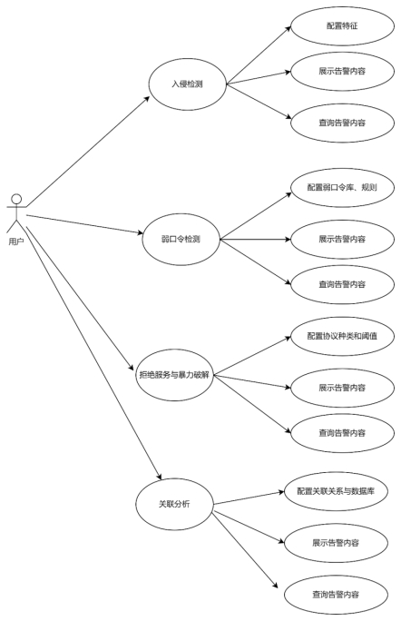 

针对入侵检测功能，提供三个大项展示，分别是入侵检测，其中包括特征检测和自定义检测，拒绝服务和暴力破解展示、关联分析展示和弱口令展示，支持查询、展示和配置。

##### **1.1.1.4.6** 网络入侵检测模块

###### **1.1.1.4.6.1** 模块概述

基于长期威胁对抗经验的积累，安天形成了深度多样化的对抗知识库，威胁检测子系统通过内置自研流量特征库、文件特征库、威胁情报信标库，建立多元特征检测机制，构建成特征检测模块，形成迅速、有效的威胁检测结果输出，输出能力能够覆盖病毒、木马、蠕虫等恶意代码检测，僵木蠕、挖矿活动、可疑文件、勒索软件、流氓软件、Webshell等恶意程序检测以及SMB漏洞、RDP漏洞、软件漏洞、设备漏洞、系统漏洞、拒绝服务漏洞、shellcode等漏洞利用检测等。通过丰富的详细协议解析能力，支持了更多的拒绝服务攻击能力，包括且不限于DNS REQUEST FLOOD攻击检测，DNS RESPONSE FLOOD攻击检测，SYN FLOOD攻击检测， TCP（STREAM） FLOOD攻击检测，FIN FLOOD攻击检测，RST FLOOD攻击检测，ACK FLOOD攻击检测，SYN-ACK FLOOD攻击检测，ICMP FLOOD攻击检测，，ICMP Smurf攻击检测， UDP FLOOD攻击检测， 非法TCP标志位攻击检测， UDPBomb攻击检测，Ping Of Death攻击检测，Teardrop攻击检测，WinNuke攻击检测， Land攻击检测等。

###### **1.1.1.4.6.2** 功能设计

 

特征检测模块为入侵检测子系统最为核心的子模块，为流量分析系统提供基础的威胁检测结果知识输出。

入侵检测子系统根据多元的对抗知识库，形成了流量特征检测引擎模块、文件特征检测引擎模块、威胁情信标检测引擎模块。基于完整承接流量采集子系统的解析数据报文，通过针对不同数据报文特征的预置策略，将指定数据报文传输到既定的检测引擎模块，将流量行为等数据同步至流量特征检测引擎模块，将文件实体及文件基础信息等传同步文件特征检测模块，将网络信标信息等同步至威胁情报信标检测引擎模块，多元检测引擎模块根据检测策略完成对原始数据的威胁检测，根据基层检测引擎将数据报文、数据流、会话、文件、邮件、网络行为等打上威胁标识，形成丰富化知识结果。

入侵检测子系统集成安天自主研发的下一代反病毒引擎（AVLSDK）、威胁情报信标检测引擎（C2）、网络行为检测引擎（AVLX）等多维度检测引擎。

入侵检测子系统基于多维度检测引擎，实现多种威胁的预警与捕获，定位病毒感染源头并监控病毒的扫描、攻击、传输、植入、控制、升级等各种行为。

入侵检测子系统通过对网络元数据、网络传输数据、载荷行为数据等信息的全要素、细粒度记录，提升对定向攻击、高级威胁的发现和溯源能力，从而达到对潜在威胁、未知威胁的持续检测效果，帮助用户提早发现关键威胁、持续感知网络安全态势、预警网络安全事件，同时支撑用户网络安全应急响应工作。

传统的检测体系（如snort）仅提供单包检测能力，事件之间完全是平行的，而类似	UTM、防毒墙一类的设备实际上只是对可还原文件的检测，安天追影威胁分析系统支持从包、流、会话、文件、协议元数据、网络行为、文件行为等多个层次进行全流量检测，同时可获得威胁信誉、威胁名称、核心行为等多个维度的信息。形成了从协议层、行为层、敏感行为层、攻击层、广谱内容层到精确内容层六个层次的立体化检测机制，同时提供基于连接和协议分析的事件吸收体系，高层次高风险事件可以吸收低层次、低敏感事件，避免对管理者造成需处理海量事件的困扰。多层次的检测可以保证获取的数据更丰富，检测内容更多且方法更多样化，能够监测攻击者在正式行动前的扫描探测活动以及针对网站、邮箱建立的命令控制通道，结合情境化分析技术，能够大幅提供网内高价值目标的快速布防和威胁定位能力。

###### **1.1.1.4.6.3** 技术实现

**1.1.1.4.6.3.1** 流量特征检测

针对流量的解析，开发了包暂存和基于传输协议的数据报文保序功能，并基于有限状态机的协议转换协议特征，完成数据包的协议识别，实现基于特征的乱序协议重定位，基于对原始流量的完整且正确的还原，确保能够精准锁定各种威胁和攻击行为。

1.1.1.4.6.3.1.1 功能描述

安天追影威胁分析系统通过对包、流、会话、协议元数据、网络行为、文件、文件行为等多个层次对采集的数据进行检测，基于真实的原始流量数据获得威胁信誉、威胁名称、核心行为、关联信标标签化结果等多维度信息，发现处于不同攻击阶段的威胁活动，如检测攻击者在正式行动前的扫描探测活动，漏洞利用突破行为、钓鱼邮件投递、勒索软件诱骗下载等恶意代码传输行为，以及命令控制通道建立、信息泄露等。以下描述设备使用的典型的流量特征检测分析技术。

基于确定性有限状态自动机，对已解析元数据中的对应协议字段进行关键字匹配和正则匹配。与此同时，对全部原始数据包，均可以直接匹配检测其网络层、传输层元数据，也可以使用相同技术，匹配检测其对应层的载荷数据。

为避免流量特征多次重复匹配的情况，安天追影威胁威胁分析系统在流量特征单包检测的初始化阶段，通过将将用户导入及系统内置的相同的数据报文特征进行归并，精简、轻量化前期流量特征规模，提升单包检测效率。

同时考虑到高速在线流量的情况，通过使用确定性有限状态自动机，尽管存在少数正则表达式无法良好支持的情况，但由于其无需回溯的特性，极大地提高了匹配检测效率，有效应对无法支持高速在线流量匹配检测的场景。

1.1.1.4.6.3.1.2 实现原理

（1）流量监测模块初始化阶段，加载检测流量所需的网络行为特征规则。

（2）借鉴SNORT/SRICATA开源软件思路，自主研发新一代流量特征检测引擎。支持从包、流、会话、元数据、网络行为多个层次进行数据提取、检测与记录。

（3）获取流量原始数据，并解析封装，传至下层模块。

（4）与流量采集子系统对接，将数据导入流量特征检测引擎进行预处理。根据配置IP、端口、协议等预处理参数，对原始数据进行封装，传送下层模块进行解析提取。

（5）提取负载信息，如TCP协议携带的Payload数据，封装固定消息格式。

（6）对原始数据报文格式、负载信息（Payload）进行提取封装，发送到流量特征检测引擎。

（7）将封装的消息推送到流量特征检测引擎，进行检测。

（8）根据加载的网络行为特征规则，逐个检测流量数据消息，产出威胁检测记录并推送至威胁分析模块，做下一步处理。

|                      |                              |
| -------------------- | ---------------------------- |
| 函数名称             | 函数功能                     |
| avlx_cfgfile_load    | 加载流量威胁检测规则文件     |
| avlx_reinit          | 加载流量威胁检测引擎初始化   |
| sengine_hit          | 对流量进行单包检测           |
| avlx_free            | 流量威胁检测引擎释放         |
| avlx_match_dpi       |                              |
| avlx_match_tcp       | 对TCP协议进行检测            |
| avlx_match_udp       | 对UDP协议进行检测            |
| avlx_match_dns       | 对DNS协议进行检测            |
| avlx_match_http      | 对HTTP协议进行检测           |
| avlx_match_tcp_file  | 对TCP协议携带的文件进行检测  |
| avlx_match_http_file | 对HTTP协议携带的文件进行检测 |
| avlx_match_icmp      | 对ICMP协议进行检测           |
| avlx_match_ssh       | 对SSH协议进行检测            |
| avlx_match_tls       | 对TLS协议进行检测            |

**1.1.1.4.6.3.2** 文件特征检测

基于分向流量的流式协议元数据解析完成对文件特征的传输识别，提取原始流量中的文件特征信息与还原文件实体，完成文件解析，将解析结果传输至文件特征检测引擎完成威胁发现。

 

追影威胁分析系统依托全球领先的安天国产自主反威胁引擎、多年积累的恶意代码检测和精确命名能力以及海量威胁库，具备对海量的、已知的恶意程序快速、有效检测的能力，有较高的识别率，降低无用告警噪声，缩短安全管理人员对威胁的判定时间。

AVL SDK作为最快速的网络威胁检测引擎，可使用海量的本地威胁库，内置五千万条高质量威胁特征，检测数亿威胁样本。依靠强大的威胁库，可直接对已知威胁进行有效识别，不仅能够大幅提高已知威胁的识别率，还可明显减少动态分析的检测噪音，从而使系统更专注于分析未知的高级威胁。

l	首先文件特征检测引擎对提取文件元数据进行预处理，预处理引擎包括：格式识别引擎（Format Recognition Engine），用于识别包裹、压缩等各种文件格式；预处理引擎（Preprocess Engine），根据格式识别引擎的结果，处理包裹、压缩等格式；虚拟机（VM），虚拟执行可执行程序，形成病毒缓冲区，实现加密便型病毒的还原。通过预处理引擎能够支持至少370种文件格式的识别，支持不少于30种加壳文件的脱壳、支持不少于50种包裹文件的拆解。

将扫描还原出的文件特征数据及文件实体输送至细分多元化的文件检测引擎，检测引擎包括二进制程序（非PE\NE）检测引擎（COM/Bin Engine）；PE、NE可执行程序检测引擎（PE Engine）；脚本检测引擎（Script Engine）；宏病毒检测引擎（Marco Engine）；邮件蠕虫检测引擎（Mail Engine），实现对邮件蠕虫的检测；启发式扫描引擎（Heuristic），针对虚拟执行结果集的加权分析，进行未知病毒分析；神经元分析引擎（NNM），针对神经网络进行未知木马蠕虫检测；行为分析引擎（AM），基于行为定义进行未知木马蠕虫检测；系统关联分析处理引擎（SLM），关联分析，系统宏操作脚本的识别和处理。通过支持不少于5万恶意代码家族的识别，支持不少于1400万恶意代码变种的检测，支持100+APT攻击组织载荷的检测，支持对威胁病毒名的精确分类和描述。

基于文件检测引擎的检测结果输出是否恶意、以及识别判定结果，包括文件格式名称、编译器壳名称、包裹名称、病毒名、家族名、变种号、平台、核心行为等。

1.高性能文件引擎进行初始化，支持超过对370+种文件格式的检测，文件检测性能达到8万/小时， 

2.从nsq实时分布式消息传递平台接收文件信息日志消息

3.使用文件检出引擎对协议还原之后还原出的文档进行格式识别和威胁检测。

4.将文件检测结果通过nsq实时分布式消息传递平台转发给威胁分析进程进行后一步处理。

**1.1.1.4.6.3.3** 威胁情报信标检测

情报威胁检测系统赋能提升其他安全设备威胁情报的检测能力。其依托于安天多年积累的海量威胁情报数据，结合情报云服务，提供高性能威胁情报检测查询服务，可对外输出威胁信息、标签知识、攻击者信息、关联信息等高价值情报数据；具备多源情报综合查询能力，以及丰富的情报内容输出，如：威胁信息、标签知识、攻击者信息、APT、关联信息等；支持自定义情报源检测、情报更新、情报统计、权限管理等功能。由于自身服务轻量，接口通用，方便与安全产品集成调用，可为自有安全产品或第三方安全产品提供情报检测赋能。

1.1.1.4.6.3.3.1 基于IOC信息进行威胁检测

在协议解析的基础之上，设备提供木马远控的通联分析能力。针对常见木马的通讯协议，匹配木马与服务器通讯的心跳保活报文、上线报文、控制报文，从而对常见木马进行远控通联检测。

针对大量已知的受攻击者控制的命令与控制（C&C）服务器，基于协议解析的结果进行匹配，即使受控主机在隔离网内，无法产生通联协议报文，依然能达成有效检测，定位受控主机的效果。

1.1.1.4.6.3.3.2 支持多元数据检测

支持采集流量日志检测；支持接入防火墙、IDS、IPS等网络安全设备监测日志检测；支持对接SOC、SIEM类产品安全日志检测；具备日志标准化丰富化能力，实现日志集中采集，统一管理。

1.1.1.4.6.3.3.3 实现原理

（1）接收原始流量协议还原以后产生的日志数据。

（2）信标检测模块接收上层协议还原推送的日志数据，根据日志记录描述删选需要检测的日志记录，并推向下层。

（3）依据日志类型，判定是否进行信标检测。

（4）根据日志类型、引擎配置参数进一步删选需要检测的日志记录，完成双向会话对应。

（5）提取日志中的IP、URL、域名等数据信息，利用信标检测引擎进行检测。

（6）解析推送数据，将记录中的IP、URL、域名等数据信息提取后，推送到信标检测引擎中进行检测。引擎对IP、URL、域名等信息打上威胁标签，返回检测结果。

| 威胁情报信标检测子模块函数 |                                                              |
| -------------------------- | ------------------------------------------------------------ |
| 函数名称                   | 函数功能                                                     |
| process_raw_message_body   | 处理协议解析后产生的日志的关键函数                           |
| process_item_data_type     | 依据日志类型，调用相应的字段提取函数，获取IP、URL、域名等信息 |
| c2_detect_select_main      | 对IP、域名、URL等信息进行威胁检测                            |
| DetectIpPort               | 对IP端口进行威胁检测                                         |
| DetectDomain               | 对域名进行威胁检测                                           |
| Detect URL                 | 对URL进行威胁检测                                            |
| handler_scan_result        | 对IP、URL、域名的威胁检测结果进行封装，通过消息队列转发给威胁分析进程 |

##### **1.1.1.4.7** 自定义入侵检测规则模块

###### **1.1.1.4.7.1** 模块概述

自定义入侵检测规则模块支持snort、yara、正则表达式等规则的导入与匹配，通过新建自定义规则或导入兼容格式的snort规则文件，来扩展流量检测规则，支持支持指定规则集合的导入与导出。同时支持信标检测功能，通过强大的C2引擎来实现对源IP、源端口、目的IP、目的端口、协议、事件威胁等级、主机状态、事件类型、攻击阶段、攻击结果、攻击手段等维度的检出功能。

自定义规则界面提供用户新建自定义规则的入口，用户可以根据响应的规则提示填入信息，同时已经建立的自定义规则以列表形式进行呈现，并提供了对其进行编辑、删除等操作。

新建规则，输入或选择规则选项，生成规则或直接输入规则。添加自定义规则成功后，后台编译规则生成规则库，引擎加载规则库。流量命中规则，产生告警事件。

新增snort语法规则，后台解析验证snort规则语法是否合法，合法的snort规则编译后添加的规则库。语法错误返回错误信息。

在协议解析的基础之上，设备提供木马远控的通联分析能力。针对常见木马的通讯协议，匹配木马与服务器通讯的心跳保活报文、上线报文、控制报文，从而对常见木马进行远控通联检测。

针对大量已知的受攻击者控制的命令与控制（C&C）服务器，基于协议解析的结果进行匹配，即使受控主机在隔离网内，无法产生通联协议报文，依然能达成有效检测，定位受控主机的效果。

根据IP生成与之相关联的画像，包括 “简介”、“通联关系”、“域名使用情况”、“源端口使用情况”、“监听端口使用情况”、“攻击详情”等信息。模块通过nsq获取告警事件，分析与IP关联的告警事件，记录“通联关系”、“域名使用情况”、“源端口使用情况”、“监听端口使用情况”、“攻击详情”等信息。

###### **1.1.1.4.7.2** 功能设计

 

自定义入侵检测规则模块下属4个模块，分别为自定义规则检测子模块，sort规则检测子模块，信标检测子模块，关联分析子模块构成。

自定义规则界面提供用户新建自定义规则的入口，用户可以根据响应的规则提示填入信息，同时已经建立的自定义规则以列表形式进行呈现，并提供了对其进行编辑、删除等操作。

sort规则检测子模块实现支持新增snort语法规则，后台解析验证snort规则语法是否合法，合法的snort规则编译后添加的规则库，如语法错误返回错误信息。采用高性能检索引擎以完成对snort规则的支持。

信标检测功能在协议解析的基础之上，设备提供木马远控的通联分析能力。针对常见木马的通讯协议，匹配木马与服务器通讯的心跳保活报文、上线报文、控制报文，从而对常见木马进行远控通联检测。

针对大量已知的受攻击者控制的命令与控制（C&C）服务器，基于协议解析的结果进行匹配，即使受控主机在隔离网内，无法产生通联协议报文，依然能达成有效检测，定位受控主机的效果。

关联分析子模块根据IP生成与之相关联的画像，包括 “简介”、“通联关系”、“域名使用情况”、“源端口使用情况”、“监听端口使用情况”、“攻击详情”等信息。

​	模块通过nsq获取告警事件，分析与IP关联的告警事件，记录“通联关系”、“域名使用情况”、“源端口使用情况”、“监听端口使用情况”、“攻击详情”等信息。

###### **1.1.1.4.7.3** 技术实现

**1.1.1.4.7.3.1** 自定义规则检测

自定义规则界面提供用户新建自定义规则的入口，用户可以根据响应的规则提示填入信息，同时已经建立的自定义规则以列表形式进行呈现，并提供了对其进行编辑、删除等操作。

| Note number | 名称         | 说明                                             |
| ----------- | ------------ | ------------------------------------------------ |
| 1           | SID          | 规则ID                                           |
| 2           | 分类         | 规则分类                                         |
| 3           | 信誉         | 信誉值0-100                                      |
| 4           | 协议         | 规则协议。HTTP、TLS、DNS、TCP、ICMP、UDP、IP等。 |
| 5           | 版本         | 规则版本号                                       |
| 6           | 动作         | 告警、阻断                                       |
| 7           | MITRE ATT&CK | 规则策略、技术点。可选择                         |
| 8           | NSA/CSS      | 规则阶段。可选择                                 |
| 9           | 流方向       | 源IP、源端口、方向、目的IP、目的端口             |
| 10          | 描述         | MSG描述信息                                      |
| 11          | 规则         | 根据以上条件输入生成的规则。也可直接输入规则     |
| 12          | 备注         | 备注                                             |

1.启动基本引擎，读取配置和参数要求。

2.从nsq实时分布式消息平台获取检测规则消息，并判断规则是否合法且满足要求。

3.支持使用预编译功能，对规则进行编译，形成更快的检测模型。

4.完成引擎的初始化功能。

新建规则，输入或选择规则选项，生成规则或直接输入规则。添加自定义规则成功后，后台编译规则生成规则库，引擎加载规则库。流量命中规则，产生告警事件。

**1.1.1.4.7.3.2** Snort规则检测

实现支持新增snort语法规则，后台解析验证snort规则语法是否合法，合法的snort规则编译后添加的规则库，如语法错误返回错误信息。采用高性能检索引擎以完成对snort规则的支持。

1.1.1.4.7.3.2.1 理论基础

如病毒一样，大多数入侵行为都具有某种特征，Snort的规则就是用这些特征的有关信息构建的。入侵者会刘勇已知的系统弱点数据库吗，如果入侵者试图利用这些弱点来实施攻击，也可以作为一些特征。这些特征可能出现在包的头部，也可能出现在载荷中。Snort的检测系统是基于规则的，而规则是基于特征的。Snort规则可以用来检测数据包的不同部分。Snort 1.x可以分析第3等和第4层的信息，但是不能分析应用层协议。Snort 2.x增加了对应用层头部的支持。所有的数据包根据类型的不同按顺序与规则比对。

规则可以用来产生告警信息、记录日志，或者使包通过（pass）：对Snort来说，也就是悄悄丢弃（drop），通过在这里的意义与防火墙或路由器上的意义是不同的。在防火墙和路由器中，通过和丢弃是两个相反的概念。规则文件通常放置在snort.conf文件中，你可以用其他规则文件，然后用主配置文件引用它们（#include 的方式，在snort 2.x主要是用过主文件引用）。

规则详解

规则动作

动作是snort规则中的第一个部分，它表示规则的条件符合的时候，将会有什么样的动作产生。Snort有5个预定义动作，你也可以定义自己的动作，需要注意的是，Snort 1.x 和 2.x对规则的应用是不同的，在1.x中，只要包符合第一个条件，它就会做出动作，然后就不再管它，尽管它可能符合多个条件；在2.x中，只有包和所有的相应规则对比后，才根据最严重的情况发出告警。

pass

这个动作高速Snort不理会这个包，这个动作在你不想检查特定的包的时候可以加快Snort的操作速度。例如：如果你在网络中有一台包含一些弱点的主机，用来检测网络安全漏洞，可能希望不理会对这台机器的攻击，pass规则这时就可以用到了。

log

log动作用来记录包，记录包有不同的方式，例如：可以记录到文件或者数据库。根据命令行参数和配置文件，包可以被记录为不同的详细程度。可以用"snort -?"命令来查看你所用的Snort版本的命令行参数。

alert

alert动作用来在一个包符合规则条件时发送告警信息。告警的发送有多种方式，例如可以发送到文件或者控制台。log动作与alert动作不同在于：alert动作是发送告警然后记录包，log动作仅仅记录包。

dynamic

dynamic规则动作由其他activate动作的规则调用，在正常情况下，他们不会被用来检测包。一个动态规则仅能被一个"activate"动作激活。

自定义动作

除了以上动作外，你也可以定义自己的动作，以用于不同的目的，例如：

向syslog发送消息。Syslog是系统日志守护进程，它在/var/log中创建日志文件，这些文件的位置可以通过修改/etc/syslog.conf来改变。你可以在unix系统中用命令"man syslog"或者"man syslog.conf"来获取更多的信息。Syslog相当于Windows中的事件查看器。

向如HP OpenView等网管系统发送SNMP trap

在一个包上引用多个动作。如你前面所看到的，一个规则仅仅规定了一个动作，自定义动作可以用来产生多个动作。例如：你可以在发送SNMP trap的同时记录Syslog

将数据记录到XML文件中

将信息记录到数据库中，Snort可以将数据记录到MySQL，Postgress SQL，Oracle和Microsoft SQL server中

协议

协议是Snort规则中的第二部分，这一部分将显示哪种类型的包将与规则比对。到目前为止，Snort可以支持以下协议：

IP

ICMP

TCP

UDP

如果协议是IP，Snort检测包中的数据链路层头部来确定包的类型，如果协议类型是其他任何一种，Snort检测IP头部来确定协议类型。

协议

在Snort规则中，有两个地址部分，用来检测包的来源和目的地址。地址可以是一个主机地址或者网络地址。你可以用关键字any来制定所有的地址。地址后面用斜线来附加一个数字，表示掩码的位数。比如：192.168.2.0/24 代表一个C类网络192.168.2.0，其子网掩码是255.255.255.0。

alert icmp ![192.168.2.0/24,192.168.8.0/24] any -> any any (msg: "Ping with TTL=1--"; ttl:100;)

注意：方括号与否定器一起用的，如果没有否定符号，你可以不用方括号。（2.9版本待确认）

端口

端口号用来在进出特定的某个或一些列端口的包上运行规则，例如，你可以用源端口23来对来自Telnet服务器的包应用规则。你可以用关键字any来对包应用规则，而不管它的端口号。端口号仅仅对TCP、UDP协议有意义，如果你选择的协议是ICMP、IP，端口号就不起作用。

端口范围

可以在规则中的端口段设置一些列的端口，而不是一个。用冒号分隔起始和结束。例如下面的规则将对来自1024-2048的所有UDP包告警：

alert udp any 1024:2048 -> any any (msg: "UDP ports";)

上限和下限

可以仅仅用一个起始端口号或结束端口号来表示端口列表，例如：:1024表示比1024小，包含1024的所有端口，1000: 表示比1000大，包括1000的所有端口

否定符

与地址段相同，也可以在Snort规则中的端口段中用否定符合来排除一个或多个端口。下面的规则将记录除了53端口外的其他所有UDP通信。

log udp any !53 -> any any(msg:"Log UDP";)

共用端口号

共用端口号是提供给一些公用应用的。在UNIX平台上，你可以查看/etc/services文件，可以看到更多的端口的定义。RFC1700中包含详细列表。目前ICANN负责管理这些端口号，可以在 ICANN.ORG中获取信息。

方向段

在Snort规则中，方向段确定源和目的，下面是方向段的相关规定：

 

"->"表示左边的地址和端口是源而右边是目的

"<-"表示右边第地址和端口是源而左边是目的在

"<>"表示规则奖杯应用在两个方向上，想同时监视服务器和客户端的时候，可以用到这个标示。

规则选项

Snort规则选项部分在头部后面，在一对圆括号里面，其中可能包含一个选项，也可能包含用分号分割的过个选项，这些选项的关系是逻辑与的关系，只有当选项中的条件都满足的时候，规则动作才会被执行。所有snort规则选项之间用分号隔开，每个规则选项也被用冒号分为选项关键字和选项值。

四类主要的规则选项类：

一般 提供信息但在检测过程中不产生任何影响

有效负载 在净荷中查找数据，并且能过相互关联（数据包数据部分）

非有效负载 查找非净荷中的数据（数据包首部）

过后检测选项 这些选项时某条规则被处罚后，所设置的执行的规则

msg

msg规则选项向日志和警报引擎告知要打印的消息以及数据包转储或警报，他是一个简单的文本字符串，利用\作为转义字符来表示离散的字符，否则这些字符可能会使Snort的规则解析器感到困惑（例如分号; 字符）。

msg:"<message text>";

reference

提供包含外部的一些攻击识别系统的引用功能，该插件目前支持几种特定的系统以及唯一URL。输出插件将使用此插件来听有关生成的警报的其他信息的链接。

gid

用于标识当规则被触发时，是snort的哪一部分生成事件，例如gid 1和规则子系统有关，大于100的gid被实际来表示特定的预处理器和解码器。有关正在使用的当前生成器ID，请参见源代码树中的etc/generators。请注意，gid关键字是可选项，如未指定，默认为1，为避免与snort已定义的gid冲突，建议从1000000开始，一般规则编写，不建议使用。gid需要和sid配合使用。文件etc/gen-msg.map包含有关预处理器和解码器gid的更多信息

sid

识别不同的snort规则（snort规则编号），用于唯一标识一条规则，应与rev关键字配合使用，文件sig-msg.map包含警报消息到Snort规则id的映射。

1.1.1.4.7.3.2.2 实现原理

1.启动基本引擎，读取配置和参数要求。

2.从nsq实时分布式消息平台获取检测规则消息，并判断规则是否合法且满足要求。

3.支持使用预编译功能，对规则进行编译，形成更快的检测模型。

4.完成引擎的初始化功能。

**1.1.1.4.7.3.3** 信标检测

信标检测功能在协议解析的基础之上，设备提供木马远控的通联分析能力。针对常见木马的通讯协议，匹配木马与服务器通讯的心跳保活报文、上线报文、控制报文，从而对常见木马进行远控通联检测。

针对大量已知的受攻击者控制的命令与控制（C&C）服务器，基于协议解析的结果进行匹配，即使受控主机在隔离网内，无法产生通联协议报文，依然能达成有效检测，定位受控主机的效果。

信标检测子模块的基本工作原理是对协议还原之后还原出的ip、url和域名等进行威胁检测。

1.初始化加载引擎库，读取配置和数据库信息。

2.通过nsq消息队列获取协议解析后产生的日志

3.对文件还原后的结果，加载文件进行检测

4.能够基于ip、域名、url等信标信息对威胁事件进行检测

**1.1.1.4.7.3.4** 关联分析

关联分析子模块根据IP生成与之相关联的画像，包括 “简介”、“通联关系”、“域名使用情况”、“源端口使用情况”、“监听端口使用情况”、“攻击详情”等信息。

模块通过nsq获取告警事件，分析与IP关联的告警事件，记录“通联关系”、“域名使用情况”、“源端口使用情况”、“监听端口使用情况”、“攻击详情”等信息。

 

1.启动web查询页面输入查询参数

2.查询数据库，获取信息

3.根据数据构成形成IP画像

4.根据页码和每页条数获取IP画像列表

5.展示结果

 

1.从NSQ实时分布式消息传递平台读取告警事件日志

2.构建算法分析日志，形成关联分析

3.使用临时数据库，生成关联的IP画像

4.完成后输出结果

##### **1.1.1.4.8** 拒绝服务攻击检测模块

###### **1.1.1.4.8.1** 模块概述

基于长期威胁对抗经验的积累，安天形成了深度多样化的对抗知识库，威胁检测子系统通过内置自研流量特征库、文件特征库、威胁情报信标库，建立多元特征检测机制，包括且不限于DNS REQUEST FLOOD攻击检测，DNS RESPONSE FLOOD攻击检测，SYN FLOOD攻击检测， TCP（STREAM） FLOOD攻击检测，FIN FLOOD攻击检测，RST FLOOD攻击检测，ACK FLOOD攻击检测，SYN-ACK FLOOD攻击检测，ICMP FLOOD攻击检测，ICMP Smurf攻击检测， UDP FLOOD攻击检测， 非法TCP标志位攻击检测， UDPBomb攻击检测，Ping Of Death攻击检测，Teardrop攻击检测，WinNuke攻击检测， Land攻击检测等。

###### **1.1.1.4.8.2** 功能设计

拒绝服务检测模块目前由17个分项独立细分子模块构成，每个子模块负责1种拒绝服务攻击类型的检测，检测模块覆盖的攻击类型有DNS REQUEST FLOOD、DNS RESPONSE FLOOD、SYN FLOOD、TCP（STREAM）FLOOD、FIN FLOOD、RST FLOOD、ACK FLOOD、SYN-ACK FLOOD、ICMP FLOOD、ICMP SMURF、UDP FLOOD、非法TCP标志位、UDPBomb、Ping Of Death、Teardrop、Land、WinNuke。

###### **1.1.1.4.8.3** 技术实现

**1.1.1.4.8.3.1** FIN FLOOD攻击检测

1.1.1.4.8.3.1.1 理论说明

FIN FLOOD攻击是一种洪泛攻击，该攻击在短时间内向目的主机发送大量变源变端口FIN报文，报文带有超大载荷引起链路拥塞，或者是极高速率的变源变端口的请求导致转发的设备异常从而引起网络瘫痪，或者是消耗服务器处理性能，从而使被攻击服务器拒绝正常服务。

攻击原理

服务器在接收到一个带有FIN标志位的数据包的时候，需要检查该数据包所表示的四元组是否存在，如果存在则检查该数据包所表示的状态是否合法，然后再向应用层传递该数据包。如果在检查中发现该数据包不合法，例如该数据包所指向的目的端口在本机并未开放，则主机操作系统协议栈会回应RST包告诉对方此端口不存在。当发包速率很大的时候，主机操作系统将耗费大量的精力接收报文、判断状态，同时要主动回应RST报文，正常的数据包就可能无法得到及时的处理。这时候客户端表现为访问页面反应很慢，丢包率较高。

同时，FIN报文用于关闭TCP连接。若攻击者向服务器发送大量的伪造的FIN报文，可能会使服务器关闭掉正常的连接。这种攻击模式的示意图如下所示。

 

攻击过程

攻击者向被攻击者发送大量FIN报文，使得被攻击者需要消耗大量资源忙于检查报文是否合法，并回复RST报文，导致资源耗尽，无法响应正常的请求。攻击者也可能在报文中携带大量载荷，造成网络瘫痪，使得被攻击者拒绝正常服务。

1.1.1.4.8.3.1.2 实现原理

攻击行为

攻击者向服务器发送大量FIN标志位置1的报文，服务器收到后，会在协议栈判断报文是否合法（是否有该四元组的连接，序列号是否正常等等），如果不合法，服务器会返回一个RST报文，由于服务器忙于回复RST报文,导致资源耗尽。

功能描述

基于攻击流量特征以统计的方式进行TCP FIN FLOOD攻击的检测，产生威胁告警日志，并将日志推送至专项分析模块。

 

判断流量是否为TCP协议；

在流量分析模块中，判断当前流是否已成功建立连接；

若当前TCP流未成功建立连接，则对同一目的IP、目的端口进行分组，统计单位时间（秒）内发送FIN包的次数；

统计次数达到告警阈值时，产生告警日志，记录源IP、数据包数量、数据包大小、开始时间、结束时间，触发告警的次数。

当流量为TCP协议时，在流量分析模块对当前流是否已成功建立连接进行判断，若当前TCP流未成功建立连接，则对同一目的IP、目的端口进行分组，统计单位时间（秒）内发送FIN包的次数，当达到告警阈值时，产生告警日志，并记录源IP、数据包数量、数据包大小、开始时间、结束时间，触发告警的次数。

##### **1.1.1.4.9** 弱口令检测模块

###### **1.1.1.4.9.1** 模块概述

在安全方面弱口令问题算是技术含量最低的安全隐患了。但往往技术含量越低，被利用频率也越高，而且造成的影响还不见得小。所以治理弱口令将成为安全体系建设中性价比最高的一个环节。但是就是这样一个性价比高的环节想完全杜绝却不是那么容易，未来的系统可以通过注册申请环节强制设置强密码，但是针对过去的老旧系统弱口令问题就令人头疼了。

弱口令模块通过多种维度组成多种方案来帮助管理员尽可能多的发现网内存在弱口令的系统。

###### **1.1.1.4.9.2** 功能设计

支持弱口令检测：内置10000以上条弱口令字典。

支持脆弱口令检测级别自定义，且级别三种以上，包括字母大小写、字符长度、递增递减或相同数字、是否包含用户名等。

支持密码加密方式为MD5的弱口令检测。

###### **1.1.1.4.9.3** 技术实现

功能开关

| 开关字段说明 | 类型 | 含义说明                     |
| ------------ | ---- | ---------------------------- |
| 弱口令检测   | Bool | 控制弱口令检测是否启用的开关 |

检测选项

| 检测选项说明      | 类型 | 含义说明                                                     |
| ----------------- | ---- | ------------------------------------------------------------ |
| 包含大小写字母    | Bool | 检测字母大小写(判断4种情况：1.不包含字母、2.只有大写字母、3.只有小写字母、4.存在大写和小写字母) |
| 口令长度不小于8位 | Bool | 检测字符长度(判断2种情况：密码不满足最低长度(小于8位)， 密码满足最低长度(大于或等于8位)) |
| 包含数字          | Bool | 检测递增递减或相同数字(判断4种情况：1.不包含数字、2.包含数字且递增、3.包含数字且递减、4.包含数字其相同、5.包含数字且不存在递增或递减或相同) |
| 不包含登录名      | Bool | 检测是否包含用户名(判断2种情况：1.包含用户名、2.不包含用户名) |

检测规则配置

| 检测规则配置说明 | 类型   | 含义说明                   |
| ---------------- | ------ | -------------------------- |
| 登录结构匹配规则 | String | 用于匹配用户登录信息的规则 |
| 登录名提取规则   | String | 用于提取登录名的规则       |
| 口令提取规则     | String | 用于提取口令的规则         |

从数据口捕获流量，从数据口捕获包含弱口令的流量

程序运行会占用一定数量的内存，分配内存用于加载弱口令库

提取登陆口令和登陆名

判断是否存在弱口令字典中

判断长度是否小于8位

判断是否包含大小写字母

判断是否包括数字

判断是否包括登陆名

生成告警信息，发送相应的告警信息至管理页面

| 弱口令检测子模块               |                                     |
| ------------------------------ | ----------------------------------- |
| 函数名称                       | 函数功能                            |
| weak_password_init             | 加载弱口令库                        |
| check_http_password_init       | 加载弱口令匹配规则库                |
| check_password_is_weak         | 检测口令是否为弱口令                |
| check_level_of_password        | 检测口令是否满足复杂度要求          |
| hs_event_handler               | Hyperscan匹配成功后，调用的回调函数 |
| check_password_letter          | 检测口令复杂度是否满足字母要求      |
| check_password_len             | 检测口令复杂度是否满足长度要求      |
| check_password_contain_number  | 检测口令复杂度是否包含数字          |
| check_password_inc_number      | 检测口令复杂度是否包含递增数字      |
| check_password_dec_number      | 检测口令复杂度是否包含递减数字      |
| check_password_same_number     | 检测口令复杂度是否包含相同数字      |
| check_password_regular_number  | 检测口令复杂度是否满足数字要求      |
| check_password_contain_usrname | 检测口令复杂度是否包含登录名        |

 

1.	启动引擎获取配置文件和数据库信息

2.	编译规则，作为内存数据库提高检出性能

3.	生成规则库用于弱口令检测

4.	将弱口令放入密文集合中

5.	完成引擎启动

 

1.	对检测引擎进行预处理操作

2.	检测口令为明文密文

3.	分别在明文库进行检索

4.	分别在密文库进行检索

5.	检索口令MD5值

6.	完成引擎检测

 

1.	启动引擎初始化

2.	检测数据内容包括大小写字母

3.	检测数据内容长度是否满足要求

4.	检测包含连续的ASCII

5.	检测包含登录名

6.	报存检测结果，并输出检测结果

 

1.	初始化引擎功能，建立检出准备

2.	提取数据信息中的登录名和口令

3.	对提取后的数据调用口令库匹配接口

4.	如果为弱口令，发送告警信息

数据库汇总表

| 序号 | 表名称         | 功能简述         | 其他说明 |
| ---- | -------------- | ---------------- | -------- |
| 1    | Pwd_check_rule | 登录口令检测规则 | 无       |
| 2    | Rule_conf      | 检测规则         | 无       |

数据库表描述

Pwd_check_rule专有字段说明表

| 字段       | 类型     | 含义说明                 |
| ---------- | -------- | ------------------------ |
| enable     | bool     | 是否启用检测功能         |
| Rule_confs | String[] | 字符串数组(检测规则集合) |
| Level      | Int      | 检测级别                 |

Rule_conf专有字段说明表

| 字段     | 类型   | 含义说明       |
| -------- | ------ | -------------- |
| dataRule | String | 数据匹配规则   |
| pwdRule  | String | 口令匹配规则   |
| usrRule  | String | 登录名匹配规则 |
| ruleID   | Int    | 规则ID         |

##### **1.1.1.4.10** WEB弱口令检测模块

###### **1.1.1.4.10.1** 模块概述

弱口令也是安全漏洞的一种，是指系统登录口令的设置强度不高，容易被攻击者猜到或破解。造成弱口令的主要原因是系统的运维人员、管理人员安全意识不足。常见的弱口令形式包括：系统出厂默认口令没有修改；密码设置过于简单，如口令长度不足，单一使用字母或数字；使用了生日、姓名、电话号码、身份证号码等比较容易被攻击者猜到的信息设置口令；设置的口令属于流行口令库中的流行口令。

绝大多数企业有一定用户数，对安全密码复杂对没有安全基准或落实不到位，都会存在弱密码。

支持Web弱口令检测，支持通过URL、用户名、密码关键字灵活自定义弱口令检测规则；本功能会依据配置的规则，提取登录信息中的用户名和口令，通过调用相关的接口，检测用户的口令是否符合复杂度要求。

###### **1.1.1.4.10.2** 功能设计

 

Web弱口令模块针对数据流进行解析，协议识别和协议内容提取，获取web用户名和密码，url等信息，并进行响应检测，支持数字检测、密码关键字检测、长度检测、字符串规律检测、和包含关系检测等方式，以定位弱口令信息，并形成告警。

###### **1.1.1.4.10.3** 技术实现

捕获传输到数据口的流量，抓取其中可能为密码的变量(password、passwd)的值，将提取到的值与弱密码逻辑做匹配，如果匹配成果，发送告警信息。

1.	捕获传输到数据口的流量

2.	对流量进行协议解析，获取登陆口令和登录名

3.	判断密码是否存在弱口令字典中

4.	判断密码长度是否符合要求

5.	判断密码是否包括大小写

6.	判断密码是否包括登陆名

7.	对检测结果生成告警信息，输出报告

 

1.	启动引擎，读取配置文件和数据库信息

2.	检测配置项是否正确

3.	检测操作是否成功

4.	返回引擎启动结果

字段展示结果

弱口令检测结果

| 字段说明 | 类型   | 含义说明                 |
| -------- | ------ | ------------------------ |
| 登录名   | String | 从登录信息中提取的登录名 |
| 密码     | String | 从登录信息中提取的口令   |
| 检测结果 | String | 弱口令检测结果           |

流量检测结果

| 字段说明 | 类型   | 含义说明                 |
| -------- | ------ | ------------------------ |
| 描述     | String | 描述检测结果             |
| 检测结果 | String | 显示系统中匹配的威胁类型 |
| 告警类型 | String | 描述是什么类型的告警     |
| 检测引擎 | String | 描述是那个组件检测的     |
| 出现次数 | Int    | 描述发生的次数           |
| 数据下载 | String | 提供离线报文的下载路径   |
| 攻击者   | String | 发起攻击者               |
| 受害者   | String | 受害者                   |

数据库表汇总表

| 序号 | 表名称    | 功能简述 | 其他说明 |
| ---- | --------- | -------- | -------- |
| 1    | Rule_conf | 匹配规则 | 无       |

数据库描述

Rule_conf专有字段说明表

| 字段     | 类型   | 含义说明       |
| -------- | ------ | -------------- |
| dataRule | String | 数据匹配规则   |
| pwdRule  | String | 口令匹配规则   |
| usrRule  | String | 登录名匹配规则 |
| ruleID   | Int    | 规则ID         |

##### **1.1.1.4.11** 暴力破解检测模块

###### **1.1.1.4.11.1** 模块概述

安天追影威胁分析系统通过对流量暴力破解行为进行分析，深度解析获取流量中的暴力破解行为特征，覆盖利用包括FTP、HTTP、IMAP、MYSQL、POP3、RDP、SMB、SMTP、SSH等协议的口令暴力破解行为，同时，利用聚合分析学习技术，形成具象化的可视检测配置、独立场景化的流量暴力破解专项分析、详尽化的针对性流量暴力破解单事件详情展示。

\1. 策略配置页面

（1）支持配置各个攻击检测的开关、阈值。

\2. 专项分析页面

支持根据时间范围、攻击类型、源IP地址、目的IP地址进行事件检索。

（1）提供被攻击主机TOP10数据统计图，统计图包括被攻击主机IP地址、被攻击次数。

（2）提供攻击类型趋势图的数据展示图，统计图包括攻击类型、事件次数。

（3）提供口令暴力破解攻击事件汇总表格数据展示，包含攻击类型、源IP地址、目的IP地址、事件次数、首次发现事件、最近发现时间、查看事件详情。

（4）支持下钻事件查看当前被攻击主机的用户名、登录次数、登录结果。

\3. 事件详情页面

（1）事件详情页面，提供当前事件的开始时间、结束时间、发送数据包个数、发送数据包大小、源IP地址、目的IP地址、源端口、目的端口、协议类型、协议解析详情字段，流量检测结果（事件描述、检测结果、告警类型、检测引擎、出现次数、原始PCAP数据包下载）。

###### **1.1.1.4.11.2** 功能设计

基于流量的口令暴力破解检测功能，能够覆盖25种协议的口令暴力破解检测，其中包含4种邮件协议（SMTP、POP3、IMAP、阿里邮箱网页版），10种数据库协议（TDS、TNS、MYSQL、PGSQL、人大金仓、南大通用、神州通用、DB2、达梦、MongoDB）和其他11种常见的网络协议（FTP、Telnet、RDP、SMB、HTTP、SSH、SNMP、Rlogin、LDAP、VNC、DCERPC）。

###### **1.1.1.4.11.3** 技术实现

**1.1.1.4.11.3.1** FTP暴力破解检测

1.1.1.4.11.3.1.1 理论说明

FTP协议

一、FTP协议的概述

1、文件传送协议(File Transfer Protocol)是互联网上使用的最广泛的文件传输协议，用于Internet上的控制文件的双向传输。

2、FTP提供交互式的访问，允许客户指明文件类型与格式，并允许文件具有存取权限。

3、FTP屏蔽了各计算机系统的细节，因而适合于在异构网络中计算机之间传送文件。

二、FTP协议的特点

1、文件传送协议FTP只提供文件传送的一些基本的服务，它使用TCP可靠的运输方式。

2、FTP的主要功能是减少或消除在不同操作系统下处理文件的不兼容性。

3、FTP使用客户服务器方式。一个FTP服务器进程可同时为多个客户进程提提供服务，FTP的服务器进程由二大部分组成：一个是主进程，负责接受新的请求；另外有诺干个从属进程，负责处理单个请求。

三、FTP工作过程

1、FTP有控制连接和数据连接，

控制连接标准端口为21，用于发送FTP命令信息。

数据连接标准端口为20，用于上传、下载数据。

2、FTP协议和其他协议不一样的地方就是客户端访问FTP服务器端需要建立二个TCP连接，一个用来传输FTP命令，一个用来传输数据

3、FTP有主动模式和被动模式，

主动模式：服务端从20端口主动向客户端发起连接，工作过程如下图所示：

 

第一步中，FTP客户端提交PORT命令并允许服务器来回连它的数据端口(1027端口)。

第二步中，服务器返回确认。

在第三步中，FTP服务器向客户端发送TCP连接请求，目标端口为1027，源端口为20。建立起传输数据的连接。

被动模式：服务端在指定范围内的某各端口被动等待客户，被动发起连接。

 

在第一步中，客户端的命令端口与服务器的命令端口建立连接，并发送命令"PASV"。

在第二步中，服务器返回命令"PORT 2024"告诉客户端：服务器用哪各端口监听数据连接。

在第三步中 ，客户端初始化一个从自己的数据端口到到服务器指定的数据端口的数据连接。

在第四步中，服务器给客户端的数据端口返回一个"ACK"响应。

1.1.1.4.11.3.1.2 实现原理

协议描述

文件传输协议（File Transfer Protocol，FTP）是用于在网络上进行文件传输的一套标准协议，此协议主要用FTP传输文件数据。

功能描述

解析流量中的FTP协议，提取登录信息中的用户名、登录结果，基于统计的方式进行暴力破解检测，当登录行为达到预设的阈值时产生事件告警记录。

 

1、流量探针检测出网络数据包，判断数据包传输层协议是否为TCP，若是TCP协议，则对应用层进行协议识别；若不是TCP协议，则按其他协议解析。

2、识别出应用层协议后，判断其是否为待处理的FTP协议，若是FTP协议，则解析出用户名和登陆状态；若不是FTP协议，则按其他协议解析。

3、对获取的用户名和登陆状态，进行分组数据流统计，判断分组内相同用户名的统计值在单位时间内是否达到阈值，若达到阈值，则产生威胁事件告警记录；若未达到阈值，则继续进行分组数据流统计，直到统计值达到阈值。

4、存储产生的威胁事件告警记录数据，进行专项分析

协议解析后，按照相同源IP地址、目的IP地址、目的端口、协议类型进行分组，获取解析后的用户名、登录状态，并进行分组数据流统计，若分组内相同用户名的统计值在单位时间内达到预设阈值，则产生威胁事件告警记录。

**1.1.1.4.11.3.2** SSH暴力破解检测

1.1.1.4.11.3.2.1 理论说明

一、SSH概述

1、SSH为Secure Shell的缩写，由IETF的网络小组（Network Working Group）所制定；SSH为建立在应用层基础上的安全协议。SSH是较可靠，专为远程登录会话和其他网络服务提供安全性的协议。利用SSH协议可以有效防止远程管理过程中的信息泄露问题。

 

2、SSH最初是UNIX系统上的一个程序，后来又迅速扩展到其他操作平台。SSH客户端适用于多种平台。几乎所有UNIX平台—包括HP-UX、Linux、AIX、Solaris、Digital UNIX、Irix，以及其他平台，都可运行SSH。

二、SSH特点

1、SSH涉及到两个验证：主机验证和用户身份验证。通过主机验证，再通过该主机上的用户验证，就能唯一确定该用户的身份。一个主机上可以有很多用户，所以每台主机的验证只需一次，但主机上每个用户都需要单独进行用户验证。

2、SSH支持多种身份验证，最常用的是密码验证机制和公钥认证机制，其中公钥认证机制在某些场景实现双机互信时几乎是必须的。虽然常用上述两种认证机制，但认证时的顺序默认是gssapi-with-mic,hostbased,publickey,keyboard-interactive,password。

3、SSH客户端支持端口转发(隧道模式)、代理认证、连接共享(连接复用)等。

三、	SSH工作过程

假如从客户端A(172.16.10.5)连接到服务端B(172.16.10.6)上，将包括主机验证和用户身份验证两个过程，以RSA非对称加密算法为例。服务端B上首先启动了sshd服务程序，即开启了ssh服务，打开了22端口(默认)。

 

1、主机验证过程

当客户端A要连接B时，首先将进行主机验证过程，即判断主机B是否是否曾经连接过

 

2、身份验证过程

主机验证通过后，将进入身份验证阶段。SSH支持多种身份验证机制，它们的验证顺序如下：gssapi-with-mic hostbased publickey keyboard-interactive password，但常见的是密码认证机制(password)和公钥认证机制(publickey)。当公钥认证机制未通过时，再进行密码认证机制的验证。这些认证顺序可以通过ssh配置文件中的指令PreferredAuthentications改变。如果使用公钥认证机制，客户端A需要将自己生成的公钥(~/.ssh/id_rsa.pub)发送到服务端B的~/.ssh/authorized_keys文件中。当进行公钥认证时，客户端将告诉服务端要使用哪个密钥对，并告诉服务端它已经访问过密钥对的私钥部分~/.ssh/id_rsa(客户端从自己的私钥中推导，或者从私钥同目录下读取公钥，计算公钥指纹后发送给服务端。所以有些版本的ssh不要求存在公钥文件，有些版本的ssh则要求私钥和公钥同时存在且在同目录下)，然后服务端将检测密钥对的公钥部分，判断该客户端是否允许通过认证。如果认证不通过，则进入下一个认证机制，以密码认证机制为例，当使用密码认证时，将提示输入要连接的远程用户的密码，输入正确则验证通过。

3、验证通过

当主机验证和身份验证都通过后，分两种情况：直接登录或执行ssh命令行中给定某个命令。

1.1.1.4.11.3.2.2 实现原理

协议描述

SSH (Secure Shell)为建立在应用层基础上专为远程登录会话和其他网络服务提供安全性的协议。利用 SSH 协议可以有效防止远程管理过程中的信息泄露问题。

功能描述

对SSH 协议进行识别和解析，基于统计的方式进行暴力破解检测，当登录行为达到预设的阈值时产生事件告警记录。

 

1、流量探针检测出网络数据包，判断数据包传输层协议是否为TCP，若是TCP协议，则对应用层进行协议识别；若不是TCP协议，则按其他协议解析。

2、识别出应用层协议后，判断其是否为待处理的SSH协议，若是SSH协议，则解析出用户名和登陆状态；若不是SSH协议，则按其他协议解析。

3、对获取的用户名和登陆状态，进行分组数据流统计，判断分组内相同用户名的统计值在单位时间内是否达到阈值，若达到阈值，则产生威胁事件告警记录；若未达到阈值，则继续进行分组数据流统计，直到统计值达到阈值。

4、存储产生的威胁事件告警记录数据，进行专项分析

SSH 协议的数据传输是经过加密的，无法通过常规的协议解析方法获取用户名和登录信息，因此通过统计对SSH 短连接在单位时间内未成功建立的方式进行暴力破解的检测，当统计的次数达到预设的阈值时产生事件告警记录，当连接建立成功时则认为暴力破解成功。

##### **1.1.1.4.12** 双向检测模块

###### **1.1.1.4.12.1** 模块概述

双向检测模块，关注通信双方中产生的所有流量元数据，从流量元数据中提取关注点数据进行威胁检测判定，威胁检测判定基于现有的威胁检测引擎（avlx），不同之处在于双向检测模块有额外的威胁判定策略库。 

双向检测策略库，用于对现有威胁行为的关联分析，以明确威胁的意图以及威胁的阶段等。

基于策略库，双向检测模块，标记基于威胁引擎检出的威胁行为，明确已知或未知的攻击阶段，并携带网络流量元数据（包括：IP、端口、协议等五元组信息），发送到威胁解析日志组件。

威胁日志解析组件，用于从威胁日志中提取流量元数据信息，并持久化到数据库中，威胁日志组件主要作用是持久化双向检出模块标记的流量元数据，同时为人工研判提供基础数据。

人工研判，对于大多数常见的攻击都能被双向检查策略库标记，但对于罕见的或不确定的威胁行为，需要人工介入才能明确其真实的攻击阶段，人工研判主目的是提供灵活的或者可干预的攻击阶段标记，纠正检测库中错误的阶段标记。经由人工参与的研判结果将被发送策略收集组件进一步处理，同时双向检测模块将研判结果通知联动设备，为联动设备提供处理依据。

策略收集组件，对于用户不同应用场景，威胁行为策略库库标记的攻击阶段并不一定能反应用户认可的攻击阶段，或者错误的表述方式，所以策略收集组件可由用户将现有判定的攻击阶段修改为他们期望的或者已经明确的攻击阶段。策略收集组件虽然支持用户重置威胁攻击阶段，但是对于策略库中标注明确的攻击阶段无法修改。

联动设备，联动设备通常为威胁处理设备（终端设备），威胁处理设备根据研判结果，执行相应的威胁行为清除，并上报威胁处理结果，由双向检测模块存储，双向检测模块与设备联动，一是为了尽快清除威胁保障网络环境，二是通过收集联动设备处理结果，为后续模块提供基础数据，以便用户能够更直观的了解当前网络环境的现在，发现安防薄弱点，为用户提供安防建议与侧重点。

为了保障威胁研判能力，并提供适当的可扩展行，双向检测模块已具备以上所描述的威胁攻击阶段：发现、标记、明确、记录、人工研判、丰富策略集、联动等功能实现，通过以上内部组件功能实现，双向检测引擎已完成一定程度的自闭环。

除此之外，策略库由策略库生成系统统一提供，当前系统会定期从策略库生成系统获取最新策略库，当前系统可以通过系统升级的方式获得策略库生成系统的赋能。

###### **1.1.1.4.12.2** 功能设计

 

双向检测模块通过以下页面为系统提供完整的攻击展示、攻击阶段确认、攻击阶段人工研判等功能。本模块的各组件功能如下：

（1）策略库外部系统

可以自我形成或者使用外部数据、人工和自动方式形成策略库，丰富行为研判规则

（2）双向检测策略库组件

完成基本的数据联动关系，支持调用自动化研判和人工研判的方式，进行数据处理，判断功能结果的多种形式。

（3）研判系统

支持自动化研判，形成规则，并支持基本的人工研判，用来判断自动研判的结果，修改研判结果和规则，并将新规则融入规则库，进一步实现闭环处理。

（4）威胁日志解析组件

支持对研判结果输出日志，并形成分析报告。

（5）失陷主机检测组件

支持根据研判结果和其他引擎及情报中心判断失陷主机，本联动之前的检出结果，形成研判数据。

###### **1.1.1.4.12.3** 技术实现

双向检测模块通过以下页面为系统提供完整的攻击展示、攻击阶段确认、攻击阶段人工研判等功能。

对于高威胁的攻击阶段，双向检测模块通过失陷主机视角，从失陷主机维度分析、统计、展示威胁事件。比如TOP图，趋势图，雷达图等。

失陷主机通常意味着，用户可能已经或者即将遭受重大损失，在安防终端还能或者能继续有效防护的情况下，及时进行安全联动；若存在完全失陷的情况，用户也可以通过该可视化界面明确需要人工处理失陷主机。

1.策略库外部系统支持对双向监控策略库的升级。

2.双向监控库加载研判库用于自动研判模块进行处理

威胁行为模块将威胁研判结果交给自动研判模块入库和整理，形成规则文件，用于后续处理。

3.	自动研判结果将交给人工研判系统，用来做二次分析，并进行规则输出，交给双向监控库。

4.自动研判和人工研判将结果输出给威胁日志解析组件，并联动设备，形成联动结果。

1.策略库外部系统从双向监测策略库中获取策略规则。

2.双向监测策略库将策略规则导入到制作工具，由制作工具制作策略库升级包。

3.工具包将打包好后的策略库升级包上传到在线升级服务器。

4.系统升级组件从在线升级服务器获取打包好后的升级包。

5.使用升级包更新双向检测策略库版本。

 

1.对网络流量进行分析和ip组包

2.对单包数据进行avlx匹配

3.对协议进行分析和识别，对协议内容进行avlx匹配

4.如果攻击确定，填充攻击确定字段

5.发送avlx告警日志

1.针对采集的数据进行人工研判，可以对失陷主机进行修改

2.对威胁日志解析组件更新研判结果

3.威胁日志解析组件对双向监测策略库更新数据和检测库

4.威胁日志解析组件对联动数据进行更新

5.执行持久化，威胁日志解析组件更新失陷主机数据库

 

1.从nsq实时分布式消息传递平台读取数据，发送给channel通道

2.读取实时分布式消息传递平台的channel数据，判断数据缓存是否达到指定数量。

3.批处理数据判断是否命中一级缓存

4.通过命中二级缓存判断是否为失陷主机，将数据写入失陷主机数据库

5.对时间大于指定数值的威胁事件，将数据写入失陷主机数据库

6.定期更新缓存信息，判断失陷数据是否过期，读取es数据库，查询未判断数据，并清空过期数据。

1.威胁日志解析组件访问数据库获得研判状态

2.威胁日志解析组件更新联动结果，写入数据库

3.威胁日志解析组件联动失陷组件，对设备进行联动，同时异步联动结果

4.形成告警数据通知管理员

# 5 资产发现子系统

##### **1.1.1.5.1** 系统概述

系统支持主动资产扫描，可帮助用户从安全角度自动化构建细粒度资产信息，支持对业务层资产精准识别和动态感知，让保护对象清晰可见。并支持被动资产发现方式进行资产探测，其中被动资产发现通过网络流量监测设备对目标网络流量进行抓取、分析，提取网内资产的设备指纹，生成资产信息。

资产管理功能可展示过往资产扫描到的所有设备信息，并按照最近发现时间进行排序，便于对新发现资产进行确认和管理，资产列表可展示的信息包括设备名称、设备IP、MAC地址、设备类型、操作系统、最近发现时间、首次发现时间。资产管理列表信息与资产实际情况及资产信息采集情况相关，当资产发现功能采集到资产信息变更后，会实时更新资产管理列表内容和资产详情内容。

资产基线管理模块是集中安全运维管理系统的子模块，为客户提供品类与型号管理、资产与部署管理、资产监测等功能，同时为网络流量采集子系统、网络流量分析子系统、入侵检测子系统、违规行为发现子系统等多个系统提供基础数据支撑。资产基线管理模块通过资产管理模块传输的信息进行资产的建档、变更、注销操作；通过资产基线管理中的导入、删除等操作进行资产建档、变更、部署、退役操作；通过资产发现探针及自动化关系对比管理进行部署基准核查、网络通联基准核查、未知资产接入/资产变更验证操作；通过资产基线变更管理进行变更登记、变更时间记录操作；通过非法未知资产接入功能进行未知资产监测、部署监测、通联监测。模块是通过人机AI结合的方式，实现多资产全生命周期的资产管理，从而帮助客户掌握资产的分布和运行情况，提高运营效率，保障客户资产安全。并且接收来自资产采集探针传输的加密数据，首先对数据进行解码、过滤操作，然后将过滤后的数据与知识库、情报库、资产信息等关联，丰富化并存储。丰富化的资产数据，可以为用于后续的分析、风险评估、告警、响应、溯源等提供数据支撑。

系统还支持立即扫描和周期性扫描，针对周期性执行的资产扫描任务，需要配置主动发现间隔时间，间隔单位支持秒、分钟、小时、天，配置并发扫描最大数量和主动发现IP范围，策略编辑完成后，需要判断自动发现开关是否开启，开启状态下保存将立即执行一次扫描任务，并按当前保存时间计时，达到主动发现间隔设置时间后，发起后台自动发起下一次主动资产扫描任务。扫描结果将自动显示在资产管理列表中，如扫描资产已在资产列表中存在，后台对资产信息进行自动更新，更新最新扫描资产相关信息。网络拓扑展示模块可对资产管理模块被动发现、主动发现的资产进行可视化展示，用户可以通过拓扑图的形式查看当前网络中的设备，以及设备间的连接关系，还可以手动添加、删除和修改这些连接关系。

##### **1.1.1.5.2** 系统功能组成

违规行为发现子系统由主动资产扫描模块、被动资产发现模块、资产画像模块、资产基线学习模块、自定义资产扫描任务模块等5个模块组成，各模块组成内容如下：

本系统中各模块功能如下：

(1)主动资产扫描模块

通过主动扫描的方式发现网内资产设备信息，包括终端设备、服务器设备、网络设备、安全设备等。主要包括以下几点：

a）启用主动资产发现

通过主动扫描网内资产信息来进行网内资产的发现。

b）立即扫描

根据用户自定义的扫描策略，对网内资产发起主动扫描任务，实现网内终端设备的发现。

c）周期性自动扫描

设置周期性的自动扫描策略，配置完成后，系统根据策略定期发起主动扫描任务，能够及时发现网内终端资产变化。

d）资产信息展示

针对被动发现和主动发现任务分析出的资产信息进行展示，展示信息包括终端基础信息及业务信息。

e）加入基线

可对已发现资产设置资产基线，以当前资产配置信息作为标准，用于监控终端资产配置信息变化。

(2)被动资产发现模块

通过主动扫描的方式发现网内资产设备信息，包括终端设备、服务器设备、网络设备、安全设备等。主要包括以下几点：

a)启用被动资产发现

通过流量设备采集的流量信息来进行网内资产的发现。

b)资产基线设置

设置资产基线内容，可用于资产基线告警信息生成。

c)资产基线告警

根据采集的资产信息和资产基线进行评估，产生资产基线信息告警。

(3)资产画像模块

可展示过往资产扫描到的所有设备信息，并按照最近发现时间进行排序，便于对新发现资产进行确认和管理资产管理列表信息与资产实际情况及资产信息采集情况相关。当资产发现功能采集到资产信息变更后，会实时更新资产管理列表内容和资产详情内容。主要包括以下几点：

a)基础信息

展示终端资产的基础信息，主要包括设备名称、设备类型、IP地址、MAC地址、首次发现时间、最近发现时间、操作系统、设备厂商。

b)系统账号

展示通过资产发现模块探测到的系统账号信息，包括账号名称、账号状态、账号类型、账号权限、账号风险。

c)端口信息

展示通过资产发现模块探测到的终端端口开放情况，包括终端已开放端口信息和对应端口通信协议。

d)主机威胁告警

展示当前主机触发的违规外联告警信息，主要包括告警类型、访问地址、访问时间、告警原因。

e)流量基线告警

展示当前主机触发的资产基线变更告警信息，信息内容与资产变更内容一直，包括告警时间和告警原因。

f)访问关系

展示当前主机资产在网内的可访问关系，主要包括本机IP、本机端口号、可访问IP、可访问端口号。

(4)资产基线学习模块

资产基线学习模块通过资产管理模块传输的信息进行资产的建档、变更、注销操作；通过资产基线管理中的导入、删除等操作进行资产建档、变更、部署、退役操作；通过资产发现探针及自动化关系对比管理进行部署基准核查、网络通联基准核查、未知资产接入/资产变更验证操作；通过资产基线变更管理进行变更登记、变更时间记录操作；通过非法未知资产接入功能进行未知资产监测、部署监测、通联监测，主要包括以下几点：

a）资产基线模块

对资产基线信息进行管理，支持对资产基线信息的新增、修改、删除，内容包括资产信息、账号信息、端口信息等。

b）资产变更模块

资产变更模块针对资产的基本信息进行建档，一旦已经建档的资产发现除了设备IP、MAC地址外任何信息包括的设备类型型号、操作系统等基础信息、系统账户、开放端口、资产的不同版本发生了变更，则认定该资产为变更资产，此时会向管理人员发送通知，管理人员根据实际情况将变更资产反馈上级或变更基线数据。

c）未知资产接入

针对资产入网和联通关系配置的管理，包括：软硬件部署基准核查、网络通联基准核查、接入实施、实施验证等内容。

d）资产异常告警

针对排查后的所有异常资产情况，包括但不限于异常资产变更、异常未知资产接入，可对其进行告警相关操作，首先将异常数据进行汇聚，然后将数据同步至对应三方系统，系统可根据情况对异常情况进行处置、处置完成后，会将处置结果推送至负责人主机并且弹窗告警。

(5)自定义资产扫描任务模块

系统支持自定义资产扫描任务，包括立即扫描和周期性扫描，扫描结果将自动显示在资产管理列表中，主要包括以下几点：

a）资产拓扑结构展示

针对当前已提交的设备关联关系进行可视化展示，初次发现资产按系统算法进行资产拓扑展示。

b）未关联节点展示

展示资产管理中记录、但在资产拓扑结构中未进行资产关联的资产。

c）节点信息展示

展示资产节点的相关基础信息。

d）拓扑重置

基于当前资产管理列表的资产信息及资产间的关联关系，重新生成资产拓扑结构。

e）拓扑编辑

支持对现有拓扑结构进行调整，包括层级结构调整和节点的添加、删除。

##### **1.1.1.5.3** 系统业务流程

一、资产管理模块

1.资产发现业务流程图

1)管理员在进行主动资产发现前，需要对资产发现范围和频率进行设置，配置完成后资产发现模块根据配置信息执行资产扫描任务。

2)资产发现模块扫描到资产节点后会根据扫描信息对资产类型进行分类标识。

3)结合扫描到的网络链接关系，生成初始的网络拓扑结构。

4)扫描任务完成后，将处理后的扫描结果加入资产管理列表，进行资产展示。

5)针对资产扫描信息，形成资产详情，并支持将资产配置加入资产基线，用于资产变更的监控。

二、资产基线学习模块

2.资产基线设置业务流程图

6)管理员在进行主动或被动资产发现前，需要对资产发现范围和频率进行设置，配置完成后资产发现模块根据配置信息执行资产扫描任务。

7)资产发现模块扫描到资产节点后会根据扫描信息对资产类型进行分类标识。

8)结合扫描到的网络链接关系，生成初始的网络拓扑结构。

9)扫描任务完成后，将处理后的扫描结果加入资产管理列表，进行资产展示。

10)针对资产扫描信息，形成资产详情，并支持将资产配置加入资产基线，用于资产变更的监控。

3.资产变更业务流程图

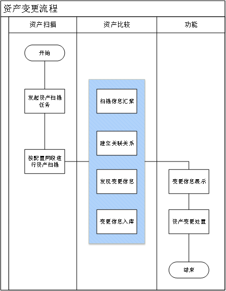

管理员进行扫描任务。

2)资产发现模块扫描到资产节点后会根据扫描信息对资产详细信息进行整体标识。

3)结合扫描到的资产链接关系，以及已知的资产情况，生成变更后的网络拓扑结构。

4)扫描任务完成后，将处理后的扫描结果加入资产变更管理列表，进行资产变更展示。

5)针对资产变更扫描信息，形成资产变更详情，并支持将资产变更配置加入资产基线，用于资产变更的管理。

4.未知资产接入业务流程图

管理员进行扫描任务。

2)资产发现模块扫描到资产节点后会根据扫描信息对资产详细信息进行整体标识。

3)结合扫描到的资产链接关系，以及已知的资产情况，生成未知资产的网络拓扑结构。

4)扫描任务完成后，将处理后的扫描结果加入未知资产管理列表，进行未知资产展示。

5)针对未知资产扫描信息，形成未知资产详情，并支持将未知资产接入配置加入资产基线，用于未知资产接入的管理。

 

三、网络拓扑展示模块

1.网络拓扑自动绘制流程图

1)管理员在进行主动资产发现前，需要对资产发现范围和频率进行设置，配置完成后资产发现模块根据配置信息执行资产扫描任务。

2)资产发现模块扫描到资产节点后会根据扫描信息对资产类型进行分类标识。

3)结合扫描到的网络链接关系，生成初始的网络拓扑结构。

2.未关联节点更新流程图

1)首先系统已经进行过最少一次资产发现，并已发现资产设备。

2)管理员再次进行主动资产发现前，需要对资产发现范围和频率进行设置，配置完成后资产发现模块根据配置信息执行资产扫描任务。

3)资产发现模块扫描到资产节点后会根据扫描信息对资产类型进行分类标识。

4)针对新发现的资产在资产管理列表进行添加。

5)将资产管理列表中的节点与拓扑图中关联节点进行对比，资产管理中存在但拓扑不存在的节点标识为未关联节点，在网络拓扑未关联节点展示区域进行展示。

6)针对资产管理列表中已经存在的节点，如资产信息发生变化的，更新资产相关信息。

7)点击网络拓扑节点可展示资产基础信息。

3.拓扑重置流程

1)首先系统已经进行过最少一次资产发现，并已发现资产设备并形成网络拓扑图。

2)对当前已经自动形成的网络拓扑进行自定义编辑，包括新增节点，删除节点以及改变节点位置并保存修改结果。

3)点击“拓扑重置”按钮，清空当前已编辑拓扑信息。

4)根据资产管理列表中的节点和节点间的关联关系进行自动拓扑绘制，形成拓扑结构图。

##### **1.1.1.5.4** 系统接口设计

###### **1.1.1.5.4.1** 内部接口设计

**1.1.1.5.4.1.1** 主动资产扫描模块

一、资产管理模块

1.资产管理模块接口

（1）接口内容

资产管理功能模块内部接口包括资产信息采集接口、资产数据接口、数据变更任务接口、资产管控接口以及工具采集上报接口，接口调用方以及提供方分别为安全代理模块（终端）、安全监管模块（管理凭条）以及用户管理模块。三者互相协同，完成了资产信息的采集、分析、管控等操作。

（2）接口方式

| 序号 | 接口名称                 | 接口描述                                 | 接口提供方   | 接口调用方   |
| ---- | ------------------------ | ---------------------------------------- | ------------ | ------------ |
| 1    | E1,资产信息采集接口      | 该接口用于采集终端数据                   | 资产代理模块 | 资产监管模块 |
| 2    | E2，资产数据上报接口     | 该接口用于将资产数据信息上报至管理平台   | 资产监管模块 | 资产代理模块 |
| 3    | E3，数据变更任务接口     | 该接口主要管理平台对设备资产信息变更管理 | 资产监管模块 | 资产代理模块 |
| 4    | E4，资产管控接口         | 该接口主要管理平台对终端资产信息管控     | 资产监管模块 | 资产代理模块 |
| 5    | E5，工具采集资产上报接口 | 该接口主要用于用户主动上报资产信息       | 资产监管模块 | 用户管理模块 |

**1.1.1.5.4.1.2** 被动资产发现模块

与主动资产扫描模块使用同一种接口方式。

**1.1.1.5.4.1.3** 资产画像模块

二、网络拓扑展示模块

(1)接口内容

网络拓扑展示模块内部接口包括数据校验接口和数据管理接口，接口调用方以及提供方分别为拓扑数据展示模块和资产发现模块。两者互相协同，完成了资产信息的采集、分析、管控、绘制等操作。

| 序号 | 接口名称        | 接口描述                           | 接口提供方       | 接口调用方       |
| ---- | --------------- | ---------------------------------- | ---------------- | ---------------- |
| 1    | E1,数据校验接口 | 该接口主要用于接收到的数据进行校验 | 数据接收         | 拓扑展示数据服务 |
| 2    | E2,数据管理接口 | 该接口用于将数据进行存储           | 拓扑展示数据服务 | 拓扑展示数据服务 |

**1.1.1.5.4.1.4** 资产基线学习模块

(3)接口内容

(4)接口方式

| 序号 | 接口名称         | 接口描述                                                     | 接口提供方       | 接口调用方       |
| ---- | ---------------- | ------------------------------------------------------------ | ---------------- | ---------------- |
| 1    | E1,数据上报接口  | 该接口主要用于接收终端资产管理功能上报的预设资产基线数据     | 数据采集模块     | 资产管理模块     |
| 2    | E2，数据变更接口 | 该接口主要用于将变更的资产基线数据同步更新至资产管理页面中，并进行同步关联 | 资产基线管理模块 | 资产基线管理模块 |

**1.1.1.5.4.1.5** 自定义资产扫描任务模块

与主动资产扫描模块使用同一种接口方式。

###### **1.1.1.5.4.2** 外部接口设计

**1.1.1.5.4.2.1** 主动资产扫描模块

(1)接口内容

资产管理功能模块内部接口包括资产信息采集接口、获取告警信息接口。

(2)接口方式

| 序号 | 接口名称                | 接口描述                   | 接口提供方   | 接口调用方       |
| ---- | ----------------------- | -------------------------- | ------------ | ---------------- |
| 1    | E1,资产信息采集接口     | 该接口主要用于资产信息采集 | 资产管理模块 | 集中监控功能模块 |
| 2    | E2,获取违规外联信息接口 | 该接口用于违规外联信息获取 | 违规外联模块 | 资产管理模块     |

**1.1.1.5.4.2.2** 被动资产发现模块

与主动资产扫描模块使用同一种接口方式。

**1.1.1.5.4.2.3** 被动资产画像模块

二、网络拓扑展示模块

(1)接口内容

(2)接口方式

| 序号 | 接口名称            | 接口描述                                             | 接口提供方 | 接口调用方       |
| ---- | ------------------- | ---------------------------------------------------- | ---------- | ---------------- |
| 1    | E1,资产信息获取接口 | 该接口主要用于接收到的数据与自身网络节点信息进行校验 | 数据接收   | 网络图谱展示模块 |

**1.1.1.5.4.2.4** 资产基线学习模块

(1) 接口内容

(2) 接口方式

| 序号 | 接口名名称           | 接口描述                                                     | 接口提提供方       | 接口调使用方       |
| ---- | -------------------- | ------------------------------------------------------------ | ------------------ | ------------------ |
| 1    | E1,资产数据同步接口  | 该接口主要用于资产基线管理模块推送的资产数据，基础信息管理子系统进行数据接收。 | 基础信息管理子系统 | 资产基线管理模块   |
| 2    | E2，基础信息上报接口 | 该接口主要接收来自基础信息管理子系统推送的基础数据，包含资产属性、信息、关系等信息 | 任务管理子系统     | 基础信息管理子系统 |

**1.1.1.5.4.2.5** 自定义资产扫描任务模块

与主动资产扫描模块使用同一种接口方式。

##### **1.1.1.5.5** 系统用户用例

一、资产管理模块

1.资产管理模块系统用例图

安全管理员使用资产发现功能可以发现网内资产情况，通过使用资产筛选功能可对在网资产信息进行检索，通过资产管理功能可以查看单一资产详情，包括基础信息、系统账号、端口信息、访问关系。

资产基线管理类角色负责资产基线管理、资产变更管理、非法资产接入管理的相应操作。

以下为各个角色的定义：

| 角色                   | 职责                                                         |
| ---------------------- | ------------------------------------------------------------ |
| 资产基线管理操作员     | 负责资产接入、资产认证、数据预处理、数据校验、数据标准化、数据丰富化的相应操作。 |
| 资产基线变更管理操作员 | 负责资产变更数据、更新基线、异常数据上报、异常数据同步、异常数据处置、异常数据告警等操作。 |
| 资产非法接入管理操作源 | 负责未知资产接入数据、更新基线、异常数据上报、异常数据同步、异常数据处置、异常数据告警等操作。 |

角色与功能对应表如下：

| 业务功能     | 资产基线管理操作员 | 资产基线变更管理操作员 | 资产非法接入管理操作源 |
| ------------ | ------------------ | ---------------------- | ---------------------- |
| 资产基线管理 | √                  | ×                      | ×                      |
| 资产基线变更 | ×                  | √                      | ×                      |
| 资产非法接入 | ×                  | ×                      | √                      |
| 资产基线更新 | √                  | √                      | √                      |
| 资产异常上报 | ×                  | √                      | √                      |
| 资产异常同步 | ×                  | √                      | √                      |
| 资产异常处置 | ×                  | √                      | √                      |
| 资产异常告警 | ×                  | √                      | √                      |

资产基线管理操作员在资产基线管理模块对资产相关信息进行处理，主要包括：资产基线管理、资产变更管理、非法接入管理。其中资产基线管理操作员负责资产接入、资产认证、数据预处理、数据校验、数据标准化、数据丰富化的相应操作；资产基线变更管理操作员负责资产变更数据、更新基线、异常数据上报、异常数据同步、异常数据处置、异常数据告警等操作；资产非法接入管理操作源负责未知资产接入数据、更新基线、异常数据上报、异常数据同步、异常数据处置、异常数据告警等操作。

1） 资产基线管理

资产基线管理操作员支持设置资产基线，系统通过自动或者手动的方式采集到资产信息后，首先会存到资产管理中，管理员可以通过导入资产基线的功能，将所有已确认资产信息全部导入到资产基线管理页面中。首次导入后即可初始化资产基线管理数据，此时产品即可基于初始基线进行自动学习及数据识别。

2） 资产变更管理

当已经设置成为基线的资产除了IP和MAC以外的其中某一个信息（设备类型、操作系统等）发生变更后，资产变更管理操作员可以通过修改模块对该操作进行识别，将其标识为资产被替代安全风险。管理人员可以通过对应的模块查看到所有的资产替代信息，并且进行处置，处置操作需要包括：更新操作，即将当前被替换风险的资产数据重新更新至资产基线管理，覆盖原资产基线内容；忽略操作，即在未进行新一轮资产扫描前，在资产变更列表隐藏所选资产信息；资产详情，即可查看当前被替换风险的资产信息；导出功能，导出所有的资产变更列表信息。

3） 非法接入管理

非法资产接入管理操作员当模块通过主动识别或自动识别等多种方式采集出全新的资产信息时，此时资产基线管理模块可以将其数据进行强制收集，收集完成后，会整理到未知资产接入列表中，此时管理人员可以通过该模块查看所有的未知资产并标记。

 

二、网络拓扑展示模块

1.网络拓扑展示用例

网络拓扑展示模块主要是用于展示当前网内资产间的关联关系，初始状态为空，通过资产发现模块发现资产后，自动绘制资产间的拓扑关系，并支持对已自动绘制的拓扑结构进行自定义修改，包括增加、删除节点，也支持对已经自定义绘制的拓扑重置，重置后按照当前资产管理模块的资产进行自动绘制拓扑结构并进行展示。

##### **1.1.1.5.6** 主动资产扫描模块

###### **1.1.1.5.6.1** 模块概述

资产发现功能可帮助用户从安全角度自动化构建细粒度资产信息，支持对业务层资产精准识别和动态感知，让保护对象清晰可见。

通过主动扫描的方式，自动发现网络设备、接入设备、网络拓扑；自动发现接入设备的类型，包括：PC终端、网络设备、宽带路由器、防火墙、游戏机、HUB、负载均衡器、媒体设备、电话交换机、手持终端、移动电话、电源设备、打印机、打印服务器、代理服务器、其他设备、路由器、安全设备、其他设备、存储设备、交换机、其他设备、其他终端、服务器、IP电话中继、IP电话、无线AP、网络摄像头。

###### **1.1.1.5.6.2** 功能设计

\1. 功能组成

资产管理展示局域网内的嗅探信息，包括：计算机名称、IP地址、MAC地址、操作系统版本等；资产发现管理支持资产通过发送基于多种协议的网络数据包，分析判断返回数据包的一系列特性，从而实现对局域网内的资产的发现。该功能模块由五部分组成，包括：启用被动资产发现、立即扫描、周期性自动扫描、资产信息展示、加入基线，每个功能说明如下：

1)启用被动资产发现

通过流量设备采集的流量信息来进行网内资产的发现。

2)立即扫描

根据用户自定义的扫描策略，对网内资产发起主动扫描任务，实现网内终端设备的发现。

3)周期性自动扫描

设置周期性的自动扫描策略，配置完成后，系统根据策略定期发起主动扫描任务，能够及时发现网内终端资产变化。

4)资产信息展示

针对被动发现和主动发现任务分析出的资产信息进行展示，展示信息包括终端基础信息及业务信息。

5)加入基线

可对已发现资产设置资产基线，以当前资产配置信息作为标准，用于监控终端资产配置信息变化。

2.功能描述

终端发现功能可通过内网主动探测技术，识别企业内网中未管控终端， 实现高效的内网暴露面清点与全网资产探测，及时防范安全隐患，建立合理的防御策略。

主动资产发现是通过主动下发资产扫描任务来进行网内资产探测，任务下发分为立即执行任务和周期性执行任务，立即执行任务需要手动配置主动发现IP范围和并发扫描最大数量，配置完成后系统立即按ip范围进行扫描任务，对网段内的IP进行顺序扫描，完成任务后将扫描到的终端在资产管理列表中显示。

3.技术原理

端口扫描的原理和探测目标主机是否存活的原理类似，都是根据发送探测包之后的响应包的状态来进行判断的。

1)网络资产探测

网络资产探测通常是指追踪发现和分析掌握网络资产情况的过程。通过网络资产探测，能够帮助企业组织梳理网络中当前存活的数据存储应用和服务，为数据治理资产纳管提供信息基础；此外，还可以据此发现网络中存在的隐匿非法资产，为及时处理提供便利。网络资产探测是实现数据治理的重要前提之一，在数据安全相关工作中具有应用价值。

从探测基础数据的来源角度进行分类，网络资产探测主要分为主动探测和被动探测，主动探测主要用于对未知网络下的资产探测，被动扫描主要用于持续性的监听已知网络下的未发现资产，并通过信息补全和深度扫描等方式完成资产属性的补全，最终实现全量资产的发现与生命周期的管理。本模块能够对主、被动资产探测方式获取的信息进行管理，下面主要针对主动探测技术进行介绍。

2)基于高速网络扫描的主动探测

主动探测方法，主要应用多样的高速网络扫描技术，如主机存活检测、端口扫描和服务鉴别等技术，通过主动向目标网络资产发送构造的探测数据包，并从返回的响应数据包的相关信息中提取目标特征，与内置特征库中的特征指纹进行匹配，来实现对操作系统、开放端囗、服务应用类型和版本的探测。

3)主机存活检测

企业的网络拓扑结构，一般分为二层网络和三层网络。二层网络仅仅通过MAC寻址即可实现通讯，而三层网络通信需要经过路由器转发，则必须通过|P路由才能实现跨网段的通信。

基于ARP协议

如果扫描探针与检测目标处于同一网段的二层网络当中，那么使用地址解析协议(ARP)扫描技术是很好的选择。该方法速度快，扫描结果精准，且通常不会有安全措施用于阻止正常的ARP数据包，扫描被干扰的可能性小。但当扫描探针与检测目标处于不同网段，属于三层网络的不同子域时，则应考虑使用其他协议。

二层网络通过发送arp广播包发现资产，控制发包频率和扫描周期来控制广播包数量和频率；使工业网络内部存在的一些特殊工控设备对网络数据包处理能力较弱时，减少其网络中断频繁处理，从而使其避免宕机，达到自动扫描识别资产的同时，不影响到企业经营生产。

基于ICMP协议

为了发现和处理网络中的各种错误，诞生了互联网控制报文协议(ICMP)。这种协议同样是属于TCPIP协议簇的一个子协议，其是网络层中的重要成员，可以用于在甲主机、路由器之间传递控制消息。ICMP协议数据报文有很多种类，但总体可分为查询报文和差错报告报文。其中，查询报文是用一对请求和应答定义的，也就是说，主机A可以向主机B发送ICMP数据包查询信息，主机B在接收到该数据包后会给出应答。故通过ICMP查询报文，即可进行主机存活检测。

ICMP的响应请求和应答可以用来测试发送和接收两端链路及目标主机TCP刀P协议是否正常，其在当前最常见的实践应用即是ping命令。然而，由于许多网络设备的防火墙可能配置禁止该类ICMP报文，故主机扫描可能被阻断。另寻他法，ICMP查询报文，除了响应请求和应答外，还包括时间戳请求和应答、地址掩码请求和应答等，因此，还可以选择构造这些类型的ICMP数据包进行探测扫描。

ICMP报文种类

基于TCP协议

传输控制协议(TCP)是一种面向连接的、可靠的、基于字节流的传输层通信协议。建立完整的TCP会话，需要完成三次握手过程，这个过程既耗资源又耗时，所以在高速网络扫描技术中不会完成整个三次握手，而是仅仅发送SYN或ACK数据包的半连接扫描。对于TCPSYN扫描，在得到响应后发送RST包终止握手；对于TCPACK扫描，则由被检测主机返回RST包。基于TCP存活主机发现技术，结果可靠性较高，但是其建立于传输层通信，故必须指定端口，限制了使用范围。

基于UDP协议

用户数据报协议(UDP)和TCP类似，也是一种传输层协议。然而和TCP协议相比，UDP是一种无连接的协议，它不能和TCP探测那样依赖于建立连接的过程，而是只能通过是否存在端口关闭网络不可达时返回的ICMP报文来判断。此外，由于UDP是无连接不可靠的，对于没有ICMP报文返回的端口也无法准确判断是通信成功还是数据包丢失，故其扫描结果的可靠性也相对较低。

端口扫描和服务鉴别

端口扫描是服务鉴别的基础和前提，在探测流程中，先进行端口存活扫描，可以排除关闭的和不可通信端口，缩小后续执行服务版本检测的规模，提高探测效率。

端口扫描其是建立在传输层协议之上的，根据具体协议，可以划分为TCP端口扫描和UDP端口扫描。在端口扫描中，最流行的TCP端口扫描技术依然是TCP半连接方法，如TCPSYN，通过向目标端口发送SYN包请求连接，目标接收到SYN包后响应SYN/ACK包，探测主机接收到响应后用RST包终止握手。

在完成端口扫描后，可以尝试与端口建立完整TCP连接进行服务类型和版本探测。通常情况下，与服务端口建立连接后，数秒时间内，服务会返回Banner欢迎信息，通过将Banner信息与服务特征指纹库中的特征指纹进行匹配，就可以鉴别并提取该端口对应服务的类型和版本信息，这个过程一般被称为null probe。如果null probe未能成功匹配服务，则可继续按照指定顺序发送多种预先构造好的探测包，并利用响应数据和特征指纹进行匹配，直到全部匹配结束。

###### **1.1.1.5.6.3** 技术实现

\1. 数据库ER图

 

 

\2. 数据库结构

| IEP_ASSETMAGR_CLIENT_ZDZC_jcxx（主动资产节点基础信息表） |           |      |            |
| -------------------------------------------------------- | --------- | ---- | ---------- |
| 字段名称                                                 | 类型      | 长度 | 描述       |
| id                                                       | int4      | 32   | 主键自增   |
| uuid                                                     | text      | 0    | 终端uuid   |
| client_name                                              | text      | 0    | 终端名称   |
| os_name                                                  | text      | 0    | 系统名称   |
| sp                                                       | text      | 0    | sp         |
| os_ver                                                   | text      | 0    | 版本       |
| os_manufacturer                                          | text      | 0    | 系统制造商 |
| client_num                                               | text      | 0    | 终端型号   |
| os_model                                                 | text      | 0    | 系统模式   |
| board_manufacture                                        | text      | 0    | 主板制造商 |
| board_num                                                | text      | 0    | 主板型号   |
| board_serialnum                                          | text      | 0    | 主板序列号 |
| board_ver                                                | text      | 0    | 主板版本   |
| bios_ver                                                 | text      | 0    | BIOS版本   |
| cpu_name                                                 | text      | 0    | CPU名称    |
| line_num                                                 | int4      | 32   | 处理线程数 |
| core_num                                                 | int4      | 32   | 核心数     |
| interface_type                                           | text      | 0    | 接口类型   |
| sound                                                    | text      | 0    | 声卡信息   |
| cd                                                       | text      | 0    | 光驱       |
| disk                                                     | text      | 0    | 硬盘       |
| net                                                      | text      | 0    | 网卡信息   |
| mem                                                      | text      | 0    | 内存信息   |
| video                                                    | text      | 0    | 显卡信息   |
| upload_time                                              | timestamp | 6    | 上传时间   |
| os_bit                                                   | text      | 0    | 位数       |
| bios_time                                                | text      | 0    | BIOS时间   |

 

| IEP_ASSETMAGR_CLIENT_ZDZC_rjxx（主动资产节点软件信息表） |           |      |              |
| -------------------------------------------------------- | --------- | ---- | ------------ |
| 字段名称                                                 | 类型      | 长度 | 描述         |
| sid                                                      | int4      | 32   | 软件id       |
| file_name                                                | text      | 0    | 文件名       |
| file_path                                                | text      | 0    | 文件路径     |
| file_md5                                                 | text      | 0    | 文件md5      |
| file_kmd5                                                | text      | 0    | 文件kmd5     |
| file_size                                                | int4      | 32   | 文件大小     |
| file_type                                                | int4      | 32   | 文件类型     |
| uploadtime                                               | timestamp | 6    | 上传时间     |
| virus_name                                               | text      | 0    | 漏洞名       |
| c_time                                                   | timestamp | 6    | 文件创建时间 |
| w_time                                                   | timestamp | 6    | 文件修改时间 |
| m_time                                                   | timestamp | 6    | 文件访问时间 |
| sign                                                     | text      | 0    | 签名         |
| source                                                   | text      | 0    | 文件来源     |
| folder                                                   | text      | 0    | 文件目录     |

##### **1.1.1.5.7** 被动资产发现模块

###### **1.1.1.5.7.1** 模块概述

资产发现功能支持被动资产发现方式进行资产探测，其中被动资产发现通过网络流量监测设备对目标网络流量进行抓取、分析，提取网内资产的设备指纹，生成资产信息。

###### **1.1.1.5.7.2** 功能设计

1.功能组成

功能模块组成与主动资产发现模块一致。

2.功能描述

被动资产发现模块可提供资产IP、MAC地址，并将发现的资产存入资产管理模版，其中资产管理模块提供将当前发现的资产信息设为资产基线的能力，可以以当前发现的设备基础信息为基准，设置为资产基线，资产基线设置成功后，后续进行资产扫描如发现资产信息有变化将信息基线告警，终端的基线告警信息可在资产详情中进行查看。

如在资产扫描过程中发现了资产基线模块不存在的IP、MAC地址，则该终端将被定义为未知资产，如存在相同IP或相同MAC，则该终端将被定义为变更资产，因为资产基本信息已与基线出现差异。

###### **1.1.1.5.7.3** 技术实现

\1. 数据库ER图

 

 

\2. 数据库结构

| IEP_ASSETMAGR_CLIENT_BDZC_jcxx（被动资产节点基础信息表） |           |      |            |
| -------------------------------------------------------- | --------- | ---- | ---------- |
| 字段名称                                                 | 类型      | 长度 | 描述       |
| id                                                       | int4      | 32   | 主键自增   |
| uuid                                                     | text      | 0    | 终端uuid   |
| client_name                                              | text      | 0    | 终端名称   |
| os_name                                                  | text      | 0    | 系统名称   |
| sp                                                       | text      | 0    | sp         |
| os_ver                                                   | text      | 0    | 版本       |
| os_manufacturer                                          | text      | 0    | 系统制造商 |
| client_num                                               | text      | 0    | 终端型号   |
| os_model                                                 | text      | 0    | 系统模式   |
| board_manufacture                                        | text      | 0    | 主板制造商 |
| board_num                                                | text      | 0    | 主板型号   |
| board_serialnum                                          | text      | 0    | 主板序列号 |
| board_ver                                                | text      | 0    | 主板版本   |
| bios_ver                                                 | text      | 0    | BIOS版本   |
| cpu_name                                                 | text      | 0    | CPU名称    |
| line_num                                                 | int4      | 32   | 处理线程数 |
| core_num                                                 | int4      | 32   | 核心数     |
| interface_type                                           | text      | 0    | 接口类型   |
| sound                                                    | text      | 0    | 声卡信息   |
| cd                                                       | text      | 0    | 光驱       |
| disk                                                     | text      | 0    | 硬盘       |
| net                                                      | text      | 0    | 网卡信息   |
| mem                                                      | text      | 0    | 内存信息   |
| video                                                    | text      | 0    | 显卡信息   |
| upload_time                                              | timestamp | 6    | 上传时间   |
| os_bit                                                   | text      | 0    | 位数       |
| bios_time                                                | text      | 0    | BIOS时间   |

 

| IEP_ASSETMAGR_CLIENT_BDZC_rjxx（被动资产节点软件信息表） |           |      |              |
| -------------------------------------------------------- | --------- | ---- | ------------ |
| 字段名称                                                 | 类型      | 长度 | 描述         |
| sid                                                      | int4      | 32   | 软件id       |
| file_name                                                | text      | 0    | 文件名       |
| file_path                                                | text      | 0    | 文件路径     |
| file_md5                                                 | text      | 0    | 文件md5      |
| file_kmd5                                                | text      | 0    | 文件kmd5     |
| file_size                                                | int4      | 32   | 文件大小     |
| file_type                                                | int4      | 32   | 文件类型     |
| uploadtime                                               | timestamp | 6    | 上传时间     |
| virus_name                                               | text      | 0    | 漏洞名       |
| c_time                                                   | timestamp | 6    | 文件创建时间 |
| w_time                                                   | timestamp | 6    | 文件修改时间 |
| m_time                                                   | timestamp | 6    | 文件访问时间 |
| sign                                                     | text      | 0    | 签名         |
| source                                                   | text      | 0    | 文件来源     |
| folder                                                   | text      | 0    | 文件目录     |

##### **1.1.1.5.8** 资产画像模块

###### **1.1.1.5.8.1** 模块概述

资产管理功能可展示过往资产扫描到的所有设备信息，并按照最近发现时间进行排序，便于对新发现资产进行确认和管理，资产列表可展示的信息包括设备名称、设备IP、MAC地址、设备类型、操作系统、最近发现时间、首次发现时间。

资产管理列表信息与资产实际情况及资产信息采集情况相关，当资产发现功能采集到资产信息变更后，会实时更新资产管理列表内容和资产详情内容。

###### **1.1.1.5.8.2** 功能设计

\1. 功能组成

1)基础信息

展示终端资产的基础信息，主要包括设备名称、设备类型、IP地址、MAC地址、首次发现时间、最近发现时间、操作系统、设备厂商。

2)系统账号

展示通过资产发现模块探测到的系统账号信息，包括账号名称、账号状态、账号类型、账号权限、账号风险。

3)端口信息

展示通过资产发现模块探测到的终端端口开放情况，包括终端已开放端口信息和对应端口通信协议。

4)主机威胁告警信息

展示当前主机触发的违规外联告警信息，主要包括告警类型、访问地址、访问时间、告警原因。

5)流量基线告警

展示当前主机触发的资产基线变更告警信息，信息内容与资产变更内容一直，包括告警时间和告警原因。

6)访问关系

展示当前主机资产在网内的可访问关系，主要包括本机IP、本机端口号、可访问IP、可访问端口号。

2.功能描述

资产详情主要从六个维度展示资产相关情况，包括基础信息、系统账号、端口信息、主机威胁告警、流量基线告警、访问关系。具体展示信息及功能如下：

| 功能模块     | 功能项                                                       | 功能描述                                                     |
| ------------ | ------------------------------------------------------------ | ------------------------------------------------------------ |
| 基础信息     | 设备名称                                                     | 1. 展示资产的名称，如通过被动扫描进行资产发现是无法获取该信息的；2. 默认使用IP地址作为设备的初始别名。 |
| 设备类型     | 1. 展示资产的设备类型，被动资产发现无法获取该信息；2. 主动资产发现可识别资产的相关设备类型；3. 系统提供自定义设备类型功能，可根据需求对类型进行调整。 |                                                              |
| IP地址       | 1. 展示当前资产的IP地址，资产发现时，当前资产正在进行网络通信的IP；2. 系统不支持对IP地址进行自定义修改； |                                                              |
| MAC地址      | 1. 展示当前资产的MAC地址，资产发现时，当前资产正在进行网络通信的网口所对应的MAC地址；2. 系统不支持对MAC地址进行自定义修改； |                                                              |
| 首次发现时间 | 1.当前系统首次进行资产探测发现该资产，并进行记录的时间；     |                                                              |
| 最近发现时间 | 1. 当前资产最后一次通过资产扫描被识别的时间；2. 当前时间随扫描任务的执行结果而改变；3. 如出现某一资产长时间未改变最近发现时间，可理解为该资产已离网或进行资产变更。 |                                                              |
| 操作系统     | 1. 展示当前设备的操作系统信息。2. 如当前设备类型非PC终端和服务器，不存在操作系统，该字段为空。 |                                                              |
| 设备厂商     | 1. 展示当前设备对应的厂商信息；2. 系统内置通用设备的对应厂商信息表，当发现资产后，会根据设备反馈信息与厂商信息表进行比对，来标识设备的厂商；3. 存在设备厂商匹配不上的情况，因此系统支持对设备厂商进行自定义设置。 |                                                              |

 

| 功能模块 | 功能项                                                       | 功能描述                                                     |
| -------- | ------------------------------------------------------------ | ------------------------------------------------------------ |
| 系统账号 | 账号名称                                                     | 该模块主要针对具备操作系统的终端设备，尤其是windows操作系统；展示操作系统当前存在的操作系统账号信息； |
| 账号状态 | 展示当前操作系统登录账号的应用状态；状态包括：启用、禁用。   |                                                              |
| 账号类型 | 展示对应账号对应的账号类型，不同环境的账号对应权限也不同。账号类型：本地账号、域账号； |                                                              |
| 账号权限 | 展示对应账号的对应账号权限，账号权限与终端操作行为有关联，例如非管理员账号无法运行部分应用程序。账号权限：管理员权限、非管理员权限（普通用户、访客账户）； |                                                              |
| 账号风险 | 展示当前账号存在的账号风险，存在风险的账号会显示告警图标；账号风险：无风险、弱密码风险； |                                                              |

 

| 功能模块 | 功能项                         | 功能描述                     |
| -------- | ------------------------------ | ---------------------------- |
| 端口信息 | 端口号                         | 展示当前资产已开发的端口情况 |
| 端口协议 | 展示对应端口应用的通信协议信息 |                              |

 

| 功能模块     | 功能项                       | 功能描述                                   |
| ------------ | ---------------------------- | ------------------------------------------ |
| 主机威胁告警 | 告警类型                     | 展示当前资产检测到的威胁告警信息的相关类型 |
| 访问地址     | 展示当前终端违规访问地址信息 |                                            |
| 访问时间     | 展示当前告警信息的发生时间   |                                            |
| 告警原因     | 展示告警信息的具体告警原因   |                                            |

 

| 功能模块 | 功能项                                             | 功能描述                                 |
| -------- | -------------------------------------------------- | ---------------------------------------- |
| 基线告警 | 告警时间                                           | 展示当前资产已检测到的资产变更发现时间； |
| 告警原因 | 展示当前检测到的资产变更内容，列举变更前后的信息； |                                          |

 

| 功能模块     | 功能项                                                       | 功能描述                                                     |
| ------------ | ------------------------------------------------------------ | ------------------------------------------------------------ |
| 访问关系     | 本机IP                                                       | 1. 展示本机与目标IP通信的IP地址信息；2. 终端设备存在多IP的情况，只显示与目标主机通信的网卡IP； |
| 本机端口号   | 1. 展示本机与目标主机通信的端口信息；2. 终端设备存在多端口的情况，只显示与目标主机通信的端口； |                                                              |
| 可访问IP     | 1. 展示本机可通信的目标主机的IP地址信息；2. 目标主机设备存在多IP的情况，只显示与本地主机通信的网卡IP； |                                                              |
| 可访问端口号 | 1. 展示本机可通信的目标主机的端口信息；2. 目标主机设备存在多端口的情况，只显示与本机通信的端口信息； |                                                              |

###### **1.1.1.5.8.3** 技术实现

\1. 数据库ER图

 

 

 

\2. 数据库结构

| IEP_ASSETMAGR_CLIENT_ZCHX_jcxx（资产画像基础信息表）  |           |      |              |
| ----------------------------------------------------- | --------- | ---- | ------------ |
| 字段名称                                              | 类型      | 长度 | 描述         |
| id                                                    | int4      | 32   | 主键自增     |
| uuid                                                  | text      | 0    | 终端uuid     |
| client_name                                           | text      | 0    | 终端名称     |
| os_name                                               | text      | 0    | 系统名称     |
| sp                                                    | text      | 0    | sp           |
| os_ver                                                | text      | 0    | 版本         |
| os_manufacturer                                       | text      | 0    | 系统制造商   |
| client_num                                            | text      | 0    | 终端型号     |
| os_model                                              | text      | 0    | 系统模式     |
| board_manufacture                                     | text      | 0    | 主板制造商   |
| board_num                                             | text      | 0    | 主板型号     |
| board_serialnum                                       | text      | 0    | 主板序列号   |
| board_ver                                             | text      | 0    | 主板版本     |
| bios_ver                                              | text      | 0    | BIOS版本     |
| cpu_name                                              | text      | 0    | CPU名称      |
| line_num                                              | int4      | 32   | 处理线程数   |
| core_num                                              | int4      | 32   | 核心数       |
| interface_type                                        | text      | 0    | 接口类型     |
| sound                                                 | text      | 0    | 声卡信息     |
| cd                                                    | text      | 0    | 光驱         |
| disk                                                  | text      | 0    | 硬盘         |
| net                                                   | text      | 0    | 网卡信息     |
| mem                                                   | text      | 0    | 内存信息     |
| video                                                 | text      | 0    | 显卡信息     |
| upload_time                                           | timestamp | 6    | 上传时间     |
| os_bit                                                | text      | 0    | 位数         |
| bios_time                                             | text      | 0    | BIOS时间     |
| IEP_ASSETMAGR_CLIENT_ZCHX _rjxx（资产画像软件信息表） |           |      |              |
| 字段名称                                              | 类型      | 长度 | 描述         |
| sid                                                   | int4      | 32   | 软件id       |
| file_name                                             | text      | 0    | 文件名       |
| file_path                                             | text      | 0    | 文件路径     |
| file_md5                                              | text      | 0    | 文件md5      |
| file_kmd5                                             | text      | 0    | 文件kmd5     |
| file_size                                             | int4      | 32   | 文件大小     |
| file_type                                             | int4      | 32   | 文件类型     |
| uploadtime                                            | timestamp | 6    | 上传时间     |
| virus_name                                            | text      | 0    | 漏洞名       |
| c_time                                                | timestamp | 6    | 文件创建时间 |
| w_time                                                | timestamp | 6    | 文件修改时间 |
| m_time                                                | timestamp | 6    | 文件访问时间 |
| sign                                                  | text      | 0    | 签名         |
| source                                                | text      | 0    | 文件来源     |
| folder                                                | text      | 0    | 文件目录     |

 

##### **1.1.1.5.9** 资产基线学习模块

###### **1.1.1.5.9.1** 模块概述

1.需求理解

资产基线管理模块是集中安全运维管理系统的子模块，为客户提供品类与型号管理、资产与部署管理、资产监测等功能，同时为网络流量采集子系统、网络流量分析子系统、入侵检测子系统、违规行为发现子系统等多个系统提供基础数据支撑。

资产基线管理模块通过资产管理模块传输的信息进行资产的建档、变更、注销操作；通过资产基线管理中的导入、删除等操作进行资产建档、变更、部署、退役操作；通过资产发现探针及自动化关系对比管理进行部署基准核查、网络通联基准核查、未知资产接入/资产变更验证操作；通过资产基线变更管理进行变更登记、变更时间记录操作；通过非法未知资产接入功能进行未知资产监测、部署监测、通联监测。

资产基线管理模块是通过人机AI结合的方式，实现多资产全生命周期的资产管理，从而帮助客户掌握资产的分布和运行情况，提高运营效率，保障客户资产安全。

资产基线管理模块用于接收来自资产采集探针传输的加密数据，首先对数据进行解码、过滤操作，然后将过滤后的数据与知识库、情报库、资产信息等关联，丰富化并存储。丰富化的资产数据，可以为用于后续的分析、风险评估、告警、响应、溯源等提供数据支撑。

###### **1.1.1.5.9.2** 功能设计

1）资产基线管理

功能位置

资产管理->资产基线管理

 

页面功能描述

a）资产基线管理界面展示资产基线信息，包括：设备名称、设备IP、MAC地址、操作系统、业务标签、设备类型等；

b）支持进行标签管理；

c）支持自动进行全网资产基线采集汇总；

d）支持以多维度对资产基线内容进行筛选；

e）支持编辑资产基线、删除资产基线。

 

页面功能描述

支持以多维度对资产基线内容进行筛选；

 

页面功能描述

支持编辑资产基线，字段包括但不限于：设备名称、设备类型、IP地址、MAC地址、操作系统、设备厂商、系统账户名称、账户状态、账户类型、账户权限、端口号、端口协议等信息。

 

页面功能描述

支持删除资产基线。

2）资产变更管理

功能位置

资产管理->资产基线管理

 

页面功能描述

a）资产变更管理界面展示资产变更信息，包括：设备名称、设备IP、MAC地址、操作系统、业务标签、设备类型等；

b）支持自动进行全网资产变更信息汇总；

c）支持以多维度对资产变更内容进行筛选；

 

页面功能描述

a）支持更新资产基线。

3）未知资产接入管理

功能位置

资产管理->资产基线管理

 

 

页面功能描述

a）未知资产接入管理界面展示未知资产接入信息，包括：设备名称、设备IP、MAC地址、操作系统、业务标签、设备类型等；

b）支持自动进行全网未知资产接入信息汇总；

c）支持以多维度对全网未知资产内容进行筛选；

d）支持新增未知资产为资产基线。

 

页面功能描述

支持新增未知资产为资产基线。

###### **1.1.1.5.9.3** 技术实现

资产基线管理模块设计完成如下功能：

| 模块             | 子模块                                                       | 功能描述                                                 |
| ---------------- | ------------------------------------------------------------ | -------------------------------------------------------- |
| 资产基线管理     | 规则设置                                                     | 资产基线规则进行设置，包括新增规则、修改规则、删除规则   |
| 规则配置         | 对资产基线配置自动及手动新增规则                             |                                                          |
| 标签管理         | 资产基线标签进行设置，包括新增标签、修改标签、删除标签，可对资产基线配置对应标签信息并保存 |                                                          |
| 资产基线管理     | 支持对资产基线进行编辑和删除操作                             |                                                          |
| 资产变更管理     | 信息管理                                                     | 资产变更信息管理，包括变更信息查看，变更信息上报         |
| 更新基线         | 资产基线手动更新                                             |                                                          |
| 非法资产接入管理 | 非法接入管理                                                 | 非法资产接入信息管理，包括非法接入信息查看，非法信息上报 |
| 新增基线         | 资产基线手动新增                                             |                                                          |

1）资产基线管理

资产基线规则设置

通过资产采集工具向各类终端设备和不同的网络获取大量的资产信息、在不同网络条件下通过离线和在线的方式将采集的所有的资产基线信息导入或上传到管理中心。

规则设置页面中可设置“资产基线发现”操作的对应规则，例如资产基线可发现类型是否包括硬件或软件；资产分类是否包括IP地址、MAC地址（物理地址）、操作系统版本、计算机信息、域名信息、主板信息、CPU信息、内存信息、硬盘信息、设备SN、软件信息；定时执行“资产发现”操作时间；是否可手动执行“资产发现”等多种规则。

管理员可以对各种资产基线发现规则进行新增、修改、删除、启用/停用等操作。针对可批量修改的规则，页面也支持管理员下载规则模板、批量导入/导出等。全部设置完成后，管理员可利用资产发现规则对所收集的资产信息进行控制及准确收集，设置完成后规则立刻执行更新操作，完成后页面会对用户进行提醒。

(1)支持定时执行和手动执行“资产基线发现”任务

(2)支持规则的新增、修改、删除、启用/停用。

(3)支持规则批量修改

(4)支持规则模板的导入/导出

(5)支持任务完成提醒

资产基线规则配置

通过采集工具向各类终端设备和不同的网络获取大量的资产信息、在不同网络条件下通过离线和在线的方式将采集的所有的资产信息导入或上传到管理中心。

在资产基线发现规则设置完成后，管理员/用户需要给权限下的不同终端配置规则，资产规则配置包括：全网规则配置、区域规则配置、操作系统规则配置、选中资产规则配置、例外资产配置。

(1)全网规则配置

管理员/用户可以对全网的设备进行配置“资产发现规则”，点击配置规则即可对全网选择适配的规则，全网的设备回根据选择的规则完成“资产基线发现”的操作。

(2)区域规则配置

管理员/用户可以针对某一个或多个区域下的设备配置“资产基线发现规则”，选中其中一个区域后，点击资产基线发现配置规则，即可给该区域选择适配的基线配置规则，该分组下的所有设备会根据选中的规则完成“资产基线发现”操作。

(3)操作系统规则配置

管理员/用户可以针对某一个或多个操作系统下的终端配置“资产基线规则”，选中其中一个操作系统后，点击配置规则，即可给该操作系统下的终端选中适配的规则，该操作系统下的所有终端会根据选中的规则完成“资产基线”操作。

(4)选择资产规则配置

管理员/用户可以自定义某个或多个不同分组、不同操作系统下的终端配置“资产基线规则”，每个终端前方都有多选按钮，点击想要配置的终端后，点击配置规则，即可给所有选中的终端配置规则，选中的所有终端会根据选中的规则完成“资产基线”操作。

(5)例外资产配置

不论是区域下的终端还是操作系统下的终端，管理员/用户都可以将其中的某些终端配置成例外，例外终端无需按照已经配置的规则进行“资产基线”操作。

资产基线管理

通过采集工具向各类设备和不同的网络获取大量的资产信息并汇总展示在管理中心，包括以下五种资产信息：信息类数据、作用承载类数据、网络类数据、应用类数据、用户类数据、硬件类数据、软件类数据。支持离线设备导出资产信息、支持离线设备资产信息导入管理中心、支持手动注册资产信息。

(1)信息类数据

1)系统平台、系统类型、系统架构、系统版本、Bios版本、系统语言、SP、用户名、主机名、系统所有用户、系统版本号、内存大小等。

2)分配给本地计算机的DNS域的名称、唯一标识本地计算机的标准DNS名称、本地计算机的DNS主机名、本地计算机的NetBIOS名称等。

3)文件路径、共享描述。

4)CPU占用百分比、内存占用百分比、硬盘占用百分比等。

5)Wifi名称、状态。

6)是否是弱口令、账户类型、账户名、应用名称、密码预留。

7)软件名、安装时间、安装路径等。

8)系统信息、主板信息、CPU信息、声卡信息、光驱信息等。

9)注册表路径、注册表项、注册表值等。

10)计划任务路径、进程路径、用户、执行频率（执行时间）等。

11)启动类型、启动用户、启动项路径等。

12)显示名称、服务名称、路径、服务状态等。

13)时间、当前用户名、操作等。

14)进程基本信息、归属软件名、开启时间、线程枚举等。

15)检查类型、检查路径等。

16)移动介质信息、负责人信息、操作方式等。

17)线程信息、操作、调用线程的进程信息等。

18)管道名、管道创建对应的进程信息等。

19)又名互斥量名、互斥量状态、进程PID等。

(2)作用承载类数据

1)父进程信息、文件信息、文件来源、动作等。

2)注册表路径、注册表项、注册表值、进程信息、修改键值等。

3)父进程信息、子进程信息、是否来自移动介质、操作等。

4)进程信息、操作、计划任务信息、行为威胁信息等。

5)进程信息、操作、启动项信息等。

6)进程信息、操作、进程加载的dll文件。

(3)网络类数据

1)进程信息、发起时间、方向、本地终端、远端、URL等。

2)爆破者信息、主机信息、爆破信息。

(4)应用类数据

邮件基本信息、行为威胁信息、威胁处置信息等。

(5)用户类数据

1)用户名、权限、所属组、是否有密码等。

2)事件、对方IP、当前用户名等。

(6)硬件类数据

硬件名、权限、使用信息等。

(7)软件类数据

软件名、权限、大小等。

通过工具获取资产基线信息后上传到管理中心。管理中心将所有信息进行统计清点，清点完成后会生成资产基线清单。

资产标签管理

显示用户权限下的所有资产标签类型以及类型下所有标签，预设标签包括普通资产标签、重要资产标签、重要程度标签、承载业务标签、自定义标签等。管理员/用户可以对标签进行标签类型高级查询、标签类型新增、标签类型编辑、标签类型删除、标签类型导出、标签类型启用/停用、标签高级查询、标签新增、标签编辑、标签删除、标签导出、标签启用/停用等操作。

(1)预设标签类型

1)普通资产标签

2)重要资产标签

3)重要程度标签

4)承载业务标签

5)信息类标签

6)网络类标签

7)应用类标签

8)用户类标签

9)自定义标签

(2)标签类型管理

1)标签类型新增，点击新增，输入标签类型即可进行标签类型新增。

2)标签类型编辑，点击编辑，输入新的标签类型即可进行标签类型编辑。

3)标签类型删除，点击删除，即可对标签类型进行删除

4)标签类型导出，选择标签类型点击导出，即可导出当前选择的标签类型。

5)标签类型启用/停用，选择标签类型，点击启用/停用，即可对当前标签的使用状态进行改变。

(3)标签管理

标签高级查询、标签新增、标签编辑、标签删除、标签导出、标签启用/停用

资产基线管理

资产基线发现以及清点等前置步骤完成后，管理员/用户可以在资产基线管理页面中查看所有相关的资产基线信息，并且可以对相关资产基线进行新增、设置、更新等操作，资产基线管理页面的主要功能为资产基线展示管理、资产基线变更管理、资产基线删除、标签设置四个模块。

(1)资产基线展示

显示用户权限下的所有资产基线信息，包括在线状态、设备名称、设备类型、IP、MAC、所属分组、所属标签、来源类型等。管理员/用户可以对资产基线进行高级查询、编辑别名、删除、导出、启用/停用等操作。

(2)资产基线变更

每次完成“资产发现”或“资产清点”等操作时，系统都会将资产的信息进行覆盖和修改，每次的变更信息系统都会留存到系统中，资产变更管理页面显示管理员/用户权限下的所有资产变更记录，方便用户查看变更信息。若对资产的变更流转发生疑问，该页面还可以针对某个资产使用记录回溯操作，协助用户解决问题。

(3)资产基线注册

针对一下无法自动发现和识别的资产，该页面还支持资产基线注册，用户可点击“注册”按钮，选择想要注册的资产基线类型，并且填写资产信息，系统会自动的生成一条新的资产基线。该资产和其他资产一样，都可以在资产管理页面中进行查看和操作。

2）资产变更管理

通过采集工具获取到资产基线信息并将采集的所有的资产信息导入或上传到资产基线管理。此时形成资产初始基线，后续该基线下同一个资产，其他信息变更后，会自动将资产变更信息采集并展示在资产变更管理。资产变更管理功能包括：资产变更展示、资产基线更新、变更自动识别。

(1)资产变更展示

通过采集工具向各类终端设备和不同的网络获取大量的资产信息、在不同网络条件下通过离线和在线的方式将采集的所有的资产信息导入或上传到管理中心。管理中心展示资产基线，此时一旦预设的资产类别对应信息发生改变则说明该资产发生了变更。

预设资产类别：

1)硬件资产，如U盘、移动硬盘等

2)软件资产，如应用程序等

3)MAC地址，MAC序列数

4)IP地址，IP序列数

5)操作系统版本，操作系统版本等

6)计算机信息，计算机基本信息如计算机型号等

7)域名信息，域名

8)主板信息，如主板型号，日期等

9)CPU信息，CPU序列号

10)内存信息，内存使用信息，总内存大小等

11)硬盘信息，硬盘型号，日期等

12)设备SN，SN序列号等

13)IDS，IDS

14)防火墙，防火墙端口等信息

15)IPS，IPS等信息

16)台式计算机，台式计算机型号等新消息

17)虚拟机，虚拟机版本等信息

18)服务器，服务器版本等信息

19)移动设备，手机等信息

20)工控上位机，工控上位机型号等信息

21)交换机，交换机型号等信息

22)路由器，路由器型号等信息

(2)资产基线更新

管理员/用户可以进行资产基线更新、支持资产基线编辑、支持资产变更信息导出。

1)资产基线更新，点击更新，即可完成更新。

2)资产基线编辑，点击编辑，输入新的资产基线数据即可进行资产基线编辑。

3)资产变更信息导出，选择类型点击导出，即可导出当前选择的资产变更信息。

(3)变更自动识别

管理中心将对资产基线信息进行识别，在进行识别后将自动对资产的变更信息进行识别。

3）未知资产接入管理

根据预生成的资产形成初始基线，后续该基线下不同的未知资产一旦接入后，会自动将未知资产接入信息采集并展示在未知资产接入信息管理。未知资产接入管理功能包括：未知资产接入展示、未知资产接入基线更新、未知资产接入自动识别。

(1)未知资产接入展示

管理中心展示未知资产接入情况，此时一旦预设的资产发生新增的改变则说明该资产为新接入的未知资产。

未知资产接入字段包括：

1)MAC地址，MAC序列数

2)IP地址，IP序列数

3)操作系统版本，操作系统版本等

4)计算机信息，计算机基本信息如计算机型号等

5)域名信息，域名

6)台式计算机，台式计算机型号等新消息

7)虚拟机，虚拟机版本等信息

8)服务器，服务器版本等信息

9)移动设备，手机等信息

10)工控上位机，工控上位机型号等信息

11)交换机，交换机型号等信息

12)路由器，路由器型号等信息

(2)未知资产接入基线更新

管理员/用户可以在该功能页面中查看所有未知的资产接入情况，支持资产基线更新、未知资产接入信息导出。

1)资产基线更新，点击更新，即可完成更新。

2)未知资产接入信息导出，选择想要导出的未知资产并点击导出，即可导出当前选择的资产变更信息。

(3)未知资产接入自动识别

管理中心将对资产基线信息进行识别，在进行识别后将自动对资产的变更信息进行识别。

数据库er图

 

数据库结构

| IEP_ASSETMAGR_CLIENT（资产信息表） |           |      |            |
| ---------------------------------- | --------- | ---- | ---------- |
| 字段名称                           | 类型      | 长度 | 描述       |
| id                                 | int4      | 32   | 主键自增   |
| uuid                               | text      | 0    | 终端uuid   |
| client_name                        | text      | 0    | 终端名称   |
| os_name                            | text      | 0    | 系统名称   |
| sp                                 | text      | 0    | sp         |
| os_ver                             | text      | 0    | 版本       |
| os_manufacturer                    | text      | 0    | 系统制造商 |
| client_num                         | text      | 0    | 终端型号   |
| os_model                           | text      | 0    | 系统模式   |
| board_manufacture                  | text      | 0    | 主板制造商 |
| board_num                          | text      | 0    | 主板型号   |
| board_serialnum                    | text      | 0    | 主板序列号 |
| board_ver                          | text      | 0    | 主板版本   |
| bios_ver                           | text      | 0    | BIOS版本   |
| cpu_name                           | text      | 0    | CPU名称    |
| line_num                           | int4      | 32   | 处理线程数 |
| core_num                           | int4      | 32   | 核心数     |
| interface_type                     | text      | 0    | 接口类型   |
| sound                              | text      | 0    | 声卡信息   |
| cd                                 | text      | 0    | 光驱       |
| disk                               | text      | 0    | 硬盘       |
| net                                | text      | 0    | 网卡信息   |
| mem                                | text      | 0    | 内存信息   |
| video                              | text      | 0    | 显卡信息   |
| upload_time                        | timestamp | 6    | 上传时间   |
| os_bit                             | text      | 0    | 位数       |
| bios_time                          | text      | 0    | BIOS时间   |

 

| IEP_ASSETMAGR_PUBLIC（资产基线信息表） |           |      |              |
| -------------------------------------- | --------- | ---- | ------------ |
| 字段名称                               | 类型      | 长度 | 描述         |
| sid                                    | int4      | 32   | 软件id       |
| file_name                              | text      | 0    | 文件名       |
| file_path                              | text      | 0    | 文件路径     |
| file_md5                               | text      | 0    | 文件md5      |
| file_kmd5                              | text      | 0    | 文件kmd5     |
| file_size                              | int4      | 32   | 文件大小     |
| file_type                              | int4      | 32   | 文件类型     |
| uploadtime                             | timestamp | 6    | 上传时间     |
| virus_name                             | text      | 0    | 漏洞名       |
| c_time                                 | timestamp | 6    | 文件创建时间 |
| w_time                                 | timestamp | 6    | 文件修改时间 |
| m_time                                 | timestamp | 6    | 文件访问时间 |
| sign                                   | text      | 0    | 签名         |
| source                                 | text      | 0    | 文件来源     |
| folder                                 | text      | 0    | 文件目录     |

 

| ClientList(资产变更信息表) |          |                                  |
| -------------------------- | -------- | -------------------------------- |
| 字段                       | 字段类型 | 字段解释                         |
| id                         | uint32   | 客户机ID(主键自增)               |
| uuid                       | string   | 客户机UUID(用于下发客户机指令等) |
| company_id                 | uint32   | 公司ID                           |
| computer_name              | string   | 计算机名                         |
| gid                        | uint32   | 组ID                             |
| work_group                 | string   | 计算机所在工作组                 |
| hardware_id                | string   | 硬件指纹                         |
| os_ver                     | string   | 操作系统版本号                   |
| os_type                    | string   | 操作系统类型                     |
| install_time               | datetime | 安装时间                         |
| uninstall_time             | datetime | 卸载时间                         |
| version                    | string   | 客户机产品的版本                 |
| base                       | string   | 客户机库的版本                   |
| remoteip                   | string   | 客户机外网IP(暂时没用到)         |
| winlogon_name              | string   | 系统当前账号                     |
| comments                   | string   | 备注                             |
| memory_size                | string   | 内存大小                         |
| harddisk_size              | string   | 硬盘大小                         |
| agent                      | string   | 客户机类型                       |
| base_level                 | string   | 基线级别                         |
| alias                      | string   | 客户机别名                       |
| orderalias                 | string   | 客户机拼音和中文别名             |
| update_time                | datetime | 更新时间                         |
| lastscantime               | datetime | 最后扫描时间                     |
| lastscantime_end           | datetime | 最后扫描结束时间                 |
| title                      | uint32   | 资产标签                         |
| badusb                     | uint32   | 是否存在badusb功能               |
| basetype                   | uint32   | 基线类型                         |
| status                     | uint32   | 是否删除                         |

 

| GroupList(资产分组信息) |          |                    |
| ----------------------- | -------- | ------------------ |
| 字段                    | 字段类型 | 字段解释           |
| id                      | uint32   | 组ID（主键、自增） |
| parent                  | uint32   | 父节点ID           |
| name                    | string   | 组名称             |
| company_id              | uint32   | 公司ID             |
| uuid                    | string   | UUID               |
| comments                | string   | 备注               |
| quit_pwd                | string   | 程序退出密码       |
| uninst_pwd              | string   | 程序卸载密码       |
| settings                | string   | 组内终端设置       |

 

| ClientIpWz(未知资产信息) |          |              |
| ------------------------ | -------- | ------------ |
| 字段                     | 字段类型 | 字段解释     |
| id                       | uint32   | 主键自增     |
| cid                      | uint32   | 客户机ID     |
| def_ip                   | string   | 客户机默认ip |
| ip_int                   | uint32   | IP整型值     |
| ip_str                   | string   | IP字符串型   |
| mac                      | string   | MAC地址      |

 

##### **1.1.1.5.10** 自定义资产扫描任务模块

###### **1.1.1.5.10.1** 模块概述

系统支持立即扫描和周期性扫描，针对周期性执行的资产扫描任务，需要配置主动发现间隔时间，间隔单位支持秒、分钟、小时、天，配置并发扫描最大数量和主动发现IP范围，策略编辑完成后，需要判断自动发现开关是否开启，开启状态下保存将立即执行一次扫描任务，并按当前保存时间计时，达到主动发现间隔设置时间后，发起后台自动发起下一次主动资产扫描任务。扫描结果将自动显示在资产管理列表中，如扫描资产已在资产列表中存在，后台对资产信息进行自动更新，更新最新扫描资产相关信息。

网络拓扑展示模块可对资产管理模块被动发现、主动发现的资产进行可视化展示，用户可以通过拓扑图的形式查看当前网络中的设备，以及设备间的连接关系，还可以手动添加、删除和修改这些连接关系。

###### **1.1.1.5.10.2** 功能设计

\1. 功能组成

1)资产拓扑结构展示

针对当前已提交的设备关联关系进行可视化展示，初次发现资产按系统算法进行资产拓扑展示。

2)未关联节点展示

展示资产管理中记录、但在资产拓扑结构中未进行资产关联的资产。

3)节点信息展示

展示资产节点的相关基础信息。

4)拓扑重置

基于当前资产管理列表的资产信息及资产间的关联关系，重新生成资产拓扑结构。

5)拓扑编辑

支持对现有拓扑结构进行调整，包括层级结构调整和节点的添加、删除。

2.功能描述

(1)拓扑展示

展示当前系统保存的资产网络拓扑结构，包括网络拓扑层级、资产详情，以及未关联资产节点情况。

(2)节点信息展示

展示选中节点的基础信息，节点信息通过资产发现模块进行更新，主要展示内容包括设备名称、设备类型、IP地址、MAC地址、操作系统，如资产发现过程中发现设备信息变更，在网络拓扑节点详细信息也随之变更。

(3)添加节点

网络拓扑展示模块除了可根据资产发现设备进行拓扑展示，还支持手动添加节点信息，手动添加节点需要填写节点基本信息，包括设备名称、设备类型、IP地址、MAC地址、操作系统。

(4)删除节点

网络拓扑展示模块除了可根据资产发现设备进行拓扑展示，还支持手动删除节点信息，可删除自动生成节点和手动添加节点，自动生成节点在删除后会被标识为未关联节点，在未关联节点展示框中可看到该节点，如删除的是手动添加节点，删除后不可恢复。

(5)拓扑重置

点击“拓扑重置”按钮，可清空当前已编辑拓扑信息。清空后根据资产管理列表中的节点和节点间的关联关系进行自动拓扑绘制，形成新的拓扑结构图，点击保存后保存最新结果。

###### **1.1.1.5.10.3** 技术实现

\1. 数据库ER图

 

\2. 数据库结构

| IEP_CLASS_CLIENTINFO_topology（拓扑节点信息表） |           |      |                           |
| ----------------------------------------------- | --------- | ---- | ------------------------- |
| 字段名称                                        | 类型      | 长度 | 描述                      |
| id                                              | int8      | 64   | 自增主键                  |
| uuid                                            | text      | 0    | 终端uuid                  |
| alias                                           | text      | 0    | 终端别名                  |
| computer_name                                   | text      | 0    | 终端名称                  |
| def_ip                                          | text      | 0    | 终端ip                    |
| last_active_time                                | timestamp | 6    | 终端最后活跃时间          |
| sn_type                                         | int4      | 32   | 终端授权类型              |
| install_time                                    | timestamp | 6    | 终端安装时间              |
| company_uuid                                    | text      | 0    | 分级uuid                  |
| online_status                                   | int4      | 32   | 终端在线状态              |
| client_version                                  | text      | 0    | 客户端版本统计            |
| virus_version                                   | text      | 0    | 漏洞库版本统计            |
| isnclientversion                                | text      | 0    | 是否为最新版本客户端      |
| isnvirusversion                                 | text      | 0    | 是否为最新版本漏洞库      |
| virus_status                                    | int4      | 32   | 终端染状态                |
| virusnum                                        | int4      | 32   | 已处理漏洞数量            |
| unleaksnum                                      | int4      | 32   | 未处理漏洞数量            |
| leaksnum                                        | int4      | 32   | 已处理漏洞数量            |
| virus_times                                     | int4      | 32   | 感染次数                  |
| unvirusnum                                      | int4      | 32   | 未处理漏洞数量            |
| undisposenum                                    | int4      | 32   | 未处理行为类型            |
| disposenum                                      | int4      | 32   | 已处理行为类型            |
| os_ver                                          | text      | 0    | 系统版本                  |
| base                                            | text      | 0    | 库版本                    |
| uninstall_time                                  | timestamp | 6    | 卸载时间                  |
| group_uuid                                      | text      | 0    | 分组uuid                  |
| strategies_uuid                                 | text      | 0    | 策略uuid                  |
| comments                                        | text      | 0    | 终端配置项信息            |
| pyh_uuid                                        | text      | 0    | 分区表key也可以为物理分级 |

# 6 违规行为发现子系

## **6.1** 系统概述

违规行为发现子系统是通过对网内主机行为、威胁行为等信息的采集、关联、分析、呈现，发现网内违规行为并展示具体违规行为原因和产生相应告警信息。主要包括以下几个子模块：

（1）暴力破解场景分析模块

口令爆破防护模块会采集终端流量信息，并支持对各类远程服务流量进行解析，通过对目标IP、登录行为、登录频次、登录结果、登录账号等对象的检测，系统集成口令爆破检测规则库，如果发现登录行为符合爆破行为特征，即可直接判定为当前终端遭受了口令爆破攻击，判定后会根据设置的规则确认是否执行防护动作，防护方式是基于分布式防火墙将攻击IP加入黑名单，拒绝该IP的所有网络连接请求。

系统会将告警事件相信信息在服务端进行存储和展示，通过管理提供的管理平台对告警事件详情、攻击结果、处置结果等进行查看和分析。

（2）违规外联检测分析模块

违规外联检测分析模块能够对终端违规连接外网行为进行有效管控，通过对终端网络连接情况进行实时探测，来检测内网主机是否存在非法连接外部网络的违规行为，并可对违规行为进行有效处置，主要实现以下功能：

a)系统内置常用检测目标，包括互联网、军综网、指挥专网等，同时支持对检测目标的自定义配置，可以满足用户在不同场景下的检测需求；

b)支持对违规行为告警规则进行自定义配置，包括告警频率、告警内容、提示间隔等。

c)能够对违规终端进行自动化处置，可实现自动断网、锁屏、禁用网卡等操作，有效阻止终端的外联行为。

d)系统提供对违规外联行为的审计，支持对审计信息进行查询、导出等操作，有效掌握全网违规行为动态。

e)可自定义配置策略的应用范围，针对不同的应用对象设置不同的管控策略。

f)能够将主机非法外联相关日志记录上报至外联监测平台，同时可接收外联监测平台的告警信息，根据告警内容进行相应的处置策略下发。

（3）访问控制策略隐患检测分析模块

访问控制策略隐患检测分析模块能够实现通过采集违规流量和策略违规事件产生相应的告警信息。

（4）违规行为取证模块

可支持通过主机外设违规利用的分析，即时发现主机外设策略违规行为，产生外设违规利用告警。

支持对外设违规告警信息进行管理，对于告警信息中发现的违规设备可将其加入到设备黑名单，同时支持删除设备、查询设备、查看设备详情等。

支持对终端的外设防护策略和外设注册规则进行管理，实现网内各终端和外设按策略区分管理。

（5）病毒传播溯源模块

实现终端病毒日志和主机行为日志信息的采集和上报、终端病毒日志和主机行为日志信息数据的关联分析、威胁概要信息列表呈现、病毒详细信息展示、病毒威胁处置状态跟踪、病毒威胁分布与行为信息展示、病毒传播路径可视化展示等内容，通过对病毒威胁传播途径及内容的分析，可以快速掌握病毒威胁的传播范围和传播速度，即时发现网内终端异常情况和感染方式，为遏制网内病毒威胁传播提供有效支撑。

（6）敏感文件名检测取证模块

敏感文件名检测取证模块支持对违规敏感关键字进行自定义检测；支持多种文件格式深度解析还原，各类数据技术有机整合，形成一个覆盖违规行为发现场景的数据防泄露体系，防范敏感数据被内部人员泄露或外来黑客窃取。

（7）网络告警全流量取证模块

待补充

## **6.2** 系统功能组成

违规行为发现子系统由暴力破解场景分析模块、违规外联检测分析模块、访问控制策略隐患检测分析模块、违规行为取证模块、病毒传播溯源模块、敏感文件名检测取证模块、网络告警全流量取证模块等7个模块组成，各模块组成内容如下：

本系统中各模块功能如下：

(1)暴力破解场景分析模块

口令爆破防护模块主要目标是实现对口令爆破攻击的感知、告警、处置和预防，并能对口令爆破事件进行详细记录和评估，判断终端是否存在被入侵迹象，基于安全管理人员以有效赋能。主要包括以下几点：

f）口令爆破告警概览

用于显示口令爆破概览信息，主要包括首次发现事件、最近攻击时间、爆破类型、受攻击终端、攻击IP、累计攻击次数、爆破结果、处置状态、操作等信息。

g）口令爆破告警详情

用于展示单一口令爆破事件的详细信息，包括基础信息、受攻击资产信息、攻击IP。

h）爆破防护策略

用于展示爆破类型的设置内容，爆破类型设置需要进行口令爆破检测和防护的服务类型，包括远程桌面、SSH远程管理、MySql数据库账号、Oracle数据库服务账号、MSSql数据服务账号、FTP账号，开启后监控该服务，关闭后不再对该服务进行口令爆破防护。

i）IP管理

用于展示已封停IP的IP列表，包括IP地址、封停类型，支持对已经封停的IP解除封停。

j）查看异常登录事件

用于展示异常登录事件告警信息，当账号疑似被爆破并且未修改密码时，所有未知IP登陆该账号行为将被判定为异常登录。

告警列表包括终端名称、IP地址、登录类型、登陆账号、登录IP地址、登录事件、登出时间。

k）爆破次数TOP统计

用于展示网内爆破告警事件的TOP统计，以爆破事件维度展示网内网内爆破次数最多的终端、IP等信息统计。

(2)违规外联检测分析模块

违规外联检测分析模块能够对终端违规连接外网行为进行有效管控，通过对终端网络连接情况进行实时探测，来检测内网主机是否存在非法连接外部网络的违规行为，并可对违规行为进行有效处置，主要实现以下功能：

a）终端流量自学习模型管理

系统发现新增终端后，既可以自动化开始进行终端流量的采集和自学习模型的建立，系统会通过终端流量采集组件对终端全流量进行实时采集，发现新增网络访问行为后，采集流量五元组信息、发起进程等，并上报管理中心进行校验。

b）违规外联告警管理

针对终端的可访问网络/不可访问网络范围主要是通过对终端流量建立的自学习模型输出数据而判定的。终端流量的自学习模型可最终输出终端的网络行为权限特征，包括是否可访问互联网、是否可访问互联网、是否可访问特定网段、可访问地址范围、禁止访问的地址访问等。

c）违规外联告警管理

统在完成建模后，会对终端全流量进行实时检测，如果发现终端存在违规流量，会立即形成告警。终端发现违规流量后会在本地产生违规告警日志，并将日志上报管理中心，管理中心对告警日志进行处理和存储。

d）违规外联检测配置

支持开启或者关闭终端的违规外联检测。

(3)访问控制策略隐患检测分析模块

访问控制策略隐患检测分析模块能够实现通过采集违规流量和策略违规事件产生相应的告警信息。

a）访问控制信息采集

采集网关设备访问控制策略和违规告警信息。

b）访问控制策略设置

可设置访问控制策略内容，支持对访问控制策略的新增、修改、删除、查询。

c）违规信息融合分析

支持对网关设备上报的违规告警信息进行融合分析，生成分析结果。

d）违规告警信息展示

通过违规告警信息展示页面，展示网内存在的访问控制策略隐患告警信息。

(4)违规行为取证模块

可支持通过主机外设违规利用的分析，即时发现主机外设策略违规行为，产生外设违规利用告警，主要实现以下功能：

a)外设违规告警

通过对所有违规外接设备的记录，可以对管理员提供直观的展示，有助于管理员快速审计所有违规外接设备，并可查看处置结果。

b)终端外设规则管理

以终端的维度展示其当前正在使用的防护策略，并支持在该模块对防护策略模板进行管理，同时也支持对特定设备进行管理和维护。

c)外设管理

针对外接设备进行的管理与维护，支持对外接设备的认证和删除，支持对外接设备加入黑名单，支持对黑名单的管理，可查看黑名单列表，可移除黑名单。

(5)病毒传播溯源模块

病毒传播溯源模块是以能够采集到的主机病毒日志、主机行为日志信息为数据基础，经过机病毒日志、主机行为日志等数据的关联分析，还原病毒传播过程，达到病毒威胁传播溯源的目的，主要实现以下功能：

a）病毒威胁信息检测

支持对病毒威胁信息进行检测，采用“本地查杀+云查杀+黑白双控模式”进行有效的病毒威胁信息检测与防御。

b）威胁信息采集与上报

支持监控终端病毒日志信息和主机行为日志信息，实时和定时采集终端病毒日志信息和主机行为日志信息并上报至管理系统，终端本地记录相应的采集和上报日志。

c）病毒威胁信息分析

通过采集上来的威胁信息、行为信息、主机信息等内容，以基准行为作为标准，在告警和威胁事件分析时使用相似度匹配的算法，结合一定的既定规则，实现对告警和威胁事件的精准归类，结合可视化攻击矩阵和事件攻击链路设计思路，对网内威胁事件进行全方位溯源分析。

d）病毒威胁信息概览

支持基于采集到的终端病毒日志信息和主机行为日志信息以列表的形式展示病毒威胁信息概况，以威胁文件的维度展示威胁信息。

e）病毒威胁分布与行为信息展示

支持查看病毒威胁分布与行为信息，可查看病毒统计数量和影响终端统计数量，支持以终端维度查看各终端针对某一威胁的详细信息。

f）病毒威胁传播路径可视化展示

支持以可视化的形式查看病毒在网内的传播路径和传播方式，可通过点击拖拽的方式对病毒传播路径可视化界面进行比例调整。

(6)敏感文件名检测取证模块

通过管理平台设置检查规则设置，关键词设置、检查内容、检查范围、文件类型，然后将检测策略下发至终端，终端通过内嵌敏感文件检测引擎，结合索引内容指纹匹配、精确内容指纹匹配、文件聚类、文件自动打标等自动化敏感文件检测识别流程。支持多种文件格式深度解析还原，还原文件格式至少需要包含：doc、ppt、xls、docx、ppsx、xlsx、csv、rtf、pdf、mdb文件格式深度检测和取证，支持用户下载还原文件进行深度分析与取证，主要实现以下功能：

a)敏感词文件告警

展示终端上报的敏感文件告警信息列表，并支持下载和删除相应包含敏感词的文件。

b)敏感文件还原与取证

通过集合外发通道管控、访问权限控制、安全计算环境隔离、数据安全流转、行为审计与追溯等综合技术手段，实现对多种文件格式深度解析还原，还原文件格式。

c)敏感词检测规则设置

支持设置敏感词检测规则，包括关键词设置、检查内容设置、检查范围设置、文件类型设置等内容。

(7)网络告警全流量取证模块

待探海补充。

## **6.3** 系统业务流程

###### **1.1.1.6.3.1** 暴力破解场景分析模块

1、 口令爆破防护业务流程图

1)系统会实时监控终端登录事件信息，包括远程桌面、数据库服务、Web服务、FTP服务等；

2)对登录事件的详情进行采集，包括登录IP、登录终端信息、登录结果、登录时间等信息；

3)基于集成的口令爆破检测规则进行检测，首先判定是否需要对该等登录服务进行检测，如果需要进行防护，会结合登录行为和检测规则判定当前终端是否遭受口令爆破，如果判定为正常登录行为则对登录事件忽略，如果判定为口令爆破，则会对应口令爆破攻击进行处置；

4)会基于设置的规则对口令爆破事件进行处置包括封停IP、仅记录等方式；

5)对口令爆破攻击形成告警日志，记录攻击IP、受攻击终端信息、攻击账号、爆破时间、爆破结果、处置结果等信息；

6)将口令爆破告警日志通过上报管理中心进行处理和记录；

7)管理中心会对上报的口令爆破日志进行处理，包括数据清晰、数据格式化、数据合并等，形成结构化的告警数据信息；

8)对告警数据进行存储；

9)通过管理中心展示告警详情。

###### **1.1.1.6.3.2** 违规外联检测分析模块

1、 终端流量自学习建模流程

流程说明：

a)系统会实时采集终端全量流量，记录访问目标地址、访问结果、访问进程等要素；

b)系统判定采集的流量数据是否已经采集并加入自学习模型中，如果已经加入则忽略该流量特征，如果未加入则上流量数据上报管理中心；

c)系统将终端流量形成日志在本地记录；

d)系统采集终端流量特征日志，并上报管理中心；

e)管理中心将上报的流量特征日志进行处理并进行存储；

f)系统会将流量特征数据投递到该终端的自学习模型中进行分析，通过上报的新流量特征数据更新终端的学习模型数据，包括可访问网络和禁止访问网络数据；

g)在达到建模时间后将完成终端的自学习模型建立，并将模型数据下发到终端；

h)终端对模型数据进行本地固化存储，未来可对流量数据进行实时检测。

2、违规外联流量管理业务流程

a)管理员在安全监管服务平台创建违规外联检测策略，包括检测目标及策略应用范围，策略创建成功后需要将其设置为开启状态，开启状态下策略会周期性同步策略内容至终端安全代理。

b)终端安全代理保证与安全监管服务平台网络可达，即可同步违规外联检测策略，策略同步至终端后立即生效，会按照策略内容对终端违规外联行为进行实时检测。

c)当终端安全代理发现终端存在违规外联行为时，会按照策略执行违规处置动作，例如断网、锁屏等。

d)终端安全代理执行违规处置动作的同时，会向安全监管服务平台上报违规审计信息。

e)如策略设置了告警提示信息，终端安全代理将在检查到终端违规外联行为时，根据告警频率和间隔进行违规告警弹窗提示。

f)如管理员在安全监管服务平台配置了外联监测平台相关信息，并开启了信息推送功能，则在终端安全代理检测到终端存在违规外联行为时，将终端违规行为日志推送至外联检查平台，进行违规行为分析，同时能够将第三方平台的分析结果回传至安全监管服务平台进行违规行为告警。

###### **1.1.1.6.3.3** 访问控制策略隐患检测分析模块

业务流程说明：

流程描述：

1.管理员先在系统创建防护策略模板，系统保存所有防护策略模板。

2.管理员针对单终端设置防护策略模板。

3.用户在终端上使用外接设备

4.终端上报至系统，系统根据策略模板设置检测该设备是否允许接入，将鉴定结果返回给终端并形成页面告警。

5.用户在终端上使用外设并进行违法拷贝文件，终端上报外设信息及用户行为至系统，系统鉴定后执行拦截或移除等操作命令返回给终端，并形成页面告警。

6.管理员在外设违规告警页面可审计所有终端上报的违规外设。可以在外设管理里，认证/删除外设设备或将外设设备添加至黑名单，也可以从黑名单移除设备。可以在终端管理里创建防护策略模板，并应用至单个终端，还可以查看违规告警次数。

外设使用管控系统侧业务流程图

流程描述：

1)管理员在安全监管服务平台创建外设管控策略，包括外设类型、连接状态设置、信息提示内容等，策略创建成功后需要将其设置为开启状态，开启状态下策略会周期性同步策略内容至终端安全代理。

2)终端安全代理保证与安全监管服务平台网络可达，即可同步外设管控策略，策略同步至终端后立即生效，会按照策略内容对终端违规接入外接设备行为进行实时检测。

3)当终端安全代理发现终端存在接入违规外设行为时，会按照策略执行违规处置动作，例如禁用、信息提示等。

4)终端安全代理执行违规处置动作的同时，会向安全监管服务平台上报违规审计信息。

5)如策略设置了告警提示信息，终端安全代理将在检查到终端违规接入外设行为时，根据预设提示内容进行违规告警弹窗提示。

 

\1. 网关设备产生的访问控制策略违规告警上报与存储流程

a)网关设备产生访问控制策略违规告警后受限判断是否需要上报，如果不需要上报则直接忽略该告警。如果需要则上报；

b)管理中心通过syslog方式接收告警；

c)接收到告警后对上报数据进行处理，包括数据清晰、格式化等，并判断是否需要存储该数据；

d)如果无需存储则忽略告警，如果需要存储，则将上报数据存入数据库中。

2.违规流量与策略违规告警的融合分析业务流程

a)管理中心首先检测接收到的网关设备产生的告警是否有匹配的违规流量告警，如果有则进行后续分析，如果没有则暂时忽略该告警；

b)提取对应违规流量告警数据

c)基于融合分析引擎进行融合关联分析；

d)形成分析结果，将结果以融合分析告警以及报告形式记录；

e)将融合分析告警进行存储。

###### **1.1.1.6.3.4** 病毒传播溯源模块

1、 主机日志信息采集及上报流程

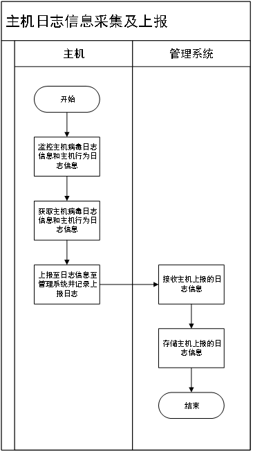

通过监控主机病毒日志信息和主机行为日志信息，采集并上报主机病毒日志信息和主机行为日志信息至关系系统，并本地记录采集上报日志，管理系统接收主机上报的日志信息后，继续后续的数据固化、过滤、关联、分析、溯源、呈现等流程。

2、 管理系统日志信息处理及呈现流程

管理系统接收主机上报的病毒日志和行为数据，本地持久化原始数据存储，针对无效数据进行数据过滤，针对网内主机上报的病毒威胁数据进行关联分析，实现网内主机病毒威胁数据可视化呈现。

3、 病毒威胁信息检测流程

可通过管理中心下发病毒威胁检测任务，入口点下发任务后，日志报表-任务日志开始记录，日志状态开启，管理中心任务队列加入任务信息，判断终端是否在线，如果终端不在线，则保留任务，当任务超过一定时长后（快速扫描30个心跳、全盘扫描60个心跳）判断任务是否超时，如果任务超时则在任务日志中记录超时状态，如果判断终端在线则终端随心跳获取任务。

获取任务后记录任务ID，并依据任务内容进行病毒威胁检测，终端执行扫描并持续上报扫描状态，扫描过程中上报状态为Ktaskdoing。

直至扫描结束后，终端会上报扫描任务结束状态，扫描结束后上报状态为Ktaskdone。

管理中心接收到终端上报信息后，对数据进行固化存储分析一些列流程，并记录相应日志。

4、 病毒威胁信息分析流程

病毒威胁信息分析流程包括：主机上报病毒日志和行为数据接收、本地化持久化原始数据存储、主机威胁信息及病毒信息关联、主机威胁信息及病毒信息分析、主机信息合并分析。

5、 病毒云查杀流程

终端首先扫描病毒文件，判断信任路径中是否有此病毒文件，如果有的话，则跳过此文件扫描，如果没有则继续后续扫描。

终端查看本地缓存文件，如果有缓存则依据缓存文件进行判断，如果没有缓存，则根据终端引擎进行判断。

判断终端引擎中是否有此记录，如果没有的话则进行云查，云查后查看自定义库并进行状态判定。

云查内容包括hash库、avl库、自定义库等内容，如果不能匹配则反馈文件属性并提交公有云查杀。

公有云查杀后，返回结果至终端，终端视结果反馈病毒信息。

6、 扫描/缓存插件流程

扫描前先经过扫描插件和缓存插件的判断流程。

扫描插件先对病毒文件是否信任、是否命中CAT或系统白缓存、文件大小是否合规进行判断。

然后缓存文件对文件路径缓存是否命中进行判断，当命中路径缓存时，走去误报流程，但未命中路径缓存时，走文件扫描流程。

7、 AVL扫描流程

AVL扫描先判断AVL是否检出病毒，如果检出病毒则判断文件属性为黑，如果未检出病毒则继续进行深度宏病毒检测。

深度宏检测判断是否命中，如果命中后则判断文件属性为黑，如果未命中则继续Webshell检测。

Webshell检测是否命中，如果命中后则判断文件属性为黑，如果未命中则属性为待定。

8、 前置云检测流程

如果AVL检测完成后结果仍为待定，则继续进行前置云检测流程。

首先判断是否符合云查格式，如果不符合则进入去误报流程，如果符合则继续投递云查。

云查判断为黑后，则判断是否为感染式病毒，然后进入云复查流程和去误报流程。

9、 去误报流程

需要通过缓存插件来判断是否命中去误报缓存，如果未命中则返回去误报前的结果，如果命中则返回去误报缓存结果。

10、 扫描信息回调流程

判断当前文件是否为子文件如果是子文件则判断子文件是否为黑，如果子文件为黑则标记父文件为黑。

如果判断不是子文件，即父文件不存在或不存在子文件的文件，则判断当前文件是否为黑，如果是的话，通知界面扫描结果。

###### **1.1.1.6.3.5** 敏感文件名检测取证模块

敏感文件识别和处理流程

通过管理平台设置检查规则设置，关键词设置、检查内容、检查范围、文件类型，然后将检测策略下发至终端，终端通过内嵌敏感文件检测引擎，结合索引内容指纹匹配、精确内容指纹匹配、文件聚类、文件自动打标等自动化敏感文件检测识别流程。支持多种文件格式深度解析还原，还原文件格式至少需要包含：doc、ppt、xls、docx、ppsx、xlsx、csv、rtf、pdf、mdb文件格式深度检测和取证，支持用户下载还原文件进行深度分析与取证。

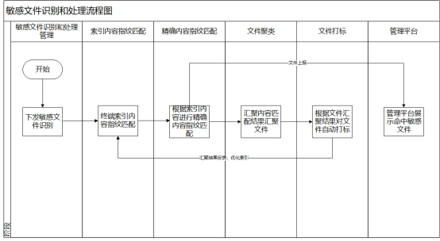 

Ÿ索引内容指纹匹配 

索引内容指纹又称索引数据匹配（IDM），是一种对于数据内容进行模糊匹配的算法技术。该技术主要用于检测各种非结构化储存的文档与样本文档的相似度。

通过对非结构化存储的数据采取分段指纹提取措施，可以实现对待检测文档内容的模糊匹配。文档经过数据预处理之后，获得与内容有关的标准化数据（统一的字符编码、内容标准等），之后采用窗口切割方式进行指纹计算。通过这样的方法可以获得一串压缩率 10%左右的内容指纹。对于待检测文档，使用上述的计算方式得到其指纹信息，然后根据自定义的相似度阈值对待检测文档的内容进行模糊匹配，如果达到设置的相似度阈值则认定该文档中的内容满足匹配条件，系统将根据设置采取后续动作。

Ÿ精确内容指纹匹配 

精确内容指纹又称精确数据匹配（EDM），是一种对于结构化数据（各类表格）进行精确匹配的算法技术。该技术主要用于匹配待检测数据是否命中结构化数据中某一行的算法技术。

通过对表格数据的行列进行预分析，计算出最能代表数据复杂性的列进行索引编制，并扩展到每行，以达到快速查询并匹配的效果。

Ÿ文件聚类

文件自动聚类是一种典型的无指导机器学习方法，用机器学习算法将不同文档分别映射到特征向量空间中，以实现将未分类文档集合自动分成若干类文档的目的。该模块利用中文分词、主题分析、特征降维去噪等技术，将不同文档分别映射到特征向量空间中。根据文档空间向量的聚集程度，将文档聚集成某些特定类别。在特征空间中，同类文档往往集聚在同一个空间区域中，从而实现将未分类文档集合自动分成若干类文档。

Ÿ文件打标

为存储于终端电脑或文件服务器的敏感文件，按照文件内容的类别和内容敏感程度，对每一个文件标注分类、分级标签。该标签将伴随文件整个生命周期，可在数据存储、使用、传输、销毁过程中，通过识别文件的分类、分级标签来对其进行展示和监管。

在敏感文件创建和存储时，根据数据来源的设备、应用、协议、网络地址、文件属性，文件内容等维度，创建数据的分类分级标签。分类分级标签存储于文件的扩展属性和文件系统扩展属性中。

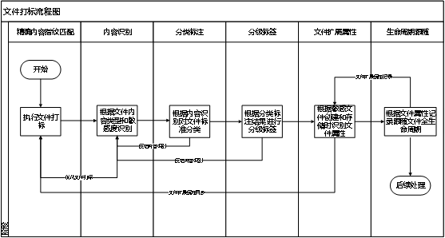

## **6.4** 系统接口设计

###### **1.1.1.6.4.1** 内部接口设计

**1.1.1.6.4.1.1** 暴力破解场景分析模块

1、口令爆破防护接口

（1）接口内容

口令爆破防护模内部接口包括终端口令爆破告警上报接口、口令爆破配置下发接口、异常登录事件上报接口等。

（2）接口方式

| 序号 | 接口名称                 | 接口描述                                         | 接口提供方               | 接口调用方               |
| ---- | ------------------------ | ------------------------------------------------ | ------------------------ | ------------------------ |
| 1    | E1,告警上报接口          | 该接口主要用于将终端产生的口令爆破告警上报服务端 | 口令爆破防护终端监控模块 | 口令爆破防护服务管理模块 |
| 2    | E2，异常登录事件上报接口 | 该接口主要用于将异常登录事件上报服务单           | 非法外联代理模块         | 非法外联服务管理模块     |
| 3    | E3，爆破防护配置下发接口 | 该接口主要将口令爆破防护配置策略下发终端         | 非法外联代理模块         | 非法外联服务管理模块     |

**1.1.1.6.4.1.2** 违规外联检测分析模块

（1）接口内容

违规外联检测内部接口包括流量特征上报、告警上报、策略配置、自学习模型数据同步等。

（2）接口设计

| 序号 | 接口名称               | 接口描述                                   | 接口提供方         | 接口调用方                   |
| ---- | ---------------------- | ------------------------------------------ | ------------------ | ---------------------------- |
| 1    | E1，流量特征上报接口   | 用于采集终端流量和上报终端流量特征数据     | 违规外联检测服务端 | 违规外联检测终端流量采集组件 |
| 2    | E2，告警上报接口       | 用于将终端产生的违规外联告警上报至管理中心 | 违规外联检测服务端 | 违规外联检测终端流量采集组件 |
| 3    | E3，策略配置接口       | 用于接收管理中心下发的策略配置             | 违规外联检测服务端 | 违规外联检测终端流量采集组件 |
| 4    | E4，自学习模型数据同步 | 用户从管理中心同步自学习模型输出的数据。   | 违规外联检测服务端 | 违规外联检测终端流量采集组件 |

 

**1.1.1.6.4.1.3** 访问策略隐患检测分析模块

\1) 接口内容

\2) 接口设计

| 序号 | 接口名称             | 接口描述                                       | 接口提供方         | 接口调用方                   |
| ---- | -------------------- | ---------------------------------------------- | ------------------ | ---------------------------- |
| 1    | E1，流量特征上报接口 | 用于采集终端流量和上报终端流量特征数据         | 外设使用管控服务端 | 外设使用管控终端流量采集组件 |
| 2    | E2，告警上报接口     | 用于将终端产生的外设使用管控告警上报至管理中心 | 外设使用管控服务端 | 外设使用管控终端流量采集组件 |
| 3    | E3，策略配置接口     | 用于接收管理中心下发的策略配置                 | 外设使用管控服务端 | 外设使用管控终端流量采集组件 |

1、违规流量原始告警获取接口

（1）接口内容

融合分析引擎支持使用违规流量告警模块提供的接口进行原始告警查询和原始告警获取。

（2）接口设计

| 序号 | 接口名称             | 接口描述                                     | 接口提供方       | 接口调用方   |
| ---- | -------------------- | -------------------------------------------- | ---------------- | ------------ |
| 1    | E1，告警查询接口     | 用于查询违规流量告警是否由于网关告警关联告警 | 违规流量告警模块 | 融合分析引擎 |
| 2    | E2，告警数据获取接口 | 获取关联告警的原始告警数据                   | 违规流量告警模块 | 融合分析引擎 |

**1.1.1.6.4.1.4** 病毒传播溯源模块

1、日志采集与上报接口

（1）接口内容

病毒传播溯源-终端数据采集与上报内部接口

病毒传播溯源-终端数据采集与上报接口主要功能由两部分组成：

1）终端行为日志采集与上报：

a)采集终端行为日志。

b)上报终端行为日志至管理系统。

2）终端病毒日志采集与上报：

a)采集终端病毒日志。

b)上报终端病毒日志至管理系统。

（2）接口方式

| 序号 | 接口名称         | 接口描述                                                     | 接口提供方               | 接口调用方                  |
| ---- | ---------------- | ------------------------------------------------------------ | ------------------------ | --------------------------- |
| 1    | E1,数据请求接口  | 该接口主要用于检测内容模板的请求接口调用。                   | 任务下发模块平台接口服务 | 任务下发模块管理平台web页面 |
| 2    | E2，数据推送接口 | 该接口主要用于检测任务的数据增、删、改、查操作推送至数据服务侧 | 任务下发模块平台接口服务 | 任务下发模块数据服务        |
| 3    | E3，数据管理接口 | 该接口主要用于响应平台接口服务从存储服务抽取对应数据         | 任务下发模块存储服务     | 任务下发模块数据服务        |
| 4    | E4，数据检索接口 | 该接口主要用于将数据库中的检测任务执行结果返回至API监听      | 任务下发模块数据服务     | 任务下发模块平台接口服务    |
| 5    | E5，数据响应接口 | 该接口主要用于检测任务的操作结果返回给前端调用               | 任务下发模块平台接口服务 | 任务下发模块管理平台web页面 |

2、病毒威胁信息概览接口

（1）接口内容

病毒传播溯源-病毒威胁信息概览内部接口

病毒传播溯源-病毒威胁信息概览内部接口主要功能由两部分组成：

1）威胁信息概览展示：

a)展示威胁概览信息，包括：文件名称、MD5、病毒名称、病毒类型、威胁程度、影响终端、最近发现时间、详情等。

2）威胁信息概览导出：

a)支持对勾选的威胁信息概览内容进行导出。

（2）接口方式

| 序号 | 接口名称         | 接口描述                                                     | 接口提供方               | 接口调用方                  |
| ---- | ---------------- | ------------------------------------------------------------ | ------------------------ | --------------------------- |
| 1    | E1,数据请求接口  | 该接口主要用于检测内容模板的请求接口调用。                   | 任务下发模块平台接口服务 | 任务下发模块管理平台web页面 |
| 2    | E2，数据推送接口 | 该接口主要用于检测任务的数据增、删、改、查操作推送至数据服务侧 | 任务下发模块平台接口服务 | 任务下发模块数据服务        |
| 3    | E3，数据管理接口 | 该接口主要用于响应平台接口服务从存储服务抽取对应数据         | 任务下发模块存储服务     | 任务下发模块数据服务        |
| 4    | E4，数据检索接口 | 该接口主要用于将数据库中的检测任务执行结果返回至API监听      | 任务下发模块数据服务     | 任务下发模块平台接口服务    |
| 5    | E5，数据响应接口 | 该接口主要用于检测任务的操作结果返回给前端调用               | 任务下发模块平台接口服务 | 任务下发模块管理平台web页面 |

3、病毒威胁分析与行为信息展示接口

（1）接口内容

病毒传播溯源-病毒威胁分析与行为信息展示接口主要是展示终端威胁行为数量和影响终端数量，可查看终端详细信息，由四部分组成：

1）病毒文件数量展示：

a)展示网内病毒文件数量

2）影响终端数量展示：

a)展示网内病毒文件数量

3）终端基础信息展示

a)展示终端基础信息

4）终端详细信息展示

a)展示终端详细信息

（2）接口方式

| 序号 | 接口名称         | 接口描述                                                     | 接口提供方               | 接口调用方                  |
| ---- | ---------------- | ------------------------------------------------------------ | ------------------------ | --------------------------- |
| 1    | E1,数据请求接口  | 该接口主要用于检测内容模板的请求接口调用。                   | 任务下发模块平台接口服务 | 任务下发模块管理平台web页面 |
| 2    | E2，数据推送接口 | 该接口主要用于检测任务的数据增、删、改、查操作推送至数据服务侧 | 任务下发模块平台接口服务 | 任务下发模块数据服务        |
| 3    | E3，数据管理接口 | 该接口主要用于响应平台接口服务从存储服务抽取对应数据         | 任务下发模块存储服务     | 任务下发模块数据服务        |
| 4    | E4，数据检索接口 | 该接口主要用于将数据库中的检测任务执行结果返回至API监听      | 任务下发模块数据服务     | 任务下发模块平台接口服务    |
| 5    | E5，数据响应接口 | 该接口主要用于检测任务的操作结果返回给前端调用               | 任务下发模块平台接口服务 | 任务下发模块管理平台web页面 |

4、病毒威胁传播路径可视化展示接口

（1）接口内容

病毒传播溯源-病毒威胁传播路径可视化接口描述了威胁传播路径、威胁传播方式等内容，由三部分组成：

1）病毒传播路径展示：

a)展示网内病毒文件的传播路径。

2）病毒传播途径展示：

a)展示网内病毒文件的传播途径。

3）终端病毒信息展示

a)展示终端的病毒信息。

（2）接口方式

| 序号 | 接口名称             | 接口描述                                                     | 接口提供方       | 接口调用方       |
| ---- | -------------------- | ------------------------------------------------------------ | ---------------- | ---------------- |
| 1    | E1,执行扫描接口      | 该接口主要用于接收到扫描任务后调用扫描任务接口               | 扫描任务执行     | 扫描任务接收     |
| 2    | E2，获取参数接口     | 该接口主要用于将检查项投递至系统API调用进行获取参数          | 系统API调用      | 扫描任务执行     |
| 3    | E3，返回参数接口     | 该接口主要用于系统API将参数返回给扫描任务执行，用于扫描任务判定检测结果 | 扫描任务执行     | 系统API调用      |
| 4    | E4，任务结果上报接口 | 该接口主要用于将扫描任务执行的检测结果上报至任务结果上报模块并推送至安全监管服务平台 | 任务结果上报模块 | 扫描任务执行     |
| 5    | E5，结果本地存储接口 | 该接口主要用于将扫描任务执行的结果本地存储                   | 本地存储模块     | 任务结果上报模块 |

5、病毒威胁信息检测接口

（1）接口内容

病毒传播溯源-病毒威胁信息检测接口描述了威胁检测流程，由四部分组成：

1）检测任务下发：

a)管理中心下发病毒检测任务。

b)回收检测任务结果

2）检测任务日志记录：

a)管理中心记录检测任务日志，并根据终端检测返回的结果实时更新检测日志内容。

b)记录检测任务状态

3）检测任务执行

a)执行病毒检测任务。

b)返回检测任务结果信息。

c)返回检测文件结果信息。

4）检测结果上报

a)检测结果上报及展示。

（2）接口方式

| 序号 | 接口名称             | 接口描述                                                     | 接口提供方       | 接口调用方       |
| ---- | -------------------- | ------------------------------------------------------------ | ---------------- | ---------------- |
| 1    | E1,执行任务下发接口  | 该接口主要用于接下发扫描任务后调用扫描任务接口               | 扫描任务执行     | 扫描任务下发     |
| 2    | E2，获取参数接口     | 该接口主要用于将检查项投递至系统API调用进行获取参数          | 系统API调用      | 扫描任务执行     |
| 3    | E3，返回参数接口     | 该接口主要用于系统API将参数返回给扫描任务执行，用于扫描任务判定检测结果 | 扫描任务执行     | 系统API调用      |
| 4    | E4，任务结果上报接口 | 该接口主要用于将扫描任务执行的检测结果上报至任务结果上报模块并推送至安全监管服务平台 | 任务结果上报模块 | 扫描任务执行     |
| 5    | E5，结果本地存储接口 | 该接口主要用于将扫描任务执行的结果本地存储                   | 本地存储模块     | 任务结果上报模块 |
| 6    | E6，任务日志接收接口 | 该接口主要用于将任务日志的结果本地存储                       | 日志接收模块     | 日志结果上报模块 |

**1.1.1.6.4.1.5** 敏感文件名检测取证模块

敏感文件名检测取证模块

（1）接口内容

敏感文件告警模块的内部接口包括敏感文件检测引擎接口，敏感文件检测规则与发现接口，敏感文件还原与取证接口，索引内容指纹匹配接口，精确内容指纹匹配接口，文件聚类接口，文件打标接口。

（2）接口方式

| 序号 | 接口名称                      | 接口描述                                 | 接口提供方           | 接口调用方           |
| ---- | ----------------------------- | ---------------------------------------- | -------------------- | -------------------- |
| 1    | E1,敏感文件检测规则与发现接口 | 该接口主要用于执行敏感文件检测规则和发现 | 敏感文件告警检测模块 | 敏感文件告警管理模块 |
| 2    | E2，敏感文件还原与取证接口    | 该接口主要用于敏感文件还原与取证         | 敏感文件告警检测模块 | 敏感文件告警管理模块 |
| 3    | E3，索引内容指纹匹配接口      | 该接口主要用于索引内容指纹匹配           | 敏感文件告警检测模块 | 敏感文件告警管理模块 |
| 4    | E4，精确内容指纹匹配接口      | 该接口主要用于精确内容指纹匹配           | 敏感文件告警检测模块 | 敏感文件告警管理模块 |
| 5    | E5，文件聚类接口              | 该接口主要用于文件聚类                   | 敏感文件告警检测模块 | 敏感文件告警管理模块 |
| 6    | E6，文件自动打标接口          | 该接口主要用于文件自动打标               | 敏感文件告警检测模块 | 敏感文件告警管理模块 |

###### **1.1.1.6.4.2** 外部接口设计

**1.1.1.6.4.2.1** 威胁告警模块接口

1、病毒传播溯源-威胁告警模块外部接口

（1）接口内容

病毒传播溯源-威胁告警模块外部接口主要功能由四部分组成：

1）数据采集上报模块数据：

a)数据上报接口。

b)任务下发接口。

2）数据存储模块：

a)数据录入接口。

b)数据获取接口。

3）数据分析模块：

a)数据上报接口。

b)结果返回接口。

4）基础支撑子系统：

a)数据推送接口。

b)数据同步接口。

（2）接口方式

| 序号 | 接口名称         | 接口描述                                                   | 接口提供方       | 接口调用方   |
| ---- | ---------------- | ---------------------------------------------------------- | ---------------- | ------------ |
| 1    | E1,数据同步接口  | 该接口主要用于同步数据内容接口                             | 病毒传播溯源模块 | 病毒告警     |
| 2    | E2,数据推送接口  | 该接口主要用于配置检查项内容。                             | 病毒传播溯源模块 | 病毒告警     |
| 3    | E3,数据录入接口  | 该接口主要用于将获取到的数据录入数据存储模块。             | 病毒传播溯源模块 | 病毒告警     |
| 4    | E4数据获取接口   | 该接口主要用于从数据存储模块获取存储数据。                 | 病毒传播溯源模块 | 病毒告警     |
| 5    | E5,数据上报接口  | 该接口主要用于将需要分析的数据上报给数据分析模块使用。     | 病毒传播溯源模块 | 病毒告警     |
| 6    | E6,结果返回接口  | 该接口主要用于获取数据分级模块进行数据分级后的结果。       | 病毒传播溯源模块 | 病毒告警     |
| 7    | E7,数据上报接口  | 该接口主要用于终端返回其所采集的数据内容。                 | 病毒传播溯源模块 | 终端病毒告警 |
| 8    | E8，任务下发模块 | 该接口主要用于病毒传播溯源模块向终端下发数据采集上报任务。 | 病毒传播溯源模块 | 病毒告警     |

（3）外部接口url展示

| 接口名称         | URL                                 | 方法 | 功能                                                       |
| ---------------- | ----------------------------------- | ---- | ---------------------------------------------------------- |
| E1,数据同步接口  | /risk-detection/risk/getruleknow    | POST | 该接口主要用于同步数据内容接口                             |
| E2,数据推送接口  | /risk-detection/risk/setedrrules    | POST | 该接口主要用于配置检查项内容。                             |
| E3,数据录入接口  | /risk-detection/risk/setStrategy    | POST | 该接口主要用于将获取到的数据录入数据存储模块。             |
| E4数据获取接口   | /risk-detection/risk/setscorerules  | POST | 该接口主要用于从数据存储模块获取存储数据。                 |
| E5,数据上报接口  | /risk-detection/risk/gettaskstatus  | POST | 该接口主要用于将需要分析的数据上报给数据分析模块使用。     |
| E6,结果返回接口  | /risk-detection/risk/detection_list | POST | 该接口主要用于获取数据分级模块进行数据分级后的结果。       |
| E7,数据上报接口  | /risk-detection/risk/gettasks       | POST | 该接口主要用于终端返回其所采集的数据内容。                 |
| E8，任务下发模块 | /risk-detection/risk/uploadinfo     | POST | 该接口主要用于病毒传播溯源模块向终端下发数据采集上报任务。 |

**1.1.1.6.4.2.2** 暴力破解场景分析模块

（1）接口内容

暴力破解场景分析模块接口会与资产管理子系统、数据存储子系统、数据采集子系统进行数据传输，因此需要设计相关接口。

（2）接口方式

| 序号 | 接口名称             | 接口描述                                         | 接口提供方     | 接口调用方       |
| ---- | -------------------- | ------------------------------------------------ | -------------- | ---------------- |
| 1    | E1,任务接收接口      | 该接口主要用于接收终端资产上报的口令爆破攻击数据 | 数据采集子系统 | 口令爆破防护模块 |
| 2    | E2，数据接收接口     | 该接口主要用于接收资产信息，和告警信息进行关联   | 资产管理子系统 | 口令爆破防护模块 |
| 3    | E3，评估数据查询接口 | 该接口用于通过数据存储子系统进行数据处理和存储   | 数据存数子系统 | 口令爆破防护模块 |

**1.1.1.6.4.2.3** 违规外联检测分析模块

（1） 接口内容

（2） 接口设计

| 序号 | 接口名称             | 接口描述                                       | 接口提供方     | 接口调用方       |
| ---- | -------------------- | ---------------------------------------------- | -------------- | ---------------- |
| 1    | E1,数据获取接口      | 用于从终端获取所需的数据内容                   | 数据采集子系统 | 违规外联检测模块 |
| 2    | E2，资产信息获取接口 | 该接口主要用于接收资产信息，和告警信息进行关联 | 资产管理子系统 | 违规外联检测模块 |
| 3    | E3，数据处理接口     | 对产生的告警和自学习模型数据进行存储           | 数据存数子系统 | 违规外联检测模块 |

 

**1.1.1.6.4.2.4** 访问控制策略隐患检测分析模块

\1) 接口内容

\2) 接口设计

| 序号 | 接口名称        | 接口描述                                                     | 接口提供方 | 接口调用方   |
| ---- | --------------- | ------------------------------------------------------------ | ---------- | ------------ |
| 1    | E1,数据支撑接口 | 该接口主要用于资产发现模块收集所有资产之后，将终端信息提供给外设使用管控功能调用，支撑终端信息数据。 | 资产发现   | 外设使用管控 |

**1.1.1.6.4.2.5** 敏感文件名检测取证模块

（1） 接口内容

（2） 接口设计

| 序号 | 接口名称                | 接口描述                   | 接口提供方     | 接口调用方                   |
| ---- | ----------------------- | -------------------------- | -------------- | ---------------------------- |
| 1    | E1,网关设备告警上报接口 | 获取网关设备访问控策略告警 | 网关设备       | 访问控制策略隐患检测分析模块 |
| 2    | E2，融合告警存储接口    | 将融合分析告警数据进行存储 | 数据存储子系统 | 访问控制策略隐患检测分析模块 |

敏感文件名检测取证模块

（1）接口内容

敏感文件告警模块接口会与资产管理子系统、数据存储子系统、数据采集子系统进行数据传输，因此需要设计相关接口。

（3） 接口方式

| 序号 | 接口名称             | 接口描述                                         | 接口提供方     | 接口调用方       |
| ---- | -------------------- | ------------------------------------------------ | -------------- | ---------------- |
| 1    | E1,任务接收接口      | 该接口主要用于接收终端资产上报的口令爆破攻击数据 | 数据采集子系统 | 敏感文件告警模块 |
| 2    | E2，数据接收接口     | 该接口主要用于接收资产信息，和告警信息进行关联   | 资产管理子系统 | 敏感文件告警模块 |
| 3    | E3，评估数据查询接口 | 该接口用于通过数据存储子系统进行数据处理和存储   | 数据存数子系统 | 敏感文件告警模块 |

## **6.5** 系统用户用例

###### **1.1.1.6.5.1** 病毒传播溯源模块

1、 威胁信息采集和上报模块用例图

威胁信息采集和上报模块包括：病毒日志监控、病毒日志采集、病毒日志上报、主机行为日志监控、主机行为日志采集、主机行为日志上报、本地采集上报日志记录等内容。

2、 病毒威胁信息概览模块用例图

病毒威胁信息概览模块包括：病毒威胁信息展示、病毒威胁信息筛选

病毒威胁信息导出、病毒威胁信息排序、病毒威胁详情查看等内容。

3、 病毒威胁分布与行为信息展示模块用例图

病毒威胁分布与行为展示信息模块包括：病毒数量统计、影响终端数量统计、单一终端威胁信息展示、终端感染方式展示、病毒处置装填展示、威胁详情展示等内容。

4、 病毒威胁传播路径可视化展示模块用例图

病毒威胁传播路径可视化展示模块包括：病毒传播路径展示、病毒传播方式展示、终端资产信息展示、终端威胁信息展示、病毒感染途径展示、可视化界面比例调整等内容。

5、 病毒威胁信息检测用例图

病毒威胁信息检测模块包括：任务下发、日志状态记录、任务队列、终端在线判断、心跳获取任务、任务超时判断、扫描状态获取、扫描状态上报、威胁信息检测、威胁结果上报等内容。

6、 病毒威胁信息分析用例图

病毒威胁信息分析模块包括：任病毒威胁信息接收、病毒威胁信息存储、病毒威胁信息去重、病毒威胁信息关联、病毒威胁分析、主机行为信息接收、主机行为信息存储、主机行为信息去重、主机行为信息关联、主机行为信息分析。

###### **1.1.1.6.5.2** 暴力破解场景分析模块

1、 口令爆破防护功能用例

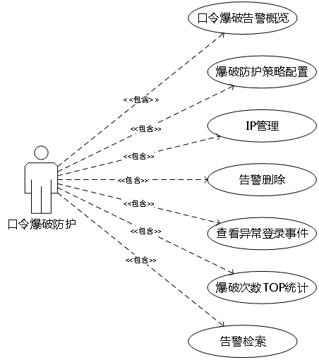

口令爆破防护功能包括口令爆破告警概览、爆破防护策略配置、IP管理、告警删除、查看异常登录事件、爆破次数TOP统计、告警检索。

2、 口令爆破告警详情用例

口令爆破告警详情功能包含基础信息展示、受攻击资产信息展示、攻击IP信息展示等三个功能，另外受攻击资产信息展示中包含信息搜索功能

3、 爆破防护策略配置用例

爆破防护策略配置功能包括爆破类型设置、爆破行为判定、处置设置、保存关闭

4、 IP管理功能用例

 

IP管理功能包括已封停IP管理和IP白名单，其中已封停IP管理包括封停IP列表、解除封停、IP搜索等功能，IP白名单包括IP白名单列表、IP添加、IP移除、IP搜索。

###### **1.1.1.6.5.3** 违规外联检测模块

1、 违规外联告警功能用例图

违规外联告警功能可分为系统告警和碰撞告警两类，系统告警包括原始告警概览、加入允许访问列表、告警碰撞、告警标记、告警删除、告警搜索。

2、 终端管理用例图

3、 自学习模型管理用例图

自学习模型管理功能包括终端基础信息展示、建模中网络访问地址、关联分析可访问地址、互联网访问权限、内网禁止访问地址。

###### **1.1.1.6.5.4** 访问控制策略隐患检测分析模块

普通用户的行为说明：

1.普通用户在企业终端接入外接设备，设备类型可包含按不限于：移动存储设备、智能卡、键盘、网卡、鼠标、蓝牙适配器、打印机、HUB、未识别设备等。

2.普通用户在企业终端接入外接设备且进行违规操作，违规操作一般包含但不限于：读写操作、拷贝操作等。

管理员的行为说明：

1.管理员可以进行设置防护策略模板行为：创建新的防护策略模板，编辑/查看已有防护策略模板，删除防护策略模板。

2.管理员可以将防护策略模板应用至终端：在终端列表中勾选单个或多个终端，选择设置防护策略模板，选择其中一个模板，即可将被选中的终端都设置为该模板。

3.管理员可以设置特定设备：在创建防护策略模板时，设备类型选择移动存储设备时，该设备类型的防护策略设置为仅特定设备时，需要管理员在外设违规告警页面查看中设置单个终端支持的特定外接设备。

4.管理员可以认证或删除外接设备：终端上报的外接设备，管理员可以对其进行审计，对外接设备进行认证或删除。

5.管理员可以对黑名单进行管控：管理员可以将违规设备加入至黑名单，也可以将黑名单中的设备移除。

6.管理员可以审计违规设备及违规行为：管理员可以在外设违规告警页面审计所有终端的上报的外接设备，包含设备类型、告警类型及处置方式等。

外设使用管控功能用例图：

外设管控功能包括外设管控策略接收、外设管控行为检测、外设违规接入行为处置、外设管控审计信息上报、告警信息展示。

###### **1.1.1.6.5.5** 敏感文件名检测取证模块

一、敏感文件名检测取证模块

1、敏感文件告警用例图

敏感文件告警模块包括：敏感文件列表（文件名称、文件格式、包含敏感词、终端名称、IP地址、发现时间）、下载文件、删除等内容。

2、 检测规则设置用例图

检查规则模块包括：检查规则设置、关键词检查、检查内容、检查范围、文件类型。

## **6.6** 暴力破解场景模块

###### **1.1.1.6.6.1** 模块概述

“口令爆破”是一攻击具手段，在web攻击中，一般会使用这种手段对应用系统的认证信息进行获取。其过程就是使用大量的认证信息在认证接口进行尝试登录，直到得到正确的结果。 为了提高效率，暴力破解一般会使用带有字典的工具来进行自动化操作。理论上来说，大多数系统都是可以被暴力破解的，只要攻击者有足够强大的计算能力和时间，所以断定一个系统是否存在暴力破解漏洞，其条件也不是绝对的。 通常所说的一个web应用系统存在暴力破解漏洞，一般是指该web应用系统没有采用或者采用了比较弱的认证安全策略，导致其被暴力破解的“可能性”变的比较高，终端中有多种常见服务可能遭受爆破攻击，例如远程桌面、数据服务、Web服务、FTP、SSH等。

暴力破解场景分析模块主要目标是实现对口令爆破攻击的感知、告警、处置和预防，并能对口令爆破事件进行详细记录和评估，判断终端是否存在被入侵迹象，基于安全管理人员以有效赋能。因此暴力破解场景分析模块应能做到以下几点：

1.口令爆破事件完整记录

针对口令爆破事件要能记录受害IP、爆破类型、爆破端口、爆破结果、爆破用户名、爆破次数、初始爆破时间、最近爆破时间等数据，其中针对受爆破用户账户，支持记录被爆破次数与爆破结果，针对疑似被成功爆破的账号进行风险提示，同时针对爆破后的异常登陆事件进行统计；

2.告警事件可查看

系统管理平台中应能查看到告警事件详情进行充分展示，并可展示攻击事件原始日志作为取证依据，另外应支持统计爆破次数受害TOP5，并且可支持基于时间周期对告警进行汇聚。

3.口令爆破可防护

针对口令爆破攻击应能做到可防护性，尤其是口令爆破攻击是短时间内威胁对抗十分剧烈的攻击行为，具有突发性、不固定、短时间会产生大量攻击行为等特征，如果依靠管理员蹲守的方式进行监控和处置是无法有效防御的，因此需要系统具有自动化的感知和防护能力。

4.防护策略可配置

不同终端的防护需求可能是不一样的，因此针对不同终端的防护要能是实现策略可配置，针对不同终端环境提供不同防护策略。

通过口令爆破防护可以实现对口令爆破事件的完整监控和自动化处置，保障终端系统的账号不被非法登录。

###### **1.1.1.6.6.2** 功能设计

口令爆破防护模块会采集终端流量信息，并支持对各类远程服务流量进行解析，通过对目标IP、登录行为、登录频次、登录结果、登录账号等对象的检测，系统集成口令爆破检测规则库，如果发现登录行为符合爆破行为特征，即可直接判定为当前终端遭受了口令爆破攻击，判定后会根据设置的规则确认是否执行防护动作，防护方式是基于分布式防火墙将攻击IP加入黑名单，拒绝该IP的所有网络连接请求。

系统会将告警事件相信信息在服务端进行存储和展示，通过管理提供的管理平台对告警事件详情、攻击结果、处置结果等进行查看和分析。

功能架构图

1)口令爆破告警概览

a)口令爆破告警概览列表显示告警概览信息，包括首次发现事件、最近攻击时间、爆破类型、受攻击终端、攻击IP、累计攻击次数、爆破结果、处置状态、操作

b)首次发现时间为首次感知到攻击的时间，最近攻击时间为感知到最近攻击到的时间，会随着攻击持续不断更新；

c)告警概览列表按照最近攻击时间由新到旧排序，如果检测到10分钟内没有再发生攻击则判断一次爆破攻击结束；

d)爆破类型为防护的服务类型，包括远程桌面、SSH远程管理、MySql数据库账号、Oracle数据库服务账号、MSSql数据服务账号、FTP账号等；

e)受攻击终端显示遭受攻击的终端总数；

f)攻击IP显示所有发现的攻击IP；

g)爆破结果包括未被入侵和已遭入侵，如果存在账号被爆破则为已遭入侵，反之为未被入侵；

h)处置状态记录系统是否对攻击IP进行处置，分为已处置、未处置；

i)点击操作列表“详情”显示告警详情。

2)口令爆破告警详情

a)显示每一个告警事件的详细信息，包括基础信息、受攻击资产信息、攻击IP；

b)基础信息包括爆破类型、受攻击终端、攻击IP、累计攻击次数、爆破结果、处置状态、最近攻击时间

c)受攻击资产信息包括受攻击账号名称、所在终端名称、IP地址、受攻击端口、受攻击账号被攻击次数、攻击结果（未被入侵、已遭入侵）；

d)受攻击资产信息支持基于账户名称、终端名称、IP地址；

e)攻击IP信息包括攻击IP、累计攻击次数、最近攻击时间、处置状态。

3)爆破防护策略

a)爆破类型设置需要进行口令爆破检测和防护的服务类型，包括远程桌面、SSH远程管理、MySql数据库账号、Oracle数据库服务账号、MSSql数据服务账号、FTP账号，开启后监控该服务，关闭后不再对该服务进行口令爆破防护；

b)爆破行为判定支持设置口令爆破行为命中规则，检测方式为同一IP N分钟内，连续登录失败达到N次；

c)处置设置包括永久封停攻击IP、临时封停IP N分钟、仅记录；

d)点击“保存”保存该规则，对全网终端生效。

4)IP管理

a)已封停IP显示已经封停的IP列表，包括IP地址、封停类型，支持对已经封停的IP解除封停；

b)IP白名单显示授信白名单。

5)支持对已上报告警进行删除；

6)查看异常登录事件

a)点击“查看异常登录事件”显示异常登录事件告警；

b)当账号疑似被爆破并且未修改密码时，所有未知IP登陆该账号行为将被判定为异常登录；

c)告警列表包括终端名称、IP地址、登录类型、登陆账号、登录IP地址、登录事件、登出时间；

d)支持基于终端名称、IP地址搜索告警。

###### **1.1.1.6.6.3** 技术实现

\1. 数据库ER图

 

\2. 数据库结构

 

| IEP_HOSTSERVICEMGR（服务信息表） |           |      |          |
| -------------------------------- | --------- | ---- | -------- |
| 字段名称                         | 类型      | 长度 | 描述     |
| uuid                             | text      | 0    | Uuid     |
| name                             | text      | 0    | 名称     |
| service                          | text      | 0    | 服务信息 |
| path                             | text      | 0    | 路径     |
| status                           | int4      | 32   | 状态     |
| class                            | int4      | 32   | 类别     |
| delay                            | bool      | 0    | 延迟     |
| triger                           | bool      | 0    | 触发     |
| systime                          | timestamp | 6    | 时间     |

 

| IEP_HOSTPORTMGR（端口信息表） |           |      |          |
| ----------------------------- | --------- | ---- | -------- |
| 字段名称                      | 类型      | 长度 | 描述     |
| uuid                          | text      | 0    | Uuid     |
| proc                          | text      | 0    | 进程路径 |
| type                          | int4      | 32   | 类型     |
| sip                           | text      | 0    | 源ip     |
| sport                         | int4      | 32   | 源端口   |
| dip                           | text      | 0    | 目的ip   |
| dport                         | int4      | 32   | 目的端口 |
| systime                       | timestamp | 6    | 时间     |

 

 

| IEP_HOSTRUN_CRONDMGR（进程信息表） |           |      |                  |
| ---------------------------------- | --------- | ---- | ---------------- |
| 字段名称                           | 类型      | 长度 | 描述             |
| uuid                               | text      | 0    | 客户端uuid       |
| crondnanme                         | text      | 0    | 计划启动项名称   |
| crondpath                          | text      | 0    | 计划启动项路径   |
| systime                            | timestamp | 6    | 上报时间         |
| crondusername                      | text      | 0    | 计划启动项用户名 |

 

| IEP_HOSTRUN_REGMGR（注册信息表） |           |      |            |
| -------------------------------- | --------- | ---- | ---------- |
| 字段名称                         | 类型      | 长度 | 描述       |
| uuid                             | text      | 0    | Uuid       |
| regpath                          | text      | 0    | 注册表路径 |
| regkey                           | text      | 0    | 注册表键值 |
| regvalue                         | text      | 0    | 注册表值   |
| systime                          | timestamp | 6    | 时间       |

## **6.7** 违规外联检测分析模块

###### **1.1.1.6.7.1** 模块概述

非法外联管理功能模版能够对终端违规连接外网行为进行有效管控，通过对终端网络连接情况进行实时探测，来检测内网主机是否存在非法连接外部网络的违规行为，并可对违规行为进行有效处置，主要实现以下功能：

1)系统内置常用检测目标，包括互联网、军综网、指挥专网等，同时支持对检测目标的自定义配置，可以满足用户在不同场景下的检测需求；

2)支持对违规行为告警规则进行自定义配置，包括告警频率、告警内容、提示间隔等。

3)能够对违规终端进行自动化处置，可实现自动断网、锁屏、禁用网卡等操作，有效阻止终端的外联行为。

4)系统提供对违规外联行为的审计，支持对审计信息进行查询、导出等操作，有效掌握全网违规行为动态。

5)可自定义配置策略的应用范围，针对不同的应用对象设置不同的管控策略。

6)能够将主机非法外联相关日志记录上报至外联监测平台，同时可接收外联监测平台的告警信息，根据告警内容进行相应的处置策略下发。

考虑到本次项目应用环境，本系统的违规外联检测应具有以下几点特性：

1)具有基于自学习的流量模型建立能力，系统应支持采集终端的历史流量以此建立流量的自学习模型，并更具模型可判断出终端的可访问网络流量列表、违规访问范围等；

2)具有实时的违规流量感知能力，通过对终端全流量的实时监控，实现对终端全流量的实时检测和对违规流量的及时发现；

3)具有违规告警可验证能力，支持关联终端联终端主机的非法外联告警，对违规外联行为进行二次关联，并产生违规外联告警。

###### **1.1.1.6.7.2** 功能设计

违规外联告警功能主要能力可分为三部分，首先是基于系统的终端流量采集组件对终端历史流量进行采集，通过一定时间周期流量采集积累足够的终端网络流量特征数据，然后基于系统集成到建模模型建立终端流量自学习模型，进而获得终端可访问网络集合，然后是实时监控终端流量，并且使用已完成的自学习建模模型对流量进行检测，如果发现流量为违规流量立即产生告警，最后是通过关联终端告警日志，对产生的违规流量进行碰撞验证，并对验证过的流量进行碰撞告警。

1)终端流量自学习模型管理

a)当系统发现新增终端后，既可以自动化开始进行终端流量的采集和自学习模型的建立

b)系统会通过终端流量采集组件对终端全流量进行实时采集，发现新增网络访问行为后，采集流量五元组信息、发起进程等，并上报管理中心进行校验；

c)如果发现的新增流量已经采集过，则不再进行重复上报；如果该流量信息是新增信息，则会形成日志并上报管理中心；

d)终端接受到某台终端新增流量特征后，会将该流量特征投递到其自学习模型中，用以进行分析，并更新终端模型数据；

e)支持查看当前终端已经创建的自学习模型数据，并且支持对已完成建模的终端进行重新建模。

2)自学习模型简单原理

a)针对终端的可访问网络/不可访问网络范围主要是通过对终端流量建立的自学习模型输出数据而判定的；

b)终端流量的自学习模型可最终输出终端的网络行为权限特征，包括是否可访问互联网、是否可访问互联网、是否可访问特定网段、可访问地址范围、禁止访问的地址访问等；

c)建模周期默认为14天，用户可基于后台配置进行调整；

d)建模过程中通过不断增加的终端流量特征数据更新模型输出的数据；

e)建模初始阶段是对终端资产进行识别，通过采集的资产配置信息、业务特征、位置、所在域、安全级别、使用人等信息对资产的网络行为特征有个初步结论；

f)建模过程中通过采集的终端流量特征和访问结果更新终端可直接访问地址；

g)通过终端可直接访问地址以及预先建立的关联分析模型组件，可以关联出终端允许访问的其他网络地址；

h)当自学习模型完成建模后，会将模型输出数据同步到终端，可将输出的数据在终端本地进行固化。

3)违规外联告警管理

a)系统在完成建模后，会对终端全流量进行实时检测，如果发现终端存在违规流量，会立即形成告警；

b)终端发现违规流量后会在本地产生违规告警日志，并将日志上报管理中心；

c)管理中心对告警日志进行处理和存储。

4)违规外联告警碰撞

a)系统接收到发现的原始违规外联告警数据后支持进行碰撞验证；

b)系统会关联终端内的流量告警日志，比对原始告警在关联终端内是否会有相同告警，如果有则判定为碰撞成功，会产生相应的碰撞告警。

c)支持对终端的碰撞告警进行多次碰撞校验，支持将终端告警和原始告警进行关联展示。

5)违规外联检测配置管理

a)支持开启或者关闭终端的违规外联检测；

b)关闭的终端其自学习模型保留。

###### **1.1.1.6.7.3** 技术实现

数据库ER图

 

数据库结构

| iep_firewall_ip_rule(非法外联ip管控规则表) |           |                        |
| ------------------------------------------ | --------- | ---------------------- |
| 字段名                                     | 字段类型  | 字段解释               |
| id                                         | int8      | 自增主键               |
| company_id                                 | int4      | 分级ID                 |
| create_time                                | timestamp | 创建时间               |
| owner_strategy                             | text      | 归属IP策略id           |
| rule_id                                    | text      | 防火墙规则ID           |
| rule_name                                  | text      | 防火墙规则名称         |
| rule_direction                             | int4      | 规则方向               |
| protocol                                   | int4      | 协议                   |
| operate                                    | int4      | 操作1=允许、2=阻止     |
| rule_state                                 | int4      | 启用状态1=启用、2=停用 |
| remote_ip                                  | int4      | IP段范围               |
| remote_start_ip                            | text      | IP起始范围(包含自身)   |
| remote_end_ip                              | text      | IP结束范围(包含自身)   |
| local_ip                                   | int4      | IP段范围               |
| local_start_ip                             | text      | IP起始范围             |
| local_end_ip                               | text      | IP结束范围             |
| remote_port                                | int4      | 远端端口范围           |
| remote_start_port                          | int4      | 端口起始               |
| remote_end_port                            | int4      | 端口结束               |
| local_port                                 | int4      | 本机端口范围           |
| local_start_port                           | int4      | 端口起始               |
| local_end_port                             | int4      | 端口结束               |
| icmp_set                                   | int4      | 类型                   |
| icmp_type                                  | int4      | icmp类型               |
| icmp_code                                  | int4      | icmp代码               |

 

| iep_firewall_ip_strategy(违规外联检测规则表) |           |                      |
| -------------------------------------------- | --------- | -------------------- |
| 字段名                                       | 字段类型  | 字段解释             |
| id                                           | int8      | 自增主键             |
| company_id                                   | int4      | 分级ID               |
| strategy_id                                  | text      | 管控协议ID           |
| default_flag                                 | int4      | 是否为默认策略       |
| strategy_type                                | int4      | 策略类型             |
| create_time                                  | timestamp | 创建时间             |
| strategy_name                                | text      | 策略名称             |
| inbound_flow                                 | int4      | 入站流量默认处置方式 |
| outbound_flow                                | int4      | 出站流量默认处置方式 |

 

| iep_firewall_blackwhitelist(非法外联黑白名单表) |           |            |
| ----------------------------------------------- | --------- | ---------- |
| 字段名                                          | 字段类型  | 字段解释   |
| id                                              | int8      | 自增主键   |
| company_id                                      | int4      | 分级ID     |
| create_time                                     | timestamp | 创建时间   |
| owner_strategy                                  | text      | 归属策略   |
| rule_id                                         | text      | 规则ID     |
| ip_type                                         | int4      | IP段范围   |
| start_ip                                        | text      | IP起始范围 |
| end_ip                                          | text      | IP结束范围 |
| port_type                                       | int4      | 端口范围   |
| start_port                                      | int4      | 端口起始   |
| end_port                                        | int4      | 端口结束   |

 

| iep_firewall_routine_strategy(非法外联基础规则表) |           |                              |
| ------------------------------------------------- | --------- | ---------------------------- |
| 字段名                                            | 字段类型  | 字段解释                     |
| id                                                | int8      | 自增主键                     |
| company_id                                        | int4      | 分级ID                       |
| strategy_id                                       | text      | 管控策略ID                   |
| default_flag                                      | int4      | 是否为默认策略               |
| create_time                                       | timestamp | 创建时间                     |
| strategy_name                                     | text      | 策略名称                     |
| boot_start                                        | int4      | 开机是否启动                 |
| app_net                                           | int4      | 程序联网默认处置方式         |
| auto_traffic                                      | int4      | 自动放行具有合法数字签名程序 |
| outreach_check                                    | int4      | 是否开启互联网外联检测       |
| outreach_url                                      | text      | 检测IP地址                   |
| outreach_interval                                 | int4      | 检测IP间隔                   |
| ip_restrict                                       | int4      | 限制终端修改IP管控规则       |
| routine_restrict                                  | int4      | 限制终端修改系统设置         |
| brute_force                                       | int4      | 开启暴力破解防护             |
| brute_time                                        | int4      | 暴力破解时间间隔单位/秒      |
| brute_count                                       | int4      | 暴力破解到达次数             |
| lock_time                                         | int4      | 暴力破解IP锁定时间单位/秒    |

## **6.8** 访问控制策略隐患检测分析模块

### **6.8.1** 访问控制策略隐患监测分析模块

**1.1.1.6.8.1.1** 模块概述

网关设备基于预设的访问控制策略，会对终端违规流量或者检测到的威胁流量产生相应告警，而系统针对终端产生的违规流量也会产生告警，两个系统的告警不仅存在关联，而且互相之间还可以进行补充，如果将两个系统的告警进行融合分析，将可以取得更好的违规流量分析与告警效果，包括：

1.减少管理员告警处置的人工成本

网关系统和本系统都会产生违规流量告警，如果安全管理人员需要需要分别在两个平台处理告警，将会处理大量相似甚至相同的告警，会浪费很多人工成本，如果将两个系统平台的告警相融合，管理员只需要在一个平台中就可以对违规流量进行处理；

2.丰富告警内容提升告警处置质量

如果将网关设备和本系统的违规流量告警相融合形成一个整体的告警，将有关联的告警融合成为一个包含要素更加丰富、事件画像更为完整的告警数据，通过告警融合可以让管理人员对违规流量事件有个更加充分的掌握。

访问控制策略隐患监测分析模块主要用来获取网关设备访问控制策略的违规告警，并且和本系统原始的违规流量告警进行比较，判断是否有关联告警，如果存在则进行关联分析，并将分析结果进行存储和呈现。

本系统通过syslog方式获取网关设备访问控制策略的违规告警，并且支持收集多个网关设备的告警数据，同时还支持设置接收规则，减少无效告警的上报以避免浪费资源。

在融合分析方面，系统集成有违规流量融合分析引擎，可以将输入的网关告警与本地的违规流量告警进行融合，包括同源分析、关联分析、威胁情报分析等，通过分析输出有关联告警的融合后告警。

系统对融合后告警会进行单独的展示与记录，并且会展示融合分析告警和原始告警的关联。

**1.1.1.6.8.1.2** 功能设计

访问控制策略隐患监测分析模块包含子功能包括网关网关设备告警采集与处理、违规流量告警关联性检测、违规流量告警关联性检测、违规流量告警融合分析、融合分析告警管理、融合分析告警存储等功能。

1.网关设备告警采集与处理

a)网关设备访问控制策略的违规告警可通过syslog方式上报给为违规行为发现子系统；

b)支持设置上报的IP地址和上报规则；

c)访问控制策略隐患监测分析模块接收到上报的违规告警后，会将告警存储到数据库中，用以进行后去的融合分析。

2.违规流量告警关联性检测

a)当收到上报的网关设备访问控制策略的违规告警后，会在本地已产生的违规流量告警进行比对，检测是否有关联的、可进行融合分析的告警；、

b)关联检测主要是通过对资产身份、访问地址、访问时间、流量特征等进行比对，检测是否有关联告警，并提取本地已产生的违规流量告警详情；

c)发现存在关联的违规流量告警后，会将上报的网关设备访问控制策略的违规告警和本地的违规流量告警投入到融合分析引擎中

3.违规流量告警融合分析

a)将投入到引擎中的告警进行分析，并可输出分析结果；

b)分析模式包括关联分析、同源分析、情报分析等，将两个告警进行融合，形成一条更加丰富完整的告警；

c)违规流量融合分析引擎可将融合后的告警进行输出。

4.融合分析告警管理

a)支持对融合分析的告警进行展示

b)支持检索融合分析后的告警

c)支持导出融合分析后的告警

5.融合分析告警存储

a)支持对融合分析后生成的告警进行存储

**1.1.1.6.8.1.3** 技术实现

\1. 数据库ER图

 

\2. 数据库结构

| IEP_HOSTSERVICEMGR（服务信息表） |           |          |          |
| -------------------------------- | --------- | -------- | -------- |
| 字段名称                         | **类型**  | **长度** | **描述** |
| uuid                             | text      | 0        | Uuid     |
| name                             | text      | 0        | 名称     |
| service                          | text      | 0        | 服务信息 |
| path                             | text      | 0        | 路径     |
| status                           | int4      | 32       | 状态     |
| class                            | int4      | 32       | 类别     |
| delay                            | bool      | 0        | 延迟     |
| triger                           | bool      | 0        | 触发     |
| systime                          | timestamp | 6        | 时间     |

 

| IEP_HOSTPORTMGR（端口信息表） |           |          |          |
| ----------------------------- | --------- | -------- | -------- |
| 字段名称                      | **类型**  | **长度** | **描述** |
| uuid                          | text      | 0        | Uuid     |
| proc                          | text      | 0        | 进程路径 |
| type                          | int4      | 32       | 类型     |
| sip                           | text      | 0        | 源ip     |
| sport                         | int4      | 32       | 源端口   |
| dip                           | text      | 0        | 目的ip   |
| dport                         | int4      | 32       | 目的端口 |
| systime                       | timestamp | 6        | 时间     |

 

 

| IEP_HOSTRUN_CRONDMGR（进程信息表） |           |          |                  |
| ---------------------------------- | --------- | -------- | ---------------- |
| 字段名称                           | **类型**  | **长度** | **描述**         |
| uuid                               | text      | 0        | 客户端uuid       |
| crondnanme                         | text      | 0        | 计划启动项名称   |
| crondpath                          | text      | 0        | 计划启动项路径   |
| systime                            | timestamp | 6        | 上报时间         |
| crondusername                      | text      | 0        | 计划启动项用户名 |

### **6.8.2** 主机外设违规利用分析模块

### **6.8.3** 模块概述

如今各种外接设备给我们的工作带来了极大的便利，例如智能手机、网卡、U盘、移动硬盘等；但这些外接设备接入到企业终端时，不仅增加了管理的不便，也会加大企业信息泄露的风险。

外接设备接入公司电脑，可能存在的安全隐患：

1.公司重要的文档通过USB存储设备拷贝带走；

2.使用网卡终端没有安全防护措施的链路访问互联网，导致终端成为病毒渗透和木马攻击企业内网的目标；

3.个人存储设备内外混换使用，容易致使核心文档泄密不便于统一管理；

4.存储有公司资料信息的存储设备丢失，或者存储设备被格式化，也容易导致核心文档丢失或受损；

5.移动设备极易成为病毒/恶意软件的跳板，未经授权的设备接入企业终端，容易给企业终端系统带来威胁，窃取公司机密信息。

如今市面上的外接设备正在不断推陈出新，功能也越来越丰富，面对各种各样的外接设备，如何管控外接设备的同时使员工便捷的使用是目前各企业都需要面临的问题。因此系统针对该问题给各企业提供了外接设备的管理解决方案。可以针对U盘、打印机、刻录机、无线网卡、蓝牙设备、串口设备等进行管理、启用管控，可记录违规使用记录并告警。外接设备的滥用容易给企业的信息安全带来隐患，只有对这些设备的使用进行规范管理，才能更好保证外接设备在企业中的安全使用。

涉密信息系统存储着大量涉及国家秘密的信息,一旦泄露就会对国家造成特别严重的损害,因此国家制订了相关的法律及制度,禁止涉密网络与公共信息网络、互联网等等外部网络连接,采取物理隔离的方式进行控制,从而减小来自外部网络的安全威胁。但内部网络中同样存在很多威胁,其中违规外联监控作为重点的防护措施,一旦被破坏,会造成极大的安全风险甚至失泄密事件,因此需对现有涉密信息系统中的安全控制措施进行改造并加以优化,确保系统中的信息安全可控。

涉密主机监控系统主要是主机外设违规利用分析模块功能对涉密内网内的计算机是否违规外联和接入非授权外接设备进行监控，对涉密计算机的相关信息进行集中管理。在涉密主机安装了本系统客户端后，无论在何时何地，涉密计算机通过哪种方式接入互联网，都能迅速将本计算机的内网IP地址，MAC地址，所属部门，负责人，联系方式等信息发送到预警管理中心，同时根据预置的阻断策略，在插入未授权移动存储设备后，能立刻禁用USB口，防止涉密信息外泄。客户端在涉密计算机中能够稳定静默运行,不会被用户发现或卸载，报警时与预警中心的通信不会被防火墙发现。预警中心收到客户端的报警后，立刻发送告警信息，网络管理员能够根据告警信息来处置违规主机。

### **6.8.4** 功能设计

体功能介绍：

外设使用管控通过三个子模块实现对外接设备的管理，对违规外接设备的告警，为终端设置防护策略。

外设违规告警模块，通过对所有违规外接设备的记录，可以对管理员提供直观的展示，有助于管理员快速审计所有违规外接设备，并可查看处置结果。

终端管理模块以终端的维度展示其当前正在使用的防护策略，并支持在该模块对防护策略模板进行管理，同时也支持对特定设备进行管理和维护。

外设管理模块，针对外接设备进行的管理与维护，支持对外接设备的认证和删除，支持对外接设备加入黑名单，支持对黑名单的管理，可查看黑名单列表，可移除黑名单。

 

应用场景分析：

1.公司重要的文档通过USB存储设备拷贝带走；

员工或外访人员或恶意盗取人员携带便携存储设备，通过USB连接企业内部设备，读写企业重要的文档资源，会导致企业资源泄露，降低企业竞争力，直接影响企业收益。

外设使用管控模块可以对外接设备进行认证，凡是被认证过的设备方可接入企业终端，当未被认证的外接设备接入企业终端时，会别检测为违规外联，产生告警提示管理员要主要该违规设备。外设使用管控模块还可以对认证设备进行操作权限设定，更加规范被认证的外联设备使用。

2.使用网卡终端没有安全防护措施的链路访问互联网，导致终端成为病毒渗透和木马攻击企业内网的目标；

使用外接类型的网卡，重新搭建防护互联网的链路，使得企业内部设备资产暴露在网络平台中，成为病毒和木马等攻击对象。一旦设备被攻击，病毒或木马等威胁会以当前被攻击设备为跳板，横向扩散至企业内部其他资产上，再通过横向扩散及纵向扩散相结合的模式，覆盖整个企业内部重要资产，盗取企业重要信息，或对企业进行勒索，或对盗取的重要资源进行暴露，都会直接对企业经营产生不可逆的影响。

外设使用管控模块支持禁用或启用外接网卡，根据企业自身需要，对外接网卡进行自定义开启或关闭。关闭外接网卡使用时，当设备接入了外接网卡就会进行告警，管理员可以提高警惕，进行及时干预。

3.个人存储设备内外混换使用，容易致使核心文档泄密不便于统一管理；

员工的私人存储设备通常在公司内部及公司外部同步使用，存储内部信息的设备一旦在非公司内的环境使用时，都存在被病毒或木马攻击的风险，还有可能被其他恶意软件读写，直接窃取公司重要资料。若员工私人存储设备在外部使用之后，被种下了恶意病毒或木马，在员工将该存储设备插入公司内部设备时， 病毒和木马就等于在无阻碍的环境下肆意传播，一样会造成公司重要资源泄露，为公司经营产生不可逆的影响。

外设使用管控模块支持对单个外接设备进行认证，即便是私人设备，也可以进行认证，用户在终端上使用了私人设备之后，系统识别到该设备就会显示在外设管理里，管理员只需要对该设备进行认证或者加入黑名单，即可实现对该设备的管控。

4.存储有公司资料信息的存储设备丢失，或者存储设备被格式化，也容易导致核心文档丢失或受损；

公司有因业务需要的时候，会将重要资源存储在移动便携设备中，但是可能由于各种原因会出现遗失的情况，移动设备的遗失直接确认为重要资源遗失，这对企业来讲是最致命的错误。还存在存有重要数据的设备被误操作，或者格式化，这代表重要数据资源从根本上消失，导致企业核心文档丢失或受损。

外设使用管控模块可最重要的文件存储设备进行认证，支持对重要文件存储设备进行识别。确认存储重要文件的设备后管理员需要提高警惕，避免丢失，造成损失。

5.移动设备极易成为病毒/恶意软件的跳板，未经授权的设备接入企业终端，容易给企业终端系统带来威胁，窃取公司机密信息。

企业对外接设备未做授权管控，使得外部设备可以随意接入企业终端，使得病毒与木马有可乘之机，在企业内部设备上横向传播，纵向覆盖，最终全面掌握企业内部所有重要数据，给企业经营带来重大威胁。

外设使用管控模块支持策略模板定制，支持对外接设备的操作权限设置，可以设置为读写或仅支持只读，同时也支持对设备类型的防护设置，更全面的限制了外接设备的接入及访问，使得病毒及木马无法扩散。

功能拆解说明：

外设使用管理模块通过外设违规告警、终端管理及外设管理三个子模块组成：

1.外设违规告警：

展示所有违规外设的使用记录，支持将外接设备加入黑名单或删除操作。

2.终端管理：

支持设置防护策略模板管理，支持以终端的维度进行防护策略模板的设置。

3.外设管理：

支持以外接设备的维度进行管理，支持认证设备、删除设备、加入黑名单等操作。

外设违规告警：

1.判断终端违规设备接入并进行告警，告警类型为：接入违规类型外设、接入黑名单设备、非法拷贝文件、接入未授权设备。检测到违规外部设备接入并进行违规操作时进行记录并告警。可通过列表查看所有告警记录，及详情。

2.设备加入黑名单：

根据列表展示的数据，管理员可进行审计，对违规设备进行加入黑名单操作，支持对违规设备可查看设备详情，同时支持将违规设备加入黑名单操作。

3.删除设备：

根据列表展示的数据，管理员可进行审计，对违规设备进行删除操作。

4.查询

根据列表展示的数据，管理员可进行审计，支持通过终端名称、IP地址、设备名称、设备UID进行查找，理论上是输入的内容越精确，查找的结果越精确。

 

终端管理：

1.防护策略模板管理：

支持对防护策略模板进行管理，支持新增、删除、编辑、查看防护策略模板。

2.防护策略设置：

以终端的维度进行策略模板的设置。

3.可使用移动设备查看：

通过列表展示内容，进行审计，查看可使用的移动设备，可在该基础上添加或移除特定设备。

4.添加/移除特定设备

查看可使用的移动存储设备，并支持添加或移除特定设备。

外设管理：

1.可用设备：

以设备的维度进行展示，对可用设备进行维护，支持认证设备、删除设备、加入黑名单操作。

2.黑名单设备：

对黑名单进行管理，支持将黑名单的设备移除黑名单。

实现对终端常见的数据通道如“红外、蓝牙、软驱、串行接口、并行接口、1394接口、PCMCIA接口、外联internet设备、自建Wi-Fi热点、无线以太网卡、智能设备连接、光驱等”进行灵活的、严格的、有效的管控，实时发现违规操作进行通知并阻止或审计。除此之外，通过设置外设管控策略还可以灵活的配置策略周期性的检测终端其它行为如“互联网是否连通、新接入的外设、是否同时使用两个以上网络端口（只对TCP通信起作用）、执行未注册U盘上的应用程序、执行已注册U盘上的应用程序、其它设备连接情况”，以及对USB大容量存储设备的管控。

告警规则设置

系统提供四种内置信息提示方案，可按不同外联设备类型设置不同的提示内容。

(1)不弹出提示信息：终端触发审计或管控策略时，不弹出提示信息。

(2)弹出自定义提示信息：终端触发审计或管控策略时，弹出该策略对应的自定义提示信息。

(3)弹出缺省提示信息：终端触发审计或管控策略时，弹出系统缺省提示信息。

(4)弹出本策略全局提示信息：终端触发审计或管控策略时，提示告警规则配置的全局提示信息。

审计行为设置

系统提供多种审计行为，可根据实际需求选择合适的审计方式。

(1)审计：触发后，终端仍可连接外联设备，同时上传审计数据至安全服务监管平台；

(2)禁用并审计：触发后，禁用已连接的外部连接设备，并上传审计数据至安全服务监管平台。

应用范围配置模块

系统支持按设备或用户进行应用范围的配置，提供使用应用范围模版或手动添加两种配置方式。

(1)按终端：终端设备名称、终端设备IP、mac地址、网段、设备组、终端设备；

(2)按外设：外设名称、外设类型、处置类型；

外设连接信息展示

实时展示触发外设管控策略的终端行为信息。

(1)支持按列内信息进行数据筛选；

(2)支持外设连接信息的高级查询，包括按处置动作、访问方式、外联方式、发生时间等做多条件关联查询；

(3)支持对展示信息的导出与删除操作。

外设管控策略接收

终端安全代理支持从安全监管服务平台同步外设管控策略，策略同步至本地后，可减少终端安全代理与安全监管服务的网络通信数据量，同时在断网环境下，终端依然可以执行非法外联检测。

安全监管服务平台在外设管控策略发生新增、编辑、删除等操作后，会实时下发至应用范围内的终端安全代理，终端安全代理将使用平台下发的策略替换掉本地原始策略，保证终端安全代理内的策略与安全监管服务平台的一致性。

外设管控行为检测

当外设管控行为检测规则下载完成后，终端安全代理将按照策略内容对终端连接外部行为进行实时检测。

外设违规接入行为处置

当终端安全代理发现终端存在违规外设接入行为时，可按照策略配置的处置动作进行处置，例如禁用、仅在有线网卡工作时禁用、仅允许连接指定wifi等。

外设管控审计信息上报

针对终端外设违规接入行为，终端安全代理将对外设接入行为审计信息进行上报，上报信息包括终端名称、用户名、IP、MAC、发生时间、外连方式、组织动作、具体连接设备描述。

内网监控模块

此模块运行在服务器上用来与客户端进行通信,并将客户端上报的信息经过处理后存储在数据库中。内网监控服务器需要开放一个固定端口(如80端口)，等客户端主动连接。每当客户端发起连接时，服务器就创建新的线程处理此连接，然后该端口继续等待其他客户端发起连接，用多线程处理的方式，可以避免由于某个客户端独占与服务端通信的通道，而导致违规外联相关信息，不能及时上报的情况发生。

内网监控中心功能模块如图所示:

内网设备管理

涉密内网中的主机设备和网络设备是系统管理的主要内容。涉密内网中的计算机可以分为两种类型:

一是涉密计算机安装客户端，管理员可以通过管理中心与客户端进行信息交互来掌握和了解涉密计算机的运行情况，这种类型的涉密计算机是可以控制的;

二是涉密计算机是没有安装客户端程序的，这类型的涉密计算机是不可控的，此时管理中心将显示其需要安装客户端的信息，在该设备安装了客户端之后，将其列为可控设备，并记录到数据库中，如果没有安装客户端，则将其列为非法接入设备，然后通过非法接入控制的策略将其从内网隔离。内网设备管理的流程如图所示。

 

违规外联监控管理部分，通过启用内网扫描程序来判断涉密内网中的计算机的状态，这是管理中心首次启动后得到的有关涉密内网的初步基础信息，虽然这些信息只包括被监控主机的IP地址和MAC地址等基本信息，但是却构成了涉密内网的可控设备列表，可以通过ARP探测和TCP探测相结合的方式来对内网设备进行扫描，这样可以保证有关涉密内网的初步信息的准确性。

1.涉密计算机信息管理

涉密内网中的主机设备的基本信息一般都会包括以下内容:计算机ID，计算机设备名称、计算机所安装的客户端版本、计算机操作系统类型、IP 地址、MAC地址、网关、计算机所属部门、计算机负责人和负责人联系电话。对于一个大型的涉密内网来说，内网中的计算机的基本硬件信息管理是十分重要的，可以帮助网络安全管理员，迅速地定位某台计算机的位置，并且在违规外联行为发生后为告警信息提供了比较详细的主机硬件资料。

2.违规外联安全策略管理

安全策略管理是内网监控服务器的重要功能之一，如果有了安全策略作为指导，客户端监控程序将会很好的控制被监控的计算机。为了给安全管理员提供更方便的管理手段，系统给管理员提供了创建及批量下发安全策略的功能。另外，如果管理员可以通过安全策略管理功能来查看它正在使用的策略，使得管理员即便是忘了对某台计算机下发过什么安全策略的话，也能在这个功能里查看到。除此之外，如果某计算机重装了操作系统后，IP地址没有发生变化，在安装完客户端监控程序之后，系统会在它重装操作系统之前所使用过的安全监控策略自动的下发给它，这样，管理员就不用反复的在系统中找到这台计算机，并再对其重新下发策略了。管理员对被监控计算机进行违规外联安全策略管理的处理流程如图所示。

 

3.安全事件管理

事件信息，是指系统本身运行时产生的事件和设备运行按照系统给其下发的安全策略后产生的安全事件，这样管理员可以对涉密内网里所有发生的安全事件有一个整体的了解，有利于管理员通过对事件的审计了解内网的所有非法外联事件、非法外联嫌疑事件、非法接入事件等安全事件提供了很好的事实根据。比如对于主机来说，假如系统安全管理员之前对某台主机下发过非法外联策略，那么如果这台主机发生了违规外联行为，那么，主机客户端监控系统就会将这个行为作为一条安全事件，上报给管理中心，管理中心接收到这条事件后，对其进行入库操作，管理员可以通过页面控制台看到这条事件的具体信息，事件信息一般包含这条事件发生的时间、这条事件所属的设备类型、事件的安全威胁等级、设备的IP 地址、MAC地址以及事件的简要描述。

 

户端升级管理

客户端的升级管理，是及时更新被监控计算机配置信息和程序版本的重要途径，在客户端管理升级的过程中，安全管理员首先将需要更新的客户端升级包上传到内网管理中心中，然后管理中心将对本地更新后的程序版本与客户端的程序版本进行比较，如果版本信息不相同，则管理中心将该客户端需要升级的版本升级包发送给客户端，客户端在收到版本升级包后执行相应的升级操作，在客户端程序升级完成后，重启客户端后继续运行。

在进行客户端升级时，管理中心程序会将升级指令以及升级信息，以客户端程序可以识别的方式发送给客户端，然后客户端会检查这个升级包的版本号是否高于自己当前的版本号，检查完成将检查结果返回给管理中心程序，如果管理中心发现客户端程序需要升级，再把升级文件下发给客户端程序，并将升级结果存入系统日志,客户端升级的流程如图所示:

 

5.告警管理部分

告警管理中心运行在外网中具有固定外网IP或者固定域名的主机上,开放一个固定端口，接收客户端违规外联时发送的告警信息。告警中心具有并发连接的性能，可以同时接收多个客户端发送的告警信息。告警中心收到客户端告警后，会立刻将告警信息上报到管理中心，提醒安全管理员及时处理违规计算机。告警管理中心具有完善的安全保密策略,只存储违规外联计算机的唯一序列号，与存放涉密计算机具体信息的内网管理中心物理隔离,并采用硬件加密措施，确保客户端监控程序与告警管理中心之间数据通讯的安全性;支持多个外网监视服务器，满足多级管理需求;支持跨路出、多网段的检测;支持日志导出和存储。

 

客户端部分

客户端模块是整个违规外联监控系统的核心模块，涉密内网中的每台计算机都需要安装客户端，用来监控涉密计算机的违规外联行为，并且将报告的行为信息上传到管理中心。如果发现违规外联的行为，还需要及时进行阻断，客户端还应该与内网监控服务器保持通信，以便更新配置信息和程序版本。另外，客户端监控程序必须是隐藏的运行于被监控的计算机上，不能被计算机的用户发现，即使被发现后也应该无法被终止或删除。因此，客户端模块还应该具备自身保护和防火墙突破等功能。

涉密计算机违规外联监控系统，如果要对涉密内网计算机进行监控，必须要先在被监控的计算机上安装违规外联监控客户端，同时在客户端的配置文件中，设置内网监控服务器和外网预警管理中心的IP地址，否则无法对被监控计算机进行违规外联行为监控。在被监控计算机安装了客户端后，可以从内网监控服务器的控制台页面上看到可控计算机列表，尚未安装违规外联监控客户端的涉密计算机，默认在非法接入设备列表中。在安装完客户端后，安全管理员要对被监控计算机下发安全策略，客户端在接收到安全策略后开始进行违规外联行为的监控工作。在客户端启动监控后，内网监控服务器开始接收被监控计算机违规外联的相关信息。通过日志查询功能，可以设定查询条件，包括按照客户端ID查询、时间段查询以及复合条件查询，并对查询结果生成相应的报告。由于外网预警服务器24小时连接在互联网上，为保证其安全性，还需要将不必要的服务和端口关闭,以防黑客的攻击。

### **6.8.5** 技术实现

外设管控模块主要由消息处理模块，信息获取模块，设备管控模块，黑名单模块、审计告警模块以及应用范围模块组成，主要实现了对接入主机的USB类设备的审计以及对USB存储设备、蓝牙设备以及无线网卡设备的管控。

外设管控能力

外设管控以防御插件的形式存在，通过对内核热插拔消息进行分析，可以判断设备在主机的接入和拔出操作。若操作为设备接入，则继续解析热插拔消息，获取设备文件在系统中存储的绝对路径，有了设备路径便可以对获取该设备的类型、UUID等信息；若操作为设备拔出，则仍需要根据热插拔消息获取设备路径，由于此时设备文件可以已经被删除，所以需要在设备接入过程中存储设备信息，以便于在设备拔出时，可以根据设备路径获取设备信息，进而上报审计日志。

在设备接入后，可以根据热插拔消息获取设备路径，在设备路径下有记录设备关键信息的设备文件，其中包含记录设备类型的bDeviceClass和bInterfaceClass文件，记录设备厂商、供应商以及序列号的idProduct、idVendor和serial文件。通过对这些文件的解析，可以得到设备类型以及设备的UUID，这便可以确定设备的唯一性。

在获取了设备类型后，通过对设备类型进行判断，可以分析出对设备的管控方式，对于存储类、蓝牙类以及无线网卡类设备，可根据类型黑名单进行判断。该配置由管理中心下发到客户端，是基于类型维度对接入的设备进行管控。若该设备类型在黑名单中对应得处置方式为拦截，则根据设备类型，采用对应的管控方式进行拦截，禁止设备接入主机系统。若该设备类型在黑名单中对应的处置方式为放行，则进行下一步判断；对于其余类型的USB设备，不做处理，直接上报审计日志。

在获取了设备UUID后，通过对设备唯一标识进行判断，可以分析出对设备的管控方式。该配置由管理中心下发到客户端，是基于UUID维度对接入设备进行管控。对于存在于配置中的设备进行放行并记录审计日志，对于不存在的设备进行拦截并记录拦截日志。

外设管控配置

管控配置可以通过服务端或者界面进行配置。

对于联网版的客户端，可以登入服务端界面，进行管控配置的下发。其中包含外设开关的配置下发，此开关为关时，外设管控变为审计模块，对于所有接入的外设不进行拦截，但会记录审计日志，即设备的接入与移出日志；其次是外设类型配置的下发，此配置是基于外设类型维度对所有接入的外设进行管控，此配置只有在外设开关为开的状态下生效；然后便是对外设唯一标识的配置，此配置是基于外设UUID维度对所有接入的外设进行管控，此配置只有在外设开关为开的状态下生效，此配置范围还包含全网配置和终端配置，顾名思义其作用域分别为全网和终端，全网配置优先级高于终端配置

对于离线版的客户端，可以导入孤岛授权文件进行管控配置的下发，该文件由可通过服务端的管理界面配置后下载，该配置能力与联网版外设配置相同。

 

数据库设计

数据库表设计：

| USB(外设管理表) |           |                |
| --------------- | --------- | -------------- |
| 字段名          | 字段类型  | 字段解释       |
| uid             | text      | 移动介质UID    |
| name            | int32     | 移动介质名称   |
| company_id      | int32     | 分级ID         |
| gid             | int32     | 组ID           |
| username        | text      | 移动介质负责人 |
| dtype           | int32     | 介质类型       |
| pw              | text      | 介质类型       |
| capacity        | text      | 介质容量       |
| create_time     | timestamp | 介质注册时间   |
| status          | int32     | 介质状态       |
| valid_date      | timestamp | 介质有效期     |
| delete_flag     | int32     | 是否删除       |
| reg             | text      | 是否认证       |
| reg_type        | text      | 认证类型       |

 

| client_peripheralterm(外设拦截表) |              |                |
| --------------------------------- | ------------ | -------------- |
| 字段名                            | 字段类型     | 字段解释       |
| id                                | int32        | 唯一ID         |
| uid                               | varchar(128) | 设备uid        |
| uuid                              | varchar(32)  | 终端uuid       |
| report_time                       | timestamp    | 上报时间       |
| company                           | int32        | 公司分级ID     |
| message                           | varchar(128) | 拦截原因       |
| status                            | int32        | 终端黑名单状态 |
| method                            | int32        | 管控方式       |
| eventid                           | varchar(128) | 拦截事件       |

 

| admin_log(用户审计日志) |           |              |
| ----------------------- | --------- | ------------ |
| 字段名                  | 字段类型  | 字段解释     |
| id                      | int4      | 主键         |
| read                    | int4      | 读取状态     |
| audit                   | int4      | 是否已审计   |
| audit_result            | int4      | 审计结果     |
| admin_id                | int4      | 管理员id     |
| admin_name              | text      | 管理员名称   |
| company_uuid            | text      | 分级UUID     |
| operating_time          | timestamp | 操作时间     |
| operating_record        | text      | 操作记录     |
| audit_id                | int4      | 审计员id     |
| audit_name              | text      | 审计时间     |
| read_time               | timestamp | 已读时间     |
| audit_time              | timestamp | 审计时间     |
| ipaddr                  | text      | 管理员登录ip |

 

| 字段名         | 数据类型 | 描述          |
| -------------- | -------- | ------------- |
| dev_ id        | VAR2(36) | 设备id (主键) |
| dev_ name      | VAR2(32) | 设备名        |
| dev_ ip        | VAR2(32) | 设备ip地址    |
| dev_ mac       | VAR2(32) | 设备mac地址   |
| reg_ time      | DATE     | 注册时间      |
| client_ status | VAR2(10) | 客户端状态    |

 

| 字段名      | 数据类型 | 描述         |
| ----------- | -------- | ------------ |
| host_ id    | VAR2(36) | 计算机id     |
| host_ name  | VAR2(64) | 计算机名     |
| client_ ver | VAR2(10) | 客户端版本   |
| OS          | VAR2(32) | 操作系统类型 |
| ip          | VAR2(64) | ip地址       |
| mac         | VAR2(64) | mac地址      |
| gateway     | VAR2(64) | 网关         |
| dev_ sn     | VAR2(32) | 设备编号     |
| dep_ id     | NUM(16)  | 所属部门     |
| user        | VAR2(32) | 用户         |
| phone       | VAR2(32) | 联系电话     |

 

| 字段名        | 数据类型  | 描述.                 |
| ------------- | --------- | --------------------- |
| seqnum        | NUM(30)   | 记录号(主键)          |
| event id      | VAR2(36)  | 事件id                |
| event _type . | VAR2(10)  | 事件类型              |
| time          | DATE      | 发生时间              |
| dev_ id       | VAR2(36)  | 发生事件设备id        |
| alert .       | NUM(1)    | 是否报警(0否/1是)     |
| description   | VAR2(100) | 事件描述              |
| handle .      | NUM(1)    | 处理(0未处理/1已处理) |
| seqnum        | NUM(30)   | 记录号                |
| event_ id     | VAR2(36)  | 事件id                |
| host id       | VAR2(36)  | 计算机id              |
| host_ name    | VAR2(64)  | 计算机名              |
| mac           | VAR2(64)  | 计算机mac地址         |
| time .        | DATE      | 发生时间              |
| is_ allow     | NUM(4)    | 是否允许(0禁止/1允许) |
| local_ ip     | VAR2(32)  | 本机外联使用ip地址    |
| illegal_ ip . | VAR2(32)  | 违规路由ip地址        |
| remark        | VAR2(255) | 备注                  |

## **6.9** 违规行为取证模块

### **6.9.1** 模块概述

病毒传播溯源模块是以能够采集到的主机病毒日志、主机行为日志信息为数据基础，经过机病毒日志、主机行为日志等数据的关联分析，还原病毒传播过程，达到病毒威胁传播溯源的目的。

主要实现终端病毒日志和主机行为日志信息的采集和上报、终端病毒日志和主机行为日志信息数据的关联分析、威胁概要信息列表呈现、病毒详细信息展示、病毒威胁处置状态跟踪、病毒威胁分布与行为信息展示、病毒传播路径可视化展示等内容，通过对病毒威胁传播途径及内容的分析，可以快速掌握病毒威胁的传播范围和传播速度，即时发现网内终端异常情况和感染方式，为遏制网内病毒威胁传播提供有效支撑，病毒传播溯源模块包括的主要内容如下：包括：病毒威胁信息检测、威胁信息采集和上报、病毒威胁信息分析、病毒威胁信息概览、病毒威胁分布与行为信息展示、病毒威胁传播路径可视化展示

### **6.9.2** 功能设计

功能架构图

1.病毒威胁信息检测

支持对终端病毒威胁信息进行检测，采用“本地查杀+云查杀+黑白双控模式”进行有效的病毒威胁信息检测与防御，结合本地的深度检测和云端服务强大计算能力，有效保障了恶意代码识别的精准和快速，同时大幅减少终端资源占用。通过云查杀，无需在本地加载体积庞大的病毒库（本地客户端具有流行库，离线后仍具有一定的查杀能力），即可达到良好的查杀效果，同时在进行全盘扫描时，不会造成终端负载过高的现象，保证终端扫描时，其他办公业务能够稳定运行。

对进入系统的文件进行监控，自动感知并扫描文件安全性；自动扫描监控进程源文件以及调用文件的安全性；监控网络的端口和流量；监控URL访问行为，可阻断恶意URL访问行为并告警。

2.威胁信息采集和上报

支持监控终端病毒日志信息和主机行为日志信息，实时和定时采集终端病毒日志信息和主机行为日志信息并上报至管理系统，终端本地记录相应的采集和上报日志。

全面的终端设备关键信息采集能力，可对实时监控系统行为，并通过机器学习等智能检测分析技术来构建高效的威胁检测分析模型。基于海量行为数据的，依托大数据分析技术和威胁情报关联分析技术，可精准、快速的发现异常线索，并识别威胁告警事件，同时提供威胁事件自动化响应预案，可及时处置威胁告警事件。

3.病毒威胁信息分析

基于节点场景的数据采集分析算法，即基于已明确分类的基准行为作为分类标准，在告警和威胁事件分析时使用相似度匹配的算法，结合一定的既定规则，实现对告警和威胁事件的精准归类。同时，基于“可疑程序（病毒）触发关键威胁规则”的敏感数据，从海量的、全部的终端行为中，计算并获得其所有前后的进程启动、文件改动、注册表等行为，最终计算并获得可疑程序（病毒）从感染开始到结束的全部行为链，并依据攻击行为矩阵，结合可视化攻击矩阵和事件攻击链路设计思路，按攻击事件行为矩阵和单一事件攻击链两种维度进行威胁事件的全方位溯源分析。

4.病毒威胁信息概览

支持基于采集到的终端病毒日志信息和主机行为日志信息以列表的形式展示病毒威胁信息概况，以威胁文件的维度展示威胁信息，展示内容包括：文件名称、文件MD5、病毒名称、病毒类型（包括：蠕虫、木马、病毒、黑客工具、流氓软件、风险程序、垃圾文件、测试文件）、威胁程度（包括：高、中、低）、影响终端数量、最近发现时间、操作（查看详情）等。支持对所选中列表数据的导出，支持对所选中列表数据的删除，支持通过文件名称、文件MD5、病毒名称等条件对病毒威胁列表数据进行模糊搜索，支持对威胁程度、病毒类型、最近发现时间等内容对列表数据进行筛选。

5.病毒威胁分布与行为信息展示

支持查看病毒威胁分布与行为信息，可查看病毒统计数量和影响终端统计数量，支持以终端维度查看各终端针对某一威胁的详细信息，内容包括终端名称、终端IP地址、文件路径、感染方式（包括：外设、网络）、病毒发现时间、病毒处置状态（包括：已处置、未处置）、操作行为（包括：上传、下载、拷贝文件）、操作行为详情等。

6.病毒威胁传播路径可视化展示

支持以可视化的形式查看病毒在网内的传播路径和传播方式，可通过点击拖拽的方式对病毒传播路径可视化界面进行比例调整。鼠标悬停某一终端节点时，可展示详细的终端信息和威胁信息，包括：终端名称、终端IP地址、病毒发现时间、感染途径、处置状态等信息。

### **6.9.3** 技术实现

1、 数据库设计

 

一、 终端上报病毒威胁信息表

| iep_hunted（终端上报病毒威胁信息表） |           |                          |
| ------------------------------------ | --------- | ------------------------ |
| 字段名                               | 字段类型  | 字段解释                 |
| id                                   | int4      | 主键                     |
| uuid                                 | text      | 客户机UUID               |
| md5                                  | text      | 文件md5                  |
| size                                 | numeric   | 文件大小                 |
| path                                 | text      | 文件路径                 |
| rectime                              | timestamp | 文件入库时间             |
| sign_md5                             | text      | 文件特征md5              |
| fixed                                | int4      | 文件是否存在0不存在1存在 |
| filename                             | text      | 文件名                   |
| createtime                           | timestamp | 文件第一次入库时间       |
| endtime                              | timestamp | 文件最后一次入库时间     |
| virusname                            | text      | 漏洞名                   |
| filetype                             | int4      | 文件类型2白3黑4未知      |
| c_time                               | timestamp | 文件创建时间             |
| w_time                               | timestamp | 文件修改时间             |
| m_time                               | timestamp | 文件访问时间             |
| hfilename                            | text      | 文件名称                 |
| status                               | int4      | 日志清除状态             |
| folder                               | int4      | 文件目录类型             |
| sg_avl                               | text      | avl特征                  |
| isadv                                | int4      | 是否为补丁               |
| info_source                          | varchar   | 信息来源                 |
| dispose                              | int4      | 处置方式                 |
| file_source                          | varchar   | 文件来源                 |

 

二、 终端上报病毒威胁信息表

| iep_hunted_source（终端上报威胁信息表） |           |          |
| --------------------------------------- | --------- | -------- |
| 字段名                                  | 字段类型  | 字段解释 |
| uuid                                    | text      | 终端UUID |
| md5                                     | text      | 文件md5  |
| path                                    | text      | 路径     |
| rectime                                 | timestamp | 上报时间 |
| filename                                | text      | 文件名   |
| source                                  | text      | 来源     |

三、 终端上报行为信息表

| iep_viruslog（终端上报行为信息表） |           |            |
| ---------------------------------- | --------- | ---------- |
| 字段名                             | 字段类型  | 字段解释   |
| id                                 | int4      | 主键       |
| uuid                               | text      | 客户机uuid |
| filename                           | text      | 检测文件名 |
| location                           | text      | 行为位置   |
| virusname                          | text      | 行为名称   |
| processresult                      | int4      | 操作进程   |
| file_md5                           | text      | 文件md5    |
| mode                               | text      | 操作结果   |
| status                             | int4      | 行为分类   |
| reporttime                         | timestamp | 上报时间   |

四、 威胁详细信息表

| iep_viruslog_detail（威胁详细信息表） |           |                          |
| ------------------------------------- | --------- | ------------------------ |
| 字段名                                | 字段类型  | 字段解释                 |
| id                                    | int4      | 主键                     |
| uuid                                  | text      | 客户机uuid               |
| filename                              | text      | 检测文件名               |
| location                              | text      | 快速扫描的扫描位置       |
| subkey                                | text      | 快速扫描注册表项下的子健 |
| virusname                             | text      | 病毒名                   |
| enginetype                            | int4      | 引擎类型                 |
| time                                  | timestamp | 检测到威胁的时间         |
| level                                 | int4      | 严重等级                 |
| processresult                         | int4      | 处理结果                 |
| reboot                                | int4      | 是否重启清除             |
| processtype                           | int4      | 处理类型                 |
| virusid                               | int4      | 病毒类型                 |
| count                                 | int4      | 威胁信息的数量           |
| groupname                             | text      | 客户所属组别名称         |
| displayname                           | text      | 快扫的描述信息           |
| file_size                             | text      | 文件大小                 |
| file_md5                              | text      | 文件md5                  |
| uploaded                              | int4      | 文件是否已经上传过       |
| mode                                  | text      | 检测的模式               |
| virusbase_ver                         | text      | 获取的模式               |
| type                                  | int4      | 处理结果                 |
| reporttime                            | timestamp | 上报时间                 |
| c_time                                | timestamp | 创建时间                 |
| w_time                                | timestamp | 修改时间                 |
| m_time                                | timestamp | 访问时间                 |
| status                                | int4      | 是否清除记录             |
| viruslog_id                           | int4      | 对应iep_viruslogid       |

五、 威胁可视化传播信息表

| iep_scantask（威胁可视化传播信息） |           |            |
| ---------------------------------- | --------- | ---------- |
| 字段名                             | 字段类型  | 字段解释   |
| taskid                             | int4      | 任务ID     |
| uuid                               | text      | 客户机UUID |
| create_time                        | timestamp | 执行时间   |
| type                               | int4      | 执行类型   |
| scan_path                          | text      | 传播路径   |
| priority                           | int4      | 节点位置   |
| bigscanid                          | int4      | 传播途径   |
| delay_time                         | int4      | 延迟时间   |
| end_time                           | timestamp | 结束时间   |
| stop_type                          | int4      | 结束类型   |

2、 病毒传播溯源模块相关技术方案

部署部分：

网关服务（nginx）

平台接口服务（pythontornado）

通信服务（pythontornado）

任务缓存服务（redis）

消息队列服务（beanstalkd）

解析数据服务（python）

存储服务

文件静态资源目录

前端部分：

采用vue2.0、elementUI进行前端研发任务。

存储部分：

后端支持开源关系型数据库PostgreSql等数据库来进行任务数据持久化。

通信部分：

1）安全监管服务平台前端与后端：

协议：https

请求数据：对称加密后的json数据

应答数据：对称加密后的json数据

2）后端与后端：

协议：tcp

请求数据：检查任务结构化protocolbuffer数据

应答数据：明文状态码

3）违规行为发现子系统：

协议：https

请求数据：结构化protocolbuffer数据，并序列化后采取base64编码

应答数据：结构化protocolbuffer数据，并序列化后采取base64编码

3、终端代理相关技术方案

（1）扫描任务执行

使用系统api读取主机病毒日志、主机行为日志等信息与扫描任务内容进行匹配。当不一致时定义违规内容，并封装数据结构同步至任务结构上报服务。

（2）任务结果上报

结构化protocolbuffer数据，并序列化后采取base64编码使用libcurl上报数据至安全监管服务平台。

（3）本地任务日志记录

将检测内容采取关系型内置数据库sqlite存储，并提供任务日志查询与导出能力。

## **6.10** 病毒传播溯源模块

### **6.10.1** 模块概述

### **6.10.2** 功能设计

### **6.10.3** 技术实现

 

## **6.11** 敏感文件名检测取证模块

###### **1.1.1.6.11.1** 模块概述

敏感文件告警模块支持对违规敏感关键字进行自定义检测；支持多种文件格式深度解析还原，还原文件格式至少需要包含：doc、ppt、xls、docx、ppsx、xlsx、csv、rtf、pdf、mdb文件格式深度检测和取证，支持用户下载还原文件进行深度分析与取证。

方案将各类数据技术有机整合，形成一个覆盖违规行为发现场景的数据防泄露体系，防范敏感数据被内部人员泄露或外来黑客窃取。

Ÿ敏感文件检测规则与发现

支持通过对关键词设置、检查内容设置、检查范围、文件类型等敏感文件检测规则定义，通过对文档格式的识别和文档内容的感知，实现对终端数据的智能分类、分级及展现。

Ÿ敏感文件还原与取证

通过集合外发通道管控、访问权限控制、安全计算环境隔离、数据安全流转、行为审计与追溯等综合技术手段，实现对多种文件格式深度解析还原，还原文件格式，可支持对doc、ppt、xls、docx、ppsx、xlsx、csv、rtf、pdf、mdb文件格式深度检测和取证，支持用户下载还原文件进行深度分析与取证。

Ÿ内置敏感文件检测引擎，保障审计追溯效果

内置敏感文件检测识别引擎，通过并行计算与横向线性扩展，实现海量审计数据的高速识别、存储、计算和分析，保障还原审计效果。

Ÿ以违规行为发现场景驱动，最大限度保障业务效率

针对不同类型用户、数据类型、使用环境，提供多种技术手段和方案，以违规行为发现场景驱动，实现安全保护的“度”与业务效率的最佳平衡，最大限度保障业务效率。

###### **1.1.1.6.11.2** 功能设计

功能架构图

通过管理平台设置检查规则设置，关键词设置、检查内容、检查范围、文件类型，然后将检测策略下发至终端，终端通过内嵌敏感文件检测引擎，结合索引内容指纹匹配、精确内容指纹匹配、文件聚类、文件自动打标等自动化敏感文件检测识别流程。支持多种文件格式深度解析还原，还原文件格式至少需要包含：doc、ppt、xls、docx、ppsx、xlsx、csv、rtf、pdf、mdb文件格式深度检测和取证，支持用户下载还原文件进行深度分析与取证。

###### **1.1.1.6.11.3** 技术实现

数据库ER图

 

数据库结构

| IEP_HOSTSERVICEMGR（索引内容指纹表） |           |      |          |
| ------------------------------------ | --------- | ---- | -------- |
| 字段名称                             | 类型      | 长度 | 描述     |
| uuid                                 | text      | 0    | Uuid     |
| name                                 | text      | 0    | 名称     |
| service                              | text      | 0    | 文件信息 |
| path                                 | text      | 0    | 路径     |
| status                               | int4      | 32   | 状态     |
| class                                | int4      | 32   | 类别     |
| delay                                | bool      | 0    | 延迟     |
| triger                               | bool      | 0    | 触发     |
| systime                              | timestamp | 6    | 时间     |

 

| IEP_HOSTPORTMGR（精确内容指纹表） |           |      |          |
| --------------------------------- | --------- | ---- | -------- |
| 字段名称                          | 类型      | 长度 | 描述     |
| uuid                              | text      | 0    | Uuid     |
| proc                              | text      | 0    | 进程路径 |
| type                              | int4      | 32   | 类型     |
| sip                               | text      | 0    | 源ip     |
| sport                             | int4      | 32   | 源端口   |
| dip                               | text      | 0    | 目的ip   |
| dport                             | int4      | 32   | 目的端口 |
| systime                           | timestamp | 6    | 时间     |

 

| IEP_HOSTPORCMGR（文件自动打标表） |           |      |          |
| --------------------------------- | --------- | ---- | -------- |
| 字段名称                          | 类型      | 长度 | 描述     |
| uuid                              | text      | 0    | Uuid     |
| pid                               | int4      | 32   | 文件id   |
| proc                              | text      | 0    | 文件名字 |
| status                            | int4      | 32   | 状态     |
| systime                           | timestamp | 6    | 时间     |

 

| IEP_HOSTRUN_REGMGR（文件聚类表） |           |      |          |
| -------------------------------- | --------- | ---- | -------- |
| 字段名称                         | 类型      | 长度 | 描述     |
| uuid                             | text      | 0    | Uuid     |
| regpath                          | text      | 0    | 文件路径 |
| regkey                           | text      | 0    | 文件键值 |
| regvalue                         | text      | 0    | 文件值   |
| systime                          | timestamp | 6    | 时间     |

## **6.12** 网络告警全流量取证模块

###### **1.1.1.6.12.1** 模块概述

###### **1.1.1.6.12.2** 功能设计

###### **1.1.1.6.12.3** 技术实现

 

# 7 关键技术解决方案

##### **1.1.1.7.1** 基本技术介绍

###### **1.1.1.7.1.2** 零拷贝内存访问技术

对于从网络镜像设备传入的网络数据包，向上层检测模块提供标准的IP层和TCP层数据，需要进行零拷贝流程，减少系统的资源消耗，提高系统的性能与分析、检出能力。

1、抓包过程中的零拷贝技术

目前在高速网络下，允许的对每个包处理的时钟周期需小于1500个指令。在内核和用户态进行处理完全来不及。而linux从网卡获取数据的过程为网卡触发CPU中断-> 内核0环中断处理程序开始处理中断-> 网卡驱动处理相关数据包-> 内核各程序处理相关数据包->拷贝到3环（应用态）。

零拷贝指的是硬件写入到处理完成中无拷贝过程。零拷贝包获取框架通过将网卡抓取到的数据包写入到内存大页（hugepage）中， 来完成在用户态直接获取网卡数据报文的需求。

获取网卡的数据的过程：网卡直接将数据写入到hugepage中。抓包程序轮询(poll)有无数据，有数据则封送走。

使用轮询避免中断，中断需要工作在ring0级别中，如下图：

 

采用等零拷贝抓包模块，使用82599等芯片的网卡。支持的网卡型号有：

Amazon的ena（Elastic Network Adapter）；

博通（Broadcom）的bnxt (NetXtreme-C, NetXtreme-E, StrataGX)；

Cavium的thunderx (CN88XX, CN83XX, CN81XX, CN80XX)、liquidio (LiquidIO II CN23XX)、bnx2x (QLogic 578xx)、qede (QLogic FastLinQ QL4xxxx)；

Chelsio的cxgbe (Terminator 5)

Cisco的enic (UCS Virtual Interface Card)

Intel的e1000 (82540, 82545, 82546)；e1000e (82571, 82572, 82573, 82574, 82583, ICH8, ICH9, ICH10, PCH, PCH2, I217, I218, I219)；igb (82575, 82576, 82580, I210, I211, I350, I354, DH89xx)；ixgbe (82598, 82599, X520, X540, X550)；i40e (X710, XL710, X722)；fm10k (FM10420)。

Mellanox的mlx4 (ConnectX-3, ConnectX-3 Pro)；mlx5 (ConnectX-4, ConnectX-4 Lx, ConnectX-5)

Netcope的szedata2 (NFB-*, NPC-*, NSF-*)；

Netronome的nfp (NFP-6xxx)；

Solarflare的sfc_efx (SFN7xxx, SFN8xxx)；

部分虚拟化环境下的avp (Wind River Accelerated Virtual Port)、virtio-net (QEMU)、vmxnet3 (VMware ESXi)、xenvirt (Xen)。

a)	零拷贝原理

零拷贝是指计算机执行IO操作时，CPU不需要将数据从一个存储区域复制到另一个存储区域，进而减少上下文切换以及CPU的拷贝时间。它是一种IO操作优化技术。

l	“零”：表示次数是0，它表示拷贝数据的次数是0

l	“拷贝”：指数据从一个存储区域转移到另一个存储区域

l	合起来，那零拷贝就是不需要将数据从一个存储区域复制到另一个存储区域。

 

如图描述从一个文件读取并通过网络将数据传输到另一个程序的场景。（此场景描述了许多服务器应用程序的行为，包括服务于静态内容的Web应用程序、FTP服务器、邮件服务器等。）操作的核心为两个调用，但是在内部，复制操作需要在用户模式和内核模式之间进行四次上下文切换，并且在操作完成之前将数据复制四次。

 

涉及的步骤包括：

\1. read()调用导致上下文从用户模式切换到内核模式。在内部会发出sys_read()（或等效文件）从文件读取数据。 第一个副本由直接内存访问（DMA）引擎执行，该引擎从磁盘读取文件内容并将其存储到内核地址空间缓冲区中。

\2. 所请求的数据量从读缓冲区复制到用户缓冲区，然后read()调用返回。调用的返回导致另一个上下文从内核切换回用户模式。 现在数据被存储在用户地址空间缓冲器中。

\3. send()套接字调用导致上下文从用户模式切换到内核模式。执行第三拷贝以再次将数据放入内核地址空间缓冲器。 不过，这一次，数据被放入一个不同的缓冲区，一个与目标套接字相关联的缓冲区。

\4. send()系统调用返回，创建第四个上下文切换。 当DMA引擎将数据从内核缓冲区传递到协议引擎时，会独立且异步地发生第四个副本。

 

而使用中间内核缓冲区（而不是将数据直接传输到用户缓冲区）可能看起来效率低下。但是在进程中引入了中间内核缓冲区来提高性能。 在读取端使用中间缓冲区允许内核缓冲区在应用程序没有要求内核缓冲区所保存的那么多数据时充当“预读缓存”。 当请求的数据量小于内核缓冲区大小时，这将显著提高性能。 写端的中间缓冲区允许异步完成写操作。

不幸的是，如果请求的数据的大小远大于内核缓冲区的大小，则这种方法本身可能成为性能瓶颈。数据在最终传递到应用程序之前，会在磁盘、内核缓冲区和用户缓冲区之间复制多次。

零拷贝通过消除这些冗余数据拷贝来提高性能。

 

如果重新检查传统场景，您会注意到实际上并不需要第二和第三数据副本。应用程序除了缓存数据并将其传输回套接字缓冲区外什么也不做。 相反，数据可以直接从读缓冲器传输到套接字缓冲器。 transferTo()方法允许您完成此操作。

transferTo()方法将数据从文件通道传输到给定的可写字节通道。在内部，它依赖于底层操作系统对零拷贝的支持；在UNIX和各种Linux版本中，这个调用被路由到sendfile()系统调用，它将数据从一个文件描述符传输到另一个文件描述符。

 

1、方法使DMA引擎将文件内容复制到读取缓冲区中。 然后，内核将数据复制到与输出套接字相关联的内核缓冲区中。

2、第三个复制发生在DMA引擎将数据从内核套接字缓冲区传递到协议引擎时。

 

这里进行一个改进：我们将上下文切换的数量从四个减少到两个，并将数据副本的数量从四个减少到三个（其中只有一个涉及CPU）。 但这还不能使我们达到零复制的目标。如果底层网络接口卡支持收集操作，我们可以进一步减少内核所做的数据重复。 在Linux内核中2.4 后来，套接字缓冲区描述符被修改以适应这个需求。 这种方法不仅减少了多个上下文切换，而且消除了需要CPU参与的重复数据副本。 用户端的使用仍然保持不变，但内部特性已经改变：

1、方法使DMA引擎将文件内容复制到内核缓冲区中。

2、没有数据复制到套接字缓冲区。 相反，只有具有关于数据位置和长度的信息的描述符被附加到套接字缓冲区。 DMA引擎将数据直接从内核缓冲区传递到协议引擎，从而消除剩余的最终CPU副本。

 

正图所示，零拷贝API与传统方法相比使时间减少了大约65%。对于那些将大量数据从一个I/O通道复制到另一个I/O通道（如Web服务器）的应用程序，这有可能显著提高性能。

###### **1.1.1.7.1.5** 包暂存技术

针对TCP协议承载的数据流量，结合数据包池技术和TCP的状态位，对请求/响应方向分别进行保序工作。通过分别计算SYN数据包（请求向）和SYN-ACK数据包（响应向）起始的协议序列号，对非正常序的数据报文进行暂存。通过数据包池提供的引用数进行暂存引用计算，并只在需要的时候释放数据报文，在暂存数据报文时不涉及流量拷贝工作。

若无法在指定的数据报文个数内重组数据流，或SYN/SYN-ACK的数据报文在流量镜像环节丢失，仍然有可能应用基于协议特征的乱序重定位重整流量数据。

###### **1.1.1.7.1.6** 数据仓库暂存技术

在数据仓库过程中，数据暂存区收集数据暂存服务器软件和提取、转换和加载活动结果的数据存储归档（存储库）。数据暂存软件服务器临时保存和更改从 OLTP 数据源提取的数据，存档存储库存储清理、转换的数据和属性，以加载到数据集市和数据仓库中。

数据暂存流程将信息作为流或文件导入、更改、生成集成的、清理过的数据，并将其暂存以加载到数据仓库、数据集市或操作数据存储中。数据暂存工具是可访问的，并且数据在数据库中。数据流开始时出现在源系统之外，通过转换引擎进行更改，并进入临时数据库。

数据仓库暂存区是一个临时区域，用于复制来自源系统的数据。出于计时原因，数据仓库架构中通常需要一个暂存区。简而言之，在将数据统一到数据仓库之前，所有必需的信息都应该可用。

由于业务周期、数据处理周期、硬件和网络资源限制以及地理因素的不同，无法同时准确地从所有 Operational 数据库中提取所有信息。数据仓库中的数据可以是持久的（即长时间保留）或暂时的（即仅暂时保留）。并非所有企业都需要数据仓库暂存区。对于很多企业来说，使用ETL直接将数据从运营数据库复制到数据仓库是比较合适的。

###### **1.1.1.7.1.7** 基于有限状态机的协议转换协议特征技术

有限状态自动机(FSM)是一种用于设计计算机程序和时序逻辑电路的数学模型,是计算机科学的重要基石。

原理

有限状态机是一种计算机设备,输入是字符串,输出是两个值,称为接受 ( Accept ) 与 拒 绝(Reject),有限状态机亦称有限状态自动机。如果 M 是一个 FSM,则由左向右一次读取输入字符串中的一个字符送到M 中。 M 每次接受一个字符时,由当前状态及读入的新字符而选择下一个状态。 可以将一个或多个状态标注为接受状态。如果 M 输入完字符后终止在接受状态,则称输入字符串是接受的, 否则称之为拒绝的。 这样的FSM 形式上可以定义如下:一个确定的有限状态自动机 M 是一个五元组,M = (K,∑,δ, A,δ),其中:K 是状态的有限集合,∑ 输入的字母表,s ∈ K 是开始状态,A ⊆ K 是一组接受状态,δ 是转换函数,将 K × Σ 中的元素映射到 K 中的一个元素。

确定有限状态自动机如此表示不易理解,因此,在使用时,一个确定有限状态自动机使用一个有向图(称之有状态转换图)表示。 用圆表示一个状态,双圆表示接受状态,用一个无标记的箭头指向开始状态,弧表示状态转换,弧上的标记符号 a表示由弧尾状态读取符号 a 后转换到弧头状态。如下图所示,表示一个确定的有限状态自动机只有当输入符号串是 abca 时是接收的,否则是拒绝的。

 

如此状态转换图具有如下特点:①有且只有一个开始状态,可以有多个终止状态;②每个弧上只有一个符号,且同一个状态引出的两个弧,如果到达两个不同的状态,则弧上的标记符号不同。如果减少对状态转换图的约束,即允许有多个开始状态,允许由一个弧引出多个标记相同符号的弧到达不同的状态,甚至允许有标记为空符号 ε(即无任何符号)出现。 这种有向图表示一个不确定的有限状态自动机。下图表示一个接受以 abca为子串的不确定的有限状态自动机。

图中的·表示任何一个符号,标记为·的弧实际上是多条弧的简单表示。 不确定的有限状态自动机表示简单容易理解,上图表示的是接受以 abca为子串的不确定有限状态自动机;下图表示的是接受由 a、b 和 c 3 个符号组成的任何仅出现两个符号的字符串的不确定有限状态自动机。 由一个不确定的有限状态自动机 M,可以构造一个与其等价的确定有限状态自动机 M′。 确定有限状态自动机与不确定有限状态自动机皆称为有限状态自动机(FSM)。

 

FSM 不仅可用于表示输入字符串是否能接受,亦可表示一个对象的状态转换,如下图所示,表示道路交通灯的转换。 即红灯亮 40 s 后转换成黄灯,黄灯亮 5 s 后转换成绿灯,绿灯亮 40 s 后转换成黄灯,黄灯亮 5 s 后转换成红灯。

协议应用

对于HTTP协议而言，可以分为请求和响应头两种:

HTTP-message  = Request | Response   ; HTTP/1.1 messages

不管是请求头还是响应头，都有如下：

​    generic-message = start-line

​             *(message-header CRLF)

​             CRLF

​             [ message-body ]

​    start-line    = Request-Line | Status-Line

​    message-header = field-name ":" [ field-value ]

​    field-name   = token

​    field-value   = *( field-content | LWS )

​    field-content  = <the OCTETs making up the field-value

​            and consisting of either *TEXT or combinations

​            of token, separators, and quoted-string>

关键字段首先是HTTP的方法。其次是要访问的URI，最后是HTTP的版本。

http_URL = "http:" "//" host [ ":" port ] [ abs_path [ "?" query ]]

HTTP-Version  = "HTTP" "/" 1*DIGIT "." 1*DIGIT

同时，对于头字段：

general-header = Cache-Control | Connection  | Date  | Pragma  | Trailer   | Transfer-Encoding  | Upgrade  | Via   | Warning这些字段都与之类似。

对于SMTP、IMAP、POP3等协议而言。此类协议均有一些特征，如：220 163 .com Anti-spam GT for Coremail System (163com[071018])、HELO smtp.163 .com、250 OK、auth login、334 dXNlcm5hbWU6、334 UGFzc3dvcmQ6、235 Authentication successful、MAILFROM、RCPTTO、250 Mail OK、DATA、QUIT等。可根据这些关键字进行识别，先识别出邮件协议，再具体识别出是什 么类型的邮件协议。很多时候需要判断是何协议，需要双向流量认证，否则只能单纯认出协议类型为邮件载荷，不能识别出协议具体是何协议。协议的识别使用内容进行识别。

根据规则，对不同的协议的数据包使用不同的引擎，按照指定的顺序进行检测。

HTTP协议的处理需要先分辨出上下行，然后调用不同的处理组件进行处理。

 

上图为HTTP状态机的起手。可以看到，在req状态机上，遇到ASCII为33、35-39、42-43、45-46等协议状态时，调用http_enter方法，同时调用log_key_logging方法，一直到结束。

在http_resp状态机上，多次进行重复调用。调用将获取HTTP的200 OK等状态码和状态信息，并调用相关函数，直到进行键-值对的处理。如下图所示：

 

对http消息头的处理：

主要调用逻辑还是log_key_enter和log_key_logging上。用于申请内存、记录并拷贝相关记录要素。下面的图记录了log_val_logging相关的调用，用于记录值相关的调用。

 

对HTTP状态机而言，最复杂的手段是对chunkdata的处理。实际处理过程中，需要记录下chunkdata的大小，并记录下每个chunk的分节符。记录下每个字段的结果，并进行文件存储。在还原载荷后，可能需要根据要求进行gzip解码等操作。

SMTP载荷分析提取模块：

SMTP即简单邮件传输协议,它是一组用于由源地址到目的地址传送邮件的规则，由它来控制信件的中转方式。SMTP协议属于TCP/IP协议簇，它帮助每台计算机在发送或中转信件时找到下一个目的地。通过SMTP协议所指定的服务器,就可以把E-mail寄到收信人的服务器上了，整个过程只要几分钟。SMTP服务器则是遵循SMTP协议的发送邮件服务器，用来发送或中转发出的电子邮件。

整体而言，SMTP载荷分析提取模块可完成对数据包进行必要的预处理：编码解码，比如邮件的base64编码的解码；根据数据包的传输序列号对TCP数据包的payload数据进行缓存，重组成一个文件；根据协议的信息或者传输的数据包信息，判断文件传输是否结束和数据缓存是否足够；载荷提取完成后，送威胁检测系统进行检测。

与其他协议相似的，SMTP协议也需要区分上下行。大致而言，SMTP的上行比较有意义，需要处理的项主要有：记录用户登录凭据、登录用户邮箱等信息；同时记录下MIME，调用MIME处理的流程，解码出用户发送的TO、CC、BCC等信息。下行流量主要用于判断指令是否成功。

需要处理的SMTP命令如下：

HELO<domain><CRLF>；识别发送方到接收SMTP的一个HELLO命令MAIL FROM:<reverse-path><CRLF>；为发送者地址。此命令告诉接收方一个新邮件发送的开始，并对所有的状态和缓冲区进行初始化。此命令开始一个邮件传输处理，最终完成将邮件数据传送到一个或多个邮箱中。

RCPT TO:<forward-path><CRLF>；标识各个邮件接收者的地址

DATA<CRLF>；接收SMTP将把其后的行为看作邮件数据去处理，以<CRLF>.<CRLF>；标识数据的结尾。

REST<CRLF>；退出/复位当前的邮件传输

NOOP<CRLF>；要求接收SMTP仅做OK应答。（用于测试）

QUIT<CRLF>；要求接收SMTP返回一个OK应答并关闭传输。

VRFY<string><CRLF>；验证指定的邮箱是否存在，由于安全因素，服务器多禁止此命令。

EXPN<string><CRLF>；验证给定的邮箱列表是否存在，扩充邮箱列表，也常禁止使用。

HELP<CRLF>；查询服务器支持什么命令

POP3载荷分析提取模块：

POP3，即“邮局协议版本3”。是TCP/IP协议族中的一员，由RFC1939 定义。本协议主要用于支持使用客户端远程管理在服务器上的电子邮件。提供了SSL加密的POP3协议被称为POP3S。

POP 协议支持“离线”邮件处理。其具体过程是：邮件发送到服务器上，电子邮件客户端调用邮件客户机程序以连接服务器，并下载所有未阅读的电子邮件。这种离线访问模式是一种存储转发服务，将邮件从邮件服务器端送到个人终端机器上，一般是PC机或 MAC。一旦邮件发送到 PC 机或MAC上，邮件服务器上的邮件将会被删除。但目前的POP3邮件服务器大都可以“只下载邮件，服务器端并不删除”，也就是改进的POP3协议。

POP3载荷分析提取模块可完成对数据包进行必要的预处理：编码解码，比如邮件的base64编码的解码；根据数据包的传输序列号对TCP数据包的payload数据进行缓存，重组成一个文件；根据协议的信息或者传输的数据包信息，判断文件传输是否结束和数据缓存是否足够；载荷提取完成后，送威胁检测系统进行检测。

POP3协议的处理过程与SMTP类似。主要的命令有：

USER [username]   处理用户名

PASS [password]   处理用户密码

APOP [Name,Digest]  Digest是MD5消息摘要

STAT  处理请求服务器发回关于邮箱的统计资料，如邮件总数和总字节数

UIDL [Msg#]  处理返回邮件的唯一标识符，POP3会话的每个标识符都将是唯一的

LIST [Msg#] 处理返回邮件数量和每个邮件的大小

RETR [Msg#] 处理返回由参数标识的邮件的全部文本

DELE [Msg#]

处理服务器将由参数标识的邮件标记为删除，由quit命令执行

RSET处理服务器将重置所有标记为删除的邮件，用于撤消DELE命令

TOP [Msg# n]处理服务器将返回由参数标识的邮件前n行内容，n必须是正整数

lNOOP处理服务器返回一个肯定的响应

QUIT终止会话

如图所示，协议的主要处理工作在RETR上，处理流程同样是根据大小和标识符，获取MIME信息，并予以存储。

IMAP载荷分析提取模块：

IMAP的处理流程与其他邮件模块类似。 IMAP的全称为Internet Mail Access Protocol，即Internet邮件访问协议。IMAP是斯坦福大学在1986年开发的一种邮件获取协议。它的主要作用是邮件客户端可以通过这种协议从邮件服务器上获取邮件的信息，下载邮件等。当前的权威定义是RFC3501。IMAP协议运行在TCP/IP协议之上，使用的端口是143。它与POP3协议的主要区别是用户可以不用把所有的邮件全部下载，可以通过客户端直接对服务器上的邮件进行操作。

IMAP主要的处理模块是FETCH指令的处理。FETCH指令是IMAP的获取邮件指令。处理方式和其他邮件模块类似，具体而言，识别邮件长度，并读取相关字节，最后进行MIME和Base64解码。

IMAP载荷分析提取模块可完成对数据包进行必要的预处理：编码解码，比如邮件的base64编码的解码；可根据数据包的传输序列号对TCP数据包的payload数据进行缓存，重组成一个文件；可根据协议的信息或者传输的数据包信息，判断文件传输是否结束和数据缓存是否足够；载荷提取完成后，送威胁检测系统进行检测。

###### **1.1.1.7.1.8** 于于数据包的协议识别技术

网络协议是通信实体在互联网环境中进行数据交换的基础，是计算机网络及数据通信不可缺少的组成成分。网络协议描述了特定网络环境下通信设备之间的通信过程，规定了通信报文的格式、处理方式和交互时序，其质量关乎网络通信的安全性、可靠性和稳定性。常用的协议解析工具如Wireshark等根据协议规范可以对协议实现快速准确识别。常见的具体协议包括：TCP，UDP，SCTP，ICMPv4，GRE，Ethernet，PPP，PPPoE，Raw，SLL，VLAN，QINQ，MPLS，ERSPAN、HTTP，SSL，TLS，SMB，DCERPC，HTTP/2，NGAP，NAS，GTP-U，PFCP，SMTP，FTP，SSH，NFS，NTP，DHCP，TFTP，KRB5，IKEv2，Mysql，Oracle，Mssql，PPTP，BGP，SNMP，NNTP，POSTGRESQL，LDAP，Telnet，MQTT，SIP，IMAP，RFB，L2TP，RDP等。

网络协议识别

网络协议识别是指通过人工或自动化手段分析网络协议或者应用所产生的网络流量，提取出能够标识网络协议的关键特征，然后以这些特征为基础标识网络流量所隶属的应用层协议。网络协议识别技术是管理和优化网络资源的重要基础，能够对网络流量的组成进行精确分析，为网络管理与维护、网络内容审计、网络安全防御等多个研究领域提供技术支撑。随着网络规模的不断扩大、网络应用种类的迅速增加，对网络协议识别的效率和准确性的要求越来越高。

网络协议识别技术的研究主要从序列载荷的内容特征和通信行为的外部特征两个方面展开。基于序列载荷内容特征的协议识别可以理解为微观、具体的方法。这类方法需要了解各层协议数据单元的字段结构和字节取值分布，如采用传输控制协议（Transmission Control Protocol， TCP）层的端口信息进行协议区分，基于特定协议字段的取值进行协议区分。基于通信行为外部特征的协议识别可以视为宏观、抽象的方法。不同协议通常具有不同的传输特性和不同的统计分布规律，可以依据协议的各种宏观统计信息来推断流量所属的网络协议。

协议识别目标

协议实体的通信通常是一个复杂的交互过程。出于简单化处理的考虑，协议设计时通常采用分层思想，将不同的通信功能在不同层次上实现。TCP/IP协议族是使用最为广泛的四层协议系统，其层次系统自下而上分为：链路层、网络层、传输层和应用层。链路层负责处理与传输媒介相关的问题;网络层负责处理分组在网络中传输;传输层为两个传输节点提供端到端通信;应用层负责处理特定应用程序与用户的交互细节。链路层、网络层和传输层都定义了各自的协议格式，根据RFC（Request For Comments）文档便可以分析通信过程。而应用层协议是根据应用需求进行定制，种类繁多。区分应用层协议是网络协议识别的主要目标。

网络协议识别往往会以协议的分层为基础，首先依据协议解析工具识别出帧头格式，如以太网帧、点对点协议（Point to Point Protocol， PPP）帧，确定数据包中的网络层首部和传输层首部，进而提取出应用层协议数据进行分析。

网络协议识别需要将连续的网络流量按照一定粒度进行划分，常见的粒度包括Bit-level、Packet-level、Flow-level、Stream-level四类。Bit-level关注网络流量的内容特征，从比特流中挖掘用于区分协议的特征序列，适用于无任何先验知识下的网络协议识别。Packet-level关注数据包的内容特征及其交互行为，如数据包内容、大小分布、时间间隔等，适用于早期的互联网流量的协议识别，现在多作为网络协议识别的辅助分析手段。Flow-level关注数据流的内容特征与交互行为，如数据流内容、大小分布、到达时间等。Stream-level关注通信主机交互产生的流量，通过长期收集来统计通信特性，适用于研究粗粒度且时间跨度较长的骨干网流量。

同一种协议通信产生的网络流量之间存在一定的相似性，可以利用这种相似性区分不同协议产生的网络流量。网络协议识别的本质就是利用网络流量的内容信息或统计信息，建立一种函数映射关系f：X→C，将网络流量映射为具体的协议类型，其中：X表示待分类的网络流量集合，C表示协议类型集合，

协议识别需求

网络协议识别技术有助于对网络流量的组成结构进行分析，保障网络的正常运转。网络协议识别的应用需求主要体现在以下领域：

1）网络管理与优化。协议识别技术通过对网络流量的分类识别与统计分析有助于了解流量分布情况和网络运行状态，通过细粒度的协议分析提高网络监控效能，通过配置合理的管理策略提供差异化的网络服务。

2）网络内容监管。面对海量的通信内容，依赖人工识别的传统内容监管方法难以为继，网络协议识别技术可以自动获取流量所承载的内容，能够针对性地过滤非法信息，有效降低监管成本，提高网络内容监管的效率和水平。

3）网络安全防御。网络流量是网络行为的体现，通过深层次分析网络中传输的内容，可以发现通信流量中包含的病毒攻击代码和敏感信息，及时进行告警并提供应对方案，从而防范安全威胁，提高网络安全防御水平。

网络协议识别流程

网络协议的识别流程大体可分为五个阶段：数据采集、数据预处理、特征提取、分类模型的建立和模型验证，如图所示。

 

网络协议识别的第一步就是获取网络数据样本。目前，协议识别的研究数据主要包括本地流量集和公开数据集。下面对两类数据集进行介绍。

网	络协议识别的对象可以是数据包、流、会话等。数据预处理能够将包含异常数据记录的原始数据集转化为适用于协议识别的数据集。

数据预处理主要包括数据清洗和数据转换两个步骤。数据清洗的目标是提高数据质量，保证数据的一致性。具体做法是对缺失数据、冗余数据、噪声数据等异常进行清洗，清洗检查内容包括包头长度是否在合理范围内、包到达时间间隔是否在合理区间内等。数据转换步骤的目标是将数据从一个维度空间映射为另一个维度空间，常用的是归一化处理方法。网络流量从数学的角度看就是一种离散型数据，使用归一化方法可以将离散特征取值映射到欧氏空间，离散特征值对应于欧氏空间的某点，这样可以使离散特征之间距离或者相似度的计算更加合理。

经过数据预处理后，样本集构造成功。此外，还需要考虑数据集中各类别数据的规模是否平衡，若不平衡，可以采取过采样或欠采样方法构造平衡数据集。为了评估方法效果，通常还需要将数据集进行分割，细分为训练集和验证集或训练集、验证集和测试集等形式。训练集用于构建分类模型，验证集用于验证模型识别效果是否达到指定要求，测试集用于评估在实际应用中模型表现的泛化能力。数据集分割方法多样，可以采用随机抽样、K折交叉验证法等。

基于数据包的协议识别

基于数据包进行分析，可以分为两类协议识别方法：基于固定规则的协议识别方法和基于载荷特征的协议识别方法。

（1）基于固定规则的协议识别方法

基于固定规则的协议识别方法多使用网络传输的五元组信息（源IP地址、目的IP地址、源端口号、目的端口号、传输层协议），一般通过比对数据包的端口或IP地址相关信息推断协议类型，可以细分为基于端口的协议识别方法和基于IP地址的协议识别方法。

基于端口的协议识别往往基于互联网数字分配机构（Internet Assigned Numbers Authority， IANA）提供的端口协议对照表进行查询，在解析出数据包的端口号信息之后，推断网络流量所属协议类型。IANA规定系统应用端口号范围为0～1023，用户应用端口号范围为1024～49151，动态端口号为49152～65535。但是随着网络应用的快速发展，很多应用都向用户提供了自定义端口的功能，用户可以根据自己的喜好设置网络应用所使用的端口。此外，点对点传输（Peer-to-Peer， P2P）、基于IP的语音传输（Voice over Internet Protocol， VoIP）等应用为了避开运营商监控，采用动态端口技术。如图：

 

一些僵尸网络程序为了躲避防火墙检测，引入了端口伪装技术，通过将通信端口更改为公认端口欺骗依据端口进行过滤的入侵检测系统。这些技术的出现，导致基于端口的协议识别方法不再可靠。

基于IP地址的协议识别主要是利用数据包的IP地址信息进行协议识别。这种方法的适用范围较窄，多用于一些公开应用的识别，以IP地址和通信端口作为协议特征进行协议识别。

（2）基于载荷特征的协议识别方法

基于载荷特征的协议识别方法被提出主要采用深度包检测技术。深度包检测技术不仅检查数据包的头首部信息，还对部分载荷或者全部载荷进行检测，通过寻找预定义的字符串特征，与特征库进行比对确定数据包的协议类型。如图：

 

基于载荷特征的协议识别方法能够避免对端口的过分依赖，减小端口滥用、伪装等技术对协议识别的影响。早期的特征提取需要一定专家知识，随着技术的不断发展，采用机器学习中深度学习方法可以自动完成特征提取。

###### **1.1.1.7.1.9** 基于特征的乱序协议重定位技术

在协议解析系统中，首先要处理的就是TCP乱序重传的问题，否则，很多信息就解析不出来。在协议分析过程中，也要处理TCP乱序重传问题，否则，分析就会遇到很多困难。当TCP报文的乱序严重影响到分析过程的时候，最好的解决方案是将报文的顺序调整正确，即对pcap内的报文进行排序。

TCP排序就是利用TCP协议的可靠性特征，来使数据包的顺序正确，从而不影响协议的分析与解析过程。TCP头格式如下：

 

其中，32位的序列号标识了TCP报文中第一个byte在对应方向的传输中对应的字节序号。当SYN出现，序列码实际上是初始序列码（ISN），而第一个数据字节是ISN+1，单位是byte。比如发送端发送的一个TCP包净荷(不包含TCP头)为12byte，SN为5，则发送端接着发送的下一个数据包的时候，SN应该设置为5+12=17。通过系列号，TCP接收端可以识别出重复接收到的TCP包，从而丢弃重复包，同时对于乱序数据包也可以依靠系列号进行重排序，进而对高层提供有序的数据流。

###### **1.1.1.7.1.10** 基于文件特征的传输识别技术

新型互联网信息窃取类恶意通信软件，集成了代理技术、加密隧道技术、P2P技术、匿名通信技术等各种方法，可以突破现有安全设备，将文件等涉密数据送到目标主机，从而逃避监管。文件是涉密信息的载体，已成为网络犯罪证据的可能载体，而任何文件的网络泄露，只有依赖于网络数据流才能成功实现。通过深入分析数据流特点进行文件传输识别是进行文件网络泄露检测的系统方案和关键技术。

文件网络泄露方式

从网络监管的角度看，文件网络泄漏从行为方式上可分为两种，一是文件被动泄漏，即文件被非法访问者通过网络获取；另一种是文件主动泄漏，即文件被合法用户通过网络转移到期望范围之外。例如：网络主机受恶意控制导致文件泄露，如主机被植入木马、被远程控制软件控制等；合法用户通过普通网络服务有意或者无意将涉密文件传送到外部网络造成文件泄漏，如HTTP、FTP、SMTP、POP3等常规网络应用；合法用户通过加密、代理等特殊网络服务有意将涉密文件传送到外部网络造成文件泄漏，如HTTPS、SMTP/SSL、POP3/SSL、P2P等网络应用等。从文件网络泄露的工具分主要有IM、邮件、木马、控制软件、间谍软件等。从涉密文件的形态上分有特定格式文档、文件被对应应用软件加密、文件被第三方加密等属性。

文件网络泄露检测技术主要有文件标识技术、行 为取证技术、网络数据过滤技术等，如图：

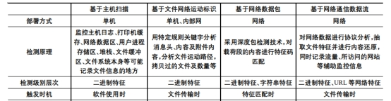 

基于文件特征的传输识别技术如图：

 

文件数据流分析

网络数据流具有连接属性、应答属性、控制属性、会话属性等多重属性。行逐层协议解释：若为IP分片报文，则进行IP分片的重组；若为UDP报文，则对报文内容按设定的特征字进行审计；若为TCP连接报文，则按协议类型对相应的协议链表进行处理；若为TCP的数据报文，则对报文内容进行文件还原。IP层对接收到的IP数据报文进行选路并获得其MTU，根据这个MTU和数据报的长度，决定是否对数据报进行分片。在接收端通过查看分组IP首部的片偏移位DF和MF，判断这个分组在传输到本机前是否经分片，若是，IP按照片偏移位置和16位标识，将分组重装成一个完整的IP数据报。IP数据报被提交到TCP层后，TCP协议根据其TCP首部的序号域，将接收的分组数据重新排序，并顺序插入到接收报文队列中，直到队列中的所有IP包能组成一份完整的报文，被提交到应用层。如图：

 

文件特征识别

目前国内外针对文件特征指纹识别的研究较少，相关的工具如QuiekviewPlus，ConversionPlus等也主要用于计算机取证领域，这些工具主要是利用文件的后缀名或根据文件的特征码判断文件的类型。归纳起来目前常用的文件类型识别技术主要有基于后缀名、基于二进制内容和基于文件特征码3种。其中，基于后缀名的识别需要以事前得到一个文件为前提，，基于二进制内容的识别以文件的二进制内容中的每个字节值出现的频率作为文件的特征，该特征作为一种统计值要求在数据流组装完后进行，时间滞后且性能开销过大。涉密文件主要是一些承载涉密信息的文档，其中涉及加密的文件类型有office系列、WPS系列、PDF、Zip、Rar压缩系列等。从存储结构上包括结构化文本、自由文本和半结构化文本，不同类型文本的特征值差异很大，甚至同类型文本不同版本的特征值也不同。所谓文件的特征码是指文件内容中固定出现的十六进制数字串，比如office2003及之前版本的文件格式特征码为 D0 CF 11 E0 A1 B11A E1；而 office2007 与 office2010 系列的格式特征码变为 50 4B 03 04 14 00 06 00 08 00 00 00 21。文件结构特征值将存储结构可作为一种指纹信息， 例如 PDF 是一种复合文档，文件头直接描述了文件的组织方式和存储格式，例如PDF文件header、body、cross-reference、trail 这 4 部分组成，其中head存有PDF的版本信息，如%PDF? 1.5。如图是RAR加密特征：

 

识别流程如图：

 

###### **1.1.1.7.1.11** 基于真实文件格式的文件解析技术

文件类型识别是文件内容还原以及后续的文件敏感信息检测预处理过程中不可或缺的一部分，精确的文件类型识别是文件内容还原和文件敏感信息检测模型选择的关键步骤之一，它能够让我们根据不同的文件类型选择适合的文件内容提取方法和敏感信息检测模型。文件类型的多样性，会给有关数据保密以及信息安全等方面带来威胁，通过对一些文件类型的识别和阻断，可以避免互联网上木马和病毒的传播，还可以避免保密文件的泄漏。

文本文件是一种由若干行字符构成的计算机文件，文本文件大部分为脚本语言类文件，即使用脚本语言创建的文件，脚本语言例如有javascript、python、以及php(Hypertext Preprocessor，超文本预处理器)等。脚本语言类文件一般是根据所使用的脚本语言以特定后缀名(如.reg，.vbs，.js或.inf等)进行保存，例如javascript脚本语言文件以 .js的后缀名进行保存。现有技术通常是基于文件后缀名来确定文本文件的类型，例如检测到文件的后缀名为“js”，则判断文件类型是javascript脚本语言文件。在对现有技术的研究和实践过程中，现有文本文件类型的识别方式，识别准确率较低，一旦文件的后缀名被修改，将会识别出错误的文件类型，造成误判。

文件类型识别原理

当服务器接收到待识别文件，通过读取待识别文件中的文件魔法数特征，并将文件魔法数特征与预先统计设定不同文件类型的多个魔法数特征进行匹配，获取匹配的文件类型，然后再使用匹配到的文件类型的语法树规则与待识别文件的内容进行对比分析，若语法树规则能正常与待识别文件的内容的框架相对应，则将待识别文件的文件类型识别为预定文件类型。

具体流程

待识别文件可以是任何未携带扩展名的未知文件类型的文件。表示不同文件类型的魔术数，是指文件的最开头的几个用于唯一区别其它文件类型的字节，根据这些字节特征就可以很方便的区别不同的文件类型，相比于只根据文件后缀名来识别文件类型准确率要高的多。

首先要以二进制的方式读取文本文件的前100个字节，然后再读取文件类型与文件魔法数一一对应的文件，将魔法数逐一与读取的字节匹配对应，然后获取到匹配的文件类型。部分文件魔法数样式如下图所示:

 

从图中可以看出，每种文件类型的特征标识 以一串十六进制字符串表示，特征标识的长度并不 固定，但是字符的定义具有惟一性，不同的文件类 型互相区别。不同类型文件的文件名使用不同的后 缀名进行区分，以“,”间隔 ；相同类型文件的多 个后缀名以“/”间隔。 部分文件类型并未定义特征标识，比如 TXT、 XML 等文本格式文件，没有列入数据库表。 微软的 Office 文档具有统一的文件头特征标 识“0x D0CF11E0”。然而其下各种文件类型 ( 如 DOC/DOT/XLS/XLA/PPT/PPS/PPA/POT 等 ) 的区分又引入了复合文档（Microsoft Compound Document File Format）的概念。

不同的文件类型的语法树规则是指待识别文件中所记录的文本特征信息，例如可以是待识别文件中的关键字，关键字是指计机语言里事先定义的、有特别意义的标识符，例如if、for、while、def等，javascript语言文件类型、python语言文件类型、php语言文件类型、html语言文件类型或vbs语言文件类型等语法树规则各不相同。

读取待识别文件的内容，根据匹配到的文件类型，获取其预先设定好的语法树规则，然后与待识别文件中的内容进行匹配，当匹配的正确率达到超过预先设定的阈值时，则该待识别文件的文件类型即为所匹配的文件类型。

###### **1.1.1.7.1.12** 单包检测技术

在DDoS攻击中最常见的攻击便是单包攻击。单包攻击防御是防火墙具备的最基本的的方法功能。

单包攻击主要分为三类：

扫描窥探攻击

畸形报文攻击

特殊报文攻击

 

单包攻击原理与防御

扫描窥探攻击：扫描型攻击是一种潜在的攻击行为，并不具有直接的破坏行为，通常是攻击者发动真正攻击前的网络探测行为。

IP地址扫描攻击：IP地址扫描攻击，即攻击者运用ICMP报文（如Ping和Tracert命令）探测目标地址，或者使用TCP/UDP报文对一定地址发起连接（如TCP ping），通过判断是否有应答报文，以确定哪些目标系统确实存活着并且连接在目标网络上。

防御方式：Anti-DDoS设备或NGFW对进入的TCP、UDP、ICMP报文进行检测，当某源IP地址发送报文的目的IP地址与此源IP地址发送的前一个报文的目的IP地址不同时，则记为一次异常，当异常次数超过预定义的阈值时，则认为该源IP地址的报文为IP地址扫描攻击，并将该源IP地址加入黑名单。

端口扫描攻击：攻击者通常使用Port Scan攻击软件，向网络中存活主机的一系列TCP/UDP端口发起连接，根据应答报文判断主机是否使用这些端口提供服务。

防御方式： Anti-DDoS或NGFW设备对进入的TCP、UDP、ICMP报文进行检测，根据源IP地址获取统计表项的索引，如果目的端口与前一报文不同，将表项中的报文个数加1，如果报文的个数超过设置的阈值，记录日志，并根据配置决定是否将源IP地址加入黑名单。

Smurf攻击：攻击者向网络中的广播地址发送源IP伪造为受害者的ICMP请求报文，使得网络中的所有主机向受害者回应ICMP应答报文，这样造成受害者系统繁忙，链路拥塞。

防御方式：Anti-DDoS\NGFW设备检查ICMP请求报文的目的地址是否为网络的A、B、C类广播地址，如果是则丢弃。并记录攻击日志。

Land攻击：Land攻击即环回攻击。Land攻击是指攻击者向受害者发送TCP报文，此TCP报文的源地址和目的地址同为受害者的IP地址。这将导致受害者向它自己的地址发送SYN-ACK回应报文，结果这个地址又发回ACK消息并创建一个空连接。从而造成资源的消耗。

防御方式：检查TCP报文的源地址和目的地址是否相同，或者TCP报文的源地址是否为环回地址，如果是则丢弃。

Fraggle攻击：Fraggle攻击类似于Smurf攻击，**使用UDP应答消息而非ICMP。UDP端口7（ECHO）和端口19（Chargen）**在收到UDP报文后，会产生大量无用的应答报文，占满网络带宽。

当运行Chargen服务的UDP端口（通常为19）收到一个数据包后，会产生一个字符串作为回应。当运行Echo服务的UDP端口（通常为7）收到一个数据包后，会简单地返回该包的数据内容作为回应。这两种服务可以被攻击者利用进行循环攻击。这样造成受害者系统繁忙，链路拥塞。

攻击者可以向攻击目标所在的网络发送UDP报文，报文的源地址为被攻击主机的地址，目的地址为被攻击主机所在子网的广播地址或子网网络地址，目的端口号为7或19。子网中启用了此功能的每个系统都会向被攻击主机发送回应报文，从而产生大量的流量，占满带宽，导致受害网络的阻塞或受害主机的崩溃。

即使子网上没有启动这些功能的系统也将产生一个ICMP不可达消息，因而仍然消耗带宽。若攻击者将UDP报文的源端口改为19，目的端口为7，这样会不停地产生大量回应报文，其危害性更大。

防御方式：设备对进入的UDP报文进行检测，若目的端口号为7或19，则直接拒绝，并将攻击记录到日志。

IP Fragment 攻击(IP分片报文检测)：IP报文头中的不分段（DF）位和更多分段（MF）位用于分片控制，攻击者通过发送分片控制非法的报文，从而导致主机接收报文时产生故障，报文处理异常，甚至导致主机崩溃。

防御方式：设备检测到报文控制位是下列情况之一时，则直接丢弃并记录攻击日志：

DF位为1（表示不能对数据包分段），而MF位也为1（表示还有更多的分段）。

DF位为1，而分段偏移（Offset） > 0。

DF位为0，而分片Offset + Length > 65535。

P Sppfing攻击（IP欺骗）：IP欺骗攻击是一种常用的攻击方法，同时也是其他攻击方法的基础。这是由IP协议自身的特点决定的，IP协议依据IP头中的目的地址来发送IP报文，如果IP报文是本网络内的地址，则被直接发送到目的地址；如果该IP地址不是本网络地址，则被发送到网关，而不对IP包中提供的源地址做任何检查，默认为IP包中的源地址就是发送IP包主机的地址。攻击者通过向目标主机发送源IP地址伪造的报文，欺骗目标主机，从而获取更高的访问和控制权限。该攻击导致危害目标主机的资源，信息泄漏。

防御方式：设备对报文的源IP地址进行路由表反查，检查路由表中到源IP地址的出接口和报文的入接口是否一致。如果不一致，则丢弃该报文，并记录攻击日志。

 

Ping of Death攻击:路由器对包的大小是有限制的，IP报文的长度字段为16位，即IP报文的最大长度为65535。如果遇到大小超过65535的报文，会出现内存分配错误，从而使接收方的计算机系统崩溃。攻击者只需不断的通过Ping命令向攻击目标发送超过65535的报文，就可以使目标计算机的TCP/IP堆栈崩溃，致使接收方系统崩溃。

防御方式：设备会检测报文的大小是否大于65535字节，对大于65535字节的报文直接丢弃，并记录攻击日志。

TCP Flag攻击（TCP报文标志位攻击）：TCP报文标志位包括URG、ACK、PSH、RST、SYN、FIN。攻击者通过发送非法TCP flag组合的报文，受害主机收到后进行判断识别，消耗其性能，甚至会造成有些操作系统报文处理异常，主机崩溃。不同的系统对这些标志位组和的应答是不同的，可用于操作系统探测。

防御方式：检查TCP报文的各个标志位，若出现以下情况，则视为攻击，予以丢弃并记录攻击日志：

6个标志位全为1。

6个标志位全为0。

SYN和FIN位同时为1。

SYN和RST位同时为1。

FIN位为1，而ACK位为0。

Teardrop攻击（泪滴攻击）：对于一些大的IP数据包，为了迎合链路层的MTU（Maximum Transmission Unit）的要求，需要传送过程中对其进行拆分，分成几个IP包。在每个IP报头中有一个偏移字段和一个拆分标志（MF），其中偏移字段指出了这个片段在整个IP包中的位置。如果攻击者截取IP数据包后，把偏移字段设置成不正确的值，接收端在收到这些分拆的数据包后，就不能按数据包中的偏移字段值正确组合出被拆分的数据包，这样，接收端会不停的尝试，以至操作系统因资源耗尽而崩溃。

防御方式：对接收到的分片数据包进行分析，计算数据包的偏移量是否有误，如果有误则丢弃，并记录攻击日志。

WinNuke攻击：WinNuke攻击又称“带外传输攻击”，它的特征是**攻击目标端口，被攻击的目标端口通常是139，而且URG位设为1，即紧急模式。**WinNuke攻击是利用Windows操作系统的漏洞，向端口发送一些携带TCP带外（OOB）数据报文，但这些攻击报文与正常携带OOB数据报文不同，其指针字段与数据的实际位置不符，即存在重合，这样Windows操作系统在处理这些数据时，就会崩溃。还有一种是IGMP（Internet Group Management Protocol）分片报文。一般情况下IGMP报文是不会分片的，很多系统对IGMP分片报文的处理也都存在问题。

防御方式：设备将丢弃目的端口为139、URG位为1且URG指针不为空的报文，并记录攻击日志。另外，如果收到IGMP分片报文也会认为受到了WinNuke攻击，而丢弃报文并记录攻击日志。

ARP欺骗：攻击者为了改变网关设备上的ARP表项，会向网关设备发送虚假ARP请求报文。如果设备将该报文中的IP地址与MAC地址对应关系学习至ARP表项，则会误将其他主机的报文转发给攻击源。

防御方式：启用ARP欺骗攻击防范后，只在自己主动向其他主机发起ARP请求并得到回应的情况下才更改ARP表项，而不会学习主机主动发来的ARP请求报文。

特殊报文攻击特殊控制报文攻击也是一种潜在的攻击行为，不具直接的破坏行为，攻击者通过发送特殊控制报文探测网络结构，为后续发送真正的攻击做准备。

超大ICMP报文攻击：超大ICMP报文攻击是指利用长度超大的ICMP报文对目标系统进行攻击。对于有些系统，在接收到超大ICMP报文后，由于处理不当，会造成系统崩溃或重启。

防御方式：当启用“超大ICMP报文控制”时，还需要设置报文长度，当设备收到的ICMP报文长度超过该值时将丢弃该报文，并记录攻击日志。

ICMP报文不可达攻击：不同的主机对ICMP不可达报文的处理方式不同，有的主机在收到网络或主机不可达的ICMP报文后，对于后续发往此目的地址的报文直接认为不可达，从而切断了目的地与主机的连接。攻击者利用这一点，伪造不可达ICMP报文，切断受害者与目的地的连接，造成攻击。

防御方式：启用ICMP重定向报文攻击防范后，设备将直接丢弃ICMP重定向报文，并记录攻击日志。

Tracert报文攻击：Tracert报文攻击是攻击者利用TTL为0时返回的ICMP超时报文，和到达目的地址时返回的ICMP端口不可达报文来发现报文到达目的地所经过的路径，它可以窥探网络的结构。

防御方式：启用Tracert报文攻击防范后，设备将检测到的超时的ICMP报文或UDP报文，或者目的端口不可达报文，直接丢弃，并记录攻击日志。

ICMP重定向报文攻击：一般情况下，网络设备会向同一个子网的主机发送ICMP重定向报文，请求主机改变路由，且设备仅向主机而不向其他设备发送ICMP重定向报文。但一些恶意的攻击可能跨越网段向另外一个网络的主机发送虚假的重定向报文，以改变主机的路由表，干扰主机正常的IP报文转发。

防御方式：启用ICMP重定向报文攻击防范后，设备将直接丢弃ICMP重定向报文，并记录攻击日志。

源站路由选项的IP报文攻击：在IP路由技术中，一个IP报文的传递路径是由网络中的路由器根据报文的目的地址来决定的，但也提供了一种由报文的发送方决定报文传递路径的方法，这就是源站选路选项。源站选路选项允许源站明确指定一条到目的地的路由，覆盖掉中间路由器的路由选项。源站选路选项通常用于网络路径的故障诊断和某种特殊业务的临时传送。由于IP源站选路选项忽略了报文传输路径中的各个设备的中间转发过程，而不管转发接口的工作状态，可能被恶意攻击者利用，刺探网络结构。

防御方式：启用源站选路选项IP报文控制后，设备会检测收到的报文是否设置IP源站选路选项。如果是则丢弃该报文，并记录攻击日志。

路由记录选项IP报文控制：在IP路由技术中，提供了路由记录选项，用来记录IP报文从源地址到目的地址过程中所经过的路径，也就是一个处理此报文的路由器的列表。IP路由记录选项通常用于网络路径的故障诊断，但也会被恶意攻击者利用，窥探网络结构。

防御方式：启用路由记录选项IP报文控制后，设备将检测收到的报文是否设置IP路由记录选项。如果是则丢弃该报文，并记录攻击日志。

时间戳选项IP报文控制：在IP路由技术中，提供了时间戳选项，记录IP报文从源到目的过程中所经过的路径和时间，也就是一个处理过此报文的路由器的列表。IP时间戳选项通常用于网络路径的故障诊断，但也会被恶意攻击者利用，窥探网络结构。

防御方式：启用时间戳选项的IP报文控制后，设备将检测收到的报文是否设置IP时间戳记录选项。如是则丢弃该报文，并记录攻击日志。

深度数据包检测

对等网络（Peer-to-Peer，简称 P2P）、VoIP、流媒体、Web TV、音视频聊天、互动在线游戏和虚拟现实等新业务的普及为运营商吸纳了大量的客户资源，同时也对网络的底层流量模型和上层应用模式产生了很大的冲击，带来带宽管理、内容计费、信息安全、舆论管控等一系列新的问题。尤其是 P2P、VoIP、流媒体等业务。当前 P2P 业务的流量已占互联网数据流量的50%-70%，如果再加上流媒体等业务，新业务的数据流量是相当巨大的，这打破了以往“高带宽、低负载”的 IP 网络 QoS 提供模式，在很大程度上加重了网络拥塞，降低了网络性能，劣化了网络服务质量，妨碍了正常的网络业务的开展和关键应用的普及。同时，P2P 的广泛使用也给网络的信息安全监测管理带来了极大的挑战。

由于 P2P 流量的带宽吞噬特性，简单的网络升级扩容是无法满足运营商数据流量增长需要的，加上网络设备缺乏有效的技术监管手段，不能实现对 P2P/WEB TV 等新兴业务的感知和识别，导致网络运营商对网络的运行情况无法有效管理。

传统的网络运维管理，往往通过设备网管实现对网元级的管理，后来发展至网络级管理，可以对上层的简单应用进行管控，而这些应用级管控技术大多采用简单网络管理协议 SNMP 或者基于端口的流量识别进行进行分析和管理。

DPI 技术是一种基于应用层的流量检测和控制技术，称为“深度包检测”。所谓“深度”是和普通的报文分析层次相比较而言的，普通报文检测仅分析 IP 包的4层以下的内容，包括源地址、目的地址、源端口、目的端口以及协议类型。

传统IP头部报文分析

 

而 DPI 除了对前面的层次分析外，还增加了应用层分析，识别各种应用及其内容。当 IP 数据包、TCP 或 UDP 数据流通过基于 DPI 技术的带宽管理系统时，该系统通过深入读取 IP 包载荷的内容来对 OSI 七层协议中的应用层信息进行重组，从而得到整个应用程序的内容，然后按照系统定义的管理策略对流量进行整形操作。

 

基于 DPI 技术的带宽管理解决方案与我们熟知的防病毒软件系统在某些方面比较类似，即其能识别的应用类型必须为系统已知的，以用户熟知的BT为例，其Handshake的协议特征字为“BitTorrent Protocol”；换句话说，防病毒系统后台要有一个庞大的病毒特征数据库，基于 DPI 技术的带宽管理系统也要维护一个应用特征数据库。当流量经过时，通过将解包后的应用信息与后台特征数据库进行比较来确定应用类型；而当有新的应用出现时，后台的应用特征数据库也要更新才能具有对新型应用的识别和控制能力。

UTM（Unified Threat Management）实现原理采用的方法就是DPI，这种方法将下载、电子邮件传输以及压缩的文档与全面且连续更新的预定义攻击签名数据库进行比较和匹配。利用这些签名可以实时扫描并检测、阻止通过网络传输的变型的（Packed）可执行文件和宏病毒文件，以实现 UTM 的功能。

DPI 的技术关键是高效的识别出网络上的各种应用。普通报文检测是通过端口号来识别应用类型的。如检测到端口号为 80 时，则认为该应用代表着普通上网应用。而当前网络上的一些非法应用会采用隐藏或假冒端口 号的方式躲避检测和监管，造成仿冒合法报文的数据流侵蚀着网络。此时采用 L2 ~ L4 层的传统检测方法已无能为力了。DPI 技术就是通过对应用流中的数据报文内容进行探测，从而确定数据报文的真正应用。因为非法应用可以隐藏端口号，但目前较难以隐藏应用层的协议特征。DPI 的识别技术可以分为以下几大类：

1、基于“特征字”的识别技术：不同的应用通常依赖于不同的协议，而不同的协议都有其特殊的指纹，这些指纹可能是特定的端口、特定的字符串或者特定的Bit 序列。基于“特征字”的识别技术通过对业务流中特定数据报文中的“指纹”信息的检测以确定业务流承载的应用。根据具体检测方式的不同，基于“特征字”的识别技术又可以被分为固定位置特征字匹配、变动位置的特征匹配以及状态特征匹配三种技术。通过对“指纹”信息的升级，基于特征的识别技术可以很方便的进行功能扩展，实现对新协议的检测。如：Bittorrent 协议的识别，通过反向工程的方法对其对等协议进行分析，所谓对等协议指的是 Peer 与 Peer 之间交换信息的协议。对等协议由一个握手开始，后面是循环的 消息流，每个消息的前面，都有一个数字来表示消息的长度。在其握手过程中，首先是先发送 19，跟着是字符串“BitTorrent protocol”。那么“19BitTorrent Protocol”就是Bittorrent的“特征字”。

2、应用层网关识别技术：某些业务的控制流和业务流是分离的，业务流没有任何特征。这种情况下，我们就需要采用应用层网关识别技术。应用层网关需要先识别出控制流，并根据控制流的协议通过特定的应用层网关对其进行解析，从协议内容中识别出相应的业务流。对于每一个协议，需要有不同的应用层网关对其进行分析。如 SIP、H323 协议都属于这种类型。SIP/H323 通过信令交互过程，协商得到其数据通道，一般是RTP格式封装的语音流。也就是说，纯粹检测 RTP 流并不能得出这条RTP流是那通过那种协议建立的。只有通过检测 SIP/H323 的协议交互，才能得到其完整的分析。

3、行为模式识别技术：行为模式识别技术基于对终端已经实施的行为的分析，判断出用户正在进行的动作或者即将实施的动作。行为模式识别技术通常用于无法根据协议判断的业务的识 别。例如：SPAM（垃圾邮件）业务流和普通的 Email 业务流从 Email 的内容上看是完全一致的，只有通过对用户行为的分析，才能够准确的识别出 SPAM 业务。

 

深度数据包检测技术应用

深度数据包检测(DPI)是一项已经在流量管理、安全和网络分析等方面获得成功的技术，同时该技术能够对网络数据包进行内容分析，但又与header或者基于元数据的数据包检测有所不同，这两种检测通常是由交换机、防火墙和入侵检测系统/IPS设备来执行的。通常的 DPI 解决方案能够为不同的应用程序提供深度数据包检测。

只针对header的处理限制了能够从数据包处理过程中看到的内容，并且不能够检测基于内容的威胁或者区分使用共同通信平台的应用程序。DPI 能够检测出数据包的内容及有效负载并且能够提取出内容级别的信息，如恶意软件、具体数据和应用程序类型。

随着网络运营商、互联网服务提供商(ISP)以及类似的公司越来越依赖于其网络以及网络上运行的应用程序的效率，管理带宽和控制通信的复杂性以及安全的需要变得越来越重要。DPI 恰好能够提供这些要求，寻求更好的网络管理以及合规的用户企业应该把 DPI 作为一项重要的技术。

DPI 技术首先能够将数据包组装到网络的流量中，数据处理(包括协议分类)接着可以从流量内容中提取信息，流量重组和内容提取都需要大量处理能力，尤其是在高流量的数据流中。成功的 DPI 技术必须能够提供基本功能，如高性能计算和对分析任务的灵活的支持。

DPI 处理部门必须能够提供符合通信网络性能的可扩扎性和性能，深度内容检测要求比仅仅是header检测更加多的处理。因此，DPI 通常使用并行处理结构来加快计算任务。DPI 技术最终能够向用户提供从网络流量中提取出的信息，实际内容处理可能与提取出的信息有很大差异，DPI 技术的表现有点像一个平台，提供内容处理的实用工具，但是可以让用户决定处理哪些内容。

 

很多服务供应商现在使用 DPI 来将流量分为低延时(语音)、保证延时(网络流量)、保证交付(应用流量)和尽最大努力交付的应用程序(文件共享)。使用这种分类，他们可以更好的根据关键任务流量、非关键流量来优化资源并减少网络拥挤。因为廉价的带宽，服务供应商可以增加增值服务来获得额外的收入，包括安全、高峰使用管理、内容计费和针对性的广告。这些都需要对网络流量的深度检测。

拥有大型网络覆盖很多地理区域的企业在他们的内部网络间可能运行着完全不同的通信类型。除了控制成本和带宽使用外，安全一直是一个挑战，这要求对网络应用程序流量的理解。这些企业已经开始看到 DPI 分析带来的好处，例如，网络管理员可以使用 DPI 技术来控制网络性能，当网络性能较低时，限制某种应用程序流量，当性能恢复到正常时，再提升流量。

现在越来越多的网络安全功能需要有效载荷级别的知识，数据泄漏防护要求深度理解通过线路发送的实际内容。应用层防火墙负责有效载荷的内容，而不是 Header 内容。在云计算中的安全服务提供商，如反垃圾邮件或者 Web 过滤服务等供应商，必须获取通过多个客户通信的实时可见的内容，以便迅速获取抵御威胁和攻击的信息。这样也要求内容级别的情报。

###### **1.1.1.7.1.13** 信标检测技术

网络信标（web beacon），又称网页臭虫（web bug），是可以暗藏在任何网页元素或邮件内的1像素大小的透明GIF或PNG图片，常用来收集目标电脑用户的上网习惯等数据，并将这些数据写入Cookie。网络信标在邮件跟踪和垃圾邮件中较为常用。

它不像Cookie那样可以被浏览器用户接受或拒绝，网络臭虫只以图形交换格式（GIF）或其他文件对象的形式出现。

它通常只能被检测，如果用户查看网页的源版本会发现一个从不同的Web服务器而不是从网页的其他部分负载的标签。

虽然互联网隐私倡导者反对使用网络臭虫，但是他们大部分承认网络臭虫有积极用途，例如跟踪侵犯版权的网站。 根据Richard M.Smith，网络臭虫（Web bug）可以收集以下资料：

1.获取网络臭虫的计算机的IP地址

2.网络臭虫所在网页的网址

3.网络臭虫图象的网址

4.网络臭虫被访问的时间

5.获取网络臭虫图象的浏览器的类型

6.一个提前设定的cookie值

网络信标经常被垃圾邮件发送者用来验证电子邮件地址。当收件人打开一封有网络臭虫的电子邮件时，返回给发件人的信息就会显示邮件已被打开，这样就可以确认电信标检测

信标检测

恶意软件有很多检测方法，例如根据每个IP通信双方的流量检测，其中包括IP黑名单、发生频率等手段，但这些技术都有缺点。如果这些传出流量的IP是一个开放接口，就很可能产生误报，但最大的问题是网络中的服务数量越多，复杂度越高，而且对于实时监控也是个挑战。

恶意软件需要和控制服务器通信接受指令，而且这个通信是定期的。恶意软件生成的流量和用户生成有不同模式，但大多数技术都无法识别这个区别，因此这里是可以检测恶意软件的特征。

传出流量可能包括用户流量如网站访问、电子邮件、下载软件。还会包括合法/非法机器流量，例如应用更新、设备时间同步、心跳、恶意软件流量掺杂。机器流量有一些信标特征，所谓新标是指周期性、规律性信号发送。

技术上需要区分用户和机器流量，如果是机器流量则需判定流量是良性还是异常，有一些方法例如启发式、白名单确定是否良性。但实际上还有更多参数，例如请求数量、周期性、web对象数量、目的IP、目的端口数等。子邮件地址是有效的。

 

上图是一个设备在17秒内的传出流量示意图，传出包括用户和机器流量两类。当用户活动时生成大量连接请求，当用户不活动时进入静默期，我们需要检测静默期，分析流量异常。

第一个用户网页访问，在4秒内生成接近50个请求，请求发给不同服务器获得网页、图像、CSS等，网页完成后流量迅速下降到0。也就是：连接数量迅速增加或减少。

紧接着进入机器流量，请求较低，一直都未超过10。也就是：与用户流量比，请求量低。此外连接更有周期性，每2秒出现一次。

总结为：用户活动有明显流量增加，连接请求多，非周期性。机器流量则具有周期性。

区分机器和用户的参数示例：

1.时间段内连接数量

2.连接周期性

3.连接不同IP数量

4.WEB请求数量

5.目的地端口数量

6.目的地URI

 

假设对上图中的终端计算机出流量进行检测，终端计算机的出方向分别是内外部网络，系统通过流量日志检测，流量内容包括网络流量、IP流量、Web流量等，例如Web流量包含HTTP消息，可以和目的IP，目的URI，端口号，GET或POST等参数相关联。IP流量可以和目的IP地和端口号之类的参数相关联。

流量分析模块检测是否机器流量。如果是，则交给异常检测模块判断良性还是异常。确定异常，则传递给威胁分析模块，并生成警报。

在检测机器流量部分，流量分类模块分析流量中的连接请求，确定用户流量还是机器流量，可以按照20秒时间分组。然后根据前面说到的参数判断，例如周期性，分组中每个连接请求的之间周期平均值，如果超过阈值则确定为机器流量，否则是用户流量。如果目的IP呈现多样性，超过指定阈值则确认为用户流量。同样还有，下载的web对象超过阈值、端口数量超过阈值等。流量分类模块可以配置为一个或多个参数。

异常检测模块进一步检测异常，从机器流量中提取信标数据，信标数据可以理解为目的IP、目的端口之类的参数，如果是HTTP连接则进一步提取GET、POST、URI。将信标数据和已知信标类型比较，确定是否异常。

 

上图是信标类型的高速缓存示例，异常检测模块把信标类型存在这里，然后进行比较匹配。如果匹配到，则将信标数据添加到类型中。通常恶意软件会定期和远控端发送信标，信标之间的间隙会小于指定阈值，连接请求之间的长间隙通常可以归属良性，例如定期更新应用，但这类远不如恶意软件的信标频繁。

在上图中，信标类型第一次出现在在时间t，第二次出现在时间（t + x）等，异常检测模块负责确定出现次数和之间的时间，如果组频率满足周期性标准，例如平均时间（平均值（x，y，z））满足指定的定时阈值，异常检测模块确定该组对应于其他组是异常。当组重复但周期性不满足时，例如平均定时（平均（x，y，z））不满足指定的定时阈值，异常检测模块确定组是否至少出现第二阈值数量，第二阈值数是否大于第一阈值数的时间，如果组发生第二次阈值，则确定为异常。如果两各周期阈值都不满足，则是良性。

 

整个过程如上图，首先流量分类模块接收流量，然后进行分组分析， 第三步确认这些访问是否归属在白名单，以减少误报，白名单包括IP、URI、目的端口等。如果是白名单，则不再监控。如果不是白名单，则进入第四步判断是否用户/机器流量，用户流量放过，机器流量进入异常检测。

 

分组过程图，第一步识别第一个连接请求，识别出后形成组，把这个请求添加到这个组。继续监控后续连接，确定后续连接是否满足分组标准，满足则添加到组。不满足则返回。

 

上图是用户/机器流量判断流程图，首先流量分析模块根据参数分析请求，然后判断是否用户流量，如果IP多样性超过阈值或下载web对象超过阈值，则判断为用户流量，用户流量停止分析返回。如果不是用户流量，则判断为机器流量。

###### **1.1.1.7.1.14** 文件检测技术

恶意文件是指带有程序设计者出于攻击意图所编写的一段程序文件，一旦运行该文件就会被感染，从而达到传播的目的。

恶意文件分类

木马文件(Tronjan)

1.病毒介绍

木马病毒是指隐藏在正常程序中的一段具有特殊功能的恶意代码，是具备破坏和删除文件、发送密码、记录键盘和攻击Dos等特殊功能的后门程序。

2.攻击方式

木马的种类很多，主要有以下几种：

其一，远程控制型，如冰河。远程控制型木马是现今最广泛的特洛伊木马，这种木马起着远程监控的功能，使用简单，只要被控制主机联入网络，并与控制端客户程序建立网络连接，控制者就能任意访问被控制的计算机。

其二，键盘记录型。键盘记录型木马非常简单，它们只做一种事情，就是记录受害者的键盘敲击，并且在LOG文件里进行完整的记录，然后通过邮件或其他方式发送给控制者。

其三，密码发送型。密码发送型木马的目的是找到所有的隐藏密码，并且在受害者不知道的情况下把它们发送到指定的信箱。这类木马程序大多不会在每次都自动加载，一般都使用25端口发送电子邮件。

其四，反弹端口型。反弹端口型木马的服务端使用主动端口，客户端使用被木马定时监测控制端的存在，发现控制端上线立即弹出端口主动连接控制端打开的主动端口。为了隐蔽起见，控制端的被动端口一般开在8O，稍微疏忽一点，用户就会以为是自己在浏览网页。

攻击者通过各种手段将挖矿程序植入受害者的计算机中，在受害者不知情的情况下利用其计算机的云算力进行挖矿，从而获取利益，这类非法植入用户计算机的挖矿程序就是挖矿木马。

后门程序（Backdoor）

1.病毒介绍

后门程序就是留在计算机系统中，供某位特殊使用者通过某种特殊方式控制计算机系统的途径。

后门程序，跟我们通常所说的"木马"有联系也有区别。联系在于：都是隐藏在用户系统中向外发送信息,而且本身具有一定权限,以便远程机器对本机的控制。区别在于：木马是一个完整的软件,而后门则体积较小且功能都很单一。后门程序类似于特洛依木马（简称"木马"），其用途在于潜伏在电脑中，从事搜集信息或便于黑客进入的动作。

后门程序和电脑病毒最大的差别，在于后门程序不一定有自我复制的动作，也就是后门程序不一定会“感染”其它电脑。后门是一种登录系统的方法，它不仅绕过系统已有的安全设置，而且还能挫败系统上各种增强的安全设置。

2.攻击方式

网页后门此类程序一般都是服务器上正常 的web服务来构造自己的连接方式，比如非常流行的ASP、cgi脚本后门等。

扩展后门，在普通意义上理解，可以看成是将非常多的功能集成到了后门里，让后门本身就可以实现很多功能，方便直接控制肉鸡或者服务器，这类的后门非常受初学者的喜爱，通常集成了文件上传/下载、系统用户检测、HTTP访问、终端安装、端口开放、启动/停止服务等功能，本身就是个小的工具包，功能强大。

账号后门技术是指黑客为了长期控制目标计算机，通过后门在目标计算机中建立一个备用管理员账户的技术。一般采用克隆账户技术。克隆账户一般有两种方式，一个是手动克隆账户，一个是使用克隆工具。

蠕虫病毒（Worm）

1.病毒介绍

蠕虫是一种可以自我复制的代码，并且通过网络传播，通常无需人为干预就能传播。蠕虫病毒入侵并完全控制一台计算机之后，就会把这台机器作为宿主，进而扫描并感染其他计算机。当这些新的被蠕虫入侵的计算机被控制之后，蠕虫会以这些计算机为宿主继续扫描并感染其他计算机，这种行为会一直延续下去。蠕虫使用这种递归的方法进行传播，按照指数增长的规律分布自己，进而及时控制越来越多的计算机。蠕虫可以通过计算机网络，电子邮件，即时消息服务，社交网络，可移动媒体和其他渠道传播。

2．攻击方式

蠕虫病毒的攻击具有如下特点：

(1)较强的独立性

计算机病毒一般都需要宿主程序，病毒将自己的代码写到宿主程序中，当该程序运行时先执行写入的病毒程序，从而造成感染和破坏。而蠕虫病毒不需要宿主程序，它是一段独立的程序或代码，因此也就避免了受宿主程序的牵制，可以不依赖于宿主程序而独立运行，从而主动地实施攻击。

(2)利用漏洞主动攻击

由于不受宿主程序的限制，蠕虫病毒可以利用操作系统的各种漏洞进行主动攻击。例如，“尼姆达”病毒利用了IE游览器的漏洞，使感染病毒的邮件附件在不被打开的情况下就能激活病毒；“红色代码”利用了微软IlSl服务器软件的漏洞(idq.dll远程缓存区溢出)来传播；而蠕虫王病毒则是利用了微软数据库系统的一个漏洞进行攻击。 

(3)传播更快更广

蠕虫病毒比传统病毒具有更大的传染性，它不仅仅感染本地计算机，而且会以本地计算机为基础，感染网络中所有的服务器和客户端。蠕虫病毒可以通过网络中的共享文件夹、电子邮件、恶意网页以及存在着大量漏洞的服务器等途径肆意传播，几乎所有的传播手段都被蠕虫病毒运用得淋漓尽致。因此，蠕虫病毒的传播速度可以是传统病毒的几百倍，甚至可以在几个小时内蔓延全球。 

(4)、更好的伪装和隐藏方式

为了使蠕虫病毒在更大范围内传播，病毒的编制者非常注重病毒的隐藏方式。在通常情况下，我们在接收、查看电子邮件时，都采取双击打开邮件主题的方式来浏览邮件内容，如果邮件中带有病毒，用户的计算机就会立刻被病毒感染。 

(5)、技术更加先进

一些蠕虫病毒与网页的脚本相结合，利用VBScript，Java，ActiveX等技术隐藏在HTML页面里。当用户上网游览含有病毒代码的网页时，病毒会自动驻留内存并伺机触发。还有一些蠕虫病毒与后门程序或木马程序相结合，比较典型的是“红色代码病毒”，病毒的传播者可以通过这个程序远程控制该计算机。这类与黑客技术相结合的蠕虫病毒具有更大的潜在威胁。 

(6)、使追踪变得更困难

当蠕虫病毒感染了大部分系统之后，攻击者便能发动多种其他攻击方式对付一个目标站点，并通过蠕虫网络隐藏攻击者的位置，这样要抓住攻击者会非常困难。 

传播过程

（1）、扫描

由蠕虫的扫描功能模块负责探测存在漏洞的主机。当程序向某个主机发送探测漏洞的信息并收到成功的反馈信息后，就得到一个可传播的对象。

（2）、攻击

攻击模块按漏洞攻击步骤自动攻击步骤l中找到的对象，取得该主机的权限(一般为管理员权限)，获得一个shell。 

（3）、复制

复制模块通过原主机和新主机的交互将蠕虫程序复制到新主机并启动。可以看到，传播模块实现的实际上是自动入侵的功能。所以蠕虫的传播技术是蠕虫技术的首要技术。

传播途径

（1）、利用漏洞

这种方式是网络蠕虫最主要的破坏方式，也是网络蠕虫的一个最显著的特点。网络蠕虫攻击时，首先探测目标计算机存在的漏洞，然后根据探测到的漏洞建立传播路径，最后实施攻击。

（2）、依赖Email传播

以电子邮件附件的形式进行传播是网络蠕虫采用的主要传播方式，蠕虫编写者通过向用户发送电子邮件，用户在点击电子邮件附件时，网络蠕虫就会感染此计算机。

（3）、依赖网络共享

网络共享是网络蠕虫传播的重要途径之一，网络蠕虫利用共享网络资源进行传播。

（4）、弱密码攻击

若用户的密码很容易猜测，网络蠕虫则会在攻克了用户密码后进入计算机并获得其控制权。所以用户应该设置复杂的密码，增加破解难度。

入侵过程

第一步：用各种方法收集目标主机的信息，找到可利用的漏洞或弱点。方法包括用扫描器扫描主机，探测主机的操作系统类型、版本，主机名，用户名，开放的端口，开放的服务，开放的服务器软件版本等。当然是信息搜集的越全越好。搜集完信息后进入第二步。

第二步：针对目标主机的漏洞或缺陷，采取相应的技术攻击主机，直到获得主机的管理员权限。对搜集来的信息进行分析，找到可以有效利用的信息。如果有现成的漏洞可以利用，上网找到该漏洞的攻击方法，如果有攻击代码就直接COPY下来，然后用该代码取得权限；如果没有现成的漏洞可以利用，就用根据搜集的信息试探猜测用户密码，另一方面试探研究分析其使用的系统，争取分析出—个可利用的漏洞。

第三步：利用获得的权限在主机上安装后门、跳板、控制端、监视器等等，清除日志。有了主机的权限，就可以进入计算机系统完成想完成的任务了。

感染型病毒（Virus）

1.病毒介绍

感染型病毒要求主机通过修改主机或以某种方式将其自身插入“命令链”来使其自身附着。通过这种方式，该病毒不仅可以确保在启动主机时就可以执行该病毒，而且还可以自我复制，因为受感染的文件已被复制，下载或以其他方式转移到其他计算机系统。它的名称基于这样一个事实，即其行为与生物病毒的行为非常相似。

2.攻击方式

感染型病毒由于其自身的特性，需要附加到其他宿主程序上进行运行，并且为了躲避杀毒软件的查杀，通常感染型病毒都会将自身分割、变形或加密后，再将自身的一部分或者全部附加到宿主程序上。一旦一个病毒文件执行，它很有可能就将系统中的绝大多数程序文件都加入病毒代码，进而传播给其它的电脑。

文件被感染的结果取决于病毒的作者，有可能只是将恶意代码附加在文件后面，程序可以正常使用；也可能会直接改写程序，导致程序运行报错崩溃等。

勒索病毒（Ransom）

1.病毒介绍

主机感染勒索病毒文件后，会在主机上运行勒索程序，遍历本地所有磁盘指定类型文件进行加密操作，加密后文件无法读取。随后生成勒索通知，要求受害者在规定时间内支付一定价值的比特币才能恢复数据，否则会被销毁数据。

2.攻击方式

特征：

①生成勒索文档或桌面，提供了黑客信息要求进行付款

②文件被加密，无法打开，并会被更改文件后缀为同一名称

传播方式：

暴力破解（通过暴力破解RDP端口、SSH端口，数据库端口）

Exploit Kit分发（通过黑色产业链中的Exploit Kit来分发勒索软件）

僵尸网络分发（通过自动传播感染的僵尸网络作为下载器，下载执行勒索病毒）

钓鱼邮件（恶意代码伪装在邮件附件中，诱使打开附件）

蠕虫式传播（通过漏洞和口令进行网络空间中的蠕虫式传播）

漏洞利用（Exploit）

1.病毒介绍

主要通过对已知的系统漏洞或重要程序的公开漏洞进行利用，攻击对象为未及时打补丁的主机。

2.行为特征/攻击方式

通过shellcode对漏洞进行利用攻击，从而达到提权或破坏的作用。

挖矿病毒（Miner）

\1. 病毒介绍

挖矿木马，是近年兴起的网络安全威胁，2017年下半年开始进入普通用户的视野，而2018年开始流行。中挖矿木马的计算机，其计算机资源被大量占用用于数字加密币的挖掘。

2.攻击方式

中了挖矿病毒的主机，会出现操作卡顿，cpu占用率高等现象。挖矿病毒一般会开启进程进行数字货币挖掘，并且创建定时任务，定时启动。

宏病毒

1.病毒介绍

宏病毒是一种寄存在文档或模板的宏中的计算机病毒。一旦打开这样的文档，其中的宏就会被执行，于是宏病毒就会被激活，转移到计算机上，并驻留在Normal模板上。从此以后，所有自动保存的文档都会“感染”上这种宏病毒，而且如果其他用户打开了感染病毒的文档，宏病毒又会转移到他的计算机上。

2.攻击方式

1、行为特征

（1）传播极快

Word宏病毒通过.DOC文档及.DOT模板进行自我复制及传播，而计算机文档是交流最广的文件类型。人们大多重视保护自己计算机的引导部分和可执行文件不被病毒感染，而对外来的文档文件基本是直接浏览使用，这给Word宏病毒传播带来很多便利。特别是Internet网络的普及，Email的大量应用更为Word宏病毒传播铺平道路。根据国外较保守的统计，宏病毒的感染率高达40%以上，即在现实生活中每发现100个病毒，其中就有40多个宏病毒，而国际上普通病毒种类已达12000多种。

（2）制作、变种方便

以往病毒是以二进制的计算机机器码形式出现，而宏病毒则是以人们容易阅读的源代码宏语言WordBasic形式出现，所以编写和修改宏病毒比以往病毒更容易。世界上的宏病毒原型己有几十种，其变种与日俱增，追究其原因还是Word的开放性所致。Word病毒都是用WordBasic语言所写成，大部分Word病毒宏并没有使用Word提供的Execute-Only处理函数处理，它们仍处于可打开阅读修改状态。所有用户在Word工具的宏菜单中很方便就可以看到这种宏病毒的全部面目。当然会有“不法之徒”利用掌握的Basic语句简单知识把其中病毒激活条件和破坏条件加以改变，立即就生产出了一种新的宏病毒，甚至比原病毒的危害更加严重。

（3）破坏可能性极大

鉴于宏病毒用WordBasic语言编写，WordBasic语言提供了许多系统级底层调用，如直接使用DOS系统命令，调用WindowsAPI，调用DDE或DLL等。这些操作均可能对系统直接构成威胁，而Word在指令安全性、完整性上检测能力很弱，破坏系统的指令很容易被执行。宏病毒Nuclear就是破坏操作系统的典型一例。

（4）多平台交叉感染

宏病毒冲破了以往病毒在单一平台上传播的局限，当WORD、EXCEL这类著名应用软件在不同平台（如Windows、Windo_wsNT、OS/2和MACINTOSH等）上运行时，会被宏病毒交叉感染。

2、攻击手段

1、U盘交流染毒文档文件；

2、硬盘染毒，处理的文档文件必将染毒；

3、光盘携带宏病毒；

4、Internet上下载染毒文档文件；

5、BBS交流染毒文档文件；

6、电子邮件的附件夹带病毒。

内核劫持（Rootkit）

1.病毒介绍

rootkit是允许某人控制操作系统的特定方面而不暴露他或她的踪迹的一组代码。从根本上说来，用户无法察觉这种特性构成了rootkit。rootkit会想尽办法去隐藏自己的网络、进程、I/O等信息(注意，这里所谓的隐藏，只是针对ring3的ui隐藏，内核层的功能不能隐藏，否则rootkit自己也无法使用功能了)，所以，rootkit的攻防问题很大程度上是一个ring0争夺战的问题，监控程序必须直接深入到系统的底层去获取最原始的数据，才能避免因为rootkit的ring3隐藏导致的误判。

2.攻击方式

一个典型rootkit包括：

1、以太网嗅探器程序，用于获得网络上传输的用户名和密码等信息。

2、特洛伊木马程序，例如：inetd或者login，为攻击者提供后门。

3、隐藏攻击者的目录和进程的程序，例如：ps、netstat、rshd和ls等。

4、可能还包括一些日志清理工具，例如：zap、zap2或者z2，攻击者使用这些清理工具删除wtmp、utmp和lastlog等日志文件中有关自己行踪的条目。

一些复杂的rootkit还可以向攻击者提供telnet、shell和finger等服务。还包括一些用来清理/var/log和/var/adm目录中其它文件的一些脚本。

广告软件（Adware）

1.病毒介绍

广告软件（广告支持的软件）是任何播放，显示或下载广告内容到用户计算机的软件应用程序。

典型功能包括弹出窗口或横幅，更改网页和Web浏览器中的搜索引擎设置等。某些广告软件是在计算机用户许可的情况下安装的：例如，在与广告软件捆绑在一起的合法应用程序的安装过程中。各种可疑工具栏就是这种情况。

2.攻击方式

采用多种社会和技术手段，强行或者秘密安装，并抵制卸载；

强行修改用户软件设置，如浏览器的主页，软件自动启动选项，安全选项；

强行弹出广告，或者其他干扰用户、占用系统资源行为；

有侵害用户信息和财产安全的潜在因素或者隐患；

与电脑病毒联合侵入用户电脑；

停用杀毒软件或其他电脑管理程序来做进一步的破坏；

未经用户许可，或者利用用户疏忽，或者利用用户缺乏相关知识，秘密收集用户个人信息、秘密和隐私；

恶意篡改注册表信息；

威胁恐吓或误导用户安装其他的产品。

恶意文件检测

恶意文件检测方法包括静态检测技术和动态检测技术两大类

静态检测技术有签名扫描检测技术、启发式扫描技术和完整性检测技术。

基于签名的检测技术主要是基于模式匹配的思想，为每种已知的恶意代码产生一个唯一的签名特征标记来创建恶意代码库。通过将样本文件的代码签名特征与恶意代码库进行对比，来检测样本是否为恶意文件。这种方法的优点是检测速度快，凡是病毒库中已有的恶意代码，均能快速准确地检测出来，误报率低；缺点是对于未出现过的病毒无能为力。

启发式扫描技术是通过分析一系列病毒代码，提取一种广谱特征码，即代表病毒某种行为特征的特殊程序指令，通过多种广谱特征码，也就是启发式规则，最后做出合理的判断。启发式扫描技术虽然能够发现已知或未知的恶意代码，但它对特定类型文件的检测需要提取该类型病毒文件的各种广谱特征码并制定判断规则，由于文件类型多，要对每一种类型的恶意文件提取广谱特征码并制定判断规则，这需要极大的工作量，同时误报率也较高。

完整性检测技术是通过检测散列值的变化作为判定恶意代码感染的依据，容易实现且保护能力较强，能发现已知或未知的病毒，但是由于程序版本升级、口令变更等正常程序也会引起文件变更，因而这种方法容易产生误报，且影响文件的运行速度。

动态检测技术有行为监控检测技术和代码仿真检测技术。

行为监控检测技术利用病毒的行为特征来检测病毒。通过观察和研究病毒，发现有一些行为是恶意代码的共同行为，而且比较特殊。这些特殊行为在正常代码中比较罕见，当程序运行时，监视其行为，如果发现病毒，立即报警。这种方法可以相当准确地预报未知的多数病毒，但不能识别病毒名称，且实现也有一定难度。

代码仿真检测技术是在代码运行时追踪恶意代码的行为，能高效地捕捉到异常行为。由于动态检测技术速度慢，而且现在带有识别虚拟机功能的恶意文件逐渐增多，动态监测技术的有效性将面临巨大挑战。

此外结合恶意文件纹理特征和BP神经网络算法的新型病毒文件检测方法，通过结合图像纹理技术、恶意文件检测技术和BP神经网络方法，将恶意文件映射为灰度图像；然后使用GLCM算法和GIST算法提取图片的纹理特征，实现了恶意文件图像纹理特征的提取，把提取的特征作为样本集使用BP神经网络算法进行学习，最后用于实际的恶意文件检测。如图是病毒样本的灰度图像：

 

###### **1.1.1.7.1.15** 流式协议高效解析技术

流式协议，即协议的内容是像流水一样的字节流，内容与内容之间没有明确的分界标志，需要我们人为地去给这些协议划分边界。TCP协议是面向流的协议，应用程序所看到的数据是一个整体,或者说是一个流(stream),一条消息有多个字节对应程序是不可见的。这会导致粘包问题，需要高效的流式协议解析技术解决。

粘包问题

所谓粘包问题主要是因为接收方不知道消息之间的界限,不知道一次性提取多少字节的数据所造成的。

TCP为提高传输效率,发送方往往要收集到足够多的数据后才发送一个TCP段.若连续几次需要send的数据都很少,通常TCP会根据优化算法把这些数据合成一个TCP段后一次发送出去,这样接收方就收到了粘包数据。

两种情况会发生粘包：

（1）发送端需要等缓冲区满才发送出去,造成粘包(发送数据时间间隔很短,数据很小,会合到一起,产生粘包)。

（2）接收方不即使接收缓冲区的包,造成多个包接收(客户端发送了一段数据,服务端只收了一小部分,服务端下次再收的时候还是从缓冲区拿上次遗留的数据,产生粘包)。

 

解决粘包问题的思路是想办法从收到的数据中把包与包的边界给区分出来。一般有三种分包方法：

（1）采用固定包长的数据包

顾名思义，即每个协议包的长度都是固定的。举个例子，例如我们可以规定每个协议包的大小是 64 个字节，每次收满 64 个字节，就取出来解析（如果不够，就先存起来）。

这种通信协议的格式简单但灵活性差。如果包内容不足指定的字节数，剩余的空间需要填充特殊的信息，如 \0（如果不填充特殊内容，如何区分包里面的正常内容与填充信息呢？）；如果包内容超过指定字节数，又得分包分片，需要增加额外处理逻辑——在发送端进行分包分片，在接收端重新组装包片。

（2）以指定字符（串）为包的结束标志

这种协议包比较常见，即字节流中遇到特殊的符号值时就认为到一个包的末尾了。例如，我们熟悉的 FTP协议，发邮件的 SMTP 协议，一个命令或者一段数据后面加上"\r\n"（即所谓的 CRLF）表示一个包的结束。对端收到后，每遇到一个”\r\n“就把之前的数据当做一个数据包。

这种协议一般用于一些包含各种命令控制的应用中，其不足之处就是如果协议数据包内容部分需要使用包结束标志字符，就需要对这些字符做转码或者转义操作，以免被接收方错误地当成包结束标志而误解析。

（3）包头 + 包体格式

这种格式的包一般分为两部分，即包头和包体，包头是固定大小的，且包头中必须含有一个字段来说明接下来的包体有多大。

例如：

struct msg_header

{

  int32_t bodySize;

  int32_t cmd;

};

这就是一个典型的包头格式，bodySize 指定了这个包的包体是多大。由于包头大小是固定的（这里是 size(int32_t) + sizeof(int32_t) = 8 字节），对端先收取包头大小字节数目（当然，如果不够还是先缓存起来，直到收够为止），然后解析包头，根据包头中指定的包体大小来收取包体，等包体收够了，就组装成一个完整的包来处理。在有些实现中，包头中的 bodySize可能被另外一个叫 packageSize 的字段代替，这个字段的含义是整个包的大小，这个时候，我们只要用 packageSize 减去包头大小（这里是 sizeof(msg_header)）就能算出包体的大小。

流式协议解析流程

针对流式协议上述三种格式的数据包技术，处理流程都是一样的。以包头 + 包体 这种格式的数据包来说明。处理流程如下：

 

###### **1.1.1.7.1.16** 载荷模拟执行与能力向量提取技术

从流量中全量采集威胁要素，为分析载荷高度定向、一次性投放等行为做出能力基础。对这些采集的要素，从包、流、会话、文件、事件、深度分析等维度进行检测，检测的方式包含威胁情报、协议行为、文件载荷、文件行为等方面。全要素日志同时进行留存分析，以提供威胁的向前追溯和向后守候能力。

要素采集和分析是应用威胁情报，进行威胁检测和威胁猎杀的基础。完整的要素留存，能提供丰富的匹配点。有效的解码分析，可规避注入URI编码、Base64邮件编码等方面的简单绕过。多维度的向量采集，特别是同时包括网络要素采集和载荷行为要素采集的能力，可有效对抗攻击者的攻击躲避行为。

###### **1.1.1.7.1.17** 全流量立体化网络病毒检测技术

近年来网络攻击手段呈平台化、组织化发展,高级持续威胁等新型网络攻击愈演愈烈。尤其在面对０day攻击、特征木马传输、隐蔽信道传输等高级攻击时，传统安全防御及检测设备难以应对，但再高级的攻击都会产生网络流量,真相往往隐藏在网络的流量中，基于网络全流量分析技术能够有效应对高级攻击。通过对网络全流量分析技术的研究，以流量分析为基础，构建流量访问模型及异常流量行为模型，以此实现对未知威胁的感知能力，并对威胁事件进行流量溯源及取证分析，极大提升未知威胁的检出率，为网络安全提供坚实的技术保障。

 

网络全流量分析技术

网络全流量分析技术是通过旁路部署方式，采集并分析全量网络流量数据，对全量网络数据进行存储，同时利用数据包分析技术提取流量链路层、网络层、应用层的信息，识别网络中的流量成份，实现网络流量可视化、异常流量检测和威胁流量溯源取证。

采用全流量分析技术能够有效应对特征检测范围之外的网络流量，能够准确发现网络中的各种隐蔽、狡猾的高级网络攻击行为，帮助安全运维部门做好事前预防(重点资产分析、安全策略评估)，事中控制(异常检测、应急响应处置)，事后回查(攻击过程回放、处置效果评估)，是应对未知威胁的有力手段。网络全流量分析流程如图所示：

 

流量行为检测

1、建立流量基线

对网络流量进行 7 x 24h 不间断的采集、分析与记录的基础上，对网络流量的各种指标数据进行持续不断的学习，从而建立网络流量运行基线，并确定基线临界值，同时对新的实时流量数据进行实时监测并与同期基线数据进行比对，对偏离临界值的流量数据进行记录和预警，方便实时了解网络流量变化趋势，快速发现和定位偏离基线的异常流量情况，为进一步异常流量分析提供有效的线索。建立流量基线、数据包基线以及会话基线３种基线类型的监测：

１)流量基线：对单条网络链路的流量基线进行学习和监测。

２)数据包基线：对数据包数量进行基线监测。

３)会话：支持对网络中的新增会话数、活动会话数进行基线监测。 

2、建立访问关系模型

基于流量可视化中针对会话可视的能力，长期的流量监控分析能够建立资产访问关系，例如统计某关键资产服务器的访问和被访问数据，谁访问了资产服务器及所访问的端口，以及此服务器是否主动访问其他系统服务器，以此构正常网络环境下完整的资产访问关系图。 平台对资产持续监控,保证监控数据与实际业务数据的一致。对一些需要特殊关注的敏感资产，发生变化可实时或定时通知，实现资产动态保护。定期进行资产基线检测，及时发现新上线未知资产、异常资产网络行为(连接、开放服务、异常标签)等。 通过长期的资产访问关系梳理及基线学习，建立正常的业务访问、数据传输关系白名单，构建访问关系模型预警非法访问流量。

3、流量行为建模分析

流量行为建模分析是基于流量元数据日志、会话元数据日志、协议元数据日志，通过对各种元数据日志灵活组合，建立流量行为模型，并通过大数据技术对日志关联性分析,实现对威胁的检测。流量行为建模基于丰富的元数据字段构建，包括重要的TCP∕IP的投标数据结构，重要的协议关键字段、全局变量字段(包长、会话大小、源目IP、时间、IP头部、TCP投标关键字段等几十种)、特定协议如ICMP的关键元数据，HTTP协议的 IP、URL、Method、Referer、UserＧAgent、Cookie字段等。通过对元数据实现复杂的逻辑关系组合，紧密贴合网络专属场景，建立准确定义异常的行为模型，识别流量的异常行为与隐蔽风险。

威胁事件溯源取证

网络全流量分析以网络原始数据包分析为基础，数据包是网络传输的最基本单元，也是最真实的数据依据。通过对网络通信原始报文的解码还原，保存全量数据并快速回查，能够在海量数据中快速发现有效线索，实现对未知威胁的快速发现、追踪、溯源与取证。 

1、特征回查：某些威胁事件可能并不会以明显的异常流量表现，比如过去某个时间前置系统服务器响应异常。要分析此问题，需要基于内容、源端口、目的端口、协议、标志位等方式调取该时段的通信数据。同时也可应对在网络安全工作中发现的新的未知木马特征，追查潜伏的异常行为。 

2、行为回查：基于协议元数据灵活自定义流量行为模型，如HTTP协议的Method、URI、Host、Statuscode、Referer、URL、Accept、ConnecGtion、UserAgent等，通过建模回查追踪可以的HTTP数据流。 通过安全事件关联分析，完整拓线各类事件数据，判断告警的准确性、严重性及威胁事件的结果，帮助用户进行影响面评估，发现安全弱点和盲点，并及时采取相应处置措施，阻止事态继续发展。

##### **1.1.1.7.2** 技术路线的可行性和解决关键技术的途径

 

为提高威胁检出能力和更好的展出效果，针对各项需要提高的需求进行了专项研究和任务计划，选定技术路线以实现用户需求和满足国家技术标准要求。

安天将研究内容分为7个方向，分别是高性能流量采集功能、丰富的协议解析与文件还原功能、流量深度处理与威胁检测能力强化、入侵威胁检测引擎强化、资产发现的优化处理、违规行为发现功能的强化、更好更丰富的前端展示。从如上7个方向来优化和提示整体性能和需求满足，以应对更高的用户需求和满足国家技术标准要求。

对于高性能流量采集功能，针对算法、内存和硬件技术来优化原有的性能瓶颈，比如非一致内存、无锁结构、内存大页、内存零拷贝，对资源使用进行动态均衡和算法优化，并充分利用cpu的指令集来优化系统性能。

在进行协议识别与解析方面，采用自生成代码来实现代码效率上的优化，通过生成不可读的高效代码来减少性能消耗，并使用高效状态机来处理协议解析中的识别与信息提取。

在文件格式识别与还原方面，采用启发式识别模式，用于在只有一部分数据包的前提下，高效和高概率的识别文件格式，以应对多种现网情况，采用内存缓存模式来提高文件还原的效果。

通过建立专业的协议识别团队来全面的识别文件格式和协议类型，形成知识库完善后续的知识积累，进行更丰富的协议和文件格式的识别和解析。

同时通过机器学习来强化多个主题的功能，如深入流量分析和入侵检测，基线建立和资产、违规行为的分析，减少人工处理的难度，并对处理结果进行自动化，以提高效率。

建立专家级的引擎团队，对多种入侵威胁进行识别和分析，如基于特征的网络入侵检测、病毒、木马、蠕虫等恶意代码检测，包括僵木蠕、挖矿活动、可疑文件、勒索软件、流氓软件、Webshell等恶意程序检测以及SMB漏洞、RDP漏洞、软件漏洞、设备漏洞、系统漏洞、拒绝服务漏洞、shellcode等漏洞利用检测等，还包括检测TCP（SYN）FLOOD、TCP （STREAM）FLOOD、UDP FLOOD、ICMP FLOOD等攻击行为及弱口令检测。

通过专家级的引擎团队建设，形成了知识的积累和进化，完善了引擎功能，形成了人才梯队，为现有和未来的功能提供了有力支撑。

通过整理用户需求和产品细化，来针对用户的痛点进行分析，实现更好的功能，并通过功能化的方式，提升展示界面的友好性，以方便用户使用，针对到多个功能点，诸如流量分析、资产发现、违规发现等功能。

以如上方式，完成检出能力和协议、文件格式丰富化、异常发现、资产画像、统计展示友好性等成果，满足了高性能、高检出、低误报、智能化、自动化、多视图、多视角、用户友好等特性。

##### 

